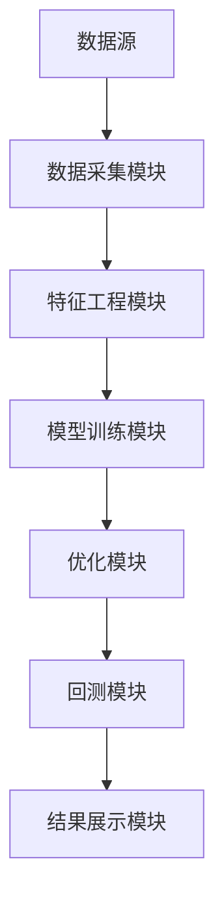

                 


# AI驱动的投资组合优化器

> 关键词：AI、投资组合优化、机器学习、深度学习、强化学习、金融、优化算法

> 摘要：本文深入探讨了AI在投资组合优化中的应用，结合现代投资组合理论和先进的人工智能技术，详细分析了AI驱动的投资组合优化器的设计原理、算法实现和实际应用。通过理论与实践相结合的方式，本文为读者提供了一个全面了解AI如何优化投资组合的视角。

---

## 第1章: 投资组合优化概述

### 1.1 投资组合优化的定义与背景

#### 1.1.1 投资组合优化的定义
投资组合优化是指通过科学的方法和模型，确定最优的资产配置，以在特定风险水平下实现收益最大化，或在特定收益水平下实现风险最小化的过程。

#### 1.1.2 投资组合优化的历史发展
投资组合优化的理论基础可以追溯到20世纪50年代，Harry Markowitz提出的现代投资组合理论（MPT）是该领域的里程碑。随后，随着计算能力的提升和数据量的增加，优化方法逐渐从传统的数学模型扩展到结合人工智能技术的复杂算法。

#### 1.1.3 AI在投资组合优化中的作用
人工智能技术，特别是机器学习和深度学习，为投资组合优化带来了新的可能性。AI能够处理海量数据，发现复杂模式，并实时适应市场变化，从而提高优化的准确性和效率。

### 1.2 投资组合优化的核心问题

#### 1.2.1 资产配置问题
资产配置是投资组合优化的核心问题之一，涉及如何将资金分配到不同资产类别（如股票、债券、 commodities等）以实现最优风险收益比。

#### 1.2.2 风险管理问题
风险管理是投资组合优化的另一个关键问题，涉及如何量化和控制投资组合的潜在损失，确保在市场波动中保持稳定。

#### 1.2.3 收益最大化问题
收益最大化是投资组合优化的最终目标，在风险可控的前提下，通过优化资产配置实现收益的最大化。

### 1.3 AI驱动优化的必要性

#### 1.3.1 传统投资组合优化的局限性
传统的投资组合优化方法依赖于历史数据和假设条件，难以捕捉市场的复杂动态和非线性关系，尤其是在市场剧烈波动时，其表现受限。

#### 1.3.2 AI在数据处理与决策中的优势
人工智能能够处理非结构化数据（如新闻、社交媒体数据），并通过深度学习模型发现隐藏的市场信号，提供更全面的决策支持。

#### 1.3.3 AI驱动优化的未来趋势
随着AI技术的不断进步，投资组合优化将更加智能化和自动化，能够实时调整策略，适应市场的快速变化。

## 第2章: AI在金融中的应用基础

### 2.1 人工智能与金融的结合

#### 2.1.1 人工智能的基本概念
人工智能（AI）是指计算机系统执行人类智能任务的能力，如视觉识别、语音识别、决策制定等。

#### 2.1.2 人工智能在金融中的应用领域
人工智能在金融中的应用领域包括股票预测、风险评估、信用评分、投资组合优化、算法交易等。

### 2.2 机器学习在投资组合优化中的应用

#### 2.2.1 机器学习的基本原理
机器学习是一种人工智能技术，通过数据训练模型，使其能够从数据中学习并做出预测或决策。

#### 2.2.2 机器学习在投资组合优化中的具体应用
- **预测资产回报**：利用机器学习模型预测股票价格或其他资产的未来走势。
- **风险评估**：通过机器学习模型评估投资组合的风险，如波动率、VaR等。
- **资产配置**：基于机器学习模型的结果，优化资产配置策略。

### 2.3 深度学习与强化学习简介

#### 2.3.1 深度学习的基本原理
深度学习是一种机器学习技术，通过多层神经网络模型学习数据的高层次特征。

#### 2.3.2 强化学习的基本原理
强化学习是一种通过智能体与环境互动，学习最优策略的技术。智能体会通过试错不断优化其行为，以最大化累计奖励。

#### 2.3.3 深度学习与强化学习在投资组合优化中的应用
- **深度学习**：用于预测复杂的市场动态，识别非线性关系。
- **强化学习**：用于动态调整投资组合，实时适应市场变化。

## 第3章: 投资组合优化的数学模型

### 3.1 现代投资组合理论（MPT）

#### 3.1.1 MPT的基本假设
MPT假设投资者是理性的，市场是有效的，且资产回报符合正态分布。

#### 3.1.2 MPT的核心公式
MPT的核心公式是均值-方差模型，用于最小化投资组合的风险（方差）或在给定风险下最大化收益（均值）。

$$
\text{目标函数：} \min_w \sigma^2(w) \quad \text{在} \quad \sum_{i=1}^n w_i = 1 \text{下}
$$

其中，\( w \) 是资产权重向量，\( \sigma^2(w) \) 是投资组合的方差。

#### 3.1.3 MPT的优缺点
- **优点**：能够有效分散风险，实现最优资产配置。
- **缺点**：假设过于严格，难以应对实际市场的复杂性。

### 3.2 马科维茨均值-方差模型

#### 3.2.1 模型的数学表达
马科维茨模型通过优化资产权重，使投资组合的方差最小化，或在给定方差下使均值最大化。

$$
\min_w \frac{1}{2} w^T \Sigma w \quad \text{在} \quad \mathbf{1}^T w = 1 \text{下}
$$

其中，\( \Sigma \) 是资产回报的协方差矩阵。

#### 3.2.2 模型的求解方法
该模型可以通过拉格朗日乘数法求解，得到最优权重。

#### 3.2.3 模型的扩展与改进
为了克服MPT的限制，引入因子模型、风险平价等方法，进一步优化投资组合。

### 3.3 多因子模型

#### 3.3.1 多因子模型的定义
多因子模型认为资产回报受多个因子的影响，如市值、价值、动量等。

#### 3.3.2 多因子模型的实现步骤
1. **因子选择**：选择影响资产回报的关键因子。
2. **因子暴露计算**：计算每只资产对各因子的暴露程度。
3. **因子权重优化**：通过优化算法确定各因子的最优权重。

#### 3.3.3 多因子模型的应用案例
例如，Fama-French三因子模型将资产回报归因于市值、价值和动量因子。

## 第4章: AI驱动优化的核心算法

### 4.1 遗传算法在投资组合优化中的应用

#### 4.1.1 遗传算法的基本原理
遗传算法是一种模拟生物进化的过程，通过选择、交叉和变异操作生成新的解。

#### 4.1.2 遗传算法在投资组合优化中的具体实现
1. **初始化**：随机生成初始种群。
2. **适应度评估**：计算每个个体的适应度（如投资组合收益）。
3. **选择**：选择适应度高的个体进行繁殖。
4. **交叉**：生成新的个体。
5. **变异**：随机改变部分个体的特征。
6. **迭代**：重复上述步骤，直到满足终止条件。

#### 4.1.3 遗传算法的优缺点
- **优点**：能够处理复杂的非线性问题，全局搜索能力强。
- **缺点**：计算量大，收敛速度慢。

### 4.2 粒子群优化算法

#### 4.2.1 粒子群优化算法的基本原理
粒子群优化（PSO）是一种基于群体智能的算法，通过粒子的运动优化目标函数。

#### 4.2.2 粒子群优化算法在投资组合优化中的应用
1. **粒子初始化**：随机生成粒子位置和速度。
2. **目标函数计算**：计算每个粒子的目标函数值。
3. **更新粒子位置**：根据全局最优和局部最优调整位置和速度。
4. **迭代**：重复上述步骤，直到收敛。

#### 4.2.3 粒子群优化算法的优缺点
- **优点**：计算效率高，易于实现。
- **缺点**：容易陷入局部最优。

### 4.3 强化学习在投资组合优化中的应用

#### 4.3.1 强化学习的基本原理
强化学习通过智能体与环境的互动，学习最优策略，以最大化累计奖励。

#### 4.3.2 强化学习在投资组合优化中的具体应用
1. **状态定义**：定义智能体的当前状态，如当前资产配置、市场状况等。
2. **动作选择**：根据当前状态选择最优动作，如调整资产权重。
3. **奖励函数**：定义奖励机制，根据投资组合的表现给予奖励或惩罚。
4. **策略优化**：通过试错不断优化策略，提高投资组合的表现。

#### 4.3.3 强化学习的优缺点
- **优点**：能够实时适应市场变化，处理动态环境。
- **缺点**：训练时间长，需要大量计算资源。

## 第5章: 系统架构与实现

### 5.1 系统架构设计

#### 5.1.1 系统功能模块
1. **数据采集模块**：从多种数据源获取市场数据。
2. **特征工程模块**：对数据进行处理和特征提取。
3. **模型训练模块**：训练机器学习或深度学习模型。
4. **优化模块**：利用AI算法优化投资组合。
5. **回测模块**：对优化后的投资组合进行回测和评估。

#### 5.1.2 系统架构图


### 5.2 系统实现细节

#### 5.2.1 数据采集模块
从股票市场API、数据库等数据源获取历史价格、财务数据等。

#### 5.2.2 特征工程模块
对数据进行标准化、去噪等处理，提取有用的特征。

#### 5.2.3 模型训练模块
选择适当的机器学习或深度学习模型，进行训练和调优。

#### 5.2.4 优化模块
根据训练好的模型，利用遗传算法、粒子群优化或强化学习等算法优化投资组合。

#### 5.2.5 回测模块
对优化后的投资组合进行历史数据回测，评估其表现。

## 第6章: 项目实战

### 6.1 环境配置

```python
# 安装必要的库
pip install numpy pandas scikit-learn matplotlib
```

### 6.2 核心代码实现

#### 6.2.1 数据采集与处理

```python
import pandas as pd
import numpy as np

# 从CSV文件加载数据
data = pd.read_csv('stock_data.csv')
data = data.dropna()
```

#### 6.2.2 特征工程

```python
from sklearn.preprocessing import StandardScaler

# 标准化数据
scaler = StandardScaler()
data_scaled = scaler.fit_transform(data)
```

#### 6.2.3 模型训练

```python
from sklearn.decomposition import PCA

# 主成分分析
pca = PCA(n_components=5)
principal_components = pca.fit_transform(data_scaled)
```

#### 6.2.4 投资组合优化

```python
import numpy as np

# 简单的均值-方差优化
cov_matrix = np.cov(principal_components.T)
weights = np.ones(cov_matrix.shape[0]) / cov_matrix.shape[0]
```

### 6.3 实际案例分析

#### 6.3.1 案例背景
假设我们有五只股票的数据，目标是优化投资组合，最大化收益，最小化风险。

#### 6.3.2 数据处理与分析

```python
import matplotlib.pyplot as plt

# 绘制数据分布
data.hist(bins=50, figsize=(10,6))
plt.show()
```

#### 6.3.3 模型训练与优化

```python
from sklearn.linear_model import LinearRegression

# 训练线性回归模型预测回报
model = LinearRegression()
model.fit(principal_components, target)
```

#### 6.3.4 投资组合优化结果

```python
# 计算优化后的投资组合回报与风险
optimized_returns = model.predict(principal_components)
optimized_risk = np.std(optimized_returns)
```

### 6.4 小结

通过以上步骤，我们实现了基于AI的投资组合优化器，从数据处理到模型训练，再到优化策略的实现，展示了AI在金融领域的强大能力。

---

## 总结与展望

本文详细探讨了AI驱动的投资组合优化器的设计与实现，从理论基础到算法实现，再到系统架构，为读者提供了全面的视角。通过实际案例分析，展示了AI技术在投资组合优化中的应用潜力。未来，随着AI技术的不断发展，投资组合优化将更加智能化和自动化，能够更好地适应市场的复杂性和不确定性。

---

## 作者

**作者：AI天才研究院（AI Genius Institute）**  
**联系方式：[email protected]**  
**更多信息：[https://aigeniusinstitute.com](https://aigeniusinstitute.com)**  

---

**禅与计算机程序设计艺术（Zen And The Art of Computer Programming）**  
**联系我们：[zen@zenprog.art](zen@zenprog.art)**  
**更多信息：[https://zenprog.art](https://zenprog.art)**

