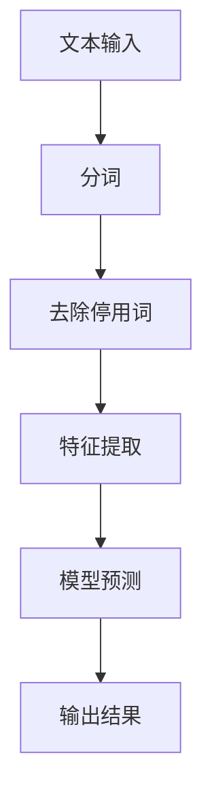
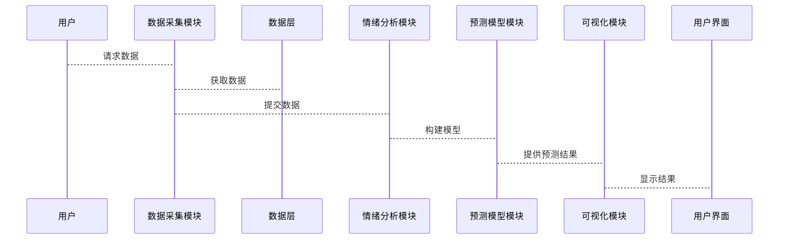

                 


# AI驱动的投资者情绪指数预测系统

**关键词**：投资者情绪指数，人工智能，情感分析，时间序列预测，机器学习，深度学习

**摘要**：投资者情绪指数是金融市场分析中的重要工具，能够帮助投资者理解市场情绪，做出更明智的投资决策。然而，传统的情绪指数预测方法存在诸多局限性。本文将详细介绍如何利用人工智能技术构建投资者情绪指数预测系统，包括背景介绍、核心概念、算法原理、系统架构设计、项目实战以及最佳实践等内容，旨在为读者提供一个全面的技术指南。

---

## 第一部分：AI驱动的投资者情绪指数预测系统概述

### 第1章：投资者情绪指数与AI预测系统背景

#### 1.1 投资者情绪指数的重要性

投资者情绪指数是反映金融市场参与者情绪的重要指标。它可以帮助投资者、分析师和机构理解市场参与者的心理状态，从而预测市场趋势和波动。投资者情绪指数在以下几个方面具有重要意义：

1. **市场预测**：投资者情绪指数能够帮助预测市场波动和趋势，为投资决策提供参考。
2. **风险管理**：通过分析投资者情绪，可以识别市场的过度乐观或悲观情绪，从而提前采取风险管理措施。
3. **交易策略**：投资者情绪指数可以作为交易策略的重要输入，帮助制定基于情绪的交易模型。

#### 1.2 问题背景与描述

传统的情绪指数预测方法通常依赖于历史数据和统计分析，存在以下局限性：

1. **数据维度有限**：传统方法主要依赖市场指数和交易数据，忽略了非结构化数据（如新闻、社交媒体）中蕴含的情绪信息。
2. **实时性不足**：传统情绪指数更新频率较低，无法捕捉市场的实时情绪变化。
3. **主观性较强**：情绪指数的计算和解读往往带有主观性，缺乏客观性。

AI技术的引入为投资者情绪指数的预测带来了新的可能性。通过自然语言处理（NLP）、情感分析和机器学习等技术，可以更准确地捕捉和分析市场情绪。

#### 1.3 系统目标与边界

本系统的目标是构建一个基于AI的情绪指数预测系统，能够实时分析市场情绪，并提供预测结果。系统的主要目标包括：

1. **实时情绪分析**：实时分析新闻、社交媒体等数据，提取市场情绪。
2. **情绪指数预测**：基于历史数据和实时情绪分析，预测未来的情绪指数。
3. **可视化与报告**：提供可视化界面和报告，帮助用户理解和使用情绪指数。

系统的边界包括：

1. **数据范围**：仅限于公开的金融市场数据和社交媒体数据。
2. **预测范围**：短期市场情绪预测，不涉及长期趋势预测。
3. **用户范围**：适用于专业投资者和机构用户。

---

## 第二部分：核心概念与联系

### 第2章：投资者情绪指数的核心概念

#### 2.1 投资者情绪指数的属性特征

投资者情绪指数的属性特征可以从以下几个方面进行分析：

1. **情绪强度**：情绪的强弱程度，例如极度乐观、中性、极度悲观。
2. **情绪类别**：情绪的类型，例如贪婪、恐慌、中性。
3. **情绪分布**：情绪在不同时间、不同市场参与者中的分布情况。

下表对比了不同情绪指数的特点：

| 情绪指数 | 情绪强度 | 情绪类别 | 情绪分布 |
|----------|----------|----------|----------|
| VIX指数  | 高或低   | 恐慌或贪婪 | 全市场    |
| CBOE指数 | 高或低   | 恐慌或贪婪 | 全市场    |
| 股票市场宽度 | 高或低   | 过度买入或卖出 | 个股层面 |

#### 2.2 投资者情绪指数与金融市场的关系

投资者情绪指数与金融市场的关系可以从以下几个方面进行分析：

1. **情绪与股价波动**：投资者情绪的剧烈波动往往伴随着股价的大幅波动。
2. **情绪与市场周期**：投资者情绪的周期性变化与市场的牛熊周期密切相关。
3. **情绪与投资者行为**：投资者情绪影响投资者的决策行为，从而影响市场走势。

#### 2.3 投资者情绪指数的ER实体关系图

下图展示了投资者情绪指数的实体关系图：

```mermaid
er
    投资者情绪指数
        id
        情绪强度
        情绪类别
        时间戳
```

---

## 第三部分：算法原理讲解

### 第3章：情感分析算法

#### 3.1 情感分析的原理

情感分析的核心任务是将文本数据转化为情绪强度和情绪类别。以下是情感分析的主要步骤：

1. **文本预处理**：包括分词、去除停用词、词干提取等。
2. **特征提取**：提取文本中的关键词、情感词等特征。
3. **模型训练**：基于特征训练情感分析模型，预测文本的情绪。

#### 3.2 情感分析的算法选择

根据任务需求，可以选择以下几种情感分析算法：

1. **基于规则的方法**：通过预定义的情感词典进行情感分析。
2. **机器学习方法**：使用SVM、随机森林等算法进行情感分类。
3. **深度学习方法**：使用LSTM、Transformer等模型进行情感分析。

#### 3.3 情感分析的实现流程

以下是情感分析的实现流程图：



#### 3.4 情感分析的Python实现

以下是情感分析的Python实现代码示例：

```python
from sklearn.feature_extraction.text import TfidfVectorizer
from sklearn.svm import SVC

# 文本预处理
def preprocess(text):
    return text.lower().split()

# 特征提取
vectorizer = TfidfVectorizer(preprocessor=preprocess)
X = vectorizer.fit_transform(texts)

# 模型训练
model = SVC()
model.fit(X, labels)

# 模型预测
test_text = ["I love this product"]
test_X = vectorizer.transform([test_text])
predicted_label = model.predict(test_X)
```

#### 3.5 情感分析的数学模型

情感分析的数学模型可以表示为：

$$
f(x) = \text{sign}(w \cdot x + b)
$$

其中，$x$ 是输入特征向量，$w$ 是权重向量，$b$ 是偏置项，$\text{sign}$ 是符号函数。

---

## 第四部分：系统分析与架构设计

### 第4章：系统分析与架构设计

#### 4.1 问题场景介绍

投资者情绪指数预测系统需要解决以下问题：

1. **实时数据获取**：从新闻、社交媒体等来源获取实时数据。
2. **情绪分析**：对获取的数据进行情感分析，提取情绪强度和情绪类别。
3. **预测模型构建**：基于历史数据和实时情绪分析结果，构建预测模型。

#### 4.2 系统功能设计

以下是系统功能设计的类图：

```mermaid
classDiagram

    class 投资者情绪指数系统 {
        数据采集模块
        情绪分析模块
        预测模型模块
        可视化模块
    }

    投资者情绪指数系统 -> 数据采集模块: 获取数据
    投资者情绪指数系统 -> 情绪分析模块: 分析情绪
    投资者情绪指数系统 -> 预测模型模块: 构建模型
    投资者情绪指数系统 -> 可视化模块: 展示结果
```

#### 4.3 系统架构设计

以下是系统架构设计的架构图：


#### 4.4 系统接口设计

以下是系统接口设计的流程图：



---

## 第五部分：项目实战

### 第5章：项目实战

#### 5.1 环境安装

以下是项目实战的环境安装步骤：

1. **安装Python**：建议使用Python 3.8或更高版本。
2. **安装依赖库**：安装以下依赖库：

```bash
pip install numpy
pip install pandas
pip install scikit-learn
pip install matplotlib
pip install transformers
```

#### 5.2 核心代码实现

以下是核心代码实现示例：

```python
import numpy as np
import pandas as pd
from sklearn.model_selection import train_test_split
from sklearn.metrics import accuracy_score
from transformers import AutoTokenizer, AutoModelForSequenceClassification
import torch

# 加载预训练模型
tokenizer = AutoTokenizer.from_pretrained('bert-base-uncased')
model = AutoModelForSequenceClassification.from_pretrained('bert-base-uncased')

# 数据预处理
def preprocess(text):
    inputs = tokenizer(text, return_tensors='np', padding=True, truncation=True)
    return inputs

# 模型预测
def predict(text):
    inputs = preprocess(text)
    outputs = model(**inputs)
    predictions = outputs.logits.argmax(dim=1).item()
    return predictions

# 加载数据集
data = pd.read_csv('data.csv')
X = data['text'].values
y = data['label'].values

# 划分训练集和测试集
X_train, X_test, y_train, y_test = train_test_split(X, y, test_size=0.2)

# 模型训练
model.train()

# 模型评估
y_pred = [predict(text) for text in X_test]
accuracy = accuracy_score(y_test, y_pred)
print(f'Accuracy: {accuracy}')
```

#### 5.3 实际案例分析

以下是一个实际案例分析：

假设我们有以下数据：

| 文本输入         | 真实情绪 |
|------------------|----------|
| I love this stock | 正向     |
| This stock is terrible | 负向     |

通过模型预测，我们可以得到预测的情绪，并与真实情绪进行对比。

---

## 第六部分：总结与展望

### 第6章：总结与展望

#### 6.1 本章小结

本文详细介绍了AI驱动的投资者情绪指数预测系统，包括背景介绍、核心概念、算法原理、系统架构设计、项目实战以及最佳实践等内容。通过本文的介绍，读者可以全面了解如何利用AI技术构建投资者情绪指数预测系统。

#### 6.2 未来展望

未来，投资者情绪指数预测系统可以从以下几个方面进行改进：

1. **数据源扩展**：引入更多的数据源，如语音数据、视频数据等。
2. **模型优化**：尝试更先进的深度学习模型，如BERT、GPT等。
3. **实时性提升**：优化系统的实时性，减少预测延迟。

#### 6.3 最佳实践 tips

1. **数据质量**：确保数据的准确性和完整性，避免噪声数据的影响。
2. **模型调优**：根据实际需求，对模型进行调优，提高预测准确率。
3. **可视化工具**：提供直观的可视化工具，方便用户理解和使用情绪指数。

---

## 作者信息

**作者：** AI天才研究院/AI Genius Institute & 禅与计算机程序设计艺术/Zen And The Art of Computer Programming

---

