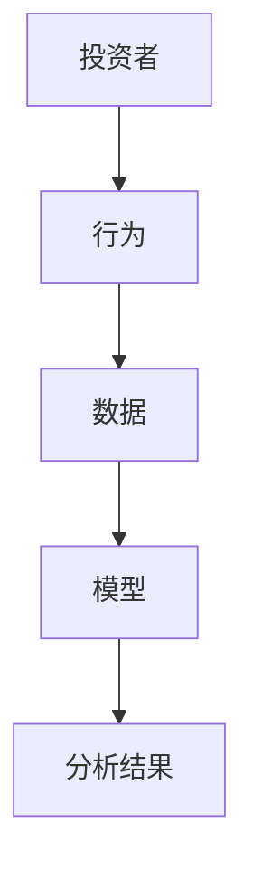
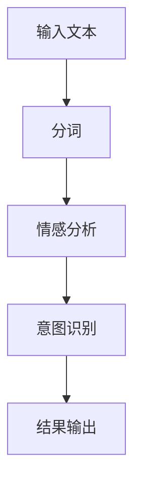

                 


# AI驱动的投资者行为分析

## 关键词：人工智能，投资者行为，行为建模，情感分析，决策优化，系统架构

## 摘要：  
本文深入探讨了AI技术在投资者行为分析中的应用，从理论基础到实际应用，详细阐述了如何利用机器学习、自然语言处理和强化学习等技术，分析和预测投资者行为。文章结合实际案例，通过系统架构设计、算法原理和项目实战，展示了AI如何帮助投资者做出更明智的决策。

---

# 第一部分: AI驱动的投资者行为分析基础

## 第1章: 投资者行为分析概述

### 1.1 投资者行为分析的背景与意义

#### 1.1.1 传统投资者行为分析的局限性  
传统投资者行为分析依赖于定性研究和专家经验，难以捕捉投资者行为的复杂性和动态变化。这种方法在数据量大、市场变化快的情况下显得力不从心。

#### 1.1.2 AI技术在投资者行为分析中的优势  
AI技术能够处理海量数据，发现隐藏模式，实时分析市场动态，帮助投资者做出更精准的决策。

#### 1.1.3 本章研究目标与框架  
本文旨在通过AI技术，分析投资者行为的驱动因素，构建行为模型，并为投资决策提供支持。

### 1.2 投资者行为分析的核心概念

#### 1.2.1 投资者行为的定义与分类  
投资者行为指投资者在不同市场环境下的决策和交易行为，可分为理性行为和非理性行为。

#### 1.2.2 AI在投资者行为分析中的应用领域  
AI技术广泛应用于情绪分析、意图识别、交易策略优化等领域。

#### 1.2.3 数据驱动与行为建模的结合  
通过大数据分析，构建投资者行为模型，预测市场趋势。

### 1.3 本章小结  
本章介绍了投资者行为分析的背景、核心概念和研究框架，为后续分析奠定了基础。

---

## 第2章: 投资者行为分析的核心概念与联系

### 2.1 投资者行为分析的核心概念

#### 2.1.1 投资者决策的驱动因素  
包括市场环境、个人情绪、认知偏差等。

#### 2.1.2 行为数据的特征与分类  
行为数据包括交易记录、社交媒体互动等。

#### 2.1.3 AI技术在行为建模中的作用  
AI能够从行为数据中提取特征，构建预测模型。

### 2.2 投资者行为分析的核心概念联系

#### 2.2.1 投资者认知、情感与决策的关系  
认知影响情感，情感驱动决策。

#### 2.2.2 行为数据与AI模型的关联  
行为数据输入模型，模型输出预测结果。

#### 2.2.3 系统架构与行为分析的整合  
系统架构决定数据处理和模型应用的流程。

### 2.3 投资者行为分析的ER实体关系图



### 2.4 本章小结  
本章详细分析了投资者行为的核心概念及其联系，为后续分析提供了理论基础。

---

## 第3章: AI驱动的投资者行为分析算法原理

### 3.1 情感分析算法

#### 3.1.1 基于词袋模型的情感分析  
词袋模型将文本表示为单词的集合，用于分类。

#### 3.1.2 基于深度学习的情感分析  
使用LSTM或Transformer模型，捕捉上下文信息。

#### 3.1.3 情感分析的数学模型  
$$ V = \sum_{i=1}^{n} w_i x_i $$

### 3.2 意图识别算法

#### 3.2.1 基于规则的意图识别  
通过预设规则匹配意图。

#### 3.2.2 基于机器学习的意图识别  
使用SVM或随机森林进行分类。

#### 3.2.3 意图识别的流程图



### 3.3 决策优化算法

#### 3.3.1 基于强化学习的决策优化  
使用Q-learning算法，动态调整策略。

#### 3.3.2 基于遗传算法的决策优化  
通过遗传算法优化交易策略。

#### 3.3.3 决策优化的数学公式  
$$ V = \sum_{i=1}^{n} w_i x_i $$

### 3.4 本章小结  
本章详细介绍了情感分析、意图识别和决策优化的算法原理及其应用。

---

## 第4章: 投资者行为分析的系统架构设计

### 4.1 系统功能设计

#### 4.1.1 数据采集模块  
从社交媒体和交易记录中采集数据。

#### 4.1.2 数据预处理模块  
清洗数据，提取特征。

#### 4.1.3 模型训练模块  
使用机器学习模型训练行为分析模型。

#### 4.1.4 结果展示模块  
展示分析结果和预测报告。

### 4.2 系统架构设计

#### 4.2.1 系统架构图


### 4.3 本章小结  
本章介绍了投资者行为分析系统的功能设计和架构设计，为实际应用提供了参考。

---

## 第5章: 项目实战

### 5.1 环境安装

#### 5.1.1 安装Python和必要的库  
安装TensorFlow、NLTK等库。

#### 5.1.2 安装Jupyter Notebook  
用于数据可视化和模型训练。

### 5.2 系统核心实现源代码

#### 5.2.1 数据预处理代码  
```python
import pandas as pd
df = pd.read_csv('data.csv')
```

#### 5.2.2 模型训练代码  
```python
model = tf.keras.Sequential()
model.add(tf.keras.layers.Dense(64, activation='relu'))
model.add(tf.keras.layers.Dense(1, activation='sigmoid'))
model.compile(optimizer='adam', loss='binary_crossentropy')
model.fit(X_train, y_train, epochs=10)
```

### 5.3 实际案例分析

#### 5.3.1 案例分析  
分析某次市场波动下的投资者行为。

#### 5.3.2 结果解读  
解读模型预测结果，优化投资策略。

### 5.4 本章小结  
本章通过实际项目展示了AI驱动的投资者行为分析的应用。

---

## 第6章: 最佳实践、小结、注意事项与拓展阅读

### 6.1 最佳实践

#### 6.1.1 数据质量的重要性  
确保数据准确性和完整性。

#### 6.1.2 模型调优的技巧  
通过交叉验证优化模型参数。

### 6.2 小结  
总结全文内容，强调AI技术在投资者行为分析中的重要性。

### 6.3 注意事项

#### 6.3.1 数据隐私问题  
注意保护投资者隐私。

#### 6.3.2 模型的局限性  
认识到AI模型的局限性，结合人工分析。

### 6.4 拓展阅读

#### 6.4.1 推荐书籍  
《机器学习实战》、《深度学习》。

#### 6.4.2 在线资源  
推荐相关课程和论文。

### 6.5 本章小结  
本章提供了最佳实践建议，总结全文内容，并推荐了扩展阅读资料。

---

## 作者：AI天才研究院 & 禅与计算机程序设计艺术

---

这篇文章系统地介绍了AI驱动的投资者行为分析，从理论到实践，结合了丰富的案例和详细的代码实现，帮助读者全面理解并应用相关技术。

