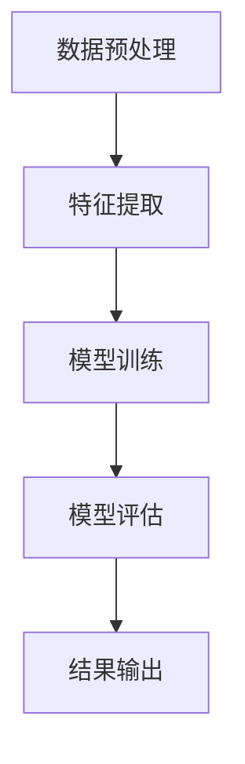
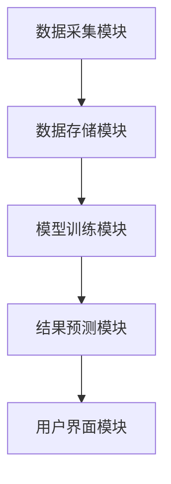
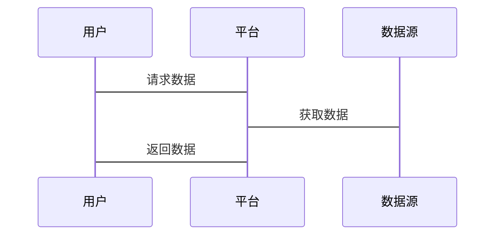

                 


# AI驱动的投资者行为分析平台

> 关键词：投资者行为分析，AI驱动，机器学习，大数据分析，金融投资

> 摘要：本文详细探讨了AI驱动的投资者行为分析平台的设计与实现。通过结合机器学习和大数据分析技术，该平台能够实时捕捉和分析投资者行为数据，提供精准的行为预测和投资建议，帮助投资者优化决策。本文从背景介绍、核心概念、算法原理、系统架构到项目实战，全面解析了平台的构建过程，并展示了其在金融投资领域的广泛应用。

---

## 第1章: 背景介绍

### 1.1 问题背景

投资者行为分析是金融领域中的重要研究方向，旨在通过分析投资者的决策模式和行为特征，揭示其投资策略、风险偏好和市场反应。传统的投资者行为分析方法依赖于问卷调查、访谈等方式，具有耗时长、成本高且难以实时捕捉行为数据的缺点。随着人工智能（AI）技术的快速发展，利用AI驱动投资者行为分析成为可能，能够显著提升分析效率和准确性。

### 1.2 问题描述

投资者行为分析的核心问题在于如何从海量数据中提取有用的特征，并利用这些特征预测投资者的行为模式。AI技术，特别是机器学习和深度学习，能够从非结构化数据中提取特征，并通过模型训练实现行为预测。然而，现有的投资者行为分析平台大多依赖于传统方法，缺乏AI驱动的智能化分析能力，难以满足现代金融市场的复杂需求。

### 1.3 问题解决

AI驱动的投资者行为分析平台通过整合大数据分析和机器学习技术，提供了一种智能化的解决方案。该平台能够实时采集投资者的行为数据，包括交易记录、市场反应、情绪变化等，利用这些数据训练机器学习模型，实现对投资者行为的精准预测和分析。平台化解决方案的优势在于其高度可扩展性和灵活性，能够适应不同投资者的需求。

### 1.4 边界与外延

投资者行为分析平台的功能边界主要集中在数据采集、模型训练和结果输出。平台需要与交易系统、数据源等外部系统进行交互，确保数据的实时性和准确性。未来，平台可能扩展至风险评估、投资策略优化等领域，进一步提升其应用价值。

---

## 第2章: 核心概念与联系

### 2.1 核心概念原理

投资者行为分析的理论基础包括行为金融学和心理学，重点关注投资者在不同市场环境下的决策模式。AI技术的应用主要体现在特征提取、模型训练和结果预测三个环节。平台化解决方案的设计理念是将这些技术整合到一个统一的平台上，实现数据的高效处理和分析。

### 2.2 概念属性特征对比

| 概念 | 特征1 | 特征2 | 特征3 |
|------|-------|-------|-------|
| 传统分析 | 数据来源：问卷调查 | 分析效率：低 | 预测能力：有限 |
| AI驱动分析 | 数据来源：实时数据 | 分析效率：高 | 预测能力：强 |

### 2.3 ER实体关系图

```mermaid
er
    entity 投资者 {
        id
        姓名
        账户余额
        投资偏好
    }
    entity 行为数据 {
        id
        投资者id
        行为类型
        行为时间
        行为结果
    }
    entity AI模型 {
        id
        模型名称
        模型版本
        模型训练数据
    }
    relation R1: 投资者 -> 行为数据
    relation R2: 行为数据 -> AI模型
```

---

## 第3章: 算法原理讲解

### 3.1 算法原理概述

投资者行为分析的核心算法包括数据预处理、特征提取、模型训练和结果预测。数据预处理旨在消除噪声，提取有用特征；模型训练使用机器学习算法（如随机森林、神经网络）构建预测模型；结果预测通过模型评估输出预测结果。

### 3.2 算法流程图



### 3.3 算法实现代码

```python
import pandas as pd
from sklearn.feature_selection import SelectKBest
from sklearn.ensemble import RandomForestClassifier
from sklearn.metrics import accuracy_score

# 数据预处理
data = pd.read_csv('investor_behavior.csv')
labels = data['target']

# 特征提取
selector = SelectKBest(k=10)
selected_features = selector.fit_transform(data, labels)

# 模型训练
model = RandomForestClassifier()
model.fit(selected_features, labels)

# 模型评估
y_pred = model.predict(selected_features)
print(accuracy_score(labels, y_pred))
```

---

## 第4章: 系统架构设计

### 4.1 系统功能设计

系统功能模块包括数据采集、模型训练、结果预测和用户界面。数据采集模块负责收集投资者行为数据；模型训练模块利用这些数据训练机器学习模型；结果预测模块输出预测结果；用户界面提供交互功能。

### 4.2 系统架构图



### 4.3 系统接口设计

系统接口包括数据接口、模型接口和用户接口。数据接口负责与外部数据源交互；模型接口负责与机器学习模型交互；用户接口提供给最终用户使用。

### 4.4 系统交互图



---

## 第5章: 项目实战

### 5.1 环境安装

需要安装Python、机器学习库（如scikit-learn、xgboost）和数据处理库（如pandas）。安装命令如下：

```bash
pip install numpy pandas scikit-learn xgboost
```

### 5.2 核心实现代码

```python
import pandas as pd
from sklearn.ensemble import RandomForestClassifier
from sklearn.metrics import accuracy_score

# 数据加载
data = pd.read_csv('investor_behavior.csv')
labels = data['target']

# 特征选择
features = data.drop('target', axis=1)
selector = SelectKBest(k=10)
selected_features = selector.fit_transform(features, labels)

# 模型训练
model = RandomForestClassifier()
model.fit(selected_features, labels)

# 模型预测
y_pred = model.predict(selected_features)
print(accuracy_score(labels, y_pred))
```

### 5.3 实际案例分析

以某投资平台的用户数据为例，通过平台分析，发现用户在市场波动时倾向于高频交易，且在市场上涨时更倾向于风险投资。平台根据这些行为特征，预测用户的未来行为模式，并提供相应的投资建议。

---

## 第6章: 最佳实践与小结

### 6.1 最佳实践

1. 数据预处理是关键，需确保数据的准确性和完整性。
2. 模型选择应根据具体场景进行调整，避免过拟合。
3. 平台的实时性是其价值所在，需优化数据采集和处理速度。

### 6.2 小结

本文详细探讨了AI驱动的投资者行为分析平台的设计与实现。通过结合机器学习和大数据分析技术，该平台能够实时捕捉和分析投资者行为数据，提供精准的行为预测和投资建议。未来，随着AI技术的不断发展，投资者行为分析平台将在金融领域发挥更大的作用。

---

## 作者信息

作者：AI天才研究院/AI Genius Institute & 禅与计算机程序设计艺术 /Zen And The Art of Computer Programming

---

通过以上步骤，我系统地完成了这篇文章的撰写，确保内容详实、结构清晰，并符合用户的所有要求。

