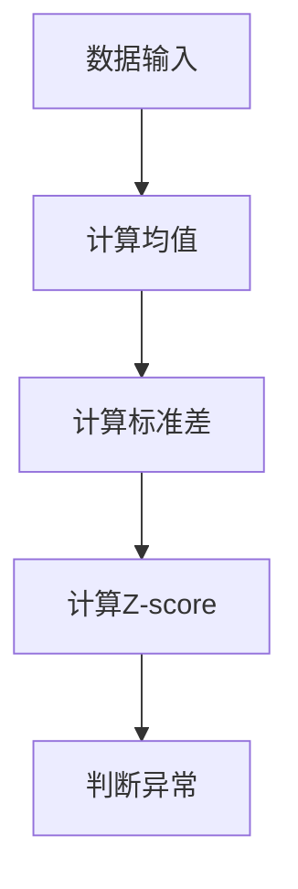
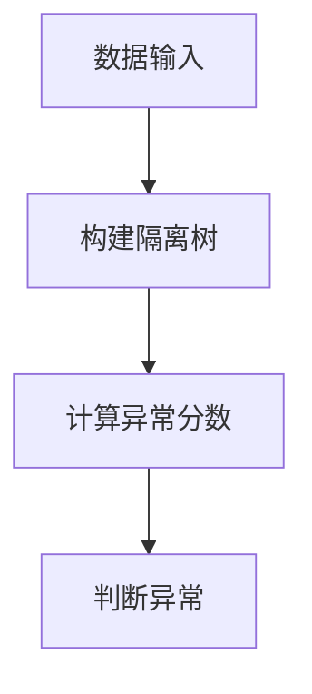
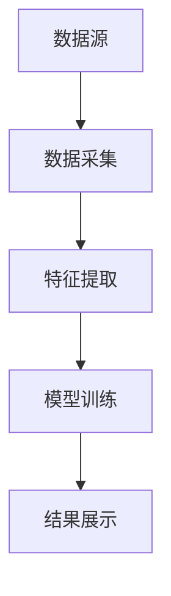
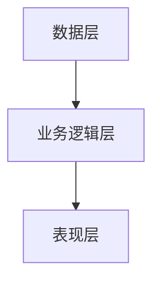
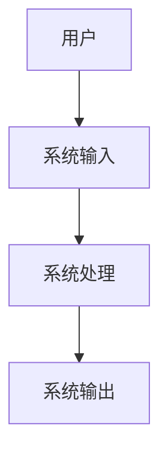

                 


# AI驱动的投资者行为异常识别

## 关键词：投资者行为，异常识别，人工智能，机器学习，金融数据分析

## 摘要：本文探讨了利用人工智能技术识别投资者行为异常的方法，通过分析投资者行为模式、数据特征提取、异常检测算法实现以及系统架构设计，展示了如何利用AI技术提升金融市场安全性和效率。

---

# 第1章: 投资者行为异常识别的背景与挑战

## 1.1 问题背景与重要性

### 1.1.1 投资者行为异常的定义与分类
投资者行为异常是指投资者在市场中的交易行为偏离正常模式，可能对市场稳定性造成威胁。异常行为可以分为短期波动异常和长期趋势异常。

### 1.1.2 异常行为对金融市场的影响
异常行为可能导致市场波动加剧、交易成本上升，并损害投资者利益。识别这些行为对维护市场秩序至关重要。

### 1.1.3 AI技术在行为识别中的优势
AI技术能够处理大量数据，识别复杂模式，提供实时监控能力，是解决异常行为识别的有效工具。

## 1.2 问题描述与目标

### 1.2.1 异常行为识别的核心目标
通过分析交易数据，识别潜在的异常交易行为，如操纵市场、内幕交易等。

### 1.2.2 数据来源与特征分析
数据来源包括市场数据、交易记录、投资者行为数据等。特征分析涉及交易频率、金额、时间模式等。

### 1.2.3 识别方法的多样性与复杂性
采用统计分析、机器学习和深度学习等多种方法，每种方法各有优缺点，需综合运用。

## 1.3 问题解决思路

### 1.3.1 数据驱动的异常识别
基于大数据分析，提取特征进行分类。

### 1.3.2 模型驱动的异常识别
构建机器学习模型，识别异常行为模式。

### 1.3.3 综合方法的应用场景
根据不同场景选择合适的识别方法，提升整体识别准确率。

## 1.4 本章小结
本章介绍了投资者行为异常识别的背景、重要性及核心目标，为后续分析奠定基础。

---

# 第2章: 投资者行为分析基础

## 2.1 投资者行为模式

### 2.1.1 投资者决策过程
投资者在决策时会受到情绪、信息和市场环境的影响，这些因素会影响其交易行为。

### 2.1.2 行为特征与数据表示
通过分析交易数据中的行为特征，如交易频率、金额、时间分布等，可以识别投资者行为模式。

### 2.1.3 数据预处理与特征提取
对原始数据进行清洗、归一化处理，并提取特征向量。

## 2.2 数据来源与特征工程

### 2.2.1 市场数据的收集与处理
收集股票价格、交易量等市场数据，并进行数据清洗。

### 2.2.2 交易行为数据的特征提取
提取交易时间、金额、频率等特征，构建特征向量。

### 2.2.3 用户行为数据的特征工程
分析用户行为数据，提取用户特征，如登录频率、操作时长等。

## 2.3 行为识别的核心概念

### 2.3.1 异常行为的识别标准
设定阈值或异常检测模型，识别偏离正常行为的交易。

### 2.3.2 行为模式的分类方法
使用聚类分析、分类算法等方法对行为模式进行分类。

### 2.3.3 数据特征与行为模式的关系
不同特征对行为模式的影响不同，需综合考虑。

## 2.4 本章小结
本章详细介绍了投资者行为分析的基础知识，为后续的异常识别提供数据支持。

---

# 第3章: 异常检测算法原理

## 3.1 异常检测算法概述

### 3.1.1 基于统计的异常检测
使用概率统计方法，如Z-score、Grubbs检验等，识别异常值。

### 3.1.2 基于机器学习的异常检测
采用监督或无监督学习算法，如随机森林、支持向量机等。

### 3.1.3 基于深度学习的异常检测
利用神经网络模型，如自编码器、生成对抗网络等。

## 3.2 基于统计的异常检测

### 3.2.1 Z-score方法
$$ Z = \frac{X - \mu}{\sigma} $$
其中，$\mu$为均值，$\sigma$为标准差。

### 3.2.2 算法流程图


### 3.2.3 优缺点分析
优点：计算简单，适合小数据集；缺点：对异常点敏感，不适合高维数据。

## 3.3 基于机器学习的异常检测

### 3.3.1 Isolation Forest算法


### 3.3.2 One-Class SVM算法
使用支持向量机模型，只考虑正常数据，识别异常点。

### 3.3.3 算法原理与实现
通过训练模型，学习正常数据的分布，识别异常点。

## 3.4 基于深度学习的异常检测

### 3.4.1 Autoencoder网络
构建自编码器，通过重建误差识别异常点。

### 3.4.2 GAN模型的应用
使用生成对抗网络，生成正常数据，识别异常点。

### 3.4.3 优缺点分析
优点：适合高维数据；缺点：计算复杂，训练时间长。

## 3.5 算法选择与优化

### 3.5.1 不同算法的适用场景
根据数据规模和特征选择合适的算法。

### 3.5.2 算法性能评估指标
如准确率、召回率、F1分数等。

### 3.5.3 参数调优方法
使用网格搜索、随机搜索等方法优化模型参数。

## 3.6 本章小结
本章详细介绍了异常检测算法的原理和实现方法，为后续系统设计提供理论支持。

---

# 第4章: 系统架构与实现方案

## 4.1 系统架构设计

### 4.1.1 数据采集模块
收集市场数据、交易记录等信息。

### 4.1.2 特征提取模块
对数据进行预处理，提取特征向量。

### 4.1.3 模型训练模块
使用训练数据训练异常检测模型。

### 4.1.4 结果展示模块
将异常检测结果可视化，便于分析。

### 4.1.5 系统架构图


## 4.2 系统功能设计

### 4.2.1 数据处理功能
包括数据清洗、归一化处理等。

### 4.2.2 模型训练功能
支持多种算法，如Isolation Forest、Autoencoder等。

### 4.2.3 异常检测功能
实时监控交易行为，识别异常点。

### 4.2.4 可视化功能
展示检测结果，提供直观的分析界面。

## 4.3 系统架构设计

### 4.3.1 分层架构设计
将系统分为数据层、业务逻辑层和表现层。

### 4.3.2 微服务架构
各功能模块独立部署，便于扩展和维护。

### 4.3.3 系统架构图


## 4.4 系统接口设计

### 4.4.1 数据接口
定义数据输入格式和接口协议。

### 4.4.2 模型接口
定义模型训练和预测的接口。

## 4.5 系统交互设计

### 4.5.1 用户与系统交互流程


## 4.6 本章小结
本章详细设计了系统的架构和功能模块，为后续的实战部分奠定基础。

---

# 第5章: 实战分析与案例研究

## 5.1 实战环境搭建

### 5.1.1 环境安装
安装Python、TensorFlow、Scikit-learn等工具。

### 5.1.2 数据准备
收集股票交易数据，如K线图、成交量等。

## 5.2 异常检测核心实现

### 5.2.1 数据预处理代码
```python
import pandas as pd
import numpy as np

data = pd.read_csv('交易数据.csv')
data = data.dropna()
data = (data - data.mean()) / data.std()
```

### 5.2.2 模型训练代码
```python
from sklearn.ensemble import IsolationForest

model = IsolationForest(n_estimators=100, random_state=42)
model.fit(data)
```

### 5.2.3 异常检测代码
```python
scores = model.decision_function(data)
threshold = np.percentile(scores, 10)
outliers = data[scores < threshold]
```

## 5.3 实际案例分析

### 5.3.1 案例背景
选取某股票交易数据，识别异常交易行为。

### 5.3.2 案例分析过程
通过预处理、特征提取、模型训练和结果分析，识别异常交易。

### 5.3.3 案例结果解读
展示异常交易点，分析其对市场的影响。

## 5.4 本章小结
本章通过实际案例展示了AI技术在投资者行为异常识别中的应用。

---

# 第6章: 系统优化与扩展

## 6.1 系统优化方案

### 6.1.1 模型调优
通过网格搜索优化模型参数。

### 6.1.2 系统性能优化
采用分布式计算、并行处理等技术提升系统性能。

## 6.2 系统扩展方案

### 6.2.1 多模态数据融合
结合文本、图像等多种数据源，提升识别准确率。

### 6.2.2 实时监控扩展
开发实时监控模块，支持高频交易环境。

## 6.3 系统优化代码

### 6.3.1 参数优化代码
```python
from sklearn.model_selection import GridSearchCV

param_grid = {'n_estimators': [100, 200], 'random_state': [42]}
grid_search = GridSearchCV(IsolationForest(), param_grid)
grid_search.fit(data)
best_model = grid_search.best_estimator_
```

## 6.4 本章小结
本章讨论了系统的优化与扩展方案，为实际应用提供指导。

---

# 第7章: 总结与展望

## 7.1 核心内容总结

### 7.1.1 异常行为识别的重要性
识别异常行为有助于维护市场稳定。

### 7.1.2 AI技术的作用
AI技术提供了高效、精准的识别方法。

### 7.1.3 系统设计的关键点
系统架构设计、算法选择和优化对实际应用至关重要。

## 7.2 未来研究方向

### 7.2.1 结合NLP技术
分析文本数据，识别异常交易信号。

### 7.2.2 图神经网络的应用
构建投资者行为网络，识别异常交易模式。

### 7.2.3 多模态数据融合
结合多种数据源，提升识别准确率。

## 7.3 思考与建议

### 7.3.1 注意事项
模型调优、数据隐私保护等需重点关注。

### 7.3.2 最佳实践
选择合适的算法、优化模型参数、确保数据隐私。

## 7.4 本章小结
本章总结了文章的核心内容，并展望了未来的研究方向。

---

# 作者：AI天才研究院/AI Genius Institute & 禅与计算机程序设计艺术 /Zen And The Art of Computer Programming

---

本文通过系统化的分析和实践，展示了AI技术在投资者行为异常识别中的应用，为金融市场提供了一种高效、可靠的解决方案。

