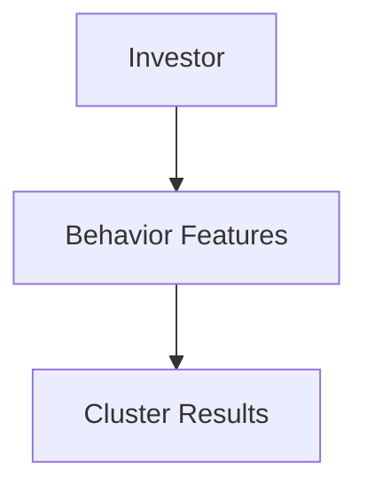
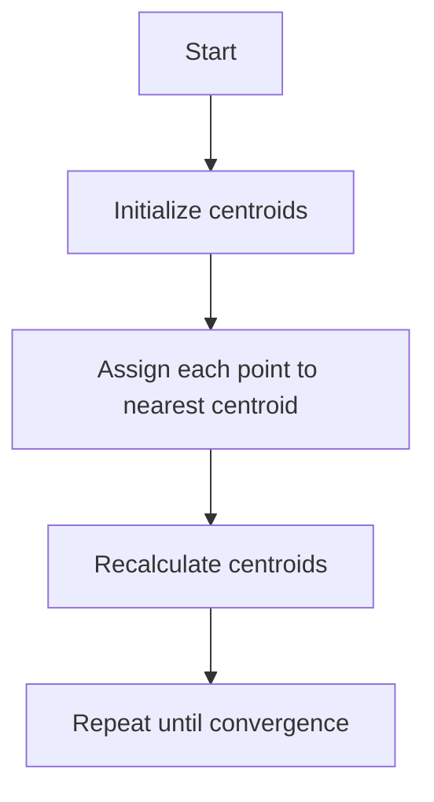
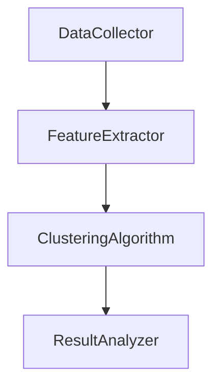
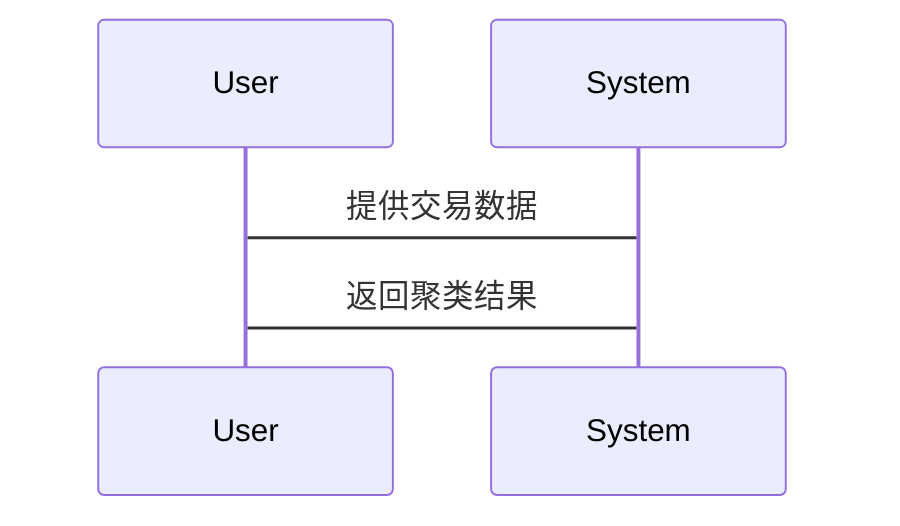

                 


# AI驱动的投资者行为模式聚类分析

> 关键词：AI驱动，投资者行为模式，聚类分析，机器学习，金融数据分析

> 摘要：本文将探讨如何利用人工智能技术进行投资者行为模式的聚类分析，通过系统化的分析和建模，揭示投资者行为背后的重要特征，为投资决策提供数据支持。

---

## 第1章: 背景介绍

### 1.1 问题背景
投资者的行为模式分析对于金融市场的理解和投资决策至关重要。传统上，投资者行为分析依赖于手动数据收集和统计分析，效率低下且难以捕捉复杂模式。近年来，随着AI技术的发展，基于机器学习的投资者行为模式分析逐渐成为可能。

### 1.2 问题描述
投资者行为模式多样且复杂，不同投资者在面对市场波动时表现出不同的决策特征。如何系统地识别和分类这些行为模式，是当前金融数据分析中的一个重要挑战。

### 1.3 问题解决
通过聚类分析，我们可以将投资者的行为模式分为若干类别，从而更好地理解和预测他们的行为。结合AI技术，聚类分析的效率和准确性得到显著提升。

### 1.4 边界与外延
投资者行为模式聚类仅关注投资者的行为特征，不涉及其具体投资策略或财务状况。外延方面，聚类结果可以用于风险评估、客户细分和个性化投资建议。

### 1.5 核心要素组成
投资者行为模式的组成包括交易频率、风险偏好、市场敏感性等特征。

---

## 第2章: 核心概念与联系

### 2.1 投资者行为模式聚类的核心概念
投资者行为模式是指投资者在特定市场环境下的决策和交易习惯。聚类分析是一种无监督学习方法，用于将数据点分成相似的类别。

### 2.2 投资者行为模式与聚类分析的关系
投资者行为模式的特征可以作为聚类分析的输入，通过聚类算法将相似的行为模式分组，便于后续分析和应用。

### 2.3 实体关系图
使用Mermaid绘制的实体关系图展示了投资者、行为特征和聚类结果之间的关系。



---

## 第3章: 算法原理讲解

### 3.1 聚类算法的基本原理
#### 3.1.1 K-means算法
K-means是一种常见的聚类算法，通过迭代优化将数据点分为K个簇。



#### 3.1.2 DBSCAN算法
DBSCAN基于密度的聚类算法，适合处理噪声和异常值。

### 3.2 基于AI的聚类算法实现
使用Python实现K-means算法：

```python
from sklearn.cluster import KMeans
import numpy as np

# 示例数据
X = np.array([[1, 2], [3, 4], [5, 6], [7, 8]])

# 初始化模型
kmeans = KMeans(n_clusters=2, random_state=0)

# 训练模型
model = kmeans.fit(X)

# 获取聚类结果
labels = model.labels_
print(labels)
```

#### 3.3 算法实现的数学模型
K-means的目标函数为：

$$ J = \sum_{i=1}^{k} \sum_{j=1}^{n_i} ||x_j - c_i||^2 $$

其中，\( c_i \) 是第i个簇的中心，\( x_j \) 是该簇中的数据点。

---

## 第4章: 系统分析与架构设计方案

### 4.1 系统分析
投资者行为模式聚类分析系统需要处理大量金融数据，提取行为特征，并进行聚类分析。

### 4.2 系统架构设计
使用Mermaid绘制的系统架构图展示了数据采集、特征提取、聚类分析和结果展示模块的协作关系。



### 4.3 系统交互设计
使用Mermaid绘制的交互序列图展示了用户与系统之间的数据流。



---

## 第5章: 项目实战

### 5.1 环境安装
安装必要的Python库，如scikit-learn、pandas和numpy。

### 5.2 核心代码实现
实现数据预处理、特征提取和聚类分析的核心代码。

```python
import pandas as pd
from sklearn.preprocessing import StandardScaler
from sklearn.cluster import KMeans

# 数据加载与预处理
data = pd.read_csv('investor_data.csv')
features = data[['trade_volume', 'profit_ratio']]
scaler = StandardScaler()
scaled_features = scaler.fit_transform(features)

# 聚类分析
model = KMeans(n_clusters=3, random_state=42)
model.fit(scaled_features)
labels = model.labels_
print(labels)
```

### 5.3 实际案例分析
分析实际交易数据，展示聚类结果在投资者行为分析中的应用。

---

## 第6章: 最佳实践与小结

### 6.1 最佳实践
确保数据质量和特征选择，定期调优聚类模型，结合实时数据流分析。

### 6.2 小结
本文系统地介绍了AI驱动的投资者行为模式聚类分析，通过算法实现和系统设计展示了其在金融分析中的应用潜力。

---

## 附录

### 附录A: 数据集
提供投资者行为数据的示例数据集。

### 附录B: 代码实现
详细代码实现，包括数据清洗、特征工程和模型调优。

### 附录C: 参考文献
列出相关文献和扩展阅读材料。

---

作者：AI天才研究院

