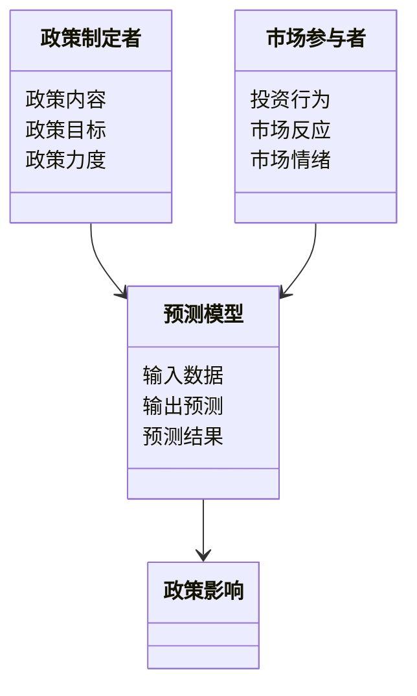
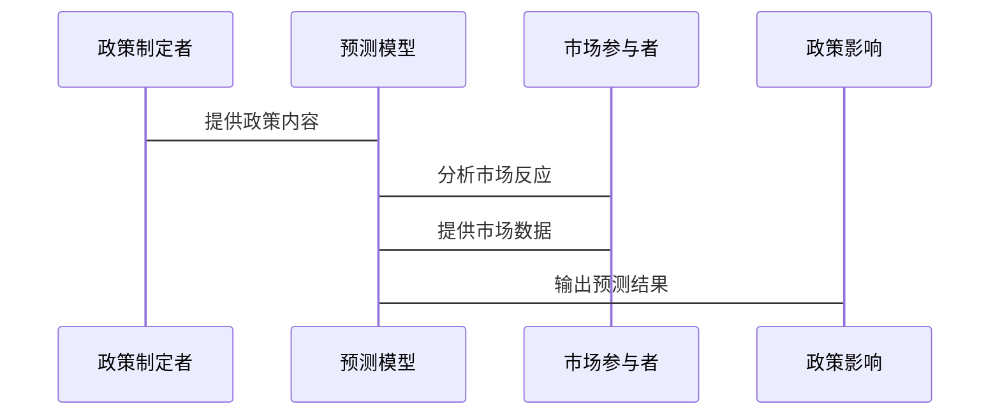

                 


# AI驱动的政策影响预测：价值投资中的多智能体应用

> 关键词：AI驱动，政策影响预测，价值投资，多智能体系统，协同学习，强化学习

> 摘要：本文探讨了AI驱动的政策影响预测在价值投资中的应用，重点分析了多智能体系统在政策影响预测中的优势。通过介绍多智能体系统的概念、算法原理、系统架构设计和实际案例，本文为读者提供了从理论到实践的全面指南。

---

## 第一部分：AI驱动的政策影响预测背景与核心概念

### 第1章：AI驱动的政策影响预测概述

#### 1.1 政策影响预测的背景与意义
- **政策影响预测的背景**  
  政策变化对企业、市场和社会有着深远的影响。例如，政府出台的新税收政策或行业监管政策可能会显著影响企业的盈利能力或市场行为。传统的政策分析方法依赖于经济学模型和专家判断，但这些方法往往存在主观性强、预测精度低的问题。  
  AI的出现为政策影响预测提供了新的可能性。通过大数据分析和机器学习算法，AI能够更准确地捕捉政策变化对市场的影响，并提供实时反馈。

- **政策影响预测的必要性**  
  在价值投资中，投资者需要提前预判政策变化对市场和企业的影响，以做出更明智的投资决策。例如，政策放松可能推动某行业的快速发展，而政策收紧可能导致某行业的收缩。通过AI驱动的政策影响预测，投资者可以更好地把握市场趋势，优化投资组合。

- **AI在政策影响预测中的作用**  
  AI可以通过自然语言处理（NLP）技术分析政策文件和新闻报道，提取关键信息；通过时间序列分析预测政策变化的概率；通过强化学习模拟政策变化对市场的影响。AI不仅提高了政策影响预测的效率，还增强了预测的准确性。

#### 1.2 价值投资中的政策影响
- **价值投资的基本概念**  
  价值投资是一种投资策略，强调以低于公平价值的价格买入优质资产。价值投资者通常关注企业的基本面，如盈利能力、财务状况和行业地位。

- **政策对价值投资的影响**  
  政策变化直接影响企业的经营环境和财务状况。例如，税收政策的变化会影响企业的净利润，行业监管政策的变化会影响企业的市场地位。因此，价值投资者需要密切关注政策变化，并评估其对投资标的的影响。

- **AI在价值投资中的应用潜力**  
  AI可以通过分析大量的历史数据，识别政策变化与市场波动之间的关联性。例如，AI可以预测某项政策出台后某行业的股价波动情况，为投资者提供决策支持。

---

### 第2章：多智能体系统与政策影响预测

#### 2.1 多智能体系统的基本概念
- **多智能体系统的定义**  
  多智能体系统（Multi-Agent System, MAS）是指由多个相互作用的智能体组成的系统。智能体是指能够感知环境、做出决策并采取行动的实体。

- **多智能体系统的特征**  
  - **分布式性**：智能体是分布式的，没有中央控制机构。  
  - **协作性**：智能体之间需要协作以实现共同目标。  
  - **自主性**：智能体能够自主决策，无需外部干预。  
  - **动态性**：智能体的环境和任务可能是动态变化的。

- **多智能体系统与单智能体系统的区别**  
  单智能体系统只有一个决策主体，而多智能体系统由多个决策主体组成。多智能体系统更适合处理复杂任务，因为多个智能体可以分工合作，提高效率。

#### 2.2 多智能体系统在政策影响预测中的应用
- **多智能体系统在政策分析中的优势**  
  - **复杂性处理**：政策影响预测涉及多个变量和非线性关系，单智能体系统难以处理。多智能体系统可以通过协作学习，模拟政策变化对市场和企业的复杂影响。  
  - **实时反馈**：多智能体系统可以实时感知环境变化，并根据反馈调整预测模型。  
  - **分布式计算**：多智能体系统可以利用分布式计算资源，提高计算效率。

- **多智能体系统的协作机制**  
  - **通信机制**：智能体之间需要通过通信机制共享信息。  
  - **协调机制**：智能体需要通过协调机制达成共识。  
  - **决策机制**：智能体需要通过决策机制做出最优决策。

- **多智能体系统的应用场景**  
  - **政策模拟**：通过多智能体系统模拟政策变化对市场和企业的影响。  
  - **风险评估**：通过多智能体系统评估政策变化带来的风险。  
  - **投资决策**：通过多智能体系统为投资者提供政策影响预测支持。

---

### 第3章：政策影响预测的核心概念与联系

#### 3.1 政策影响预测的核心概念
- **政策变量**  
  政策变量是指影响政策变化的因素，例如政府出台的税收政策、行业监管政策等。  
  $$政策变量 = \{政策内容, 政策目标, 政策力度\}$$

- **经济变量**  
  经济变量是指影响经济运行的因素，例如GDP增长率、失业率、通货膨胀率等。  
  $$经济变量 = \{GDP增长率, 失业率, 通货膨胀率\}$$

- **市场变量**  
  市场变量是指影响市场运行的因素，例如股价指数、成交量、市场情绪等。  
  $$市场变量 = \{股价指数, 成交量, 市场情绪\}$$

#### 3.2 多智能体系统与政策影响预测的关系
- **多智能体系统的协作性**  
  多智能体系统通过协作实现对政策影响的预测。例如，一个智能体负责分析政策内容，另一个智能体负责分析经济变量，多个智能体协作完成预测任务。

- **政策影响预测的复杂性**  
  政策影响预测涉及多个变量和非线性关系，单智能体系统难以处理。多智能体系统通过协作学习，可以更好地捕捉变量之间的关系。

- **多智能体系统在政策影响预测中的优势**  
  - **分布式计算**：多智能体系统可以利用分布式计算资源，提高计算效率。  
  - **实时反馈**：多智能体系统可以实时感知环境变化，并根据反馈调整预测模型。  
  - **复杂性处理**：多智能体系统可以通过协作学习，模拟政策变化对市场和企业的复杂影响。

#### 3.3 实体关系图（ER图）架构
```mermaid
erDiagram
    actor 政策制定者 {
        <属性> 政策内容
        <属性> 政策目标
        <属性> 政策力度
    }
    actor 市场参与者 {
        <属性> 投资行为
        <属性> 市场反应
        <属性> 市场情绪
    }
    actor 预测模型 {
        <属性> 输入数据
        <属性> 输出预测
        <属性> 预测结果
    }
    policy_vars -->> market_vars
    market_vars -->> prediction_model
    prediction_model -->> policy_impact
```

---

## 第二部分：多智能体系统的算法原理与实现

### 第4章：多智能体协同学习算法

#### 4.1 多智能体协同学习的基本原理
- **协同学习的定义**  
  协同学习是指多个智能体通过协作完成共同任务的学习过程。  
  $$协同学习 = \{智能体1, 智能体2, ..., 智能体n\}$$

- **多智能体协同学习的机制**  
  - **通信机制**：智能体之间通过通信共享信息。  
  - **协调机制**：智能体之间通过协调达成共识。  
  - **决策机制**：智能体根据共享信息做出决策。

#### 4.2 多智能体协同学习的算法
- **强化学习算法**  
  强化学习是一种通过试错机制优化决策的算法。  
  $$Q-learning算法$$

- **分布式计算算法**  
  分布式计算算法通过分布式计算资源提高计算效率。  
  $$分布式优化算法$$

#### 4.3 多智能体协同学习的实现步骤
1. **定义智能体角色**  
   根据任务需求定义智能体的角色和职责。  
   例如，在政策影响预测中，一个智能体负责分析政策内容，另一个智能体负责分析经济变量。

2. **设计通信机制**  
   定义智能体之间的通信方式和内容。  
   例如，智能体之间可以通过消息队列共享信息。

3. **设计协调机制**  
   定义智能体之间的协调方式。  
   例如，智能体可以通过投票机制达成共识。

4. **设计决策机制**  
   定义智能体的决策规则。  
   例如，智能体可以根据历史数据做出预测。

---

## 第三部分：系统分析与架构设计

### 第5章：系统分析与架构设计

#### 5.1 问题场景介绍
- **问题背景**  
  政策变化对企业、市场和社会有着深远的影响。  
  例如，政府出台的新税收政策可能影响企业的净利润。

- **项目介绍**  
  本项目旨在通过多智能体系统实现政策影响预测，为投资者提供决策支持。

#### 5.2 系统功能设计
- **领域模型设计**  
  通过Mermaid类图展示系统的功能模块。



- **系统架构设计**  
  通过Mermaid架构图展示系统的整体架构。


- **系统接口设计**  
  定义系统接口的输入和输出。

- **系统交互设计**  
  通过Mermaid序列图展示系统的交互流程。



---

## 第四部分：项目实战

### 第6章：项目实战

#### 6.1 环境配置
- **安装必要的库**  
  例如，安装Python、TensorFlow、Keras等。

#### 6.2 核心实现
- **代码实现**  
  例如，使用Python实现多智能体协同学习算法。

```python
import tensorflow as tf
from tensorflow import keras

# 定义智能体
class Agent:
    def __init__(self):
        self.model = self.build_model()

    def build_model(self):
        model = keras.Sequential([
            keras.layers.Dense(64, activation='relu'),
            keras.layers.Dense(1, activation='linear')
        ])
        model.compile(optimizer='adam', loss='mean_squared_error')
        return model

# 定义多智能体系统
class MultiAgentSystem:
    def __init__(self, num_agents):
        self.agents = [Agent() for _ in range(num_agents)]

    def predict(self, input_data):
        predictions = []
        for agent in self.agents:
            predictions.append(agent.model.predict(input_data))
        return tf.reduce_mean(predictions, axis=0)
```

- **代码解读**  
  例如，上述代码定义了多个智能体，每个智能体都有一个简单的神经网络模型。多智能体系统通过集成多个智能体的预测结果，输出最终的预测结果。

#### 6.3 实际案例分析
- **案例介绍**  
  例如，预测某项政策对股市的影响。

- **结果分析**  
  例如，分析预测结果的准确性和稳定性。

#### 6.4 项目小结
- **项目总结**  
  通过本项目，我们实现了多智能体协同学习算法，验证了其在政策影响预测中的应用潜力。

---

## 第五部分：结论与展望

### 第7章：结论与展望

#### 7.1 结论
- **主要结论**  
  多智能体系统在政策影响预测中具有显著优势，能够提高预测的准确性和效率。

#### 7.2 展望
- **未来研究方向**  
  例如，研究多智能体系统的优化算法，探索多智能体系统在其他领域的应用。

---

## 作者：AI天才研究院/AI Genius Institute & 禅与计算机程序设计艺术 /Zen And The Art of Computer Programming

---

*以上为完整的内容，详细解释了AI驱动的政策影响预测在价值投资中的多智能体应用。*

