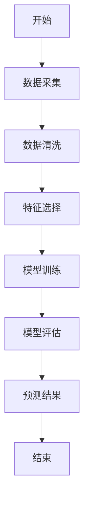
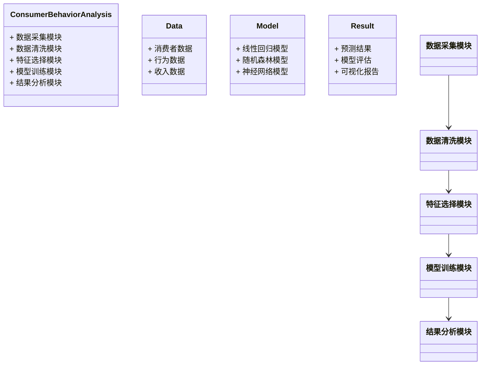
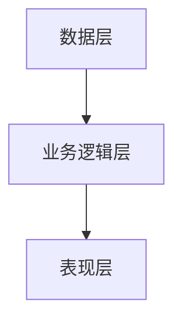
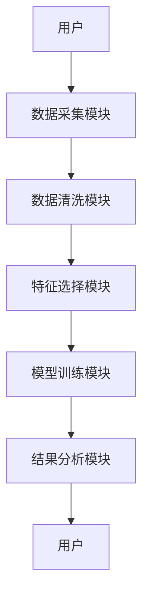

                 


# AI驱动的消费者行为分析：预测公司未来收入

## 关键词：AI，消费者行为分析，收入预测，机器学习，数据科学

## 摘要：本文探讨了如何利用人工智能技术分析消费者行为，以预测公司未来收入。通过详细分析消费者行为的核心概念、相关算法及其在系统中的应用，结合实际项目案例，展示了如何构建有效的预测模型，并提供了最佳实践建议。

---

# 第1章 消费者行为分析的背景与意义

## 1.1 消费者行为分析的背景

消费者行为分析是理解市场动态、优化营销策略的关键。随着数据科学和人工智能的发展，企业能够通过分析消费者数据，预测其行为，从而优化收入预测。

### 1.1.1 数据驱动决策的兴起

企业逐渐从经验驱动转向数据驱动决策，利用大数据技术获取消费者行为数据，分析模式和趋势。

### 1.1.2 AI在消费者行为分析中的作用

人工智能技术，如机器学习，能够处理海量数据，识别复杂模式，提供精准预测。

### 1.1.3 预测公司未来收入的意义

准确预测收入有助于制定更好的财务计划、市场营销策略和产品开发计划。

## 1.2 消费者行为分析的核心概念

消费者行为分析涉及多个关键概念，如消费者决策树、数据特征和预测模型。

### 1.2.1 消费者决策模型

消费者决策树模型帮助企业理解消费者在不同阶段的决策过程。

### 1.2.2 数据特征与行为预测

数据特征如年龄、性别、购买频率等，影响消费者行为，是预测模型的重要输入。

### 1.2.3 收入预测的数学模型

基于历史数据，构建数学模型预测未来收入，如线性回归模型。

## 1.3 本章小结

本章介绍了消费者行为分析的背景、核心概念及其在预测公司收入中的重要性。

---

# 第2章 消费者行为分析的核心概念与联系

## 2.1 消费者行为分析的核心概念

消费者行为分析涉及多个核心概念，如消费者决策树、数据特征和预测模型。

### 2.1.1 消费者决策树模型

消费者决策树模型帮助企业理解消费者在不同阶段的决策过程。

### 2.1.2 数据特征与行为预测

数据特征如年龄、性别、购买频率等，影响消费者行为，是预测模型的重要输入。

### 2.1.3 收入预测的数学模型

基于历史数据，构建数学模型预测未来收入，如线性回归模型。

## 2.2 消费者行为分析的核心概念对比

通过对比数据特征和预测模型，选择最适合的分析方法。

### 2.2.1 数据特征对比表格

| 特征 | 描述 | 影响 |
|------|------|------|
| 年龄 | 消费者的年龄 | 影响购买力和消费习惯 |
| 性别 | 消费者的性别 | 影响购买偏好 |
| 收入 | 消费者的收入水平 | 直接影响购买能力 |

### 2.2.2 消费者行为分析的ER实体关系图

```mermaid
er
actor Consumer
object ConsumerBehavior
object PurchaseHistory
object IncomeData

Consumer -|> ConsumerBehavior: has
Consumer -|> PurchaseHistory: has
Consumer -|> IncomeData: has
```

### 2.2.3 消费者行为分析流程图



## 2.3 本章小结

本章详细介绍了消费者行为分析的核心概念，并通过对比和流程图展示了这些概念之间的联系。

---

# 第3章 消费者行为分析的算法原理

## 3.1 线性回归算法

线性回归是一种简单但强大的预测模型，适用于线性关系的数据。

### 3.1.1 线性回归的数学模型

线性回归的数学模型如下：

$$y = \beta_0 + \beta_1 x + \epsilon$$

其中，$$y$$是目标变量，$$x$$是自变量，$$\beta_0$$和$$\beta_1$$是回归系数，$$\epsilon$$是误差项。

### 3.1.2 线性回归的Python实现

```python
import pandas as pd
import numpy as np
from sklearn.linear_model import LinearRegression

# 假设我们有一个数据集，包含自变量x和目标变量y
x = np.array([1, 2, 3, 4, 5]).reshape(-1, 1)
y = np.array([2, 4, 5, 4, 6])

# 创建线性回归模型
model = LinearRegression()

# 训练模型
model.fit(x, y)

# 预测
y_pred = model.predict(x)
print(y_pred)
```

### 3.1.3 线性回归的应用实例

线性回归可以用于预测未来收入，基于历史销售数据。

## 3.2 随机森林算法

随机森林是一种基于决策树的集成学习算法，具有高准确性和鲁棒性。

### 3.2.1 随机森林的数学模型

随机森林通过构建多个决策树，并进行投票或平均来预测结果。

### 3.2.2 随机森林的Python实现

```python
from sklearn.ensemble import RandomForestRegressor

# 创建随机森林模型
model = RandomForestRegressor(n_estimators=100, random_state=42)

# 训练模型
model.fit(x, y)

# 预测
y_pred = model.predict(x)
print(y_pred)
```

### 3.2.3 随机森林的应用实例

随机森林可以用于预测消费者行为，基于多个特征进行分析。

## 3.3 神经网络算法

神经网络是一种强大的深度学习算法，适用于复杂的非线性关系。

### 3.3.1 神经网络的数学模型

神经网络由多个层组成，包括输入层、隐藏层和输出层。

### 3.3.2 神经网络的Python实现

```python
from keras.models import Sequential
from keras.layers import Dense

# 创建神经网络模型
model = Sequential()
model.add(Dense(64, activation='relu', input_dim=1))
model.add(Dense(1, activation='sigmoid'))

# 编译模型
model.compile(loss='binary_crossentropy', optimizer='adam', metrics=['accuracy'])

# 训练模型
model.fit(x, y, epochs=100, batch_size=1)
```

### 3.3.3 神经网络的应用实例

神经网络可以用于预测消费者行为，基于复杂的特征组合进行分析。

---

# 第4章 消费者行为分析的系统架构设计

## 4.1 系统分析与设计

### 4.1.1 问题场景介绍

系统需要预测消费者行为，以帮助公司优化收入。

### 4.1.2 系统功能设计

系统功能包括数据采集、特征工程、模型训练和结果分析。



### 4.1.3 系统架构设计

系统架构采用分层设计，包括数据层、业务逻辑层和表现层。



## 4.2 系统接口与交互设计

### 4.2.1 系统接口设计

系统接口包括数据输入接口、模型训练接口和结果输出接口。

### 4.2.2 系统交互流程图



---

# 第5章 消费者行为分析的项目实战

## 5.1 项目环境与工具安装

### 5.1.1 Python环境搭建

安装Python和必要的库，如pandas、numpy、scikit-learn和Keras。

### 5.1.2 数据分析工具安装

安装Jupyter Notebook或其他数据分析工具。

### 5.1.3 深度学习框架安装

安装TensorFlow或Keras框架。

## 5.2 数据预处理与特征选择

### 5.2.1 数据清洗与标准化

处理缺失值、异常值和标准化数据。

### 5.2.2 特征选择与工程

选择重要的特征，并进行特征工程，如主成分分析。

### 5.2.3 数据集划分与验证

将数据集划分为训练集和测试集，进行交叉验证。

## 5.3 模型训练与评估

### 5.3.1 模型训练

使用训练数据训练模型，调整超参数。

### 5.3.2 模型评估

使用测试数据评估模型性能，计算准确率、召回率和F1分数。

### 5.3.3 模型优化

通过调整超参数和模型结构，优化模型性能。

## 5.4 项目小结

本章通过实际项目展示了消费者行为分析的具体实施步骤，从数据预处理到模型训练和评估，提供了详细的代码示例和分析。

---

# 第6章 最佳实践与小结

## 6.1 最佳实践

### 6.1.1 数据质量的重要性

确保数据的准确性和完整性，选择合适的特征。

### 6.1.2 模型解释性

选择具有高解释性的模型，便于业务理解。

### 6.1.3 模型优化

定期更新模型，适应市场变化。

## 6.2 小结

本文详细探讨了AI驱动的消费者行为分析，从核心概念到算法实现，再到系统设计和项目实战，提供了全面的指导。

---

作者：AI天才研究院/AI Genius Institute & 禅与计算机程序设计艺术 /Zen And The Art of Computer Programming

