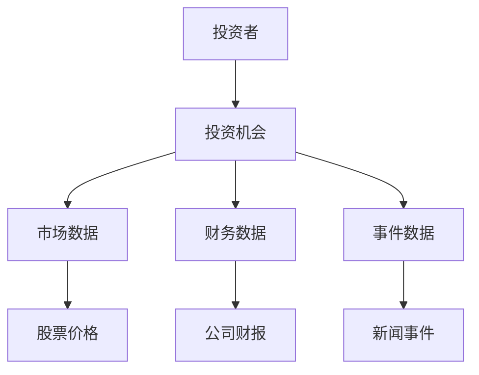
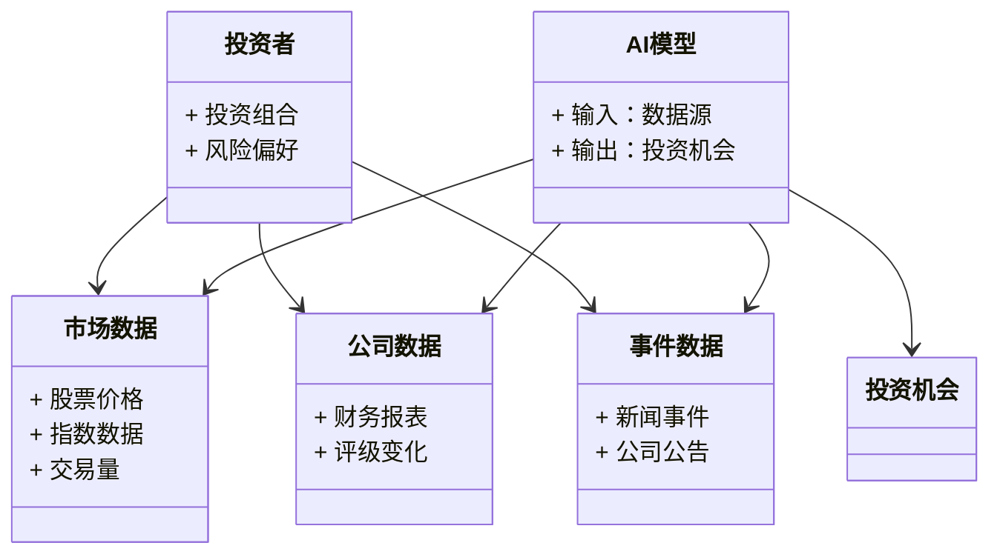
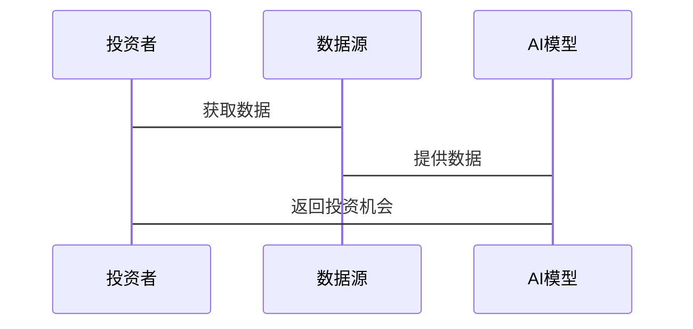

                 


# AI驱动的特殊情况投资机会识别

> 关键词：AI技术，投资机会识别，机器学习，深度学习，金融数据分析

> 摘要：本文深入探讨了人工智能技术在投资机会识别中的应用，特别是针对特殊情况的投资机会。通过分析AI算法的原理、系统设计与架构、项目实战案例，本文为读者提供了全面的视角，帮助其理解如何利用AI技术来发现和捕捉特殊市场条件下的投资机会。

---

# 第一部分：背景与概念

## 第1章：AI与投资机会识别概述

### 1.1 人工智能在金融投资中的应用背景
#### 1.1.1 传统投资分析的局限性
传统投资分析依赖于人类的主观判断和经验，这种方法存在效率低、覆盖面有限的问题，尤其是在面对复杂市场环境时，难以及时捕捉到潜在的投资机会。

#### 1.1.2 人工智能技术的兴起与应用
随着计算能力的提升和大数据技术的发展，人工智能技术在金融领域的应用逐渐普及。通过机器学习和深度学习算法，AI能够快速处理海量数据，发现隐藏的模式和趋势。

#### 1.1.3 特殊情况投资机会的定义与特点
特殊情况投资机会指的是在特定市场条件下出现的、传统方法难以察觉的投资机会。例如，市场波动加剧时的套利机会或突发事件引发的短期价格波动。

### 1.2 问题背景与问题描述
#### 1.2.1 投资机会识别的复杂性
投资机会的识别涉及大量的数据处理和模式识别，传统方法难以高效应对市场的复杂性和不确定性。

#### 1.2.2 特殊情况下的投资机会特征
在特殊情况（如市场崩盘、突发事件等）下，市场行为往往偏离常态，这些特殊条件下的投资机会具有高度的时间敏感性和稀缺性。

#### 1.2.3 AI技术在特殊情况投资中的应用潜力
AI技术能够通过实时数据分析和预测模型，快速识别特殊市场条件下的投资机会，帮助投资者在第一时间做出决策。

### 1.3 问题解决与边界条件
#### 1.3.1 AI驱动投资机会识别的核心问题
如何通过AI技术高效、准确地识别特殊市场条件下的投资机会。

#### 1.3.2 问题解决的边界与外延
AI技术的应用范围、数据来源、模型精度等边界条件对投资机会识别的效果产生重要影响。

#### 1.3.3 核心概念与关键要素
包括数据源、算法选择、模型训练、实时监控等关键要素，这些要素共同构成AI驱动投资机会识别的核心框架。

---

## 第2章：AI驱动投资机会识别的核心概念与联系

### 2.1 核心概念原理
#### 2.1.1 人工智能的基本原理
人工智能通过模拟人类的思维方式，利用数据和算法进行学习和推理，从而实现对复杂问题的解决。

#### 2.1.2 机器学习与深度学习的差异
机器学习是一种基于经验的数据驱动学习方法，而深度学习则是机器学习的一种特殊形式，通过多层神经网络进行特征学习。

#### 2.1.3 特殊情况投资机会识别的关键算法
包括支持向量机（SVM）、随机森林（Random Forest）、长短时记忆网络（LSTM）等算法在特殊情况下的应用。

### 2.2 核心概念属性特征对比
#### 2.2.1 不同AI算法的性能对比
通过对比不同算法的准确率、计算效率和适用场景，选择最适合特殊情况投资机会识别的算法。

#### 2.2.2 不同模型的适用场景
例如，线性回归适用于趋势预测，而LSTM网络适用于时间序列数据的分析。

#### 2.2.3 模型复杂度与准确性的关系
模型复杂度越高，可能面临过拟合的风险，但同时也可能捕捉到更多的市场特征。

### 2.3 ER实体关系图架构


---

# 第二部分：算法原理

## 第3章：机器学习与深度学习算法原理

### 3.1 线性回归算法
#### 3.1.1 线性回归的基本原理
线性回归是一种简单且常用的回归算法，适用于预测连续型变量。其基本公式为：
$$ y = \beta_0 + \beta_1x + \epsilon $$
其中，$\beta_0$和$\beta_1$是模型参数，$\epsilon$是误差项。

#### 3.1.2 线性回归的实现步骤
1. 数据预处理
2. 模型训练
3. 模型评估
4. 模型优化

### 3.2 支持向量机（SVM）
#### 3.2.1 SVM的基本原理
SVM通过构建最大-margin分类器，将数据点映射到高维空间，并使用支持向量进行分类。

#### 3.2.2 SVM的数学模型
$$ \text{最大化} \ \frac{1}{2}||w||^2 $$
$$ \text{受限于} \ y_i(w \cdot x_i + b) \geq 1 $$

### 3.3 神经网络与深度学习
#### 3.3.1 神经网络的基本结构
包括输入层、隐藏层和输出层，各层之间通过权重和激活函数进行连接。

#### 3.3.2 长短时记忆网络（LSTM）
LSTM通过门控机制处理序列数据，适用于时间序列预测。

#### 3.3.3 LSTM的数学模型
$$ f_t = \sigma(W_f \cdot [h_{t-1}, x_t]) $$
$$ i_t = \sigma(W_i \cdot [h_{t-1}, x_t]) $$
$$ o_t = \sigma(W_o \cdot [h_{t-1}, x_t]) $$
$$ c_t = c_{t-1} + i_t \cdot (x_t - f_t \cdot c_{t-1}) $$
$$ h_t = o_t \cdot \tanh(c_t) $$

---

## 第4章：算法流程与优化

### 4.1 算法流程
#### 4.1.1 数据预处理
包括数据清洗、标准化和特征选择。

#### 4.1.2 模型训练
通过训练数据优化模型参数，提高预测精度。

#### 4.1.3 模型评估
使用测试数据评估模型的性能，计算准确率、召回率和F1分数。

#### 4.1.4 模型优化
通过调整超参数和优化算法（如随机梯度下降）提高模型性能。

### 4.2 算法优化策略
#### 4.2.1 参数调优
通过网格搜索或贝叶斯优化选择最优模型参数。

#### 4.2.2 集成学习
通过集成多个模型的结果提高预测准确性，例如随机森林和梯度提升树（GBDT）。

#### 4.2.3 模型解释性
使用特征重要性分析解释模型的决策过程。

---

# 第三部分：系统分析与架构设计

## 第5章：系统分析与架构设计

### 5.1 问题场景介绍
系统需要实时监控市场数据，识别特殊情况下的投资机会，并为投资者提供实时建议。

### 5.2 系统功能设计


### 5.3 系统架构设计


### 5.4 接口设计
- 数据接口：与数据源（如交易所API）对接，获取实时数据。
- 模型接口：与AI模型交互，接收输入数据并返回预测结果。

### 5.5 交互设计


---

## 第6章：系统实现与优化

### 6.1 系统实现
#### 6.1.1 数据预处理代码
```python
import pandas as pd
import numpy as np

data = pd.read_csv('data.csv')
data = data.dropna()
data = (data - data.mean()) / data.std()
```

#### 6.1.2 模型训练代码
```python
from sklearn.linear_model import LinearRegression

model = LinearRegression()
model.fit(X_train, y_train)
```

### 6.2 系统优化
#### 6.2.1 并行计算优化
通过并行计算加速模型训练过程。

#### 6.2.2 模型压缩与轻量化
减少模型大小，提高运行效率。

---

# 第四部分：项目实战

## 第7章：项目实战

### 7.1 项目环境安装
#### 7.1.1 安装Python
下载并安装Python 3.x版本。

#### 7.1.2 安装依赖库
使用pip安装以下库：
- pandas
- numpy
- scikit-learn
- keras
- tensorflow

### 7.2 核心代码实现
#### 7.2.1 数据预处理代码
```python
import pandas as pd
import numpy as np

def preprocess_data(data):
    data = data.dropna()
    data = (data - data.mean()) / data.std()
    return data
```

#### 7.2.2 模型训练代码
```python
from sklearn.model_selection import train_test_split
from sklearn.linear_model import LinearRegression

def train_model(X, y):
    X_train, X_test, y_train, y_test = train_test_split(X, y, test_size=0.2)
    model = LinearRegression()
    model.fit(X_train, y_train)
    return model
```

### 7.3 案例分析
#### 7.3.1 数据来源
使用股票价格数据，预测特定市场条件下的投资机会。

#### 7.3.2 模型评估
计算模型的准确率、召回率和F1分数，评估模型的性能。

#### 7.3.3 实时监控
通过设置实时数据流，持续监控市场变化，及时捕捉投资机会。

---

## 第8章：总结与展望

### 8.1 总结
通过AI技术，我们可以高效、准确地识别特殊市场条件下的投资机会，提升投资效率和收益。

### 8.2 展望
未来，随着AI技术的不断发展，投资机会识别将更加智能化和精准化。

### 8.3 最佳实践 Tips
- 数据质量是模型性能的基础，确保数据的准确性和完整性。
- 选择合适的算法和模型，根据具体情况调整参数。
- 定期更新模型，适应市场变化。

---

# 作者：AI天才研究院 & 禅与计算机程序设计艺术

