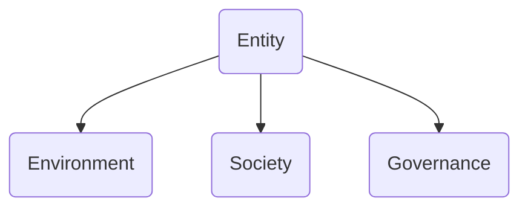
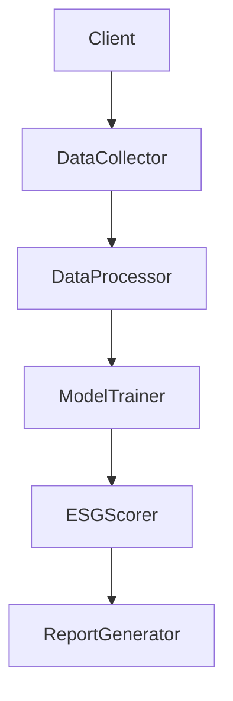

                 


# AI驱动的环境、社会和治理(ESG)分析：可持续价值投资

## 关键词：AI, ESG, 可持续投资, 机器学习, 深度学习

## 摘要：  
随着全球对可持续发展的关注日益增加，环境、社会和治理（ESG）分析已成为投资决策中的重要组成部分。本文探讨了如何利用人工智能（AI）技术来优化ESG分析，提升可持续价值投资的效率和准确性。通过分析ESG的核心概念、AI驱动的分析方法、数学模型和系统架构设计，本文为读者提供了一个全面的技术视角，展示了AI在ESG领域的广泛应用和未来发展方向。

---

# 第1章: ESG分析的背景与重要性

## 1.1 ESG的起源与发展  
ESG分析起源于20世纪60年代的社会责任投资（SRI）理念，随着全球可持续发展目标的提出，ESG的重要性日益凸显。  

## 1.2 ESG在可持续投资中的作用  
ESG指标帮助投资者识别企业在环境保护、社会责任和公司治理方面的表现，从而做出更符合可持续发展的投资决策。  

## 1.3 AI技术对ESG分析的推动  
AI技术的引入显著提升了ESG分析的效率和精度，特别是在处理海量数据和复杂模型方面表现出色。  

---

# 第2章: ESG分析的核心概念与联系

## 2.1 ESG的核心定义与指标  
- **环境（E）**：关注企业对环境的影响，如碳排放、资源消耗等。  
- **社会（S）**：关注企业对社会的贡献，如员工权益、社区参与等。  
- **治理（G）**：关注企业的内部管理，如董事会结构、透明度等。  

## 2.2 ESG指标体系的构建  
通过构建层次化的ESG指标体系，可以更全面地评估企业的可持续发展能力。  

## 2.3 ESG分析的核心要素对比表  
| **维度** | **环境（E）** | **社会（S）** | **治理（G）** |  
|----------|----------------|----------------|----------------|  
| **指标** | 碳排放、能源消耗 | 员工满意度、社区参与 | 董事会结构、透明度 |  

## 2.4 ESG分析的ER实体关系图  


---

# 第3章: AI驱动的ESG分析方法

## 3.1 数据预处理与特征提取  
- **文本数据**：从企业年报、社会责任报告中提取关键词和情感特征。  
- **结构化数据**：处理财务数据和环境指标，提取关键特征。  
- **非结构化数据**：利用自然语言处理技术提取隐含信息。  

## 3.2 模型训练与优化  
- **机器学习模型**：如支持向量机（SVM）和随机森林（Random Forest）用于分类和回归任务。  
- **深度学习模型**：如长短期记忆网络（LSTM）用于时间序列数据分析。  

## 3.3 综合评分方法  
通过集成学习和模型调优，优化ESG评分的准确性和一致性。  

---

# 第4章: ESG分析的数学模型与算法原理

## 4.1 线性回归模型  
用于预测企业的ESG评分，公式如下：  
$$ y = \beta_0 + \beta_1x_1 + \beta_2x_2 + \dots + \beta_nx_n + \epsilon $$  

## 4.2 支持向量机（SVM）  
用于分类任务，通过构建超平面实现数据的线性或非线性分离。  

## 4.3 神经网络模型  
使用深度学习模型处理复杂数据，如文本和图像信息。  

---

# 第5章: 系统架构设计与实现

## 5.1 系统功能设计  
- **数据采集模块**：收集企业ESG相关数据。  
- **数据处理模块**：清洗和转换数据。  
- **模型训练模块**：构建和优化ESG评分模型。  
- **评分与报告模块**：生成ESG评分报告。  

## 5.2 系统架构设计  


---

# 第6章: 项目实战与案例分析

## 6.1 项目环境配置  
安装必要的库，如TensorFlow、Scikit-learn和NLTK。  

## 6.2 核心代码实现  
```python
import pandas as pd
from sklearn.model_selection import train_test_split
from sklearn.ensemble import RandomForestClassifier

# 数据加载
data = pd.read_csv('esg_data.csv')
X = data.drop('esg_score', axis=1)
y = data['esg_score']

# 数据分割
X_train, X_test, y_train, y_test = train_test_split(X, y, test_size=0.2)

# 模型训练
model = RandomForestClassifier()
model.fit(X_train, y_train)

# 模型预测
y_pred = model.predict(X_test)
```

## 6.3 案例分析与解读  
通过实际案例分析，展示AI驱动ESG分析的优势和应用场景。  

---

# 第7章: 最佳实践与未来展望

## 7.1 最佳实践  
- 数据质量是关键，确保数据的完整性和准确性。  
- 结合领域知识，优化模型的可解释性。  

## 7.2 小结  
AI技术为ESG分析提供了新的可能性，未来将更加注重模型的动态调整和实时反馈。  

## 7.3 注意事项  
- 数据隐私和合规性问题需要重点关注。  
- 模型的可解释性是投资者信任的关键。  

## 7.4 拓展阅读  
推荐相关书籍和论文，进一步深入学习AI与ESG的结合应用。  

---

# 作者：AI天才研究院 & 禅与计算机程序设计艺术

