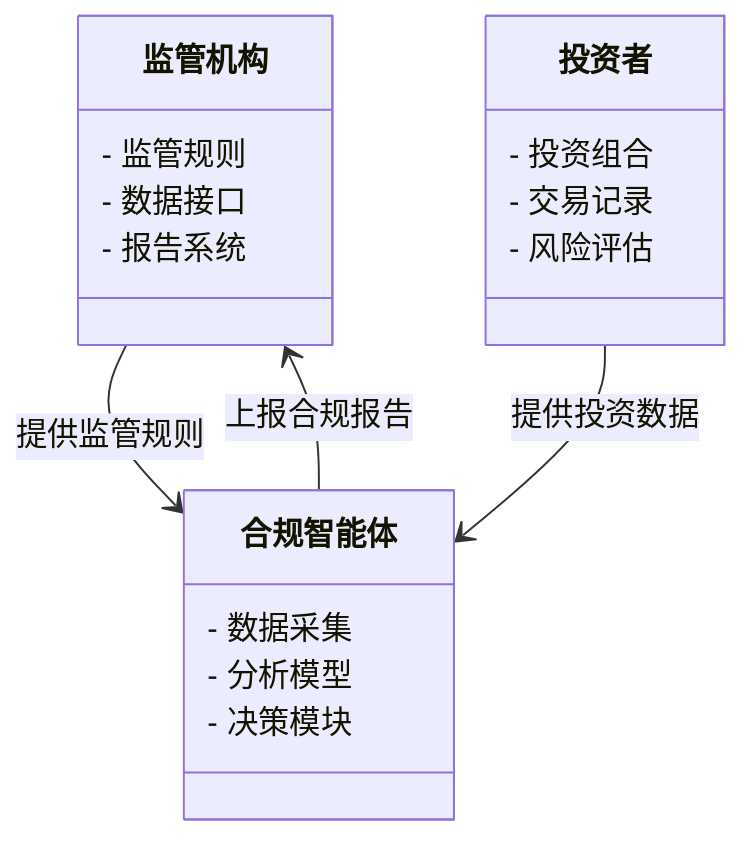
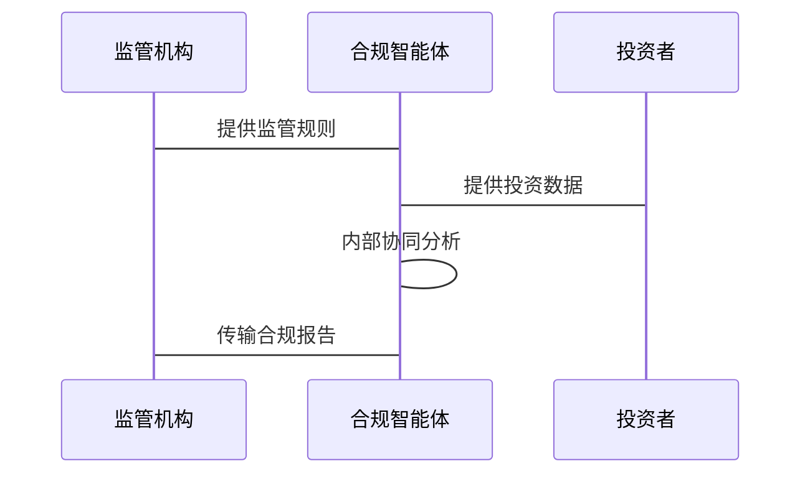

                 


# 《AI驱动的监管合规性分析：价值投资中的多智能体应用》

> 关键词：AI驱动、监管合规性分析、多智能体系统、价值投资、金融监管

> 摘要：本文将探讨AI技术在监管合规性分析中的应用，特别是在价值投资中的多智能体系统的应用。文章将从监管合规性分析的背景、核心概念、算法原理、系统架构、项目实战等方面进行详细分析，揭示AI技术在金融监管和投资决策中的潜力与价值。

---

# 第1章: 监管合规性分析的背景与价值

## 1.1 监管合规性分析的背景介绍

### 1.1.1 传统监管合规性分析的局限性

传统的监管合规性分析依赖于人工审查和静态规则，存在效率低下、覆盖面有限、难以应对复杂金融环境等问题。

### 1.1.2 AI技术的发展与监管需求

AI技术的快速发展为监管合规性分析提供了新的可能性，特别是在处理海量数据和复杂规则方面具有显著优势。

### 1.1.3 价值投资中的监管合规性需求

在价值投资中，合规性分析是确保投资行为合法、合规的重要环节，AI技术可以帮助投资者快速识别合规投资机会。

## 1.2 多智能体系统的基本概念

### 1.2.1 多智能体系统的定义

多智能体系统是由多个相互作用的智能体组成的系统，每个智能体都可以独立决策并与其他智能体协作。

### 1.2.2 多智能体系统的特征

- 分布式性：多个智能体分布在不同的节点上。
- 协作性：智能体之间需要协作完成共同目标。
- 反应性：智能体能够实时感知环境并做出反应。

### 1.2.3 多智能体系统与单智能体系统的区别

| 特性 | 单智能体系统 | 多智能体系统 |
|------|--------------|-------------|
| 结构  | 单一中心     | 分布式      |
| 决策  | 集中决策     | 分散决策    |
| 交互  | 无           | 高          |

## 1.3 AI驱动的监管合规性分析的核心价值

### 1.3.1 提高监管效率

AI技术可以快速处理海量数据，识别潜在风险，提高监管效率。

### 1.3.2 降低合规成本

通过自动化分析和智能决策，AI技术可以显著降低合规成本。

### 1.3.3 提升投资决策的准确性

AI驱动的多智能体系统可以帮助投资者更准确地识别合规投资机会，提升投资决策的准确性。

## 1.4 本章小结

本章介绍了监管合规性分析的背景、多智能体系统的概念以及AI驱动的监管合规性分析的核心价值。

---

# 第2章: 监管合规性分析的核心概念与联系

## 2.1 监管合规性分析的定义与范围

### 2.1.1 监管合规性的定义

监管合规性是指企业或个人在经营活动中遵守相关法律法规和监管要求的性质。

### 2.1.2 监管合规性的范围

- 公司治理
- 信息披露
- 投资合规
- 风险管理

### 2.1.3 监管合规性分析的目标

识别和评估合规风险，确保经营行为合法合规。

## 2.2 多智能体系统在监管合规性分析中的应用

### 2.2.1 多智能体系统的监管优势

- 分布式计算能力
- 实时数据处理
- 多维度分析

### 2.2.2 多智能体系统的合规性分析流程

1. 数据采集与处理
2. 智能体协同分析
3. 风险识别与预警
4. 合规性评估与报告

### 2.2.3 多智能体系统与监管合规性的关系

多智能体系统通过协同合作，能够更高效地完成监管合规性分析任务。

## 2.3 监管合规性分析的核心要素

### 2.3.1 数据来源与处理

- 数据来源：企业内部数据、公开数据、监管数据
- 数据处理：清洗、整合、分析

### 2.3.2 分析模型与算法

- 机器学习模型
- 强化学习算法
- 图神经网络

### 2.3.3 结果解读与反馈

- 可视化报告
- 风险预警
- 反馈优化

## 2.4 本章小结

本章详细介绍了监管合规性分析的核心概念、多智能体系统的应用以及合规性分析的核心要素。

---

# 第3章: AI驱动的监管合规性分析的算法原理

## 3.1 监管合规性分析的算法选择

### 3.1.1 常见的监管合规性分析算法

- 传统机器学习算法（如SVM、随机森林）
- 基于强化学习的算法（如DQN）
- 基于图神经网络的算法

### 3.1.2 多智能体系统中的算法选择

- 多智能体强化学习
- 联合学习
- 分布式计算算法

### 3.1.3 基于强化学习的合规性分析

强化学习通过智能体与环境的交互，逐步学习最优策略，适用于复杂的监管合规性分析任务。

## 3.2 基于强化学习的合规性分析算法

### 3.2.1 强化学习的基本原理

- 状态（State）
- 行动（Action）
- 奖励（Reward）
- 策略（Policy）

### 3.2.2 多智能体强化学习的流程

1. 初始化智能体
2. 智能体与环境交互
3. 更新策略
4. 评估结果

### 3.2.3 合规性分析的数学模型

$$ Q(s,a) = Q(s,a) + \alpha (r + \gamma \max Q(s',a') - Q(s,a)) $$

其中：
- \( Q(s,a) \)：状态-行动值函数
- \( \alpha \)：学习率
- \( r \)：奖励
- \( \gamma \)：折扣因子
- \( Q(s',a') \)：下一个状态的最大值

## 3.3 本章小结

本章详细介绍了监管合规性分析中常用的算法，特别是强化学习在多智能体系统中的应用。

---

# 第4章: 系统架构与设计

## 4.1 问题场景介绍

### 4.1.1 监管合规性分析的复杂性

- 数据异构性
- 规则复杂性
- 实时性要求

### 4.1.2 多智能体系统的应用需求

- 分布式计算
- 实时协作
- 高效决策

## 4.2 系统功能设计

### 4.2.1 领域模型设计

使用Mermaid类图描述系统中的各个角色及其关系。



### 4.2.2 系统架构设计

使用Mermaid架构图描述系统的整体架构。


## 4.3 系统接口设计

### 4.3.1 API接口设计

- 数据接口：用于数据的上传和下载
- 分析接口：用于合规性分析请求
- 报告接口：用于生成和获取合规报告

### 4.3.2 交互流程图

使用Mermaid序列图描述系统交互流程。



## 4.4 本章小结

本章详细介绍了系统的架构设计、功能设计和接口设计，为实际应用提供了理论基础。

---

# 第5章: 项目实战与案例分析

## 5.1 环境安装与配置

### 5.1.1 安装Python环境

- 安装Python 3.8及以上版本
- 安装必要的库（如TensorFlow、Keras、Scikit-learn）

### 5.1.2 安装AI框架

- 安装强化学习框架（如OpenAI Gym）
- 安装分布式计算框架（如Ray）

## 5.2 核心代码实现

### 5.2.1 合规智能体代码

```python
class ComplianceAgent:
    def __init__(self, rules):
        self.rules = rules
        self.q_table = {}

    def get_action(self, state):
        if state in self.q_table:
            return self.q_table[state]
        else:
            return 'default_action'

    def update_q_table(self, state, action, reward):
        self.q_table[state] = reward
```

### 5.2.2 多智能体协同代码

```python
import ray

@ray.remote
class MultiAgent:
    def __init__(self, rules):
        self.rules = rules
        self.agents = []

    def add_agent(self, agent):
        self.agents.append(agent)

    def process(self, data):
        for agent in self.agents:
            agent.get_action(data)
```

## 5.3 案例分析与结果解读

### 5.3.1 案例背景

假设某金融机构需要分析其投资组合的合规性，使用多智能体系统进行分析。

### 5.3.2 数据处理与分析

- 数据清洗：处理缺失值和异常值
- 数据分析：使用机器学习模型识别潜在风险
- 合规性评估：根据分析结果生成合规报告

### 5.3.3 结果解读

- 合规性评分
- 风险预警
- 投资建议

## 5.4 本章小结

本章通过实际案例展示了如何使用AI技术进行监管合规性分析，提供了代码实现和结果解读。

---

# 第6章: 最佳实践与未来展望

## 6.1 小结

AI技术在监管合规性分析中的应用具有巨大潜力，多智能体系统能够显著提高监管效率和准确性。

## 6.2 注意事项

- 数据隐私保护
- 算法透明性
- 系统可解释性

## 6.3 拓展阅读

- 《强化学习入门》
- 《多智能体系统与应用》
- 《金融监管与合规性分析》

---

# 作者：AI天才研究院 & 禅与计算机程序设计艺术

