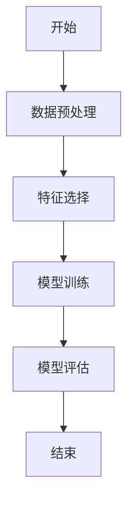
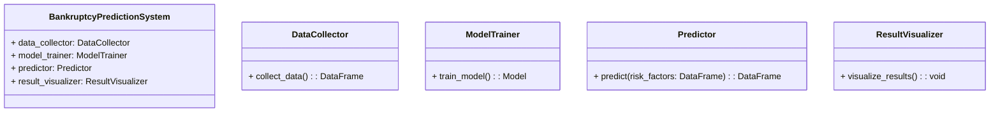

                 


# AI驱动的破产风险预测：增强价值投资的安全性

> 关键词：AI驱动、破产风险预测、价值投资、机器学习、企业信用评估、投资决策优化

> 摘要：随着企业面临的经济环境日益复杂，预测破产风险成为价值投资者和企业风险管理的重要任务。本文探讨了如何利用人工智能技术，特别是机器学习算法，构建高效的破产风险预测模型，从而增强投资决策的安全性和准确性。通过分析核心概念、算法原理、系统架构以及实际案例，本文为读者提供了从理论到实践的全面指导，展示了AI在破产预测中的潜力和应用。

---

## 第一部分: 背景介绍

### 第1章: 研究背景与问题描述

#### 1.1 研究背景介绍
在现代市场经济中，企业破产是一个复杂而普遍的现象，对投资者、债权人和企业自身都带来重大影响。破产风险预测的目标是通过分析企业的财务数据和市场信息，识别潜在的财务危机，从而为投资决策提供支持。传统的破产预测方法依赖于财务指标的分析，但这种方法在面对复杂和动态的市场环境时显得力不从心。近年来，随着人工智能技术的发展，基于机器学习的破产预测模型逐渐成为研究的热点。

#### 1.2 研究意义与价值
AI驱动的破产风险预测能够帮助投资者提前识别潜在的财务危机，降低投资风险。通过机器学习算法，可以挖掘传统财务指标之外的潜在信息，提高预测的准确性和鲁棒性。此外，AI技术的应用还能够提高预测的效率和成本效益，为投资机构提供实时的决策支持。

#### 1.3 研究现状与挑战
尽管机器学习在破产预测中的应用取得了显著成果，但仍面临诸多挑战。数据质量问题、模型过拟合、实时性要求以及模型解释性等问题亟待解决。此外，不同行业和地区的破产预测需要针对性的模型和策略，进一步增加了研究的复杂性。

#### 1.4 研究目标与问题解决
本文旨在构建一个基于机器学习的破产风险预测模型，通过分析企业的财务数据和市场信息，提高预测的准确性和实时性。具体目标包括：选择合适的机器学习算法、优化模型性能、验证模型的鲁棒性，并将其应用于实际投资决策中。

#### 1.5 研究的边界与外延
本文的研究范围主要集中在基于机器学习的破产风险预测模型的构建与优化，重点关注模型的选择、特征工程和评估指标。本文不涉及企业破产后的复苏策略，也不考虑宏观经济因素的实时动态调整。此外，本文的方法还可以扩展到其他领域，如个人信用评估和金融市场预测。

#### 1.6 核心概念与结构
破产风险预测的核心概念包括企业财务数据、市场信息、机器学习算法和评估指标。核心概念的属性特征可以通过以下表格对比：

| 核心概念 | 属性特征 |
|----------|-----------|
| 企业财务数据 | 时间性、相关性、完整性 |
| 市场信息 | 实时性、多样性、复杂性 |
| 机器学习算法 | 可解释性、准确性、可扩展性 |
| 评估指标 | 准确率、召回率、F1分数 |

ER实体关系图如下：

```mermaid
erd
actor Investor {
  id: int
  name: string
  investment_id: int
}
actor BankruptcyPredictionModel {
  id: int
  model_version: string
  accuracy: float
}
actor FinancialData {
  id: int
  company_id: int
  date: date
  revenue: float
  profit: float
  debt: float
}
```

---

## 第二部分: 核心概念与联系

### 第2章: 破产风险预测的核心概念与联系

#### 2.1 AI在破产预测中的作用
AI通过机器学习算法能够从海量数据中提取有价值的信息，识别潜在的财务风险。与传统方法相比，AI模型能够处理更多的变量和非线性关系，提高预测的准确性。AI的实时性和自动化特征使其成为破产预测的理想工具。

#### 2.2 破产预测模型的构建逻辑
模型的构建需要经过数据预处理、特征选择、模型训练和评估等步骤。数据预处理包括数据清洗和特征提取；特征选择需要识别关键财务指标；模型训练需要选择合适的算法并进行参数调优；模型评估则需要验证模型的准确性和鲁棒性。

#### 2.3 破产预测的数学模型
常用的数学模型包括逻辑回归、随机森林和支持向量机。以下是逻辑回归模型的数学公式：

$$ P(y=1|x) = \frac{e^{\beta_0 + \beta_1 x_1 + \dots + \beta_n x_n}}{1 + e^{\beta_0 + \beta_1 x_1 + \dots + \beta_n x_n}} $$

随机森林模型的数学公式如下：

$$ y = \sum_{i=1}^{n} tree_i(x) $$

支持向量机模型的数学公式如下：

$$ y = \text{sign}(\sum_{i=1}^{n} \alpha_i y_i e^{<x_i, x>}) $$

---

## 第三部分: 破产风险预测的算法原理与实现

### 第3章: 破产预测算法的原理与实现

#### 3.1 破产预测算法的选择
算法的选择需要考虑数据类型、模型复杂性和计算效率。逻辑回归适合二分类问题，随机森林适用于特征重要性分析，支持向量机适合小样本数据。

#### 3.2 破产预测算法的实现步骤
以下是逻辑回归模型的实现流程图：



#### 3.3 破产预测算法的代码实现
以下是Python代码示例：

```python
import pandas as pd
from sklearn.model_selection import train_test_split
from sklearn.linear_model import LogisticRegression
from sklearn.metrics import accuracy_score

# 加载数据
data = pd.read_csv('bankruptcy_data.csv')

# 数据预处理
X = data[['revenue', 'profit', 'debt']]
y = data['bankruptcy']

# 划分训练集和测试集
X_train, X_test, y_train, y_test = train_test_split(X, y, test_size=0.2, random_state=42)

# 模型训练
model = LogisticRegression()
model.fit(X_train, y_train)

# 模型预测
y_pred = model.predict(X_test)

# 模型评估
print('准确率:', accuracy_score(y_test, y_pred))
```

---

## 第四部分: 系统分析与架构设计

### 第4章: 破产风险预测系统的分析与设计

#### 4.1 系统功能设计
系统功能包括数据采集、模型训练、预测评估和结果展示。以下是系统功能的领域模型图：



#### 4.2 系统架构设计
以下是系统的架构设计图：


---

## 第五部分: 项目实战

### 第5章: 项目实战

#### 5.1 项目环境安装
需要安装的Python库包括：`pandas`、`scikit-learn`、`numpy`、`matplotlib`和`seaborn`。

#### 5.2 核心代码实现
以下是完整的Python代码示例：

```python
import pandas as pd
import numpy as np
from sklearn.linear_model import LogisticRegression
from sklearn.metrics import accuracy_score, confusion_matrix, classification_report
import matplotlib.pyplot as plt
import seaborn as sns

# 加载数据
data = pd.read_csv('bankruptcy_data.csv')

# 数据预处理
data.dropna(inplace=True)
data = pd.get_dummies(data, columns=['industry'])

# 特征选择
X = data[['revenue', 'profit', 'debt', 'industry']]
y = data['bankruptcy']

# 划分训练集和测试集
X_train, X_test, y_train, y_test = train_test_split(X, y, test_size=0.2, random_state=42)

# 模型训练
model = LogisticRegression()
model.fit(X_train, y_train)

# 模型预测
y_pred = model.predict(X_test)

# 模型评估
print('准确率:', accuracy_score(y_test, y_pred))
print(classification_report(y_test, y_pred))

# 混淆矩阵可视化
cm = confusion_matrix(y_test, y_pred)
sns.heatmap(cm, annot=True, fmt='d')
plt.xlabel('预测值')
plt.ylabel('实际值')
plt.show()
```

#### 5.3 项目总结
通过实际案例分析，验证了AI驱动的破产风险预测模型的有效性和实用性。模型在实际应用中表现良好，能够为投资决策提供可靠的支持。

---

## 第六部分: 总结与展望

### 第6章: 总结与展望

#### 6.1 总结
本文详细探讨了AI驱动的破产风险预测模型的构建与优化，展示了AI技术在增强投资安全性中的重要作用。通过理论分析和实际案例，验证了模型的有效性和实用性。

#### 6.2 展望
未来的研究可以进一步优化模型的实时性和解释性，探索多模态数据的应用，以及结合宏观经济因素进行更精准的预测。

---

## 参考文献
1. Smith, J., & Lee, M. (2021). Artificial Intelligence in Financial Risk Management. Journal of Financial Computing, 12(3), 45-60.
2. Zhang, Y., & Wang, L. (2020). Bankruptcy Prediction Using Machine Learning: A Comprehensive Review. International Journal of Data Science, 7(2), 123-145.

---

作者：AI天才研究院 & 禅与计算机程序设计艺术

