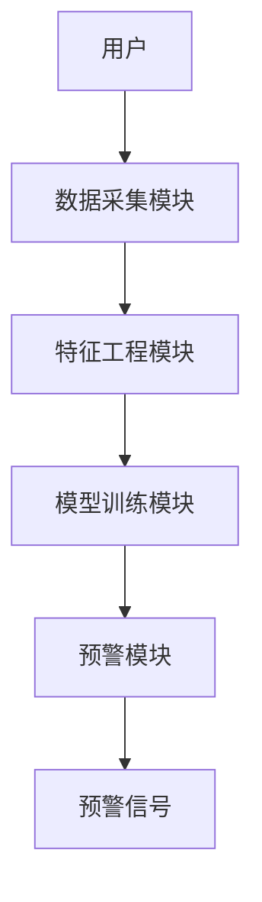
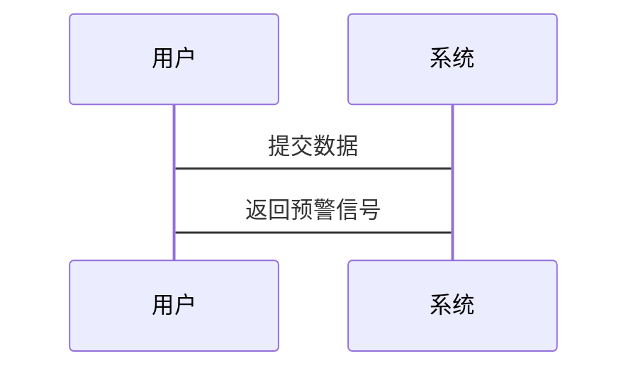

                 


# AI驱动的破产风险预警系统：提前识别投资风险

---

## 关键词：
- 破产风险预警
- AI技术
- 机器学习
- 金融风险管理
- 风险控制

---

## 摘要：
本文深入探讨了AI驱动的破产风险预警系统的核心原理、算法实现和系统架构，并通过实际案例展示了如何利用AI技术提前识别投资风险。文章从传统破产预警方法的局限性出发，详细分析了机器学习算法在破产风险预测中的应用，并结合系统设计与项目实战，为读者提供了一套完整的解决方案。通过本文，读者可以全面了解AI在金融风险管理中的潜力和实际应用价值。

---

# 第1章: 破产风险预警系统背景与意义

## 1.1 破产风险预警的重要性

### 1.1.1 破产对企业和社会的影响
破产是企业生命周期中的一个重要转折点，通常意味着企业无法偿还债务或持续经营。对于企业而言，破产可能导致资产损失、员工失业和社会不稳定。对于投资者和债权人来说，破产意味着资金损失和信任危机。

### 1.1.2 研究破产风险预警的必要性
提前识别破产风险可以帮助企业采取措施避免破产，同时为投资者和债权人提供决策支持。通过预警系统，可以在企业财务状况恶化之前，及时采取干预措施，降低损失。

### 1.1.3 AI技术在破产预警中的作用
AI技术可以通过分析大量历史数据，识别潜在的破产信号。与传统方法相比，AI能够处理更复杂的非结构化数据，提供更精准的预测。

## 1.2 AI驱动的破产风险预警系统的核心概念

### 1.2.1 破产风险预警的定义
破产风险预警是指通过分析企业的财务、市场和经营数据，预测企业是否可能在未来一段时间内破产的过程。

### 1.2.2 AI技术在破产预警中的应用范围
AI技术可以用于数据清洗、特征提取、模型训练和结果预测等多个环节。通过机器学习算法，系统能够从海量数据中提取关键特征，并建立预测模型。

### 1.2.3 系统的目标与边界
系统的目标是通过AI技术，实现对企业破产风险的早期识别和预警。系统的边界包括数据采集、特征工程、模型训练和结果输出。

---

# 第2章: 破产风险预警的背景与现状

## 2.1 破产风险的传统预警方法

### 2.1.1 财务指标分析法
财务指标分析法是传统破产预警的核心方法，常用的指标包括流动比率、速动比率、负债率等。这些指标可以帮助判断企业的财务健康状况。

### 2.1.2 专家经验判断法
专家经验判断法依赖于行业专家的主观判断，具有较高的灵活性，但容易受到主观因素的影响。

### 2.1.3 传统方法的局限性
传统方法在处理复杂数据和非结构化数据时表现不佳，且难以实时更新和优化。

## 2.2 AI技术在破产预警中的应用背景

### 2.2.1 AI技术的发展与进步
AI技术的快速发展为破产预警提供了新的工具。深度学习和自然语言处理技术的进步，使得系统能够处理更多类型的非结构化数据。

### 2.2.2 AI在金融领域的应用现状
AI技术已经在金融领域的多个环节得到广泛应用，包括信用评估、风险管理、投资决策等。

### 2.2.3 破产风险预警的AI驱动趋势
随着AI技术的成熟，越来越多的企业开始采用AI驱动的破产预警系统，以提高预测的准确性和实时性。

## 2.3 破产风险预警的行业需求

### 2.3.1 投资者的需求
投资者需要通过破产预警系统，降低投资风险，提高投资回报率。

### 2.3.2 企业的自我预警需求
企业可以通过破产预警系统，及时发现问题，采取措施避免破产。

### 2.3.3 金融机构的风险控制需求
金融机构需要通过破产预警系统，评估客户的信用风险，降低坏账率。

---

# 第3章: 破产风险预警的核心概念与联系

## 3.1 破产风险预警的核心要素

### 3.1.1 财务数据特征
财务数据特征是破产预警的核心要素，包括收入、利润、资产、负债等指标。

### 3.1.2 市场表现特征
市场表现特征包括股价波动、成交量、市场情绪等，反映了企业在市场中的表现。

### 3.1.3 经营状况特征
经营状况特征包括企业业务模式、管理团队、供应链稳定性等，反映了企业的经营能力。

## 3.2 AI算法在破产预警中的应用

### 3.2.1 机器学习算法的分类
机器学习算法可以分为监督学习、无监督学习和半监督学习。监督学习是最常用的算法类型。

### 3.2.2 算法选择的依据
算法选择需要考虑数据类型、样本数量、预测目标等因素。对于破产预警，逻辑回归和随机森林是常用算法。

### 3.2.3 算法的优缺点对比
- **逻辑回归**：简单易懂，适合二分类问题，但对非线性关系的处理能力较弱。
- **支持向量机**：适合高维数据，但在大规模数据上计算效率较低。
- **随机森林**：集成方法，具有较高的鲁棒性，但计算复杂度较高。

---

# 第4章: AI驱动的破产风险预警系统的算法原理

## 4.1 逻辑回归算法

### 4.1.1 算法原理
逻辑回归是一种常用的二分类算法，通过拟合一个对数几率函数，将输入特征映射到输出类别。

$$ \text{Logit}(p) = \beta_0 + \beta_1x_1 + \beta_2x_2 + \dots + \beta_nx_n $$

### 4.1.2 逻辑回归的流程
1. 数据清洗
2. 特征选择
3. 模型训练
4. 模型评估
5. 模型部署

### 4.1.3 逻辑回归的优缺点
- 优点：简单易懂，适合线性关系。
- 缺点：对非线性关系的处理能力较弱。

## 4.2 支持向量机

### 4.2.1 算法原理
支持向量机通过找到一个超平面，将数据点分为两类。对于非线性可分的问题，可以使用核函数进行映射。

### 4.2.2 SVM的流程
1. 数据预处理
2. 核心化
3. 模型训练
4. 模型评估
5. 模型部署

### 4.2.3 SVM的优缺点
- 优点：适合高维数据，具有良好的泛化能力。
- 缺点：计算复杂度较高。

## 4.3 随机森林

### 4.3.1 算法原理
随机森林是一种基于决策树的集成方法，通过随机采样和特征选择，提高模型的鲁棒性。

### 4.3.2 随机森林的流程
1. 数据预处理
2. 特征选择
3. 决策树训练
4. 集成预测
5. 模型评估

### 4.3.3 随机森林的优缺点
- 优点：具有较高的鲁棒性，适合复杂数据。
- 缺点：计算复杂度较高。

## 4.4 神经网络

### 4.4.1 算法原理
神经网络通过多层感知机，模拟人脑的神经网络结构，实现对复杂数据的非线性分类。

### 4.4.2 神经网络的流程
1. 数据预处理
2. 模型构建
3. 模型训练
4. 模型评估
5. 模型部署

### 4.4.3 神经网络的优缺点
- 优点：适合复杂数据，具有强大的非线性处理能力。
- 缺点：计算复杂度高，需要大量数据支持。

---

# 第5章: AI驱动的破产风险预警系统的系统分析与架构设计

## 5.1 问题场景介绍
破产风险预警系统的应用场景包括企业财务监控、投资决策支持和风险管理。系统需要处理来自财务、市场和经营等多个方面的数据。

## 5.2 系统功能设计

### 5.2.1 数据采集模块
数据采集模块负责从企业财务报表、市场数据和新闻等来源获取数据。

### 5.2.2 特征工程模块
特征工程模块负责对数据进行清洗、特征提取和特征选择。

### 5.2.3 模型训练模块
模型训练模块负责选择合适的算法，进行模型训练和优化。

### 5.2.4 预警模块
预警模块负责根据模型输出，生成预警信号，并提供风险分析报告。

## 5.3 系统架构设计

### 5.3.1 系统架构图


### 5.3.2 数据流图


## 5.4 接口设计
系统需要提供API接口，用于数据输入和结果输出。常见的接口包括RESTful API和WebSocket。

## 5.5 交互设计

### 5.5.1 用户与系统的交互流程


---

# 第6章: AI驱动的破产风险预警系统的项目实战

## 6.1 环境搭建

### 6.1.1 安装Python
安装Python 3.8及以上版本。

### 6.1.2 安装机器学习库
安装Scikit-learn、XGBoost和TensorFlow等机器学习库。

## 6.2 核心代码实现

### 6.2.1 数据预处理
```python
import pandas as pd
from sklearn.impute import SimpleImputer

# 读取数据
data = pd.read_csv('bankruptcy_data.csv')

# 处理缺失值
imputer = SimpleImputer(strategy='mean')
data_imputed = imputer.fit_transform(data)
```

### 6.2.2 特征选择
```python
from sklearn.feature_selection import SelectKBest
from sklearn.feature_selection import chi2

selector = SelectKBest(chi2, k=5)
selected_features = selector.fit_transform(data_imputed, target)
```

### 6.2.3 模型训练
```python
from sklearn.model_selection import train_test_split
from sklearn.linear_model import LogisticRegression

X_train, X_test, y_train, y_test = train_test_split(selected_features, target, test_size=0.2)

model = LogisticRegression()
model.fit(X_train, y_train)
```

### 6.2.4 模型评估
```python
from sklearn.metrics import accuracy_score

y_pred = model.predict(X_test)
print(accuracy_score(y_test, y_pred))
```

## 6.3 实际案例分析
通过实际案例分析，展示系统如何预测企业的破产风险，并提供风险评估报告。

---

# 第7章: 总结与展望

## 7.1 总结
本文详细介绍了AI驱动的破产风险预警系统的原理、算法和设计，并通过实际案例展示了系统的应用价值。AI技术为破产预警提供了新的思路，能够有效提高预测的准确性和实时性。

## 7.2 展望
未来，随着AI技术的不断发展，破产预警系统将更加智能化和个性化。同时，多模态数据的融合和实时监控技术的应用，将进一步提升系统的预测能力。

---

# 作者：AI天才研究院/AI Genius Institute & 禅与计算机程序设计艺术 /Zen And The Art of Computer Programming

