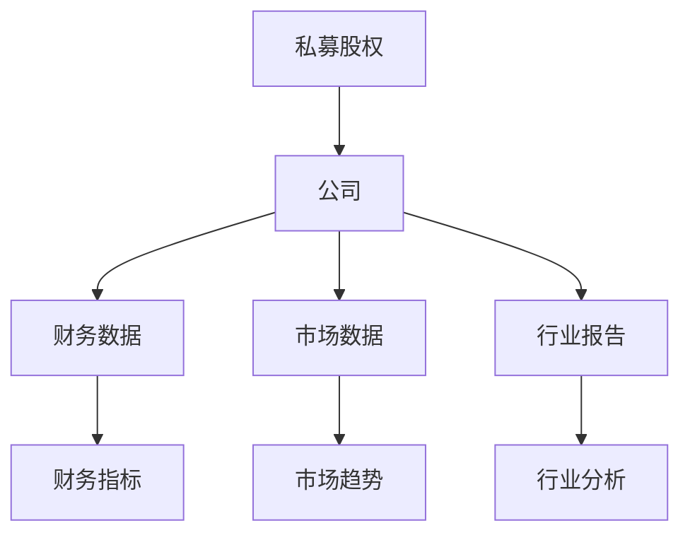
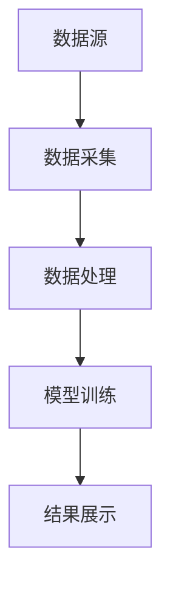
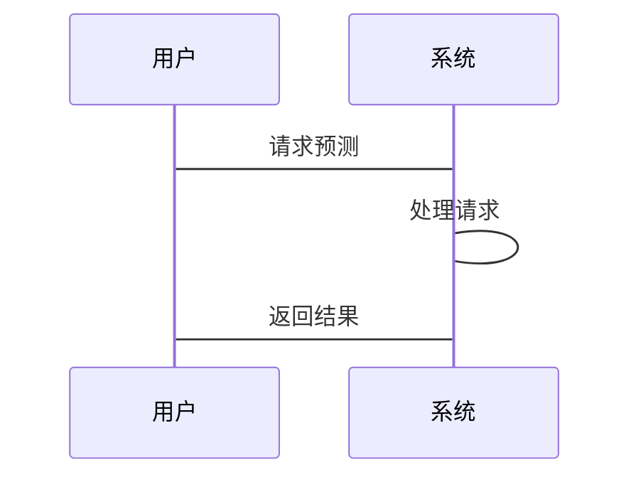

                 


# AI驱动的私募股权投资分析

## 关键词：私募股权投资、人工智能、机器学习、数据分析、投资决策

## 摘要：本文探讨了人工智能在私募股权投资中的应用，分析了其核心概念、算法原理、系统架构，并通过案例展示了AI如何优化投资决策，提供了一种创新的分析方法。

---

# 第1章: 私募股权投资与AI技术的结合

## 1.1 私募股权投资的基本概念

### 1.1.1 私募股权的定义与特点

私募股权是指通过非公开市场进行的投资，其特点包括高门槛、高回报潜力、长期持有和较低的流动性。私募股权通常涉及对企业的控制权投资，投资者通过购买企业的部分股权，期望在企业增值后通过出售实现收益。

### 1.1.2 私募股权投资的流程

私募股权投资的流程一般包括以下几个阶段：

1. **尽职调查**：投资者对目标企业的财务状况、市场地位、管理团队等进行详细调查。
2. **投资决策**：基于尽职调查结果，评估投资风险和回报，做出投资决策。
3. **投资后管理**：投资者与被投企业保持联系，提供支持，监控企业运营。
4. **退出策略**：在适当的时候，通过出售股权或企业公开上市等方式退出，实现收益。

### 1.1.3 私募股权投资的挑战

私募股权投资面临的主要挑战包括：

- **信息不对称**：投资者难以全面掌握企业的内部信息。
- **市场波动**：经济波动可能影响企业价值。
- **复杂决策**：涉及多因素分析，决策过程复杂。

## 1.2 AI技术在金融领域的应用前景

### 1.2.1 AI技术的基本概念

人工智能（AI）是指模拟人类智能的计算机系统，包括学习、推理和自我改进的能力。机器学习是AI的核心，通过数据训练模型，使其能够进行预测和决策。

### 1.2.2 AI在金融领域的应用

AI在金融领域的应用包括：

- **股票预测**：利用历史数据预测股票价格走势。
- **风险评估**：通过分析数据评估投资风险。
- **投资组合优化**：根据市场情况调整投资组合，以最大化收益和最小化风险。

### 1.2.3 AI在私募股权投资中的潜在价值

AI技术可以通过以下方式提升私募股权投资的效率和准确性：

- **数据处理**：处理大量非结构化数据，如新闻、社交媒体，提取有用信息。
- **模型预测**：利用机器学习模型预测企业业绩和市场趋势。
- **自动化决策**：自动化分析流程，辅助投资决策。

---

# 第2章: 私募股权投资分析的核心概念与联系

## 2.1 私募股权投资分析的背景介绍

### 2.1.1 问题背景

私募股权投资分析需要处理大量复杂数据，传统方法依赖人工经验，效率低下且容易出错。AI技术的应用可以提高分析效率和准确性。

### 2.1.2 问题描述

私募股权投资分析涉及多个因素，包括财务数据、市场趋势、管理团队等。传统方法难以处理这些复杂因素，导致决策失误。

### 2.1.3 问题解决

通过AI技术，可以自动化处理和分析数据，提供更准确的预测和决策支持。

## 2.2 核心概念与联系

### 2.2.1 核心概念原理

私募股权投资分析的核心是通过对数据的分析，评估企业的潜在价值和风险。AI技术通过机器学习模型，帮助投资者做出更明智的决策。

### 2.2.2 核心概念属性对比表格

| 属性 | 私募股权投资分析 | AI技术应用 |
|------|----------------|------------|
| 数据来源 | 公司财务数据、市场数据、行业报告 | 文本数据、结构化数据、图像数据 |
| 分析方法 | 财务指标分析、行业分析、案例分析 | 机器学习、自然语言处理、图像识别 |
| 决策支持 | 投资决策、风险评估 | 预测模型、自动化决策 |

### 2.2.3 ER实体关系图



---

# 第3章: 算法原理

## 3.1 算法原理概述

在私募股权投资分析中，常用的机器学习算法包括线性回归、支持向量机、随机森林和神经网络。

### 3.1.1 线性回归

线性回归用于预测连续型变量，如企业未来收入。

公式：
$$ y = \beta_0 + \beta_1x_1 + \beta_2x_2 + \dots + \beta_nx_n $$

### 3.1.2 支持向量机

支持向量机适用于分类问题，如判断企业是否值得投资。

### 3.1.3 随机森林

随机森林是一种集成学习方法，用于处理复杂的分类和回归问题。

### 3.1.4 神经网络

神经网络适用于处理复杂非线性关系，如市场趋势预测。

---

## 3.2 算法实现步骤

### 3.2.1 数据预处理

- 数据清洗：处理缺失值和异常值。
- 数据转换：将数据转换为模型可接受的格式。

### 3.2.2 模型训练

- 选择算法。
- 训练模型，调整参数。

### 3.2.3 模型评估

- 使用测试数据评估模型性能。
- 调整模型以提高准确性。

### 3.2.4 模型部署

- 部署模型到生产环境，实时处理数据。

---

## 3.3 代码实现

以下是一个简单的线性回归实现：

```python
import numpy as np
from sklearn.linear_model import LinearRegression

# 示例数据
X = np.array([[1], [2], [3], [4]])
y = np.array([2, 4, 6, 8])

# 创建模型
model = LinearRegression()

# 训练模型
model.fit(X, y)

# 预测
print(model.predict([[5]]))  # 输出：[[10]]
```

---

# 第4章: 系统分析与架构设计

## 4.1 系统分析

### 4.1.1 问题场景

投资者需要一个系统来分析私募股权，包括数据收集、处理和预测。

### 4.1.2 项目介绍

开发一个AI驱动的私募股权投资分析系统，帮助投资者做出更明智的决策。

---

## 4.2 系统架构设计

### 4.2.1 系统功能设计

- 数据采集模块：收集企业财务数据、市场数据等。
- 数据处理模块：清洗和转换数据。
- 模型训练模块：训练机器学习模型。
- 结果展示模块：可视化分析结果。

### 4.2.2 系统架构图



### 4.2.3 接口设计

- REST API接口，提供数据查询和预测服务。

### 4.2.4 交互流程图



---

# 第5章: 项目实战

## 5.1 环境安装

- 安装Python和必要的库，如scikit-learn、pandas、numpy。

## 5.2 核心代码实现

```python
import pandas as pd
from sklearn.model_selection import train_test_split
from sklearn.linear_model import LinearRegression

# 加载数据
data = pd.read_csv('equity_data.csv')

# 分割数据
X = data[['revenue', 'profit']]
y = data['valuation']

# 训练模型
X_train, X_test, y_train, y_test = train_test_split(X, y, test_size=0.2)
model = LinearRegression()
model.fit(X_train, y_train)

# 预测
print(model.predict(X_test))
```

---

## 5.3 案例分析

### 5.3.1 数据分析

分析企业财务数据和市场趋势，预测其未来价值。

### 5.3.2 模型应用

利用训练好的模型，预测企业的潜在估值。

---

## 5.4 总结

通过AI技术，私募股权投资分析变得更加高效和准确。系统化的流程和强大的算法模型能够帮助投资者做出更明智的决策。

---

# 第6章: 总结

## 6.1 回顾

本文详细探讨了AI在私募股权投资中的应用，包括核心概念、算法原理和系统设计。

## 6.2 最佳实践 tips

- 数据质量至关重要。
- 选择合适的算法。
- 持续监控和优化模型。

## 6.3 未来展望

随着AI技术的发展，私募股权投资分析将更加智能化和自动化。

---

# 作者：AI天才研究院/AI Genius Institute & 禅与计算机程序设计艺术 /Zen And The Art of Computer Programming

---

**本文通过详细的结构化分析，结合实际案例和代码实现，展示了AI如何驱动私募股权投资分析的创新。希望本文能为读者提供有价值的见解和实用的方法。**

