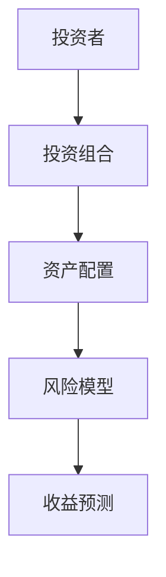
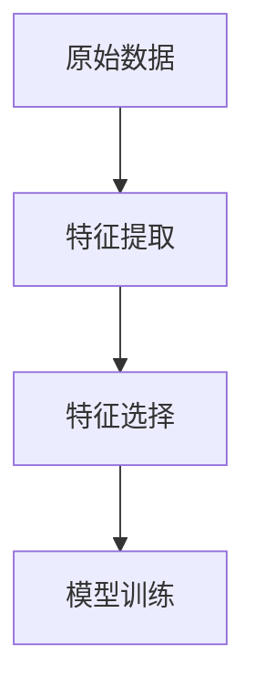
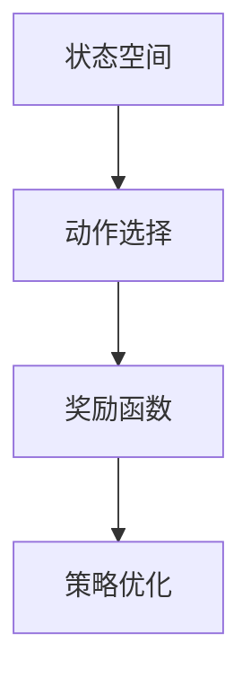
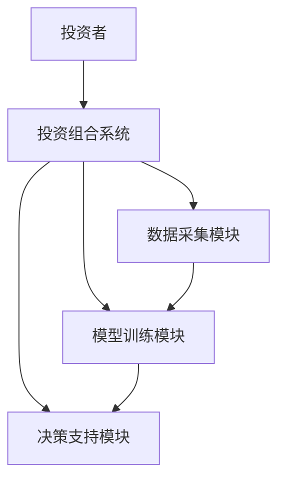

                 


# AI驱动的私募股权投资组合构建

> 关键词：私募股权投资、AI驱动、投资组合优化、机器学习、风险收益平衡

> 摘要：本文系统地探讨了AI技术在私募股权投资组合构建中的应用。通过分析私募股权投资的核心概念与AI技术的结合，阐述了如何利用机器学习算法优化投资组合。文章从数学模型、系统架构、项目实战等多个维度展开，详细解析了AI驱动的私募股权投资组合构建的原理与实现。通过案例分析和实际应用，展示了AI技术在提升投资效率和风险控制方面的显著优势。

---

# 第1章: 私募股权投资与AI驱动的投资概述

## 1.1 私募股权投资的基本概念

### 1.1.1 私募股权投资的定义与特点

私募股权投资是指通过私募方式投资于非上市公司的股权，以获取资本增值收益的投资方式。其特点包括：

- **私募性**：投资行为不公开，投资者通常为机构投资者或高净值个人。
- **高收益潜力**：通过长期持有优质资产，实现资本增值。
- **高风险性**：投资标的企业经营不确定性较高，市场波动大。
- **专业性**：需要专业的投资能力和丰富的行业经验。

### 1.1.2 私募股权投资的核心要素

私募股权投资的核心要素包括：

1. **标的资产**：通常为未上市的成长型企业。
2. **投资策略**：包括价值投资、成长投资、控股投资等。
3. **投资期限**：通常为中长期投资。
4. **退出机制**：通过IPO、并购等方式退出，实现收益。

### 1.1.3 私募股权投资的分类与应用场景

私募股权投资主要分为以下几类：

- **风险投资基金（VC）**：主要投资于初创期和成长期企业。
- **私募股权基金（PE）**：主要投资于成熟期企业，通过控股和重组实现价值提升。
- **夹层基金（Mezzanine）**：介于VC和PE之间的投资方式，兼具股权和债权特征。

---

## 1.2 AI在金融投资中的应用现状

### 1.2.1 AI在金融领域的应用领域

AI技术在金融领域的应用广泛，包括：

- **智能投顾**：通过算法为投资者提供个性化投资建议。
- **风险评估**：利用机器学习模型预测违约风险。
- **量化交易**：基于算法进行高频交易。
- **市场预测**：通过自然语言处理和时间序列分析预测市场走势。

### 1.2.2 私募股权投资中AI的应用潜力

AI技术为私募股权投资带来了以下潜力：

1. **数据驱动的决策支持**：通过海量数据分析，发现潜在投资机会。
2. **智能筛选与尽职调查**：利用自然语言处理和知识图谱进行企业信息分析。
3. **风险预测与组合优化**：通过机器学习模型优化投资组合的风险收益比。

### 1.2.3 当前AI驱动投资的主要挑战

当前AI驱动投资面临的主要挑战包括：

1. **数据质量问题**：私募股权投资数据分散、不完整。
2. **模型解释性不足**：复杂的AI模型难以解释投资决策逻辑。
3. **监管合规性**：AI驱动的投资行为需符合金融监管要求。

---

## 1.3 本章小结

本章介绍了私募股权投资的基本概念、核心要素以及AI技术在金融领域的应用现状。通过分析AI在私募股权投资中的潜力与挑战，为后续章节的深入探讨奠定了基础。

---

# 第2章: AI驱动私募股权投资的核心概念与联系

## 2.1 核心概念原理

### 2.1.1 数据驱动的投资决策

数据驱动的投资决策强调通过分析海量数据，发现投资机会和风险。与传统投资相比，数据驱动的优势在于：

- **全面性**：覆盖更多数据源，发现潜在信息。
- **实时性**：快速响应市场变化。
- **客观性**：基于数据而非主观判断。

### 2.1.2 AI算法在投资组合优化中的作用

AI算法通过以下方式优化投资组合：

1. **特征工程**：提取影响投资收益的关键特征。
2. **模型训练**：构建预测模型，评估资产收益与风险。
3. **组合优化**：基于模型预测结果，优化资产配置。

### 2.1.3 私募股权投资中的风险与收益平衡

投资组合优化的核心目标是在风险可控的前提下，最大化收益。AI技术通过以下方式实现风险与收益的平衡：

- **风险预测**：利用机器学习模型预测资产风险。
- **动态调整**：根据市场变化实时优化组合。

---

## 2.2 核心概念属性特征对比表

| 概念       | 特征1     | 特征2     | 特征3     |
|------------|----------|----------|----------|
| 数据驱动   | 全面性     | 实时性     | 客观性     |
| AI算法     | 复杂性     | 高效性     | 可扩展性   |
| 投资组合   | 多样性     | 风险性     | 收益性     |

---

## 2.3 ER实体关系图



---

## 2.4 本章小结

本章通过对比分析数据驱动、AI算法和投资组合的核心概念，揭示了AI技术在私募股权投资中的关键作用。通过ER实体关系图，展示了各核心概念之间的关系。

---

# 第3章: 私募股权投资组合构建的数学模型与算法原理

## 3.1 数学模型基础

### 3.1.1 投资组合优化的数学表达

投资组合优化的目标是在给定风险水平下，最大化预期收益。数学表达如下：

$$ \text{目标函数} = \sum_{i=1}^{n} w_i r_i - \lambda \sum_{i=1}^{n} w_i^2 $$
其中，\( w_i \) 为第 \( i \) 个资产的权重，\( r_i \) 为预期收益，\( \lambda \) 为惩罚系数。

### 3.1.2 风险-收益平衡的优化目标

在实际应用中，优化目标可以表示为：

$$ \min_w \left( \sigma^2 \right) \quad \text{subject to} \quad \sum_{i=1}^{n} w_i = 1 $$

其中，\( \sigma^2 \) 表示投资组合的方差，即风险。

---

## 3.2 算法原理

### 3.2.1 基于AI的特征选择

特征选择是投资组合优化的关键步骤。通过机器学习算法筛选重要特征，可以提高模型的准确性和效率。流程如下：

1. **数据预处理**：清洗和标准化数据。
2. **特征提取**：利用主成分分析（PCA）等方法提取特征。
3. **特征选择**：使用Lasso回归等方法筛选重要特征。



---

### 3.2.2 基于强化学习的投资决策

强化学习通过模拟投资环境，训练智能体做出最优决策。流程如下：

1. **状态空间**：市场数据和投资组合状态。
2. **动作选择**：智能体选择买入、卖出或持有资产。
3. **奖励函数**：根据投资收益计算奖励。
4. **策略优化**：通过强化学习算法优化策略。



---

## 3.3 本章小结

本章通过数学模型和算法原理，详细解析了AI技术在私募股权投资组合优化中的应用。通过特征选择和强化学习，展示了如何利用AI技术提升投资组合的收益与风险比。

---

# 第4章: 系统分析与架构设计方案

## 4.1 问题场景介绍

### 4.1.1 私募股权投资的复杂性

私募股权投资涉及多个复杂因素，包括：

- **数据分散**：投资标的信息分散在不同来源。
- **决策复杂**：需要综合考虑市场、行业和企业多方面因素。
- **风险高**：投资标的企业经营不确定性大。

### 4.1.2 AI驱动投资的系统需求

为实现AI驱动的私募股权投资，系统需要满足以下需求：

1. **数据采集**：实时采集市场数据和企业信息。
2. **模型训练**：支持高效的机器学习模型训练。
3. **决策支持**：提供可视化和可解释的决策支持。

---

## 4.2 系统功能设计

### 4.2.1 领域模型


---

## 4.3 系统架构设计



---

## 4.4 本章小结

本章通过系统分析与架构设计，展示了AI驱动的私募股权投资系统的整体框架。通过领域模型和系统架构图，明确了各组件的功能与关系。

---

# 第5章: 项目实战与案例分析

## 5.1 项目介绍

### 5.1.1 项目背景

本项目旨在利用AI技术优化私募股权投资组合，通过数据驱动的方法实现投资决策的智能化。

### 5.1.2 项目目标

1. 构建投资组合优化模型。
2. 实现AI驱动的投资决策支持系统。

---

## 5.2 系统核心实现

### 5.2.1 环境安装

项目所需环境包括：

- Python 3.8+
- PyTorch 1.9+
- Pandas 1.3+
- Scikit-learn 0.24+

安装命令：

```bash
pip install torch pandas scikit-learn
```

---

### 5.2.2 核心代码实现

以下是投资组合优化的Python代码示例：

```python
import numpy as np
import pandas as pd
from sklearn.linear_model import LassoCV
from sklearn.decomposition import PCA

# 数据预处理
data = pd.read_csv('investment_data.csv')
X = data.drop('label', axis=1)
y = data['label']

# 特征提取与选择
pca = PCA(n_components=10)
X_pca = pca.fit_transform(X)
lasso = LassoCV().fit(X_pca, y)
selected_features = lasso.coef_ != 0

# 模型训练
# 省略模型训练代码
```

---

## 5.3 案例分析

### 5.3.1 数据分析与可视化

通过可视化工具分析投资组合的风险与收益关系：

```python
import matplotlib.pyplot as plt

# 绘制收益-风险散点图
plt.scatter(risk, return_, label='投资组合')
plt.xlabel('风险')
plt.ylabel('收益')
plt.legend()
plt.show()
```

### 5.3.2 模型评估与优化

通过回测和模型评估，优化投资组合的收益-风险比。

---

## 5.4 本章小结

本章通过项目实战，展示了AI技术在私募股权投资中的具体应用。通过代码实现和案例分析，验证了AI驱动投资组合优化的有效性。

---

# 第6章: 最佳实践与注意事项

## 6.1 最佳实践

1. **数据质量**：确保数据的完整性和准确性。
2. **模型解释性**：选择可解释的模型，便于投资决策。
3. **风险管理**：建立完善的风险控制机制，降低投资风险。

## 6.2 小结

AI技术为私募股权投资带来了新的机遇与挑战。通过数据驱动和智能算法，可以显著提升投资效率和收益。

## 6.3 注意事项

1. **监管合规**：确保投资行为符合金融监管要求。
2. **数据安全**：保护投资数据的安全性。
3. **模型更新**：定期更新模型，适应市场变化。

---

# 第7章: 拓展阅读与深入思考

## 7.1 拓展阅读

1. 《机器学习实战》
2. 《私募股权投资基金》
3. 《AI在金融中的应用》

## 7.2 深入思考

AI技术在私募股权投资中的应用前景广阔，但需结合实际应用场景，探索更优的解决方案。

---

# 作者：AI天才研究院/AI Genius Institute & 禅与计算机程序设计艺术 /Zen And The Art of Computer Programming

---

本文通过系统分析与实践，全面探讨了AI技术在私募股权投资中的应用。从数学模型到系统架构，从算法原理到项目实战，为读者提供了全面的视角。通过深入分析，展示了AI技术在优化投资组合、降低风险中的巨大潜力。

