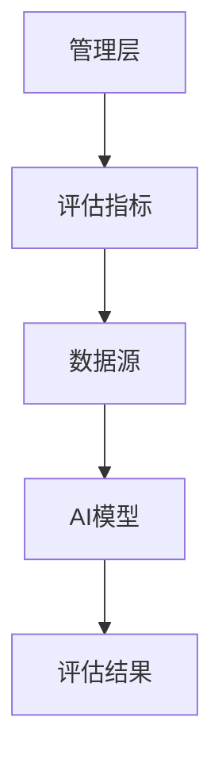

                 

# AI驱动的管理层能力评估：量化领导力对公司价值的影响

**关键词**：AI驱动，管理层能力评估，领导力，量化评估，企业价值，算法原理，系统架构，项目实战

**摘要**：  
随着人工智能技术的快速发展，领导力评估逐渐从传统的主观评价向数据驱动的量化评估转变。本文将探讨AI如何驱动管理层能力评估，量化领导力对公司价值的影响。通过分析AI在领导力评估中的应用，本文将揭示如何利用技术手段提升企业管理层的能力评估效率和准确性，为企业创造更大的价值。文章内容涵盖领导力评估的背景、AI驱动的核心概念、算法原理、系统架构设计、项目实战以及最佳实践等方面，为读者提供全面而深入的分析。

---

# 第1章: 领导力评估的现状与挑战

## 1.1 领导力评估的传统方法

### 1.1.1 传统领导力评估的核心指标
传统的领导力评估主要依赖主观评价，包括以下几个核心指标：
1. **决策能力**：管理层在决策过程中的准确性和效率。
2. **团队管理能力**：管理者对团队的协调、激励和培养能力。
3. **战略规划能力**：制定和执行企业战略的能力。
4. **沟通能力**：与员工、客户和其他利益相关者的沟通效果。
5. **创新意识**：在面对变化和挑战时的创新能力和适应性。

### 1.1.2 传统评估方法的局限性

1. **主观性**：传统评估依赖管理者和评估者的主观判断，容易受到个人偏见的影响。
2. **数据不足**：传统方法缺乏足够多的数据支持，难以量化领导力的具体表现。
3. **评估频率低**：由于数据收集和分析的复杂性，传统评估通常难以高频次进行。
4. **反馈滞后**：评估结果往往滞后于实际表现，难以及时提供反馈以改进管理行为。

### 1.1.3 传统方法对企业价值的影响

传统领导力评估方法的局限性导致以下问题：
1. **管理决策失误**：由于评估结果的不准确，企业在招聘、晋升和培训等方面的决策可能失误。
2. **团队效率低下**：管理层能力未能有效评估，可能导致团队协作效率低下。
3. **企业竞争力下降**：在快速变化的商业环境中，传统评估方法难以提供及时有效的反馈，影响企业的竞争力。

## 1.2 管理层能力评估的痛点

### 1.2.1 数据收集的难度

1. 数据来源分散：领导力评估需要整合来自不同渠道的数据，如绩效数据、员工反馈、项目完成情况等。
2. 数据质量参差不齐：不同数据源的质量和可靠性差异较大，增加了数据清洗和预处理的难度。

### 1.2.2 评估标准的主观性

1. 主观判断的影响：传统评估方法中，评估者的主观判断可能影响评估结果的客观性。
2. 标准不统一：不同企业和不同评估者可能采用不同的评估标准，导致评估结果缺乏可比性。

### 1.2.3 评估结果的可操作性

1. 非量化结果难以直接应用：传统评估方法通常以定性描述为主，难以直接用于企业的决策和管理优化。
2. 缺乏动态调整能力：评估结果难以根据实时数据进行动态调整，难以满足快速变化的管理需求。

## 1.3 AI技术在领导力评估中的潜力

### 1.3.1 数据驱动的评估优势

1. **数据全面性**：AI可以通过整合多源数据，提供更全面的领导力评估依据。
2. **客观性**：通过机器学习算法，AI可以减少主观判断的影响，提高评估的客观性。
3. **动态评估能力**：AI可以实时分析数据，动态调整评估结果，适应变化的管理需求。

### 1.3.2 AI算法的客观性与准确性

1. **算法优势**：机器学习算法可以通过大量数据训练，识别领导力的关键特征，提高评估的准确性。
2. **可解释性**：通过模型解释技术，AI可以提供评估结果的可解释性，帮助管理者理解评估依据。

### 1.3.3 对企业价值的潜在提升

1. **提升管理效率**：AI驱动的评估可以提高管理决策的效率和准确性。
2. **优化团队表现**：通过精准的评估，企业可以更好地识别和培养优秀管理者，提升团队整体表现。
3. **增强企业竞争力**：在快速变化的商业环境中，AI驱动的领导力评估可以帮助企业在竞争中占据优势。

## 1.4 本章小结

本章从传统领导力评估方法的局限性入手，分析了当前管理层能力评估的主要痛点，并探讨了AI技术在解决这些问题中的潜力。通过对比传统方法和AI驱动方法的优劣，我们可以看出，AI技术在提高评估的客观性、动态性和可操作性方面具有显著优势，为企业价值的提升提供了新的可能性。

---

# 第2章: AI驱动的领导力评估的核心概念

## 2.1 核心概念与定义

### 2.1.1 领导力的量化指标

AI驱动的领导力评估将领导力转化为可量化的指标，主要包括以下几个方面：
1. **决策能力**：通过分析管理者的决策准确性和效率，量化其决策能力。
2. **团队管理能力**：通过员工满意度、团队绩效等数据，评估管理者的团队管理能力。
3. **战略规划能力**：通过对企业战略目标的实现程度进行评估，衡量管理者的战略规划能力。
4. **沟通能力**：通过分析管理者的沟通频率、效果和员工反馈，量化其沟通能力。
5. **创新意识**：通过分析管理者在创新项目中的表现，评估其创新意识。

### 2.1.2 AI驱动评估的定义

AI驱动的领导力评估是指利用人工智能技术，通过数据挖掘、机器学习等方法，对管理层的能力进行量化评估的过程。其核心在于通过算法模型，将领导力的多个维度转化为可量化的指标，并通过动态数据分析，提供实时的评估结果。

### 2.1.3 核心要素的组成

AI驱动的领导力评估系统主要包括以下几个核心要素：
1. **数据源**：包括员工绩效数据、项目完成情况、客户反馈、员工满意度调查等。
2. **算法模型**：包括机器学习算法、自然语言处理技术等，用于数据的分析和评估。
3. **评估指标**：通过算法模型生成的可量化指标，用于衡量领导力的各个维度。
4. **反馈机制**：将评估结果反馈给管理者和企业，用于优化管理行为和决策。

---

## 2.2 核心概念的属性特征对比

### 2.2.1 数据维度对比表

| 数据维度        | 传统评估       | AI驱动评估       |
|-----------------|---------------|-----------------|
| 数据来源        | 单一、分散     | 多源、实时       |
| 数据量          | 少、不完整     | 大、完整         |
| 数据处理方式    | 简单、人工     | 复杂、自动化     |
| 评估结果        | 主观、定性     | 客观、定量       |

### 2.2.2 方法论对比分析

| 方法论特点        | 传统评估               | AI驱动评估               |
|-------------------|-----------------------|-------------------------|
| 数据处理          | 依赖人工分析           | 自动化处理               |
| 评估标准          | 主观性强               | 客观性高                 |
| 评估频率          | 低                     | 高                     |
| 评估结果的应用     | 较低                   | 较高                   |

### 2.2.3 评估结果的可解释性

AI驱动的领导力评估结果具有较高的可解释性，主要体现在以下几个方面：
1. **模型透明性**：通过机器学习模型的解释技术，可以明确每个评估指标对最终结果的影响程度。
2. **数据来源清晰**：评估结果基于多源数据，能够追溯具体的数据来源，提高结果的可信度。
3. **动态调整**：评估结果可以根据实时数据进行动态调整，具有较高的灵活性和适应性。

---

## 2.3 实体关系图（ER图）

---

## 2.4 本章小结

本章通过对AI驱动的领导力评估的核心概念进行详细分析，明确了其与传统评估方法的主要区别，并通过对比分析和实体关系图，展示了AI驱动评估的系统架构和各要素之间的关系。这些分析为后续的算法实现和系统设计奠定了基础。

---

接下来，我会继续按照目录结构完成后续章节的内容。如果需要继续完成后续部分，请告诉我！

