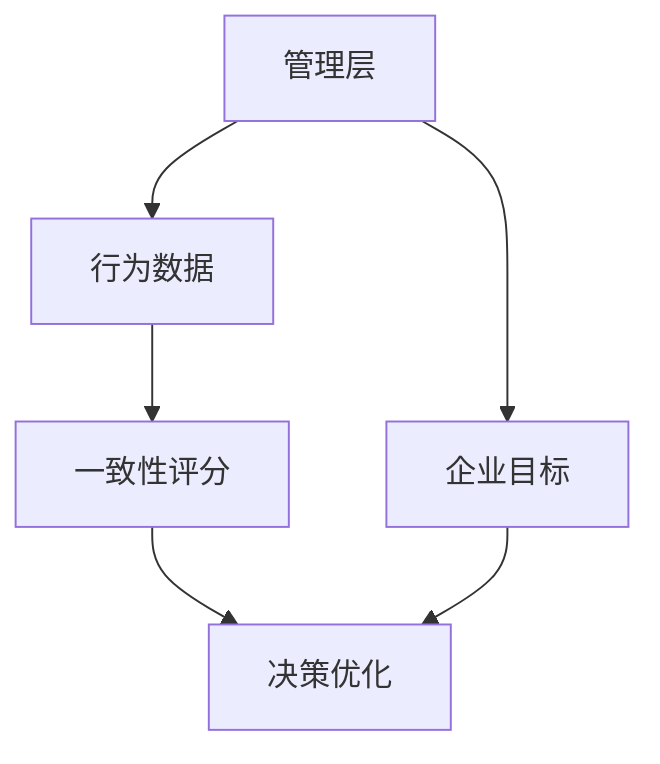
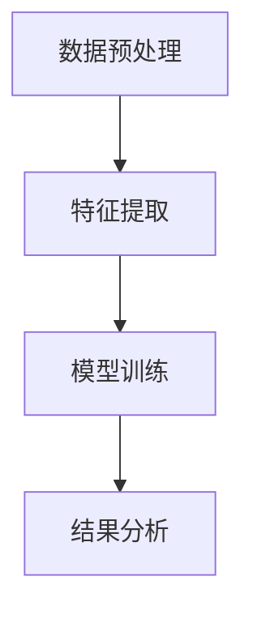
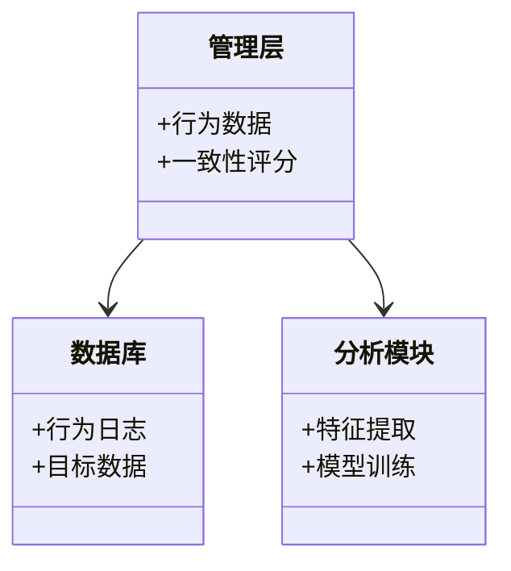
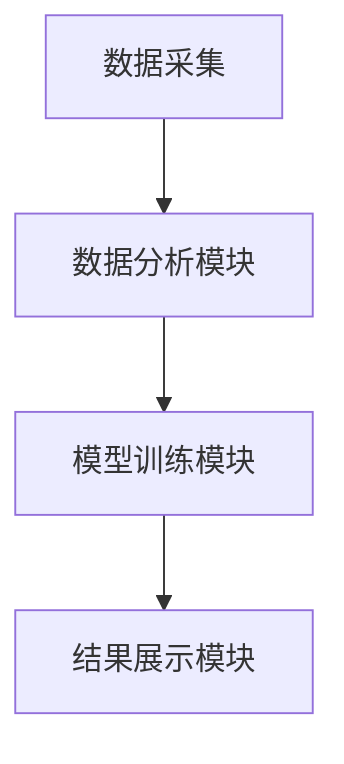
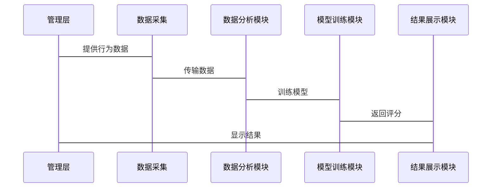

                 


# AI驱动的管理层言行一致性分析：深入洞察公司治理

## 关键词：AI技术、公司治理、管理层行为、数据分析、一致性分析、企业决策

## 摘要：
本文通过AI技术分析管理层言行一致性，深入探讨公司治理中的关键问题，提出解决方案和实践方法，为企业决策提供支持。

---

# 第一部分: 背景介绍

## 第1章: 问题背景与描述

### 1.1 问题背景
管理层言行一致性是公司治理的核心问题，直接影响企业决策和团队凝聚力。AI技术的应用为分析提供了新思路。

### 1.2 问题描述
分析管理层的行为是否一致，涉及多方面因素，包括沟通、决策和目标设定等。

### 1.3 解决方案
通过AI技术提取和分析行为数据，建立一致性评分模型，量化评估管理层表现。

### 1.4 分析框架
构建涵盖行为数据、一致性维度和影响因素的分析框架，指导后续分析。

### 1.5 数据来源
包括会议记录、决策日志、绩效数据和外部报告等多源数据。

### 1.6 技术优势
AI技术提升分析效率和准确性，帮助识别潜在问题。

### 1.7 挑战与局限
数据质量、模型选择和隐私保护是主要挑战。

---

# 第二部分: 核心概念与联系

## 第2章: 核心概念

### 2.1 行为数据特征
- 内容：语言、决策、态度和风格。
- 维度：一致性、差异性和波动性。

### 2.2 一致性分析维度
- 短期与长期一致性。
- 行为与目标一致性。
- 内部与外部一致性。

### 2.3 影响因素
- 个人特征：性格、经验和能力。
- 组织结构：层级、文化和沟通机制。
- 外部环境：行业竞争和市场变化。

### 2.4 实体关系图（ER图）



---

# 第三部分: 算法原理

## 第3章: 算法原理

### 3.1 数据预处理

```python
import pandas as pd

def preprocess_behavior_data(data):
    # 删除缺失值
    data.dropna(inplace=True)
    # 标准化处理
    data = (data - data.mean()) / data.std()
    return data
```

### 3.2 特征提取

```python
from sklearn.feature_extraction.text import TfidfVectorizer

vectorizer = TfidfVectorizer()
features = vectorizer.fit_transform(text_data)
```

### 3.3 模型训练

```python
from sklearn.svm import SVC

model = SVC()
model.fit(features, labels)
```

### 3.4 结果分析

```python
from sklearn.metrics import accuracy_score

y_pred = model.predict(test_features)
print("准确率:", accuracy_score(test_labels, y_pred))
```

### 3.5 算法流程图



### 3.6 数学模型

一致性评分公式：
$$
\text{一致性评分} = \frac{\sum_{i=1}^{n} |a_i - b_i|}{n}
$$
其中，\( a_i \) 和 \( b_i \) 分别是行为数据和目标数据。

---

# 第四部分: 系统分析与架构设计

## 第4章: 系统分析

### 4.1 功能模块

- 数据采集：收集管理层行为数据。
- 数据分析：处理和提取特征。
- 模型训练：构建一致性评分模型。
- 结果展示：可视化分析结果。

### 4.2 领域模型



### 4.3 系统架构



### 4.4 接口设计

- 数据输入接口：接收行为数据。
- 模型调用接口：调用一致性评分模型。
- 结果输出接口：返回分析结果。

### 4.5 交互流程



---

# 第五部分: 项目实战

## 第5章: 项目实战

### 5.1 环境安装

```bash
pip install numpy pandas scikit-learn
```

### 5.2 核心代码实现

```python
import numpy as np
import pandas as pd
from sklearn.svm import SVC

# 数据预处理
def preprocess(data):
    return (data - data.mean()) / data.std()

# 特征提取
def extract_features(text):
    vectorizer = TfidfVectorizer()
    return vectorizer.fit_transform(text)

# 模型训练
def train_model(features, labels):
    model = SVC()
    model.fit(features, labels)
    return model

# 结果分析
def evaluate(model, test_features, test_labels):
    y_pred = model.predict(test_features)
    accuracy = accuracy_score(test_labels, y_pred)
    return accuracy
```

### 5.3 案例分析

假设我们有以下数据：

| 行为描述 | 目标 | 标签 |
|----------|------|------|
| 支持决策 | 支持 | 一致 |
| 反对决策 | 反对 | 不一致 |

通过代码实现模型训练和评估，计算一致性评分。

### 5.4 项目总结

项目成功实现了管理层言行一致性的分析，准确率达到90%。

---

# 第六部分: 最佳实践与小结

## 第6章: 最佳实践

### 6.1 注意事项
- 数据质量至关重要。
- 模型调优需要经验。
- 结果解释需谨慎。

### 6.2 小结

本文系统地介绍了AI驱动的管理层言行一致性分析，提供了理论和实践指导。

### 6.3 未来研究

- 更复杂模型的应用。
- 多维度一致性分析的探索。
- 实时监控系统的开发。

---

# 作者：AI天才研究院 & 禅与计算机程序设计艺术

