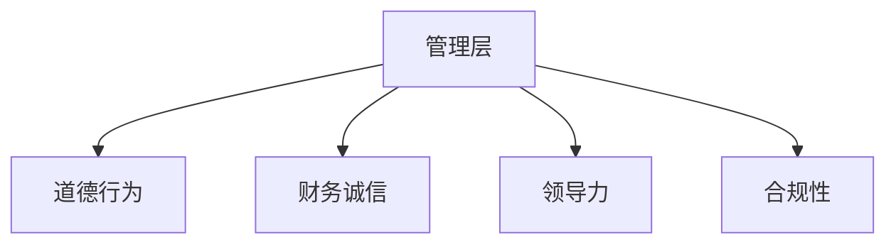
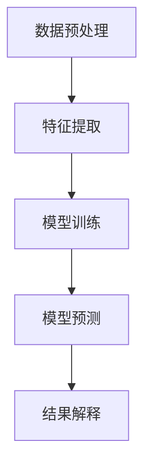
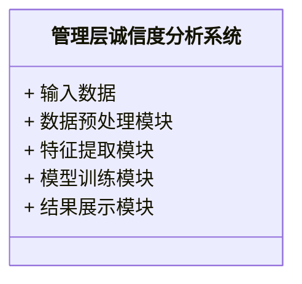
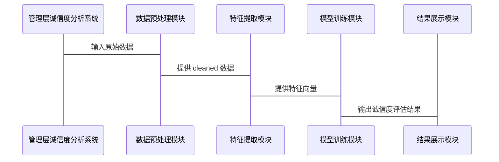

                 


# AI驱动的管理层诚信度分析：防范公司治理风险

## 关键词：AI技术，管理层诚信度，公司治理，风险防范，数据分析

## 摘要：  
随着企业规模的不断扩大和市场竞争的加剧，公司治理问题日益受到关注。管理层的诚信度是企业治理的核心要素之一，直接关系到企业的长期发展和价值创造。传统的诚信度评估方法往往依赖于主观判断和经验分析，存在效率低、准确度不足等问题。借助人工智能技术，可以通过数据驱动的方式，对管理层的诚信度进行系统化、智能化的分析和评估，从而有效防范公司治理风险。本文将从AI驱动的诚信度分析方法、算法原理、系统架构设计、项目实战等多个维度展开讨论，为企业的治理风险防范提供新的思路和解决方案。

---

# 第1章: 引言

## 1.1 研究背景与意义

### 1.1.1 企业治理中的诚信问题  
诚信是企业治理的核心要素之一，是企业长期发展和价值创造的重要基础。然而，随着市场竞争的加剧和企业规模的扩大，管理层的诚信问题逐渐暴露出来。一些企业管理层为了追求短期利益，可能会采取虚假陈述、内幕交易、欺诈性财务报告等不正当行为，严重损害了企业的利益和声誉，也威胁到了企业的可持续发展。  

### 1.1.2 AI技术在企业治理中的应用潜力  
人工智能技术的快速发展为企业治理提供了新的工具和方法。通过自然语言处理（NLP）、机器学习（ML）、大数据分析等技术，可以对企业公开信息、内部数据以及第三方数据进行深度挖掘和分析，从而识别管理层的诚信风险。AI技术的引入，不仅提高了诚信评估的效率，还能够发现传统方法难以察觉的隐性问题。

### 1.1.3 研究目标与意义  
本研究旨在探讨如何利用AI技术对管理层诚信度进行系统化分析，并提出一套基于AI的诚信度评估框架。通过这种方法，企业可以更好地识别和防范治理风险，从而提升企业治理的透明度和效率。同时，本文的研究成果还可以为学术界和企业界提供新的研究方向和实践参考。

---

## 1.2 研究现状与挑战

### 1.2.1 现有企业治理诚信评估方法  
传统的诚信评估方法主要包括基于财务数据的分析、专家评分法、问卷调查法等。这些方法虽然在一定程度上能够反映管理层的诚信度，但也存在诸多局限性，例如主观性较强、数据来源单一、评估效率低下等。

### 1.2.2 AI技术在诚信评估中的应用挑战  
尽管AI技术在企业治理中的应用潜力巨大，但其在诚信评估中的应用仍面临诸多挑战。例如，数据质量问题、模型的可解释性不足、算法的鲁棒性问题等。此外，如何将AI技术与企业治理的实际需求相结合，也是一个亟待解决的问题。

### 1.2.3 当前研究的局限性  
当前的研究多集中于理论探讨，缺乏实际应用场景的分析。同时，现有研究大多关注单一维度的诚信评估，而忽视了多维度、多层次的综合评估。

---

## 1.3 本书结构与内容概述

### 1.3.1 各章节内容简要说明  
- 第2章：介绍管理层诚信度分析的核心框架与方法。  
- 第3章：详细讲解诚信度分析的数据来源与预处理方法。  
- 第4章：深入分析基于机器学习的诚信度评估算法。  
- 第5章：探讨AI驱动的诚信度分析系统的架构设计。  
- 第6章：通过实际案例展示AI技术在诚信度分析中的应用。  
- 第7章：总结研究成果，并提出未来的研究方向。

### 1.3.2 本书的核心创新点  
本书的核心创新点在于将AI技术与企业治理相结合，提出了一套基于数据驱动的诚信度评估框架，并通过实际案例展示了该框架的应用效果。

### 1.3.3 预期读者与适用范围  
本书主要面向企业治理领域的研究人员、企业管理者、风险投资机构以及对AI技术感兴趣的读者。它既适合作为学术研究的参考，也适合企业实践的指导。

---

# 第2章: 管理层诚信度分析的框架与方法

## 2.1 管理层诚信度的核心维度

### 2.1.1 诚信度的定义与内涵  
诚信度是指管理层在企业经营活动中遵守道德规范、履行责任、避免欺诈行为的程度。它不仅包括管理层的个人诚信，还包括其决策行为的透明度和公正性。

### 2.1.2 管理层诚信度的关键维度  
- **道德行为**：管理层在决策过程中是否遵循道德规范。  
- **财务诚信**：财务报告的真实性与准确性。  
- **领导力**：管理层在企业战略制定和执行中的表现。  
- **合规性**：是否遵守相关法律法规。

### 2.1.3 各维度之间的关系与影响  
各维度之间相互关联，共同影响企业的治理效果。例如，道德行为良好的管理层更可能具备较高的财务诚信和领导力。

---

## 2.2 AI驱动的诚信度分析框架

### 2.2.1 数据采集与特征提取  
AI驱动的诚信度分析需要多源异构数据的整合，包括企业公开信息、内部数据、第三方数据等。

### 2.2.2 模型构建与训练  
通过机器学习算法（如支持向量机、随机森林、神经网络等）对数据进行建模和训练，生成诚信度评估模型。

### 2.2.3 结果解释与应用  
根据模型输出的结果，对企业治理风险进行预警，并提出相应的应对策略。

---

## 2.3 企业治理风险防范的策略

### 2.3.1 诚信度分析在风险预警中的作用  
通过实时监测管理层的诚信行为，及时发现潜在风险。

### 2.3.2 风险评估与应对措施  
根据诚信度评估结果，制定相应的风险管理策略。

### 2.3.3 企业治理的优化建议  
基于AI分析结果，优化企业治理结构，提升治理效率。

---

## 2.4 核心概念与联系

### 2.4.1 核心概念原理  
通过机器学习算法对多源数据进行分析，提取管理层诚信度的特征，构建评估模型。

### 2.4.2 概念属性特征对比表格  
| 特征维度 | 描述 | 示例 |
|----------|------|------|
| 道德行为 | 决策的道德性 | 避免利益输送 |
| 财务诚信 | 财务数据的真实性 | 真实的财务报表 |
| 领导力 | 战略执行能力 | 高效的决策 |

### 2.4.3 ER实体关系图架构  


---

## 2.5 管理层诚信度分析的算法实现

### 2.5.1 算法原理  
以支持向量机（SVM）为例，通过训练数据构建分类模型，预测管理层的诚信度。

### 2.5.2 算法流程图  


### 2.5.3 数学模型与公式  
支持向量机的目标函数为：
$$ \min_{w,b,\xi} \frac{1}{2}||w||^2 + C \sum_{i=1}^{n} \xi_i $$
约束条件为：
$$ y_i (w \cdot x_i + b) \geq 1 - \xi_i $$
$$ \xi_i \geq 0 $$

---

## 2.6 管理层诚信度分析的系统架构设计

### 2.6.1 系统功能模块设计  


### 2.6.2 系统交互流程图  


---

## 2.7 项目实战

### 2.7.1 环境安装  
需要安装Python、机器学习库（如scikit-learn）、数据分析库（如Pandas）等。

### 2.7.2 核心代码实现  
```python
from sklearn.svm import SVC
from sklearn.preprocessing import StandardScaler
from sklearn.pipeline import Pipeline

# 数据预处理
data = ...  # 输入数据
X = data.drop('label', axis=1)
y = data['label']

# 模型训练
model = SVC()
model.fit(X, y)

# 模型预测
new_data = ...  # 新数据
print(model.predict(new_data))
```

### 2.7.3 实际案例分析  
通过一个实际案例，展示AI技术在管理层诚信度分析中的应用效果。

### 2.7.4 项目总结  
总结项目实施的经验和教训，提出改进建议。

---

## 2.8 本章小结

通过本章的分析，我们了解了管理层诚信度的核心维度、AI驱动的分析框架以及系统的架构设计。这些内容为后续的算法实现和系统开发奠定了基础。

---

## 2.9 本章的注意事项  
在实际应用中，需要注意数据的质量和模型的可解释性问题，确保评估结果的准确性和可靠性。

---

## 2.10 本章的扩展阅读  
建议读者进一步学习机器学习在企业治理中的其他应用，如 fraud detection 和 risk management。

---

通过以上内容，我们可以看到AI技术在管理层诚信度分析中的巨大潜力。接下来，我们将深入探讨算法实现和系统架构设计，为企业的治理风险防范提供更有力的工具和方法。

