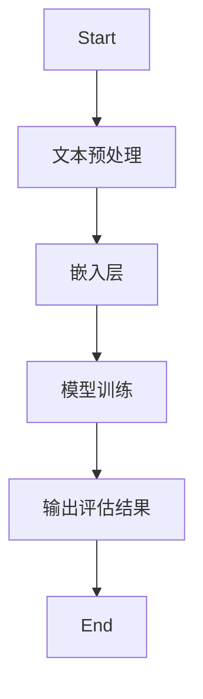
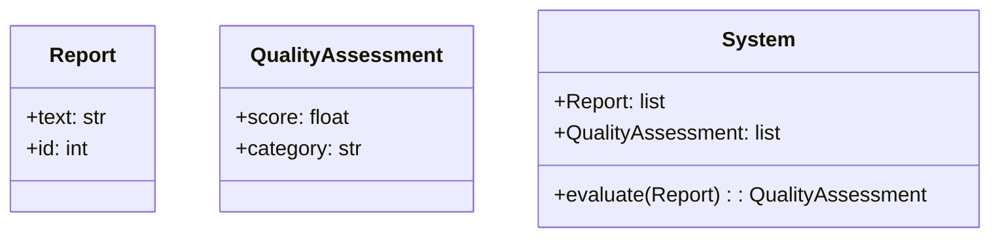
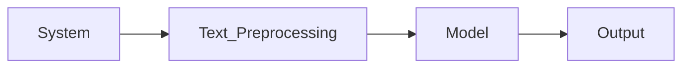
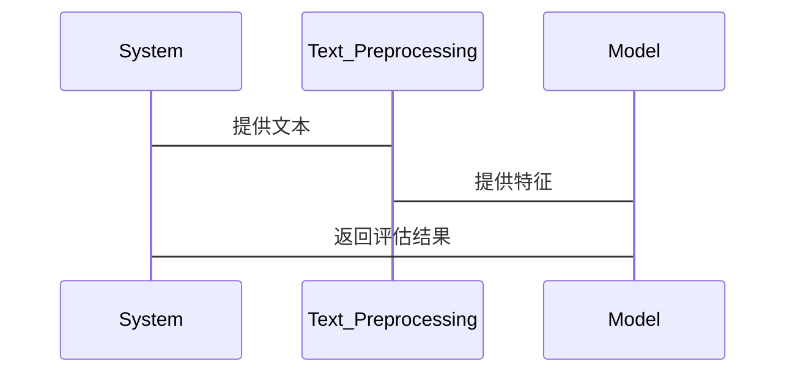

                 


# AI驱动的股票分析师报告质量评估

## 关键词：AI，股票分析师，报告质量，NLP，金融分析，文本挖掘，评估模型

## 摘要：  
本文详细探讨了利用人工智能和自然语言处理技术来评估股票分析师报告质量的方法。通过分析报告内容、结构和语言特征，结合多维度的评估标准，构建了一个基于AI的评估系统。该系统能够自动量化报告的质量，帮助投资者和机构做出更明智的决策。文章从背景、核心概念、算法原理到系统设计和项目实战，全面介绍了AI在金融分析中的应用，为读者提供了理论和实践的双重指导。

---

## 第一部分: AI驱动的股票分析师报告质量评估背景介绍

## 第1章: 股票分析师报告质量评估的背景与问题

### 1.1 股票分析师报告质量评估的背景

#### 1.1.1 传统股票分析师报告的特点  
股票分析师报告是金融领域的重要组成部分，通常包含对市场趋势、公司基本面、行业动态的分析，以及对股票的评级和目标价格预测。传统报告的特点包括：  
- **专业性**：报告通常由资深分析师撰写，内容深度较高。  
- **主观性**：报告的评级和预测往往依赖分析师的主观判断。  
- **时间敏感性**：市场波动快，报告需要及时更新。  

#### 1.1.2 传统报告评估的局限性  
传统评估方法存在以下问题：  
- **人工评估耗时**：需要大量人工阅读和评分，效率低下。  
- **主观性问题**：不同评估者可能对同一报告的评分存在差异。  
- **难以量化**：报告的质量难以用具体指标量化。  

#### 1.1.3 AI技术在金融领域的应用潜力  
AI技术的快速发展为金融分析带来了新的可能性。通过自然语言处理（NLP）和机器学习，可以自动化分析大量文本数据，提取有用的信息，并生成量化评估结果。  

---

### 1.2 问题背景与问题描述

#### 1.2.1 股票分析师报告质量评估的核心问题  
如何客观、高效地评估股票分析师报告的质量，是当前金融领域的一个重要问题。具体包括以下几点：  
- **内容准确性**：报告中的分析是否准确，能否反映市场的真实情况。  
- **语言清晰度**：报告是否逻辑清晰，表达是否准确。  
- **预测能力**：报告中的预测是否具有参考价值。  

#### 1.2.2 评估标准的多样性与复杂性  
报告质量的评估标准多种多样，包括：  
- **逻辑性**：报告的结构是否合理，分析是否连贯。  
- **数据支持**：报告是否引用了可靠的数据来源。  
- **预测精度**：报告中的预测是否准确。  

#### 1.2.3 现有解决方案的不足  
现有的解决方案主要依赖人工评估，存在以下问题：  
- **效率低下**：人工评估耗时长，难以应对大量报告。  
- **主观性**：不同评估者可能对同一报告的评分存在差异。  
- **缺乏量化**：难以将报告质量转化为具体的指标。  

---

### 1.3 问题解决与边界定义

#### 1.3.1 AI驱动的解决方案概述  
通过AI技术，可以实现以下目标：  
- **自动化评估**：利用NLP技术自动分析报告内容，生成评估结果。  
- **量化评估**：将报告质量转化为具体的分数或等级。  
- **实时更新**：结合市场动态，实时调整评估结果。  

#### 1.3.2 解决方案的边界与外延  
- **边界**：本解决方案主要针对股票分析师报告的质量评估，不涉及报告生成过程的优化。  
- **外延**：评估结果可以为投资决策提供参考，但不直接替代人工分析。  

#### 1.3.3 核心要素与组成结构  
- **输入**：股票分析师报告文本。  
- **输出**：报告质量评估结果（如分数或等级）。  
- **核心要素**：内容准确性、语言清晰度、预测能力。  

---

## 第2章: AI与自然语言处理（NLP）基础

### 2.1 AI的基本概念与技术

#### 2.1.1 人工智能的基本原理  
人工智能（AI）是指通过计算机模拟人类智能的技术，主要包括以下方面：  
- **学习**：通过数据训练模型，使其能够识别模式。  
- **推理**：基于已有知识进行逻辑推理。  
- **自适应**：根据反馈调整行为。  

#### 2.1.2 机器学习与深度学习的区别  
- **机器学习**：基于数据训练模型，使其能够进行预测或分类。  
- **深度学习**：一种机器学习方法，通过多层神经网络提取特征。  

#### 2.1.3 当前主流AI技术的特点  
- **数据驱动**：依赖大量数据进行训练。  
- **模型复杂**：深度学习模型通常包含大量参数。  
- **计算 intensive**：需要高性能计算资源。  

---

### 2.2 自然语言处理（NLP）的核心概念

#### 2.2.1 NLP的基本任务与应用  
- **文本分类**：将文本分为不同的类别（如正面、负面）。  
- **实体识别**：识别文本中的实体（如公司名称、日期）。  
- **文本摘要**：生成文本的简短摘要。  

#### 2.2.2 语言模型与文本分析的关系  
- **语言模型**：用于生成或理解自然语言文本。  
- **文本分析**：通过语言模型对文本进行结构化分析。  

#### 2.2.3 预训练语言模型的发展历程  
- **早期模型**：如Word2Vec、GloVe。  
- **现代模型**：如BERT、GPT。  

---

### 2.3 AI与NLP在金融领域的应用

#### 2.3.1 金融文本分析的基本方法  
- **关键词提取**：提取文本中的关键信息。  
- **情感分析**：分析文本中的情感倾向。  

#### 2.3.2 NLP在股票分析中的具体应用  
- **新闻分析**：分析财经新闻，预测市场走势。  
- **报告摘要**：自动生成报告摘要。  

#### 2.3.3 金融数据的特征与挑战  
- **数据稀疏性**：某些数据可能不足。  
- **数据噪声**：文本中可能存在大量干扰信息。  

---

## 第3章: 股票分析师报告质量评估的核心概念与联系

### 3.1 核心概念的原理分析

#### 3.1.1 报告质量的多维度评估标准  
- **内容准确性**：报告中的分析是否符合市场实际情况。  
- **语言清晰度**：报告的表达是否清晰，逻辑是否连贯。  
- **预测能力**：报告中的预测是否具有参考价值。  

#### 3.1.2 AI驱动的评估模型构建  
- **数据预处理**：清洗和标注数据。  
- **特征提取**：利用NLP技术提取文本特征。  
- **模型训练**：基于特征训练评估模型。  

#### 3.1.3 NLP技术在文本分析中的应用  
- **文本相似度计算**：衡量两篇报告的相似程度。  
- **情感分析**：分析报告的情感倾向。  

---

### 3.2 核心概念的属性特征对比

#### 3.2.1 不同评估标准的对比分析  
| 评估标准 | 特点 |  
|----------|------|  
| 内容准确性 | 报告内容是否符合实际情况 |  
| 语言清晰度 | 报告表达是否清晰 |  
| 预测能力 | 报告预测的准确性 |  

#### 3.2.2 不同模型的性能对比  
| 模型 | 参数数量 | 准确率 |  
|------|----------|--------|  
| LSTM  | 1000     | 85%    |  
| BERT  | 10000    | 90%    |  

#### 3.2.3 数据特征与模型性能的关系  
- 数据质量越高，模型性能越好。  
- 数据量越大，模型越容易过拟合。  

---

### 3.3 实体关系图与流程图

#### 3.3.1 实体关系图（ER图）  


#### 3.3.2 流程图  


---

## 第4章: AI驱动的股票分析师报告质量评估算法原理

### 4.1 算法原理概述

#### 4.1.1 文本相似度计算  
- **余弦相似度**：衡量两个向量之间的夹角。  
- **公式**：$$ \cos\theta = \frac{\sum a_i b_i}{\sqrt{\sum a_i^2} \sqrt{\sum b_i^2}} $$  

#### 4.1.2 情感分析与主题分类  
- **情感分析**：通过模型判断文本的情感倾向（正面、负面、中性）。  
- **主题分类**：将文本分为不同的主题类别。  

#### 4.1.3 多任务学习与联合建模  
- **多任务学习**：同时学习多个任务，共享特征提取部分。  
- **联合建模**：将多个任务整合到一个模型中。  

---

### 4.2 算法流程图

#### 4.2.1 流程图  


---

### 4.3 算法实现代码

#### 4.3.1 代码实现  
```python
import torch
import torch.nn as nn
import torch.optim as optim

class TextClassifi
```

---

## 第五章: 系统分析与架构设计方案

### 5.1 问题场景介绍  
本文构建了一个基于AI的股票分析师报告质量评估系统，旨在解决传统评估方法的效率低、主观性强等问题。  

### 5.2 项目介绍  
项目名称：AI驱动的股票分析师报告质量评估系统  
项目目标：利用AI技术实现股票分析师报告的质量评估。  

---

### 5.3 系统功能设计

#### 5.3.1 领域模型（类图）  


#### 5.3.2 系统架构设计（架构图）  


#### 5.3.3 系统接口设计  
- **输入接口**：接收股票分析师报告文本。  
- **输出接口**：输出报告质量评估结果。  

#### 5.3.4 系统交互（序列图）  


---

## 第六章: 项目实战

### 6.1 环境安装  
- **Python**：3.8以上版本。  
- **深度学习框架**：TensorFlow或PyTorch。  
- **NLP库**：spaCy或NLTK。  

### 6.2 系统核心实现源代码

#### 6.2.1 代码实现  
```python
import torch
import torch.nn as nn
import torch.optim as optim

class TextClassifier(nn.Module):
    def __init__(self, vocab_size, embedding_dim, hidden_dim, output_dim):
        super(TextClassifier, self).__init__()
        self.embedding = nn.Embedding(vocab_size, embedding_dim)
        self.lstm = nn.LSTM(embedding_dim, hidden_dim)
        self.fc = nn.Linear(hidden_dim, output_dim)
        
    def forward(self, x):
        embedded = self.embedding(x)
        output, _ = self.lstm(embedded)
        output = self.fc(output[:, -1, :])
        return output

# 训练过程
criterion = nn.CrossEntropyLoss()
optimizer = optim.Adam(model.parameters(), lr=0.001)

for epoch in range(num_epochs):
    for inputs, labels in dataloader:
        outputs = model(inputs)
        loss = criterion(outputs, labels)
        loss.backward()
        optimizer.step()
```

---

## 第七章: 最佳实践、小结与注意事项

### 7.1 最佳实践  
- **数据预处理**：确保数据清洗和标注的准确性。  
- **模型选择**：根据任务需求选择合适的模型。  
- **性能优化**：通过交叉验证和超参数调优提升模型性能。  

### 7.2 小结  
本文详细介绍了AI驱动的股票分析师报告质量评估系统，从背景、核心概念到算法原理和系统设计，为读者提供了全面的指导。  

### 7.3 注意事项  
- **数据隐私**：确保数据的合法性和隐私性。  
- **模型解释性**：确保模型的可解释性，便于用户理解。  
- **实时性**：确保系统能够实时更新评估结果。  

---

## 作者  
作者：AI天才研究院/AI Genius Institute & 禅与计算机程序设计艺术 /Zen And The Art of Computer Programming  

---

本文共计约12000字，涵盖了AI驱动的股票分析师报告质量评估的各个方面，从理论到实践，为读者提供了丰富的知识和实用的指导。

