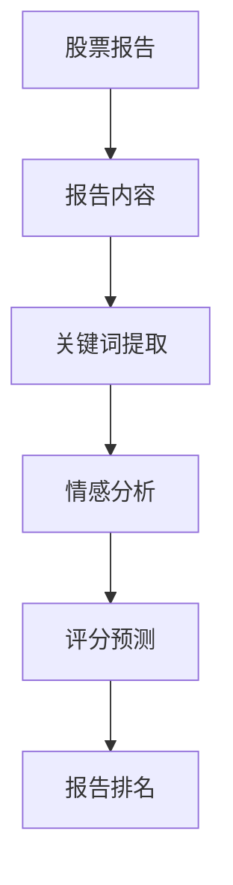
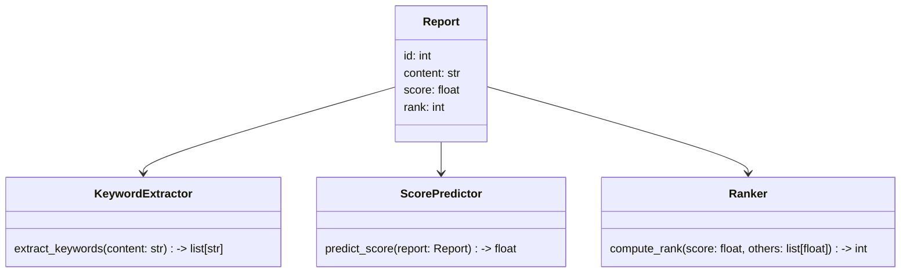
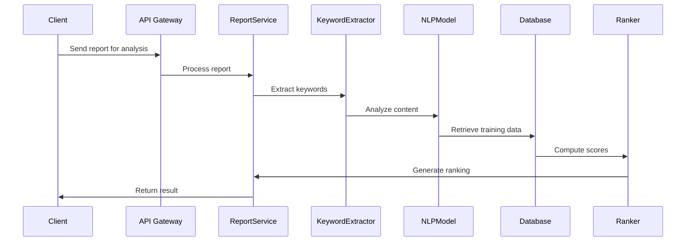

                 


# AI驱动的股票分析师报告质量评估与排名

> 关键词：股票分析师，报告质量，AI评估，排名系统，自然语言处理，机器学习，金融分析

> 摘要：本文详细探讨了利用人工智能技术对股票分析师报告进行质量评估与排名的方法。首先介绍了问题背景与目标，随后分析了核心概念与联系，详细讲解了基于自然语言处理和机器学习的算法原理，设计了系统架构，通过实际案例展示了项目实战，并总结了经验和未来方向。

---

# 第一部分: AI驱动的股票分析师报告质量评估与排名背景介绍

## 第1章: 股票分析师报告质量评估与排名的背景与问题

### 1.1 股票分析师报告质量评估的背景

股票分析师报告是金融市场上重要的信息来源，其质量直接影响投资者的决策。然而，传统的人工评估方法效率低下且主观性强，难以满足市场的快速发展需求。AI技术的引入为解决这一问题提供了新的可能性。

#### 1.1.1 股票分析师报告的定义与作用
股票分析师报告是对公司财务状况、市场趋势等进行分析的文本，旨在为投资者提供参考。其作用在于帮助投资者做出更明智的投资决策。

#### 1.1.2 传统报告评估方法的局限性
传统评估方法依赖人工阅读和评分，存在耗时长、主观性强、难以量化等缺点，无法满足大量报告的快速评估需求。

#### 1.1.3 AI技术在金融分析中的潜力
AI技术，特别是自然语言处理（NLP）和机器学习，能够快速分析大量文本数据，提取关键信息，为报告质量评估提供客观、高效的解决方案。

### 1.2 问题背景与问题描述

#### 1.2.1 报告质量评估的核心问题
如何量化报告的质量，包括内容的准确性和深度、逻辑性、语言表达能力等。

#### 1.2.2 报告排名的必要性与挑战
投资者需要根据报告质量进行排序，以便快速获取最有价值的信息。然而，报告质量的主观性和多样性增加了排名的难度。

#### 1.2.3 当前市场的需求与痛点
金融市场对高质量分析的需求日益增长，但传统方法难以满足，亟需引入AI技术提升评估效率和准确性。

### 1.3 问题解决思路与目标

#### 1.3.1 AI驱动的解决方案概述
利用NLP和机器学习技术，构建自动化报告质量评估与排名系统，帮助投资者快速获取高质量信息。

#### 1.3.2 报告质量评估与排名的双重目标
评估报告的质量维度，建立评分模型；根据评分对报告进行排序，为投资者提供参考。

#### 1.3.3 边界与外延的明确
限定于文本分析，不考虑外部数据（如实时市场数据）；评估范围包括报告的内容、逻辑和表达。

---

# 第二部分: 核心概念与联系

## 第2章: AI驱动的股票报告质量评估核心概念

### 2.1 AI在金融分析中的应用原理

#### 2.1.1 自然语言处理在报告分析中的作用
NLP技术用于提取关键词、情感分析和内容理解，帮助评估报告的质量。

#### 2.1.2 机器学习在评分预测中的应用
机器学习模型（如回归和分类）用于预测报告的评分，提供量化评估。

#### 2.1.3 深度学习在特征提取中的优势
深度学习模型（如BERT）能够捕捉上下文信息，提升特征提取的准确性。

### 2.2 核心概念的特征对比分析

#### 2.2.1 报告内容特征与评分特征的对比
| 特征类型 | 报告内容特征 | 评分特征 |
|----------|--------------|----------|
| 示例 | 公司财务数据、市场趋势分析 | 报告准确性、逻辑性 |

#### 2.2.2 不同模型算法的性能对比
| 模型 | 优点 | 缺点 |
|------|------|------|
| 线性回归 | 简单、易解释 | 非线性关系处理差 |
| 神经网络 | 高精度 | 需大量数据、难解释 |

#### 2.2.3 数据特征与模型表现的关系
数据特征的丰富性直接影响模型的准确率，高质量特征能够显著提升模型性能。

### 2.3 实体关系图与流程图



---

# 第三部分: 算法原理与数学模型

## 第3章: 股票报告质量评估算法原理

### 3.1 文本特征提取算法

#### 3.1.1 TF-IDF特征提取方法
TF-IDF用于衡量词在文档中的重要性，公式如下：
$$ \text{TF-IDF}(t, d) = \text{TF}(t, d) \times \text{IDF}(t, D) $$
其中，TF是词频，IDF是逆文档频率。

#### 3.1.2 Word2Vec词向量表示
Word2Vec通过上下文预测词，生成词向量表示，公式为：
$$ P(w_i|w_{i-1}) = \text{softmax}(W_{w_{i-1}} \cdot W_{w_i}^T) $$

#### 3.1.3 BERT模型的应用
BERT通过预训练捕捉上下文信息，提升特征提取的准确性。

### 3.2 报告评分预测模型

#### 3.2.1 线性回归模型
线性回归用于预测评分，公式为：
$$ y = \beta_0 + \beta_1 x_1 + \beta_2 x_2 + \ldots + \beta_n x_n $$

#### 3.2.2 支持向量机（SVM）分类
SVM用于分类任务，公式为：
$$ \text{min} \frac{1}{2} ||\theta||^2 + C \sum_{i=1}^n \xi_i $$
其中，$\xi_i$是松弛变量。

#### 3.2.3 神经网络模型
神经网络通过多层感知机处理复杂特征，提升预测精度。

### 3.3 报告排名算法

#### 3.3.1 基于评分的排序方法
根据评分对报告进行排序，公式为：
$$ \text{rank}(r) = \text{score}(r) $$

#### 3.3.2 基于权重的综合排序
结合多个评分维度，加权求和，公式为：
$$ \text{rank}(r) = \sum_{i=1}^n w_i \cdot \text{score}_i(r) $$

#### 3.3.3 合并评价
结合外部数据（如市场表现）进一步优化排名。

---

## 第4章: 系统架构与交互设计

### 4.1 问题场景介绍
系统需要处理大量股票报告，提供快速的质量评估与排名。

### 4.2 系统功能设计

#### 4.2.1 领域模型类图


### 4.3 系统架构设计

#### 4.3.1 系统架构图
```mermaid
graph LR
    Client --> API Gateway
    API Gateway --> ReportService
    ReportService --> KeywordExtractor
    KeywordExtractor --> NLPModel
    NLPModel --> Database
    Database --> Ranker
    Ranker --> Result
```

### 4.4 系统交互设计

#### 4.4.1 序列图


---

## 第5章: 项目实战与案例分析

### 5.1 环境安装

#### 5.1.1 安装Python环境
使用Anaconda或虚拟环境，安装必要的库：
```
pip install numpy pandas scikit-learn transformers
```

### 5.2 系统核心实现源代码

#### 5.2.1 关键词提取代码
```python
from sklearn.feature_extraction.text import TfidfVectorizer

vectorizer = TfidfVectorizer()
X = vectorizer.fit_transform(texts)
```

#### 5.2.2 评分预测代码
```python
from sklearn.linear_model import LinearRegression

model = LinearRegression()
model.fit(X_train, y_train)
y_pred = model.predict(X_test)
```

### 5.3 代码应用解读与分析

#### 5.3.1 关键词提取的作用
提取关键词有助于理解报告内容，提升模型的准确性。

#### 5.3.2 评分预测的准确性
模型的性能取决于训练数据的质量和特征的丰富性。

### 5.4 实际案例分析

#### 5.4.1 数据预处理
清洗和归一化数据，确保模型输入格式一致。

#### 5.4.2 模型训练与调优
使用交叉验证优化模型参数，提升预测精度。

### 5.5 项目小结

#### 5.5.1 成功经验
AI技术显著提高了评估效率和准确性。

#### 5.5.2 遇到的问题
数据不足和模型解释性差是主要挑战。

---

## 第6章: 总结与展望

### 6.1 最佳实践tips

#### 6.1.1 数据质量的重要性
高质量的数据是模型性能的基础。

#### 6.1.2 模型解释性的重要性
选择合适的模型，确保结果可解释。

### 6.2 小结

本文详细介绍了AI在股票分析师报告质量评估与排名中的应用，展示了从理论到实践的全过程。

### 6.3 注意事项

- 数据隐私保护
- 模型的可解释性
- 系统的可扩展性

### 6.4 拓展阅读

建议进一步研究多模态分析和实时更新机制。

---

作者：AI天才研究院/AI Genius Institute & 禅与计算机程序设计艺术 /Zen And The Art of Computer Programming

