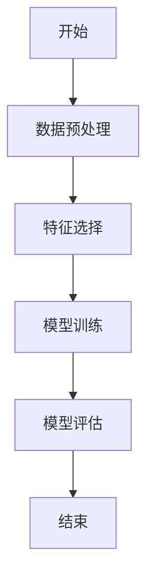
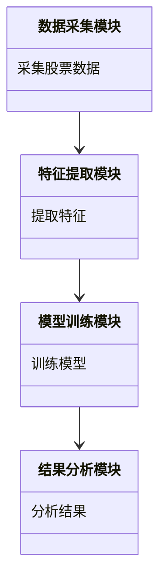
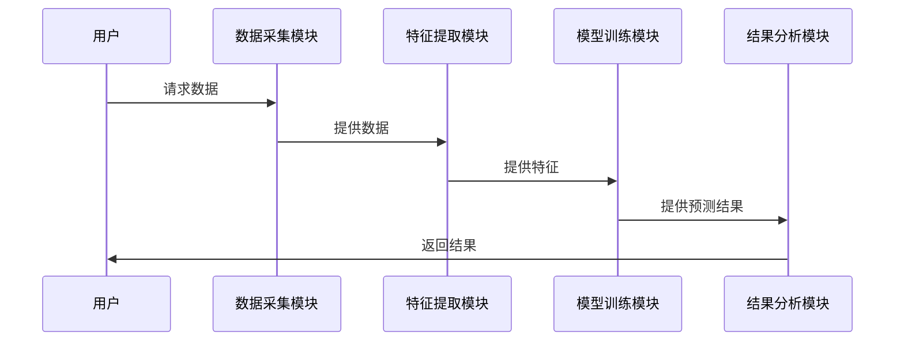

                 


# AI驱动的股票基本面分析工具

> 关键词：股票分析，人工智能，机器学习，深度学习，量化投资

> 摘要：本文系统地探讨了如何利用人工智能技术提升股票基本面分析的效率和准确性。通过分析核心概念、算法原理、系统架构设计以及实际案例，展示了AI在股票分析中的广泛应用和巨大潜力。

---

# 第一部分：AI驱动的股票基本面分析工具概述

## 第1章：股票基本面分析与AI的结合

### 1.1 股票基本面分析的基本概念

#### 1.1.1 股票基本面分析的定义
股票基本面分析是指通过对公司的财务数据、行业地位、管理团队、市场环境等因素进行分析，评估股票的内在价值。传统的基本面分析依赖分析师的主观判断，而AI技术的引入显著提高了分析的效率和准确性。

#### 1.1.2 基本面分析的核心要素
基本面分析的核心要素包括：
1. **财务数据**：收入、利润、资产负债表等。
2. **行业地位**：公司在行业中的竞争地位。
3. **管理团队**：管理团队的能力和稳定性。
4. **市场环境**：宏观经济环境和政策影响。

#### 1.1.3 AI在股票分析中的作用
AI通过处理大量数据、识别模式和预测趋势，帮助分析师更快速、准确地进行基本面分析。AI还可以实时监控市场变化，提供动态的分析结果。

### 1.2 AI驱动的股票分析背景

#### 1.2.1 传统股票分析的局限性
传统股票分析依赖人工经验，存在效率低、主观性强、难以处理海量数据等问题。

#### 1.2.2 AI技术的快速发展
近年来，AI技术，尤其是机器学习和深度学习的快速发展，为股票分析提供了新的工具和方法。

#### 1.2.3 AI在金融领域的应用前景
AI在金融领域的应用前景广阔，包括股票预测、风险管理、量化投资等。

### 1.3 本书的目标与结构

#### 1.3.1 本书的核心目标
本书旨在介绍如何利用AI技术提升股票基本面分析的效率和准确性，帮助读者掌握AI在股票分析中的核心概念和实际应用。

#### 1.3.2 本书的章节安排
本书共分为七章，涵盖股票基本面分析的背景、核心概念、算法原理、数学模型、系统架构设计、项目实战以及总结与展望。

#### 1.3.3 学习本书的先备知识
读者需要具备基本的股票分析知识和编程基础，熟悉Python和机器学习的基本概念。

---

## 第2章：AI驱动的股票基本面分析工具的核心概念

### 2.1 数据特征与处理

#### 2.1.1 财务数据的特征提取
财务数据是基本面分析的核心，包括收入、利润、现金流等。特征提取的关键是选择最具代表性的指标。

#### 2.1.2 文本数据的处理方法
文本数据包括公司公告、新闻报道等，需要进行分词、情感分析等处理。

#### 2.1.3 数据预处理的常见步骤
数据预处理包括数据清洗、缺失值处理、标准化等步骤。

### 2.2 算法选择与模型构建

#### 2.2.1 常见的机器学习算法
常用算法包括线性回归、支持向量机（SVM）、随机森林等。

#### 2.2.2 深度学习模型的应用
深度学习模型如LSTM在时间序列数据上表现优异。

#### 2.2.3 模型选择的策略
模型选择需考虑数据类型、问题类型和计算资源。

### 2.3 系统架构与流程

#### 2.3.1 系统的整体架构
系统架构包括数据采集、特征提取、模型训练、结果分析等模块。

#### 2.3.2 数据流的处理流程
数据流处理流程包括数据采集、预处理、特征提取、模型训练和结果分析。

#### 2.3.3 系统模块的划分
系统模块包括数据模块、特征模块、模型模块、结果模块等。

---

## 第3章：基于机器学习的股票预测算法

### 3.1 线性回归模型

#### 3.1.1 线性回归的基本原理
线性回归通过拟合最佳直线来预测目标变量。公式为：
$$ y = \beta_0 + \beta_1x + \epsilon $$

#### 3.1.2 普通最小二乘法的公式
最小二乘法用于求解回归系数，公式为：
$$ \hat{\beta} = (X^T X)^{-1} X^T y $$

#### 3.1.3 算法流程图


### 3.2 支持向量机模型

#### 3.2.1 SVM的基本原理
SVM通过构建超平面将数据分为不同类别。

#### 3.2.2 核函数的选择
常用核函数包括线性核、多项式核、RBF核等。

#### 3.2.3 算法流程图


---

## 第4章：数学模型与股票分析

### 4.1 回归分析

#### 4.1.1 线性回归模型
线性回归用于预测连续变量，公式为：
$$ y = \beta_0 + \beta_1x + \epsilon $$

#### 4.1.2 逻辑回归模型
逻辑回归用于分类问题，公式为：
$$ P(y=1|x) = \frac{e^{\beta_0 + \beta_1x}}{1 + e^{\beta_0 + \beta_1x}} $$

### 4.2 时间序列分析

#### 4.2.1 ARIMA模型
ARIMA用于时间序列预测，公式为：
$$ y_t = c + \phi_1 y_{t-1} + \theta_1 e_{t-1} + e_t $$

#### 4.2.2 LSTM网络
LSTM通过门控机制处理时间序列数据。

---

## 第5章：系统架构设计

### 5.1 系统功能设计

#### 5.1.1 领域模型
领域模型展示了系统的各个模块及其关系，如下：


### 5.2 系统架构设计

#### 5.2.1 分层架构
系统架构分为数据层、业务逻辑层和表示层。

#### 5.2.2 微服务架构
系统采用微服务架构，各个模块独立运行。

#### 5.2.3 接口设计
系统提供RESTful API接口，供其他系统调用。

### 5.3 系统交互设计

#### 5.3.1 序列图
系统交互序列图展示用户与系统的交互流程：


---

## 第6章：项目实战

### 6.1 环境安装

#### 6.1.1 安装Python
安装Python 3.8及以上版本。

#### 6.1.2 安装库
安装numpy、pandas、scikit-learn等库。

### 6.2 核心实现

#### 6.2.1 数据预处理
```python
import pandas as pd
data = pd.read_csv('stock_data.csv')
data = data.dropna()
```

#### 6.2.2 特征选择
```python
from sklearn.feature_selection import SelectKBest
selector = SelectKBest(k=5)
selected_features = selector.fit_transform(data, target)
```

#### 6.2.3 模型训练
```python
from sklearn.linear_model import LinearRegression
model = LinearRegression()
model.fit(selected_features, target)
```

### 6.3 案例分析

#### 6.3.1 数据来源
使用某股票的历史数据进行分析。

#### 6.3.2 模型评估
评估模型的准确率、召回率等指标。

### 6.4 代码解读与分析
详细解读代码实现，分析每一步的作用。

### 6.5 项目小结
总结项目的实现过程，指出优缺点和改进方向。

---

## 第7章：总结与展望

### 7.1 全书总结
总结本书的核心内容，强调AI在股票分析中的重要性。

### 7.2 未来展望
展望AI在股票分析中的未来发展方向，如多模态分析、强化学习等。

### 7.3 最佳实践Tips
给出实际应用中的建议和注意事项。

### 7.4 问题解答
解答读者可能遇到的问题。

---

## 附录

### 附录A：常用Python库

### 附录B：参考文献

### 附录C：术语表

---

# 作者：AI天才研究院/AI Genius Institute & 禅与计算机程序设计艺术 /Zen And The Art of Computer Programming

