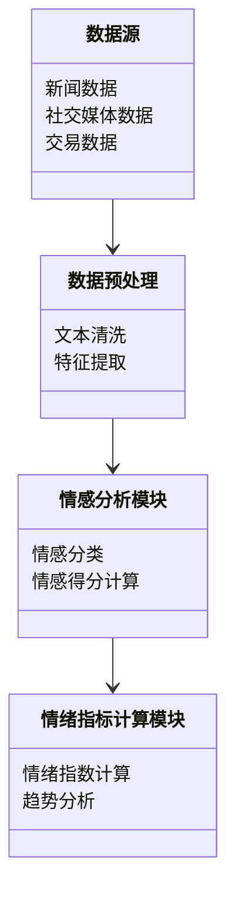
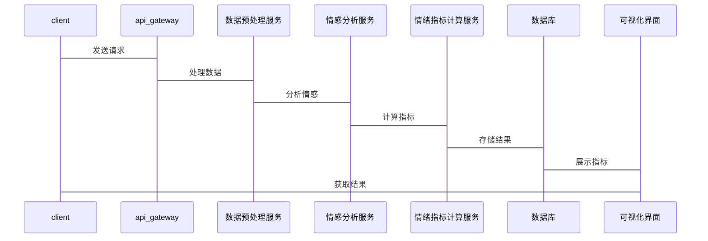

                 


# AI驱动的股票市场情绪指标开发

## 关键词：AI，股票市场，情绪指标，情感分析，深度学习

## 摘要：  
本文深入探讨了如何利用人工智能技术开发股票市场情绪指标。通过分析情绪指标的核心概念、算法原理、系统架构及实际应用，本文旨在为读者提供从理论到实践的全面指导，帮助其理解并掌握利用AI技术来捕捉和量化市场情绪的方法。通过实际项目案例，详细展示了如何从数据采集、特征提取、模型训练到系统实现，构建一个高效的股票市场情绪指标系统。

---

# 第一部分: AI驱动的股票市场情绪指标开发背景与基础

## 第1章: 股票市场情绪指标开发背景

### 1.1 问题背景与问题描述

#### 1.1.1 股票市场情绪指标的定义  
股票市场情绪指标是通过分析市场参与者的情绪波动，量化投资者对市场未来走势的态度和信心。这种指标能够帮助投资者理解市场情绪的变化趋势，辅助投资决策。

#### 1.1.2 情绪指标在股票市场中的作用  
情绪指标可以帮助投资者预测市场的短期波动，识别市场拐点，优化投资组合。此外，情绪指标还可以与其他技术指标结合，提供更全面的市场分析工具。

#### 1.1.3 当前市场对情绪指标的需求  
随着金融市场的复杂化，投资者对实时情绪分析的需求日益增长。传统技术分析的局限性使得情绪指标成为弥补这一空白的重要工具。

---

### 1.2 情绪指标的核心概念与边界

#### 1.2.1 情绪指标的核心要素  
- 数据来源：新闻、社交媒体、交易数据等。  
- 情感分析：通过NLP技术分析文本情感。  
- 时间序列分析：捕捉情绪变化的趋势。  

#### 1.2.2 情绪指标的边界与外延  
情绪指标仅反映市场情绪，不直接预测价格走势。其外延包括情绪与其他市场指标的结合，如成交量、价格波动等。

#### 1.2.3 情绪指标与传统技术分析的结合  
情绪指标可以作为技术分析的补充，帮助交易者更好地理解市场参与者的心理。

---

## 第2章: AI驱动的股票市场情绪指标开发基础

### 2.1 AI技术在金融领域的应用现状

#### 2.1.1 AI在金融领域的典型应用  
- 股票价格预测。  
- 风险评估与管理。  
- 市场情绪分析。  

#### 2.1.2 情感分析在股票市场中的应用  
- 分析社交媒体上的投资者情绪。  
- 解读新闻标题的情绪倾向。  
- 识别市场情绪的拐点。  

#### 2.1.3 当前技术的局限性与改进方向  
- 数据质量与噪声问题。  
- 情感分析的实时性与准确性。  
- 多模态数据的融合。  

---

### 2.2 情绪指标开发的关键技术

#### 2.2.1 自然语言处理技术  
- 用于分析文本数据，提取情感特征。  

#### 2.2.2 情感分析算法  
- 基于规则的方法：简单但不够灵活。  
- 机器学习方法：svm、朴素贝叶斯等。  
- 深度学习方法：lstm、transformer等。  

#### 2.2.3 数据挖掘与特征提取  
- 从社交媒体、新闻中提取关键词和情感特征。  

---

# 第二部分: 情绪指标的核心概念与联系

## 第3章: 情绪指标的核心概念与联系

### 3.1 情绪指标的核心概念

#### 3.1.1 情绪指标的构成要素  
- 数据来源：社交媒体、新闻、交易数据。  
- 情感分析：判断文本的情感倾向。  
- 时间序列分析：捕捉情绪变化的趋势。  

#### 3.1.2 情绪指标的数学模型  
- 情感得分计算：$S = \sum_{i=1}^{n} w_i \cdot e_i$，其中$w_i$是权重，$e_i$是情感得分。  

#### 3.1.3 情绪指标的计算方法  
- 基于文本的情感分析，计算每条数据的情感得分，再进行加权求和。

---

### 3.2 情感分析算法原理

#### 3.2.1 基于规则的情感分析  
- 使用预定义的规则和情感词典判断文本情感。  

#### 3.2.2 基于机器学习的情感分析  
- 通过训练数据，学习情感分类模型。  

#### 3.2.3 基于深度学习的情感分析  
- 使用Transformer架构捕捉文本的语义关系。  

---

## 第4章: 情绪指标的算法原理与数学模型

### 4.1 情感分析的算法原理

#### 4.1.1 基于规则的情感分析  
- 示例：使用情感词典判断新闻标题的情感倾向。  

#### 4.1.2 基于机器学习的情感分析  
- 示例：使用支持向量机（SVM）进行分类。  

#### 4.1.3 基于深度学习的情感分析  
- 示例：使用Transformer模型进行情感分类。  

---

### 4.2 情感分析的数学模型

#### 4.2.1 朴素贝叶斯分类器  
- 概率公式：$P(c|x) = \frac{P(x|c)P(c)}{P(x)}$。  

#### 4.2.2 支持向量机（SVM）  
- 分离超平面：最大化类别间隔。  

#### 4.2.3 循环神经网络（RNN）  
- 用于处理序列数据，捕捉上下文信息。  

#### 4.2.4 Transformer架构  
- 注意力机制：$A = QK^T$，其中$Q$和$K$是查询和键的变换矩阵。  

---

# 第三部分: 系统分析与架构设计

## 第5章: 系统分析与架构设计方案

### 5.1 项目介绍

#### 5.1.1 项目目标  
开发一个基于AI的股票市场情绪指标系统，实现从数据采集到情绪分析的全流程自动化。  

---

### 5.2 系统功能设计

#### 5.2.1 领域模型  


---

### 5.3 系统架构设计

#### 5.3.1 系统架构图  


---

### 5.4 系统接口设计

#### 5.4.1 API接口  
- 输入：文本数据。  
- 输出：情感得分。  

---

### 5.5 系统交互设计

#### 5.5.1 交互流程  


---

# 第四部分: 项目实战

## 第6章: 项目实战

### 6.1 环境安装

#### 6.1.1 安装依赖  
- Python 3.8+  
- Jieba  
- Transformers  
- Scikit-learn  

---

### 6.2 核心代码实现

#### 6.2.1 情感分析模块  
```python
from transformers import pipeline

sentiment_analyzer = pipeline("sentiment-analysis")
def get_sentiment(text):
    result = sentiment_analyzer(text)
    return result[0]['label'], result[0]['score']
```

---

### 6.2.2 情绪指标计算模块  
```python
import numpy as np

def compute_sentiment_score(sentiments):
    return np.mean(sentiments)
```

---

### 6.3 案例分析与解读

#### 6.3.1 数据来源  
- 新闻标题：例如，“股市上涨，投资者信心增强”。  

#### 6.3.2 情感分析  
- 使用预训练的模型对新闻标题进行情感分类，得到情感得分。  

#### 6.3.3 情绪指标计算  
- 计算所有文本的情感得分的平均值，作为情绪指标。  

---

## 第7章: 总结与展望

### 7.1 总结  
本文详细介绍了AI驱动的股票市场情绪指标开发的背景、核心概念、算法原理、系统架构及项目实战。通过实际案例展示了如何利用AI技术量化市场情绪，辅助投资决策。  

### 7.2 展望  
未来，随着AI技术的不断发展，情绪指标在股票市场中的应用将更加广泛和精准。结合多模态数据和更先进的模型，情绪指标将为投资者提供更强大的决策支持。

---

## 作者：AI天才研究院/AI Genius Institute & 禅与计算机程序设计艺术 /Zen And The Art of Computer Programming

