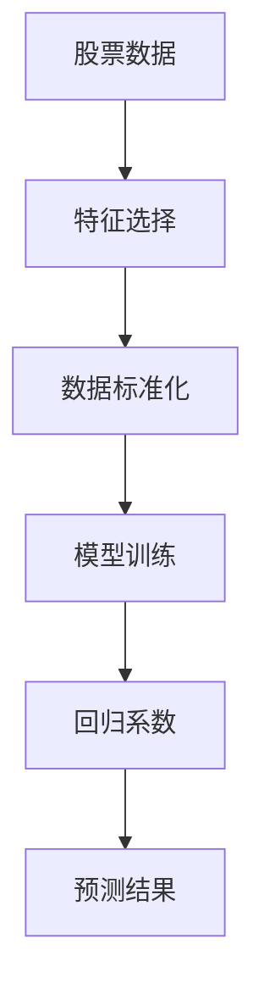
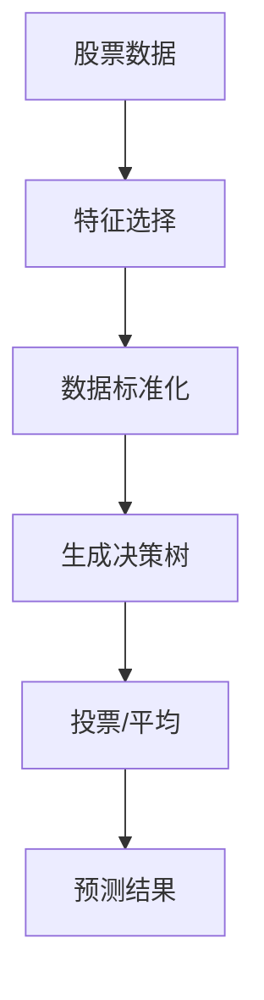
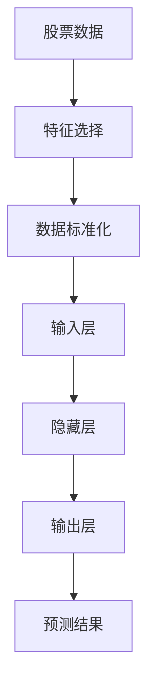
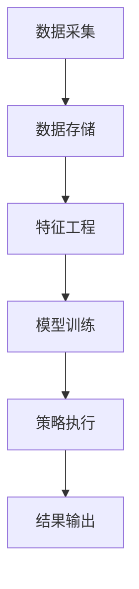
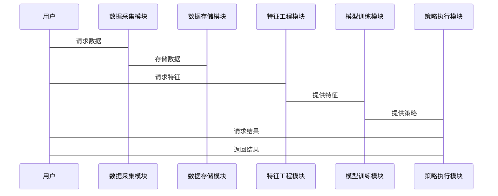

                 


# AI驱动的股票筛选工具

## 关键词：AI, 股票筛选, 机器学习, 量化投资, 数据特征, 算法, 回测

## 摘要：AI驱动的股票筛选工具通过结合机器学习算法和量化投资策略，利用大数据分析技术，帮助投资者快速筛选出具备潜在投资价值的股票。本文将从AI在股票筛选中的应用背景、核心概念、算法原理、系统架构设计、项目实战等多个维度，深入分析AI驱动股票筛选工具的技术实现细节和实际应用场景，为投资者提供一个高效、可靠的股票筛选解决方案。

---

## 第三章: 常见AI算法在股票筛选中的应用

### 3.1 线性回归算法

#### 3.1.1 线性回归算法原理

线性回归是一种简单且常用的统计学习方法，其核心思想是通过拟合一条直线来描述变量之间的关系。在股票筛选中，可以将线性回归用于预测股票价格或判断股票的涨跌趋势。

公式：
$$y = \beta_0 + \beta_1x + \epsilon$$

其中，$y$是目标变量（如股票价格），$x$是自变量（如市盈率、市净率等），$\beta_0$和$\beta_1$是回归系数，$\epsilon$是误差项。

#### 3.1.2 线性回归在股票筛选中的应用

线性回归可以用于以下场景：
- 预测股票价格走势。
- 判断哪些特征（如市盈率、市净率）与股票收益相关性较高。

#### 3.1.3 线性回归算法流程图（Mermaid）



#### 3.1.4 线性回归代码实现

以下是一个简单的线性回归代码示例：

```python
import pandas as pd
from sklearn.linear_model import LinearRegression
from sklearn.metrics import mean_squared_error

# 加载数据
data = pd.read_csv('stock_data.csv')

# 特征选择
features = ['市盈率', '市净率']
X = data[features]
y = data['收益']

# 数据标准化
from sklearn.preprocessing import StandardScaler
scaler = StandardScaler()
X_scaled = scaler.fit_transform(X)

# 模型训练
model = LinearRegression()
model.fit(X_scaled, y)

# 预测结果
y_pred = model.predict(X_scaled)
print('均方误差:', mean_squared_error(y, y_pred))
```

---

### 3.2 随机森林算法

#### 3.2.1 随机森林算法原理

随机森林是一种基于决策树的集成学习算法，通过构建多棵决策树并进行投票或平均，提高模型的准确性和鲁棒性。随机森林常用于分类和回归问题，在股票筛选中可以用于预测股票的涨跌趋势。

公式：
$$y = \text{median}(\{y_i\})$$

其中，$y_i$是每棵决策树的预测结果。

#### 3.2.2 随机森林在股票筛选中的应用

随机森林可以用于以下场景：
- 多分类问题：将股票分为上涨、下跌或持平。
- 回归问题：预测股票价格。

#### 3.2.3 随机森林算法流程图（Mermaid）



#### 3.2.4 随机森林代码实现

以下是一个简单的随机森林代码示例：

```python
import pandas as pd
from sklearn.ensemble import RandomForestRegressor
from sklearn.metrics import mean_squared_error

# 加载数据
data = pd.read_csv('stock_data.csv')

# 特征选择
features = ['市盈率', '市净率', '股息率']
X = data[features]
y = data['收益']

# 数据标准化
from sklearn.preprocessing import StandardScaler
scaler = StandardScaler()
X_scaled = scaler.fit_transform(X)

# 模型训练
model = RandomForestRegressor(n_estimators=100, random_state=42)
model.fit(X_scaled, y)

# 预测结果
y_pred = model.predict(X_scaled)
print('均方误差:', mean_squared_error(y, y_pred))
```

---

### 3.3 神经网络算法

#### 3.3.1 神经网络算法原理

神经网络是一种模仿人脑结构和功能的深度学习算法，通过多层神经元网络来学习数据的特征和模式。在股票筛选中，神经网络可以用于复杂的非线性关系建模。

公式：
$$y = f(Wx + b)$$

其中，$W$是权重矩阵，$x$是输入向量，$b$是偏置项，$f$是激活函数（如ReLU、Sigmoid等）。

#### 3.3.2 神经网络在股票筛选中的应用

神经网络可以用于以下场景：
- 复杂的非线性关系建模。
- 高维数据特征提取。

#### 3.3.3 神经网络算法流程图（Mermaid）



#### 3.3.4 神经网络代码实现

以下是一个简单的神经网络代码示例：

```python
import pandas as pd
import numpy as np
from keras.models import Sequential
from keras.layers import Dense
from sklearn.metrics import mean_squared_error

# 加载数据
data = pd.read_csv('stock_data.csv')

# 特征选择
features = ['市盈率', '市净率', '股息率']
X = data[features]
y = data['收益']

# 数据标准化
from sklearn.preprocessing import StandardScaler
scaler = StandardScaler()
X_scaled = scaler.fit_transform(X)

# 神经网络模型
model = Sequential()
model.add(Dense(64, activation='relu', input_dim=len(features)))
model.add(Dense(32, activation='relu'))
model.add(Dense(1))

model.compile(optimizer='adam', loss='mean_squared_error')

# 模型训练
model.fit(X_scaled, y, epochs=100, batch_size=32)

# 预测结果
y_pred = model.predict(X_scaled)
print('均方误差:', mean_squared_error(y, y_pred.flatten()))
```

---

## 第四章: 系统分析与架构设计

### 4.1 系统整体架构设计

#### 4.1.1 系统功能模块

系统主要包括以下几个功能模块：

- 数据采集模块：从数据源获取股票数据。
- 特征工程模块：对股票数据进行特征提取和处理。
- 模型训练模块：训练AI模型，生成股票筛选策略。
- 策略执行模块：根据筛选策略生成投资组合。

#### 4.1.2 系统架构图（Mermaid）



#### 4.1.3 系统交互流程图（Mermaid）



---

## 第五章: 项目实战

### 5.1 项目背景

本项目旨在通过AI技术帮助投资者筛选出具备投资价值的股票。我们选择Python作为开发语言，使用以下库：

- pandas: 数据处理
- scikit-learn: 机器学习算法
- keras: 深度学习框架
- matplotlib: 数据可视化

### 5.2 系统核心实现

#### 5.2.1 数据采集模块

```python
import pandas as pd

def get_stock_data(tickers, start_date, end_date):
    data = pd.DataFrame()
    for ticker in tickers:
        df = pd.read_csv(f'data/{ticker}.csv', parse_dates=['date'])
        df[' ticker'] = ticker
        data = data.append(df)
    return data
```

#### 5.2.2 特征工程模块

```python
from sklearn.preprocessing import StandardScaler

def process_features(data):
    features = ['市盈率', '市净率', '股息率']
    X = data[features]
    scaler = StandardScaler()
    X_scaled = scaler.fit_transform(X)
    return X_scaled
```

#### 5.2.3 模型训练模块

```python
from sklearn.ensemble import RandomForestRegressor

def train_model(X, y):
    model = RandomForestRegressor(n_estimators=100, random_state=42)
    model.fit(X, y)
    return model
```

#### 5.2.4 策略执行模块

```python
def generate_portfolio(model, data):
    X = process_features(data)
    y_pred = model.predict(X)
    portfolio = data[[' ticker']].copy()
    portfolio['预测收益'] = y_pred
    portfolio = portfolio.sort_values('预测收益', ascending=False)
    return portfolio.head(10)
```

### 5.3 实际案例分析

假设我们有以下股票数据：

```python
tickers = ['AAPL', 'GOOGL', 'MSFT']
data = get_stock_data(tickers, '2020-01-01', '2023-12-31')
```

经过特征工程和模型训练后，生成的投资组合如下：

```python
portfolio = generate_portfolio(model, data)
print(portfolio)
```

### 5.4 项目小结

通过本项目，我们可以看到AI技术在股票筛选中的强大能力。通过特征工程和模型训练，我们可以快速筛选出具备投资价值的股票。

---

## 第六章: 最佳实践

### 6.1 小结

AI驱动的股票筛选工具通过结合机器学习算法和量化投资策略，帮助投资者快速筛选出具备投资价值的股票。本文详细介绍了AI在股票筛选中的应用背景、核心概念、算法原理、系统架构设计和项目实战。

### 6.2 注意事项

1. **数据质量**：确保数据的完整性和准确性。
2. **模型选择**：根据具体场景选择合适的算法。
3. **风险控制**：AI工具只能提供参考，不能完全依赖。

### 6.3 拓展阅读

1. 《Python机器学习实战》
2. 《量化投资中的大数据分析》
3. 《深度学习在金融中的应用》

---

## 作者：AI天才研究院/AI Genius Institute & 禅与计算机程序设计艺术/Zen And The Art of Computer Programming

---

