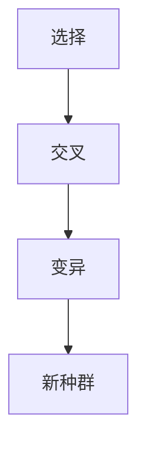
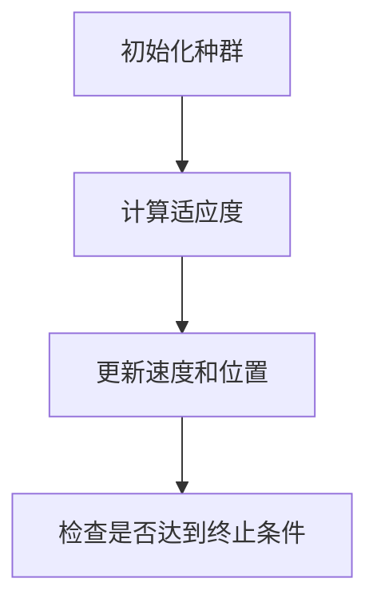
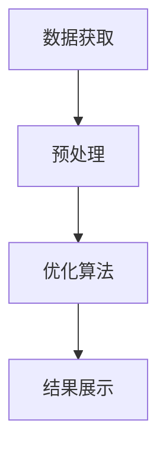
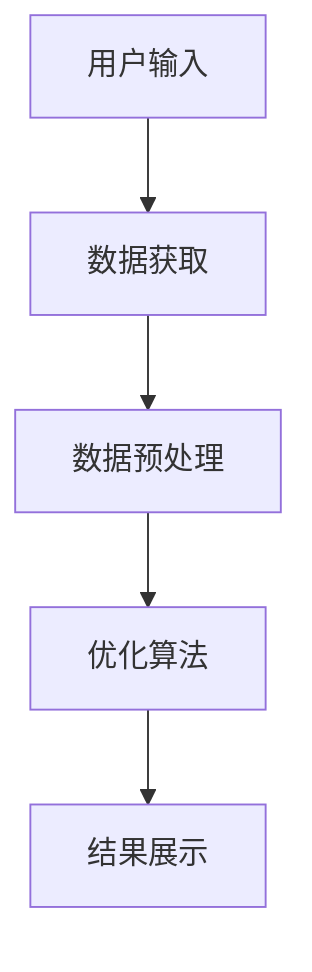

                 


# AI驱动的股票组合优化工具

> 关键词：AI驱动、股票组合优化、投资组合管理、现代优化算法、深度学习、系统架构设计

> 摘要：本文深入探讨了AI驱动的股票组合优化工具的核心概念、算法原理、系统架构设计以及实际应用案例。通过详细分析优化目标、约束条件、数据特征等关键要素，结合遗传算法、粒子群优化算法、深度学习等技术，为读者提供了一个从理论到实践的完整指南。

---

# 第一部分：AI驱动的股票组合优化工具概述

## 第1章：股票组合优化的基本概念

### 1.1 股票组合优化的定义与背景

#### 1.1.1 投资组合优化的基本概念
股票组合优化是指通过科学的方法选择最优的股票组合，以在特定风险水平下实现最大收益，或在特定收益水平下最小化风险。它是现代投资组合理论（MPT）的核心内容之一。

#### 1.1.2 AI技术在金融领域的应用背景
人工智能技术（AI）在金融领域的应用日益广泛，特别是在股票组合优化方面。AI能够处理海量数据，发现复杂模式，并快速做出决策，这使得AI成为传统金融工具的重要补充。

#### 1.1.3 股票组合优化的现实意义
股票组合优化能够帮助投资者实现资产配置的最优化，降低投资风险，提高收益。在当前复杂多变的市场环境中，AI驱动的股票组合优化工具为投资者提供了更高效、更精准的决策支持。

---

### 1.2 AI驱动的股票组合优化的优势

#### 1.2.1 传统股票组合优化的局限性
传统股票组合优化方法通常基于历史数据和简单的统计模型，难以捕捉市场中的复杂动态和非线性关系，且计算效率较低。

#### 1.2.2 AI技术在优化过程中的独特优势
AI技术能够处理非结构化数据，发现传统方法难以察觉的模式，并通过机器学习算法实时更新优化结果，从而提高优化的准确性和效率。

#### 1.2.3 数据驱动决策的核心作用
AI驱动的股票组合优化工具依赖于大量的历史数据和实时市场数据，通过数据驱动的方式不断优化投资策略，实现动态调整。

---

## 第2章：AI驱动的股票组合优化工具的核心概念

### 2.1 核心概念与原理

#### 2.1.1 优化目标与约束条件
优化目标通常是最大化收益或最小化风险。约束条件包括资金限制、流动性要求、风险承受能力等。

#### 2.1.2 数据特征与模型选择
数据特征包括股票的历史收益率、波动率、相关性等。模型选择需要根据数据特征和优化目标来确定，常用模型包括线性回归、聚类分析等。

#### 2.1.3 风险与收益的平衡机制
通过构建风险-收益曲线，找到最优投资组合。常用的风险衡量指标包括波动率、VaR（在险价值）等。

---

### 2.2 核心概念之间的关系

#### 2.2.1 优化目标与约束条件的关联
优化目标决定了约束条件的设置，而约束条件则限制了优化的范围和可能性。

#### 2.2.2 数据特征对模型选择的影响
数据特征的类型和分布直接影响模型的选择，例如，时间序列数据适合使用ARIMA模型。

#### 2.2.3 风险收益平衡的实现路径
通过优化算法寻找最优解，平衡风险与收益，实现投资目标。

---

## 第3章：AI驱动股票组合优化的算法原理

### 3.1 现代优化算法概述

#### 3.1.1 遗传算法的基本原理
遗传算法是一种模拟自然选择过程的优化算法，主要包括选择、交叉和变异三个步骤。



#### 3.1.2 粒子群优化算法的实现步骤
粒子群优化算法通过模拟鸟群觅食行为，寻找最优解。



#### 3.1.3 其他常用优化算法的简介
包括模拟退火算法、蚁群算法等，各有其独特的优势和应用场景。

---

### 3.2 基于深度学习的优化方法

#### 3.2.1 神经网络在股票组合优化中的应用
神经网络可以用于预测股票价格和识别市场趋势，从而辅助优化决策。

#### 3.2.2 基于强化学习的优化策略
强化学习通过试错机制，学习最优的投资策略。

#### 3.2.3 深度学习模型的优势与挑战
优势包括非线性建模能力，挑战包括数据质量和计算复杂度。

---

## 第4章：系统架构与设计

### 4.1 系统架构设计

#### 4.1.1 问题场景介绍
系统需要实现股票组合优化功能，包括数据获取、预处理、模型训练和结果展示。

#### 4.1.2 系统功能模块划分
包括数据获取模块、预处理模块、优化算法模块和结果展示模块。

#### 4.1.3 系统架构图


---

### 4.2 系统接口与交互设计

#### 4.2.1 系统接口定义
包括API接口的设计，如获取股票数据的接口。

#### 4.2.2 系统交互流程图


---

## 第5章：项目实战与实现

### 5.1 项目环境与工具安装

#### 5.1.1 开发环境搭建
推荐使用Python作为开发语言，安装Jupyter Notebook和相关库。

#### 5.1.2 依赖库的安装与配置
安装Pandas、NumPy、Scikit-learn等库。

---

### 5.2 核心算法实现

#### 5.2.1 基于遗传算法的股票组合优化代码
```python
import numpy as np

def fitness(individual):
    # 计算收益和风险
    return -1 * (individual.dot(returns) - 1)  # 最大化收益

def main():
    # 初始化种群
    population = np.random.rand(100, len(returns))
    # 迭代优化
    for _ in range(100):
        fitness_values = np.apply_along_axis(fitness, 1, population)
        # 选择、交叉、变异
    return best_individual

if __name__ == "__main__":
    main()
```

#### 5.2.2 基于深度学习的优化策略代码
```python
import tensorflow as tf

model = tf.keras.Sequential([
    tf.keras.layers.Dense(64, activation='relu'),
    tf.keras.layers.Dense(1, activation='linear')
])

model.compile(optimizer='adam', loss='mean_squared_error')
model.fit(X_train, y_train, epochs=10)
```

---

## 第6章：应用案例与分析

### 6.1 典型案例分析

#### 6.1.1 案例背景介绍
以某段时间内的股票数据为例，展示优化过程。

#### 6.1.2 数据收集与处理
包括数据清洗、特征提取等步骤。

#### 6.1.3 模型训练与评估
展示模型的训练过程和评估结果，如准确率、收益率等。

---

## 第7章：总结与展望

### 7.1 最佳实践 tips
- 数据质量是关键，确保数据的准确性和完整性。
- 结合多种算法，提高优化效果。

### 7.2 小结
AI驱动的股票组合优化工具为投资者提供了更高效、更精准的决策支持。

### 7.3 注意事项
- 风险提示：优化结果仅供参考，投资需谨慎。
- 模型局限：市场变化复杂，模型需不断更新。

### 7.4 拓展阅读
推荐相关书籍和论文，如《Python机器学习实战》等。

---

# 作者

作者：AI天才研究院/AI Genius Institute & 禅与计算机程序设计艺术 /Zen And The Art of Computer Programming

---

通过以上结构，您可以逐步撰写完整的技术博客文章，涵盖从理论到实践的各个方面，为读者提供全面的指导。

