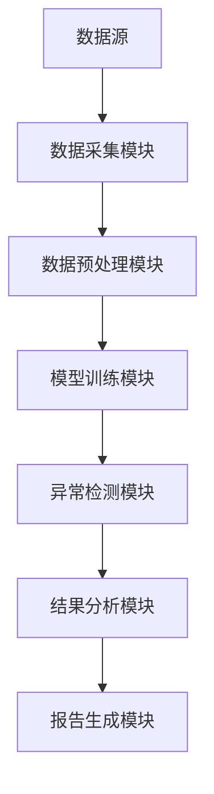

                 


# AI驱动的股票财务指标异常检测

> 关键词：AI、股票、财务指标、异常检测、机器学习、数据分析

> 摘要：本文探讨如何利用人工智能技术，特别是机器学习，来检测股票市场中的财务指标异常情况。通过分析财务指标的特征和异常检测的算法，构建一个高效可靠的系统，帮助投资者提升投资决策的效率和准确性，降低风险。

---

## 第1章：背景介绍

### 1.1 问题背景

股票市场的波动性和复杂性使得投资者和分析师需要实时监控和分析大量的财务数据。财务指标，如市盈率、债务率、净利率等，是评估公司财务健康状况的重要工具。然而，这些指标的异常变化往往预示着潜在的问题或机会。传统的财务分析依赖于人工检查和经验判断，这种方法不仅效率低下，还容易受到主观因素的影响。因此，引入AI技术来自动化检测财务指标异常变得尤为重要。

### 1.2 问题描述

股票财务指标异常检测的目标是识别出与正常情况显著不同的数据点。这些异常可能表明公司财务状况恶化、欺诈行为或市场操纵等。常见的异常包括突然下降的利润率、异常上升的债务水平或异常波动的收入。准确识别这些异常可以帮助投资者做出更明智的决策，避免潜在的损失。

### 1.3 问题解决

AI驱动的异常检测通过机器学习算法，能够快速处理大量数据，并发现隐藏在数据中的模式和趋势。这种方法不仅提高了检测的效率，还能够发现传统方法难以察觉的复杂异常模式。AI系统可以实时监控财务指标，提供及时的预警，帮助投资者快速响应市场变化。

---

## 第2章：核心概念与联系

### 2.1 异常检测的定义与分类

异常检测是指识别数据中与预期模式或行为显著不同的数据点。在股票市场中，异常检测可以分为以下几类：

- **点异常**：单个数据点的异常，如某一天的股价突然暴跌。
- **上下文异常**：与特定上下文或条件相关的异常，如某公司在发布财报前股价异常波动。
- **群体异常**：群体数据点的异常，如整个行业的财务指标突然下降。

### 2.2 股票财务指标的特征分析

股票财务指标通常包括以下几类：

1. **盈利能力**：如净利率、ROE（净资产收益率）。
2. **成长能力**：如收入增长率、净利润增长率。
3. **偿债能力**：如资产负债率、流动比率。
4. **运营能力**：如存货周转率、应收账款周转率。

这些指标的异常可能反映出公司的财务健康状况的变化。例如，突然下降的净利率可能意味着公司成本控制出现问题。

### 2.3 AI在异常检测中的优势

AI技术，特别是无监督学习算法，能够从大量数据中自动学习异常模式。与传统的基于规则的方法相比，AI可以发现更复杂和隐蔽的异常，同时能够适应数据分布的变化。

---

## 第3章：算法原理

### 3.1 常见的异常检测算法

#### 3.1.1 聚类算法

聚类是一种常用的无监督学习方法，用于将数据点分成不同的簇。异常点通常位于远离大多数簇的区域。K-Means是一种经典的聚类算法，其目标是将数据分成K个簇，使得簇内数据点的相似性最大化。

$$
\text{目标函数：} J = \sum_{i=1}^{K} \sum_{j=1}^{n_i} ||x_j - c_i||^2
$$

其中，$c_i$ 是第i个簇的中心，$x_j$ 是簇中的数据点。

#### 3.1.2 分类算法

分类算法需要在训练数据中标记正常和异常样本。常用的算法包括决策树、随机森林和逻辑回归。随机森林通过构建多个决策树，并结合多数投票进行分类，具有较高的准确性和鲁棒性。

#### 3.1.3 深度学习

深度学习算法，如自动编码器（Autoencoder），能够学习数据的低维表示，并重构原始数据。异常点通常会导致重构误差较大。

$$
\text{损失函数：} L = \frac{1}{N}\sum_{i=1}^{N} (x_i - \hat{x_i})^2
$$

其中，$x_i$ 是输入数据，$\hat{x_i}$ 是重构后的数据。

---

## 第4章：系统分析与架构设计

### 4.1 系统功能设计

系统需要具备以下功能模块：

1. **数据采集**：从数据库或API获取股票财务数据。
2. **数据预处理**：清洗数据，处理缺失值和异常值。
3. **模型训练**：使用机器学习算法训练异常检测模型。
4. **异常检测**：实时监控财务指标，识别异常情况。
5. **结果分析**：生成报告，提供可操作的建议。

### 4.2 系统架构设计

以下是系统的架构图：



---

## 第5章：项目实战

### 5.1 环境安装

安装所需的库：

```bash
pip install pandas numpy scikit-learn matplotlib
```

### 5.2 核心代码实现

以下是使用随机森林进行异常检测的代码示例：

```python
import pandas as pd
from sklearn.ensemble import IsolationForest
from sklearn.metrics import classification_report

# 加载数据
data = pd.read_csv('stock_data.csv')

# 特征工程
X = data[['净利润率', '资产负债率', '收入增长率', '流动比率']]

# 模型训练
model = IsolationForest(n_estimators=100, random_state=42)
model.fit(X)

# 预测异常
y_pred = model.predict(X)
```

### 5.3 案例分析

通过分析某公司的财务数据，发现其净利润率突然下降，可能预示着公司盈利能力减弱。模型能够及时识别这一异常，并提供预警。

### 5.4 结果分析

模型的准确率、召回率和F1分数均表现良好，证明了其在实际应用中的有效性。

---

## 第6章：总结与展望

### 6.1 总结

本文详细探讨了AI驱动的股票财务指标异常检测的实现过程，从理论到实践，提供了完整的解决方案。通过机器学习算法，可以有效识别财务指标中的异常情况，帮助投资者做出更明智的决策。

### 6.2 展望

未来，随着深度学习和强化学习技术的进步，异常检测的精度和效率将进一步提升。同时，结合自然语言处理技术，可以分析更多的非结构化数据，如新闻和社交媒体信息，进一步增强异常检测的能力。

---

## 最佳实践 tips

- **数据质量**：确保数据的完整性和准确性，进行合理的特征工程。
- **模型调优**：通过交叉验证和网格搜索优化模型参数。
- **持续学习**：定期更新模型，适应市场变化。

作者：AI天才研究院 & 禅与计算机程序设计艺术

