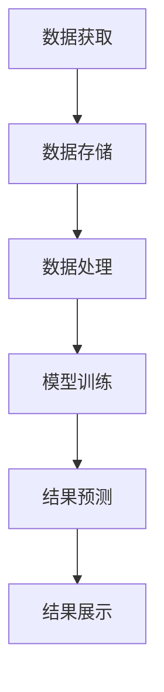

                 


# AI驱动的股票财报质量评估

> 关键词：AI, 股票财报, 财务分析, 自然语言处理, 机器学习, 股票投资

> 摘要：本文深入探讨了AI技术在股票财报质量评估中的应用，分析了从数据获取、文本预处理、特征提取到模型训练和结果预测的完整流程。文章结合实际案例，详细讲解了自然语言处理（NLP）和机器学习算法在财务数据中的应用，展示了如何利用AI提升财务分析的效率和准确性。

---

## 第1章: 股票财报质量评估的背景与挑战

### 1.1 股票财报质量评估的重要性

#### 1.1.1 财务报表分析的核心作用
股票的财务报表（如利润表、资产负债表、现金流量表）是投资者评估公司财务健康状况的重要依据。通过分析这些数据，投资者可以了解公司的盈利能力、偿债能力、运营效率等关键指标。

#### 1.1.2 AI技术在金融分析中的应用现状
随着AI技术的快速发展，机器学习和自然语言处理（NLP）在金融领域的应用越来越广泛。AI可以帮助分析师快速处理大量财务数据，发现隐藏在数据中的模式和趋势，从而辅助投资决策。

#### 1.1.3 股票财报质量评估的难点与痛点
传统的财务分析方法依赖于人工判断，存在耗时长、效率低、主观性强等问题。此外，财务报表中的文本信息（如管理层讨论与分析部分）往往难以量化，这使得全面评估财报质量变得困难。

---

### 1.2 AI驱动的股票财报质量评估的必要性

#### 1.2.1 传统财报分析的局限性
传统财报分析主要依赖人工阅读和计算，容易受到主观因素的影响。同时，面对海量的财务数据，人工分析效率低下，难以及时提供有效的决策支持。

#### 1.2.2 AI技术如何提升财报分析效率
AI技术可以通过自动化处理财务数据，快速提取关键信息并进行量化分析。例如，使用NLP技术分析财务报告中的文本信息，可以提取出公司的经营状况、风险提示等关键信息。

#### 1.2.3 数据驱动的决策优势
通过AI技术，可以将财务数据与市场数据相结合，构建预测模型，帮助投资者更准确地评估公司的财务健康状况和未来业绩。

---

## 第2章: 财报质量评估的核心指标与方法

### 2.1 财务报表分析的关键指标

#### 2.1.1 利润表分析
利润表反映了公司在一定会计期间的经营成果，主要包括收入、成本、利润等指标。

#### 2.1.2 资产负债表分析
资产负债表反映了公司在某一特定时点的财务状况，包括资产、负债和所有者权益等指标。

#### 2.1.3 现金流量表分析
现金流量表反映了公司在一定会计期间内的现金流入和流出情况，分为经营活动、投资活动和筹资活动的现金流量。

---

### 2.2 文本分析在财报解读中的应用

#### 2.2.1 自然语言处理（NLP）在财报文本分析中的作用
NLP技术可以用于提取财务报告中的关键词、主题和情感倾向，帮助分析师快速了解公司经营状况。

#### 2.2.2 关键词提取与情感分析
通过关键词提取，可以识别财务报告中重要的财务指标和风险提示。情感分析则可以帮助判断管理层的表述是否积极或消极。

#### 2.2.3 文本相似度分析
通过比较不同公司的财务报告，可以识别行业趋势和潜在风险。

---

### 2.3 数据预处理与特征提取

#### 2.3.1 数据清洗与标准化
数据清洗包括去除重复数据、处理缺失值、标准化格式等。标准化格式包括将日期统一、将金额单位统一等。

#### 2.3.2 特征工程与维度降维
特征工程包括选择关键特征、创建新特征、删除冗余特征等。维度降维可以通过主成分分析（PCA）等方法减少特征数量。

#### 2.3.3 时间序列数据处理
财务数据通常具有时间序列特性，可以使用时间序列分析方法（如ARIMA、LSTM）进行建模。

---

## 第3章: AI驱动的股票财报质量评估的技术实现框架

### 3.1 技术架构概述

#### 3.1.1 数据获取与存储
数据获取包括从股票交易所API获取财务数据，从新闻网站获取财经新闻等。数据存储可以使用数据库（如MySQL）或大数据平台（如Hadoop）。

#### 3.1.2 数据预处理与特征提取
数据预处理包括清洗、转换和标注。特征提取包括文本特征提取（如TF-IDF）和数值特征提取（如均值、标准差等）。

#### 3.1.3 模型训练与优化
模型训练包括选择合适的算法（如随机森林、支持向量机、神经网络等），调整超参数，进行交叉验证。

#### 3.1.4 结果输出与可视化
结果输出包括生成财务健康评分、风险提示等。结果可视化可以通过图表（如柱状图、折线图）展示。

---

## 第4章: AI驱动的股票财报质量评估的算法原理与实现

### 4.1 文本预处理与特征提取

#### 4.1.1 文本预处理方法
- 分词与词干提取：使用NLTK或spaCy进行分词和词干提取。
- 停用词去除与词向量表示：去除常见停用词，使用Word2Vec或GloVe生成词向量。
- 文本标准化与清洗：统一文本格式，去除无关信息。

#### 4.1.2 特征提取与表示
- TF-IDF特征提取：计算文本中关键词的TF-IDF值。
- Word2Vec与GloVe词向量：将文本转换为向量表示。
- BERT等预训练模型的应用：利用BERT模型进行上下文语义表示。

#### 4.1.3 代码实现与示例
```python
from sklearn.feature_extraction.text import TfidfVectorizer

vectorizer = TfidfVectorizer()
text = "The company reported a profit increase of 10% in the quarter."
tfidf = vectorizer.fit_transform([text])
print(tfidf.toarray())
```

---

### 4.2 基于机器学习的财报质量评估模型

#### 4.2.1 算法原理与选择
- 支持向量机（SVM）：适合小规模数据分类。
- 随机森林（Random Forest）：适合特征较多的数据，具有较强的抗过拟合能力。
- 神经网络与深度学习模型：适合复杂数据模式的挖掘。
- 时间序列预测模型：适合处理具有时间依赖性的数据。

#### 4.2.2 模型训练与优化
- 数据分割与交叉验证：将数据分为训练集和测试集，使用交叉验证评估模型性能。
- 模型调参与超参数优化：使用网格搜索或随机搜索优化模型参数。
- 示例代码：
```python
from sklearn.ensemble import RandomForestClassifier
from sklearn.model_selection import GridSearchCV

# 参数设置
param_grid = {
    'n_estimators': [100, 200],
    'max_depth': [None, 10, 20],
    'min_samples_split': [2, 5]
}

# 模型训练
rf = RandomForestClassifier()
grid_search = GridSearchCV(rf, param_grid, cv=5)
grid_search.fit(X_train, y_train)
best_model = grid_search.best_estimator_
```

---

## 第5章: 项目实战与系统架构设计

### 5.1 项目介绍与目标
本项目旨在构建一个AI驱动的股票财报质量评估系统，能够自动获取财务数据，进行文本分析和模型预测，输出公司财务健康评分。

### 5.2 系统架构设计

#### 5.2.1 数据获取模块
- 数据来源：股票交易所API、财经新闻网站、公司官网等。
- 数据存储：使用数据库存储结构化数据，使用文件存储非结构化数据。

#### 5.2.2 数据处理模块
- 数据清洗：处理缺失值、异常值等。
- 特征提取：将文本和数值数据转换为模型可接受的输入格式。

#### 5.2.3 模型训练模块
- 模型选择：根据数据特点选择合适的算法。
- 模型训练：使用训练数据训练模型，保存最优模型。

#### 5.2.4 结果预测与展示模块
- 结果预测：使用训练好的模型对新数据进行预测。
- 结果展示：生成可视化报告，展示财务健康评分、风险提示等。

#### 5.2.5 系统架构图


---

## 第6章: 最佳实践与总结

### 6.1 本章小结
本文详细介绍了AI技术在股票财报质量评估中的应用，从数据预处理、特征提取到模型训练和结果预测，构建了一个完整的解决方案。

### 6.2 注意事项
- 数据质量：确保数据来源可靠，数据清洗充分。
- 模型选择：根据具体问题选择合适的算法，避免盲目追求复杂模型。
- 可解释性：关注模型的可解释性，便于分析结果。

### 6.3 拓展阅读
- 推荐阅读《机器学习实战》、《自然语言处理入门》等书籍。
- 关注相关领域的最新研究，如图神经网络在金融领域的应用。

---

## 作者：AI天才研究院/AI Genius Institute & 禅与计算机程序设计艺术 /Zen And The Art of Computer Programming

---

本文通过详细分析AI技术在股票财报质量评估中的应用，展示了如何利用自然语言处理和机器学习算法提升财务分析的效率和准确性。希望本文能为金融从业者和技术爱好者提供有价值的参考。

