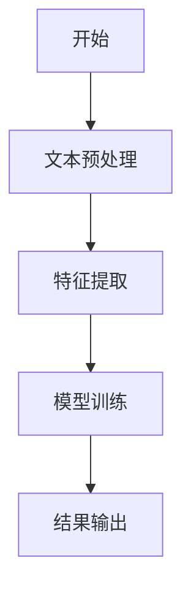
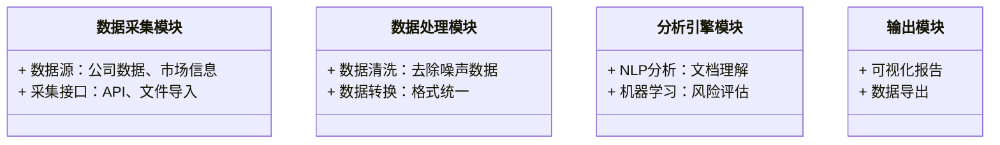
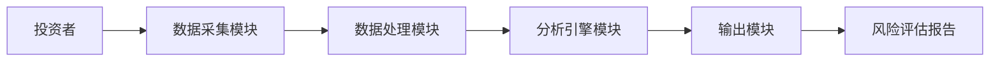
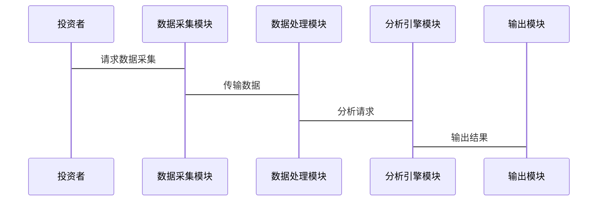

                 


```markdown
# AI驱动的自动化公司尽职调查

> 关键词：AI驱动、公司尽职调查、自动化、数据挖掘、风险评估、自然语言处理、机器学习

> 摘要：本文深入探讨了AI驱动的自动化公司尽职调查的核心概念、技术原理和系统架构，结合实际案例分析，展示了如何利用AI技术提升尽职调查的效率和准确性。文章从背景介绍、核心概念、算法原理到系统设计和项目实战，详细阐述了AI在公司尽职调查中的应用，并提供了最佳实践和未来研究方向的展望。

---

## 第一部分: AI驱动的自动化公司尽职调查基础

### 第1章: 公司尽职调查概述

#### 1.1 问题背景与目标
##### 1.1.1 传统公司尽职调查的痛点
- 数据收集耗时且成本高
- 信息来源分散，难以整合
- 人工分析容易出错，且效率低下
- 传统方法难以应对海量数据
- 风险评估缺乏动态性和实时性

##### 1.1.2 AI驱动的自动化调查的核心目标
- 提高数据收集和处理的效率
- 利用AI技术实现智能分析和预测
- 提供实时动态的风险评估
- 降低尽职调查的成本和时间

##### 1.1.3 问题解决的边界与外延
- 边界：专注于自动化数据处理和智能分析
- 外延：涵盖从数据采集到风险评估的全流程

#### 1.2 核心概念与联系
##### 1.2.1 AI驱动的公司尽职调查的核心要素
| 核心要素 | 描述 |
|----------|------|
| 数据源   | 包括公司财务数据、市场信息、新闻报道等 |
| AI算法   | 包括NLP、机器学习等技术 |
| 风险评估 | 基于算法的分析结果，生成风险评分 |

##### 1.2.2 核心概念属性对比表
| 对比维度 | 传统尽职调查 | AI驱动尽职调查 |
|----------|--------------|----------------|
| 数据来源 | 依赖人工收集 | 自动化数据采集 |
| 分析方式 | 依赖人工分析 | 智能算法分析 |
| 输出结果 | 静态报告 | 动态风险评估 |

##### 1.2.3 ER实体关系图（使用Mermaid流程图）

```mermaid
erDiagram
    actor 投资者
    actor 律师
    actor 审计师
    entity 公司数据
    entity 市场信息
    entity 财务数据
    entity 风险评估
    投资者 --> 公司数据: 查询
    投资者 --> 市场信息: 分析
    投资者 --> 财务数据: 审核
    投资者 --> 风险评估: 生成
    律师 --> 公司数据: 验证
    审计师 --> 财务数据: 核查
```

---

### 第2章: AI驱动的自动化公司尽职调查技术基础

#### 2.1 自然语言处理（NLP）在尽职调查中的应用
##### 2.1.1 NLP的核心原理
- 文本预处理：分词、去除停用词
- 特征提取：词袋模型、TF-IDF
- 模型训练：文本分类、情感分析

##### 2.1.2 NLP在文档分析中的流程图（Mermaid）



#### 2.2 机器学习模型在风险评估中的应用
##### 2.2.1 机器学习算法的选择与优化
- 算法选择：随机森林、支持向量机（SVM）
- 超参数优化：网格搜索、交叉验证

##### 2.2.2 风险评估模型的数学公式

$$
风险评分 = \alpha \cdot 财务指标 + \beta \cdot 市场指标 + \gamma \cdot 经营指标
$$

---

### 第3章: AI驱动的公司尽职调查系统架构设计

#### 3.1 系统功能模块设计
##### 3.1.1 数据采集模块（Mermaid类图）



#### 3.2 系统架构设计
##### 3.2.1 系统架构图（Mermaid架构图）



#### 3.3 系统接口设计
##### 3.3.1 系统交互流程（Mermaid序列图）



---

## 第二部分: AI驱动的公司尽职调查系统实现与应用

### 第4章: 项目实战

#### 4.1 环境安装与配置
##### 4.1.1 安装Python和相关库
```bash
pip install numpy pandas scikit-learn spacy
```

#### 4.2 系统核心代码实现
##### 4.2.1 数据采集模块的实现
```python
import requests

def fetch_data(api_key):
    url = f'https://api.example.com/company-info?api_key={api_key}'
    response = requests.get(url)
    return response.json()
```

##### 4.2.2 风险评估模型的实现
```python
from sklearn.ensemble import RandomForestClassifier

def train_model(data):
    X = data.drop('label', axis=1)
    y = data['label']
    model = RandomForestClassifier().fit(X, y)
    return model
```

#### 4.3 实际案例分析与解读
##### 4.3.1 案例分析
- 数据来源：公司财务数据、市场新闻、行业报告
- 分析过程：文本预处理、特征提取、模型训练、结果输出
- 结果解读：风险评分、关键指标分析

#### 4.4 系统优化与改进
##### 4.4.1 系统性能优化
- 数据预处理的优化
- 模型训练的优化

##### 4.4.2 系统功能扩展
- 实时数据监控
- 多维度风险分析

---

## 第三部分: 总结与展望

### 第5章: 最佳实践与小结

#### 5.1 最佳实践
- 数据质量的重要性
- 模型的可解释性
- 系统的可扩展性

#### 5.2 小结
- AI驱动的自动化公司尽职调查的优势
- 系统实现的关键点
- 未来研究方向

### 第6章: 注意事项与拓展阅读

#### 6.1 注意事项
- 数据隐私与安全
- 算法的可解释性
- 系统的维护与更新

#### 6.2 拓展阅读
- 推荐书籍：《机器学习实战》、《自然语言处理入门》
- 推荐论文：相关领域的最新研究

---

## 作者：AI天才研究院/AI Genius Institute & 禅与计算机程序设计艺术/Zen And The Art of Computer Programming
```

