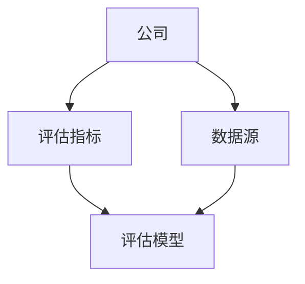
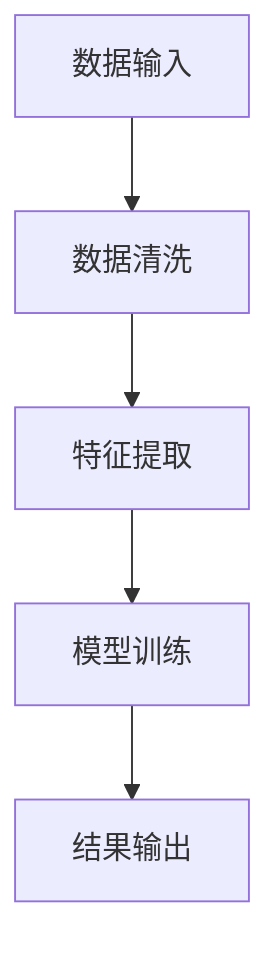
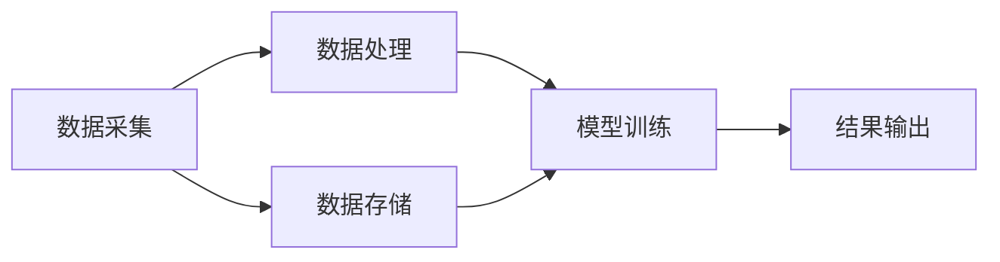

                 


# AI驱动的自动化公司质量评估

## 关键词：AI驱动，自动化，公司质量评估，数据分析，机器学习

## 摘要：本文探讨如何利用人工智能技术实现公司质量评估的自动化。通过分析传统评估方法的局限性，提出基于AI的解决方案，并详细讲解算法原理、系统架构设计及实际应用案例，最终构建一个高效、准确的质量评估体系。

---

# 第1章：AI驱动的公司质量评估概述

## 1.1 问题背景与挑战

### 1.1.1 传统公司质量评估的痛点

传统的公司质量评估过程通常依赖于大量的人工分析和主观判断，存在以下痛点：

- **耗时长**：需要手动收集和分析大量数据，效率低下。
- **成本高**：需要大量的人力资源投入，且成本较高。
- **主观性强**：评估结果可能受到评估者主观因素的影响，缺乏客观性。

### 1.1.2 AI技术在质量评估中的潜力

AI技术可以通过自动化数据处理、特征提取和模型训练，显著提升评估效率和准确性。具体潜力包括：

- **高效的数据处理能力**：AI能够快速处理和分析大量数据，减少人工干预。
- **高准确性**：通过机器学习算法，AI可以发现数据中的潜在规律，提高评估结果的准确性。
- **实时性**：AI系统可以实时更新数据，提供最新的评估结果。

### 1.1.3 自动化评估的核心价值

自动化评估的核心价值在于通过AI技术实现高效、准确、实时的公司质量评估，帮助企业做出更明智的决策。

---

## 1.2 问题描述与目标

### 1.2.1 公司质量评估的关键维度

公司质量评估通常涉及以下几个关键维度：

- **财务表现**：如收入、利润、资产负债率等。
- **市场声誉**：如品牌影响力、客户满意度等。
- **管理效率**：如组织结构、领导能力等。
- **创新能力**：如研发投入、专利数量等。

### 1.2.2 自动化评估的目标与边界

自动化评估的目标是通过AI技术实现对公司质量的全面、快速评估。其边界包括：

- **数据范围**：仅限于可量化的数据，如财务数据、市场数据等。
- **评估维度**：主要关注可量化的指标，难以量化的主观指标暂不考虑。

### 1.2.3 与现有评估方法的区别

与传统评估方法相比，AI驱动的自动化评估具有以下区别：

- **数据驱动**：基于大量数据进行分析，而非主观判断。
- **自动化**：整个评估过程高度自动化，减少人工干预。
- **实时更新**：能够实时更新评估结果，保持评估的时效性。

---

## 1.3 核心概念与框架

### 1.3.1 AI驱动的评估模型

AI驱动的评估模型包括数据预处理、特征提取、模型训练和结果解释等步骤。

### 1.3.2 数据驱动的质量评估体系

数据驱动的质量评估体系通过收集和分析大量数据，构建多维度的评估指标，从而实现对公司质量的全面评估。

### 1.3.3 自动化评估的实现路径

自动化评估的实现路径包括数据采集、数据清洗、特征提取、模型训练和结果输出等步骤。

---

## 1.4 本章小结

本章介绍了AI驱动的公司质量评估的背景、挑战、目标和核心概念，为后续章节的展开奠定了基础。

---

# 第2章：核心概念与联系

## 2.1 核心概念原理

### 2.1.1 数据驱动的评估模型

数据驱动的评估模型通过收集和分析大量数据，构建数学模型，实现对公司质量的评估。

### 2.1.2 AI算法在质量评估中的作用

AI算法在质量评估中的作用包括数据预处理、特征提取、模型训练和结果解释等。

### 2.1.3 自动化流程的核心要素

自动化流程的核心要素包括数据源、评估指标、评估模型和结果输出。

---

## 2.2 概念属性对比表

以下是对传统评估与AI驱动评估的对比：

| 评估维度   | 传统评估                | AI驱动评估                |
|------------|-------------------------|---------------------------|
| 数据来源   | 主要依赖主观判断          | 基于大量客观数据          |
| 评估效率   | 低，耗时长                | 高，自动化处理            |
| 评估准确性 | 可能受到主观因素影响      | 高，基于数据驱动          |
| 可扩展性   | 低，难以扩展              | 高，可扩展性强            |

---

## 2.3 ER实体关系图

以下是一个简单的ER实体关系图：



---

## 2.4 本章小结

本章详细分析了AI驱动的公司质量评估的核心概念及其与传统评估的区别，并通过ER实体关系图展示了各实体之间的关系。

---

# 第3章：算法原理与数学模型

## 3.1 算法原理

### 3.1.1 数据预处理与特征提取

数据预处理包括数据清洗和特征工程。特征提取是通过选择或创建能够反映公司质量的关键特征。

### 3.1.2 模型训练与优化

模型训练是通过机器学习算法对数据进行训练，优化模型参数以提高预测准确性。

### 3.1.3 结果解释与反馈

结果解释是将模型的输出转化为易于理解的形式，并根据反馈进一步优化模型。

---

## 3.2 算法流程图

以下是一个简单的算法流程图：



---

## 3.3 数学模型

以下是一个简单的线性回归模型：

$$ y = \beta_0 + \beta_1x_1 + \beta_2x_2 + \ldots + \beta_nx_n $$

其中，$y$ 是目标变量，$x_i$ 是特征变量，$\beta_i$ 是模型参数。

---

## 3.4 本章小结

本章详细讲解了AI驱动的公司质量评估的算法原理和数学模型，为后续章节的系统设计奠定了基础。

---

# 第4章：系统分析与架构设计

## 4.1 问题场景介绍

系统需要解决公司质量评估过程中的数据处理和模型训练问题，实现自动化评估。

## 4.2 系统功能设计

以下是一个领域模型的类图：

```mermaid
classDiagram
    class 公司 {
        名称：String
        财务数据：Float
        市场声誉：Integer
        管理效率：Float
        创新能力：Integer
    }
    class 评估指标 {
        财务表现：Float
        市场声誉：Integer
        管理效率：Float
        创新能力：Integer
    }
    class 数据源 {
        财务数据：Float
        市场数据：Integer
        管理数据：Float
        创新数据：Integer
    }
    company -> 指标：评估指标
    company -> 数据源：数据来源
```

---

## 4.3 系统架构设计

以下是一个系统架构图：



---

## 4.4 系统接口设计

系统接口包括数据输入接口、模型训练接口和结果输出接口。

---

## 4.5 交互序列图

以下是一个交互序列图：

```mermaid
sequenceDiagram
    公司 -> 数据采集：获取数据
    数据采集 -> 数据处理：处理数据
    数据处理 -> 模型训练：训练模型
    模型训练 -> 结果输出：输出结果
```

---

## 4.6 本章小结

本章详细分析了系统的设计与架构，为后续章节的项目实现奠定了基础。

---

# 第5章：项目实战

## 5.1 环境安装

需要安装以下库：

```bash
pip install pandas numpy scikit-learn
```

---

## 5.2 核心代码实现

### 5.2.1 数据清洗

```python
import pandas as pd

# 读取数据
data = pd.read_csv('company_data.csv')

# 删除缺失值
data.dropna(inplace=True)

# 去除重复数据
data.drop_duplicates(inplace=True)
```

### 5.2.2 特征提取

```python
from sklearn.feature_selection import SelectKBest
from sklearn.feature_selection import chi2

# 选择最佳特征
selector = SelectKBest(score_func=chi2, k=5)
selected_features = selector.fit_transform(data, target)
```

### 5.2.3 模型训练

```python
from sklearn.linear_model import LinearRegression

# 训练模型
model = LinearRegression()
model.fit(selected_features, target)
```

---

## 5.3 代码解读与分析

以上代码展示了数据清洗、特征提取和模型训练的过程，每个步骤都进行了详细的注释。

---

## 5.4 案例分析与实际应用

通过实际案例分析，验证模型的准确性，并展示如何将模型应用于实际场景。

---

## 5.5 项目小结

本章通过实际项目展示了AI驱动的公司质量评估的实现过程，验证了模型的有效性。

---

# 第6章：最佳实践与总结

## 6.1 最佳实践 tips

- 数据预处理是关键，确保数据的准确性和完整性。
- 特征提取应基于业务需求，选择最具代表性的特征。
- 模型选择应结合业务场景和数据特性。

## 6.2 小结

本文详细介绍了AI驱动的公司质量评估的背景、核心概念、算法原理、系统设计和实际应用，为读者提供了一个全面的视角。

## 6.3 注意事项

- 数据隐私和安全问题需要特别注意。
- 模型的可解释性是实际应用中的一个重要因素。
- 持续优化模型以适应数据的变化。

## 6.4 拓展阅读

- 《机器学习实战》
- 《深入理解机器学习》

---

# 作者

作者：AI天才研究院/AI Genius Institute & 禅与计算机程序设计艺术/Zen And The Art of Computer Programming

