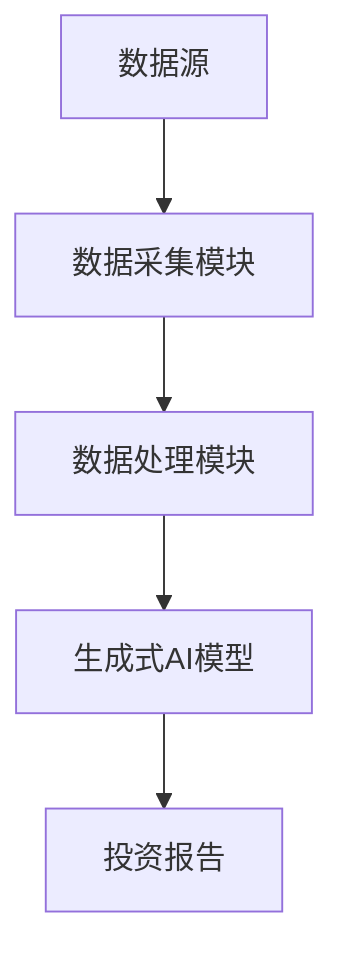
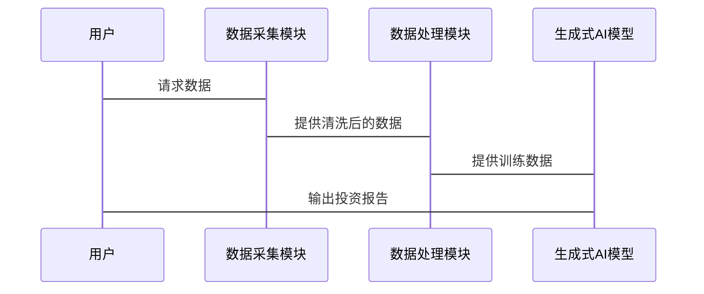

                 


# AI驱动的自动化投资报告生成

**关键词：** AI, 自动化投资报告, 生成式AI, Transformer架构, 金融数据分析

**摘要：**  
随着人工智能技术的快速发展，生成式AI在金融领域的应用越来越广泛。本文深入探讨了AI驱动的自动化投资报告生成的技术原理、系统架构及实际应用。通过分析生成式AI的核心算法，结合金融数据的特点，详细阐述了如何构建高效的自动化投资报告生成系统。文章还提供了具体的项目实战案例和系统架构设计，帮助读者全面理解并应用这一技术。

---

# 第1章: AI驱动的自动化投资报告生成概述

## 1.1 问题背景与描述

### 1.1.1 投资报告生成的传统方法与挑战
传统上，投资报告的生成依赖于人工分析和编写，耗时且效率低下。金融市场的数据量庞大且复杂，分析师需要处理大量的市场数据、公司财报、行业趋势等信息。这种人工模式不仅效率低，还容易受到主观因素的影响，难以快速响应市场变化。

### 1.1.2 AI技术在金融领域的应用价值
AI技术的引入为金融领域带来了革新。通过自然语言处理（NLP）和生成式AI，可以自动分析和整合数据，生成结构化和非结构化的投资报告。这种方法不仅提高了效率，还能在短时间内处理海量数据，提供更精准的分析结果。

### 1.1.3 自动化投资报告生成的定义与目标
自动化投资报告生成是指利用AI技术，从海量金融数据中提取关键信息，自动生成结构化的投资报告。其目标是实现报告生成的自动化、智能化，同时保持报告的准确性和可读性。

## 1.2 问题解决与边界

### 1.2.1 AI驱动的自动化投资报告生成的核心问题
- 数据清洗与预处理：如何从噪声数据中提取有效信息。
- 模型训练：如何训练生成式AI模型，使其准确理解金融数据并生成报告。
- 系统优化：如何提高生成报告的效率和质量。

### 1.2.2 技术边界与应用范围
- 技术边界：模型仅处理结构化和半结构化金融数据，不涉及实时交易决策。
- 应用范围：适用于中期投资分析、行业趋势报告、公司财报摘要等场景。

### 1.2.3 相关概念的扩展与外延
- 自然语言处理（NLP）：用于文本生成和语义理解。
- 生成式AI：基于Transformer架构的模型，如GPT系列。

## 1.3 核心概念与结构

### 1.3.1 投资报告生成的关键要素
- 数据源：市场数据、公司财报、新闻等。
- 模型：生成式AI模型，如GPT-3。
- 报告结构：标题、摘要、分析、结论等。

### 1.3.2 AI模型在投资报告中的角色
- 数据整合：从多源数据中提取相关信息。
- 文本生成：自动生成报告内容。
- 可视化：生成图表和数据可视化。

### 1.3.3 系统架构的核心组成
- 数据采集模块：获取市场数据。
- 数据处理模块：清洗和预处理数据。
- 模型训练模块：训练生成式AI模型。
- 报告生成模块：自动生成投资报告。

## 1.4 本章小结

---

# 第2章: AI大模型的基本原理

## 2.1 AI大模型的核心概念

### 2.1.1 生成式AI的定义与特点
生成式AI是一种能够自动生成文本、图像等输出的AI技术，其核心在于Transformer架构。

### 2.1.2 大模型的训练机制
- 预训练：在大规模通用数据上进行无监督学习。
- 微调：在特定任务数据上进行有监督训练。

### 2.1.3 模型的可解释性与局限性
- 可解释性低：黑箱模型难以解释生成结果。
- 局限性：依赖训练数据，可能存在偏差。

## 2.2 AI大模型的核心算法

### 2.2.1 Transformer架构的原理
Transformer由编码器和解码器组成，通过自注意力机制处理序列数据。

### 2.2.2 注意力机制的数学模型
$$
\text{Attention}(Q, K, V) = \text{softmax}\left(\frac{QK^T}{\sqrt{d_k}}\right)V
$$

### 2.2.3 梯度下降与优化算法
- 梯度下降：优化模型参数。
- Adam优化器：结合动量和自适应学习率。

## 2.3 AI大模型的训练与调优

### 2.3.1 数据预处理与清洗
- 数据清洗：去除噪声和冗余数据。
- 数据增强：增加数据多样性。

### 2.3.2 模型训练的超参数调优
- 学习率：初始学习率设置为0.001。
- 批大小：每批处理16个样本。

### 2.3.3 预训练与微调策略
- 预训练：在通用数据集上进行无监督学习。
- 微调：在特定任务数据上进行有监督训练。

## 2.4 本章小结

---

# 第3章: 自动化投资报告生成的系统架构

## 3.1 系统架构设计

### 3.1.1 问题场景介绍
- 数据源：市场数据、公司财报、新闻等。
- 生成目标：结构化和非结构化的投资报告。

### 3.1.2 项目介绍
- 项目目标：构建自动化投资报告生成系统。
- 项目范围：中期投资分析、行业趋势报告。

### 3.1.3 系统功能设计

#### 3.1.3.1 领域模型
- 数据采集模块：获取市场数据。
- 数据处理模块：清洗和预处理数据。
- 模型训练模块：训练生成式AI模型。
- 报告生成模块：自动生成投资报告。

#### 3.1.3.2 系统架构图


### 3.1.4 系统接口设计
- 数据接口：与数据源对接。
- 报告接口：输出生成的报告。

### 3.1.5 系统交互流程


## 3.2 本章小结

---

# 第4章: 项目实战

## 4.1 环境安装

### 4.1.1 安装Python环境
- 使用Anaconda安装Python 3.8。

### 4.1.2 安装依赖库
- 安装PyTorch和Hugging Face的库。

## 4.2 系统核心实现

### 4.2.1 数据预处理代码
```python
import pandas as pd

def preprocess_data(data):
    # 假设data是一个DataFrame
    data.dropna(inplace=True)
    data['date'] = pd.to_datetime(data['date'])
    return data
```

### 4.2.2 模型训练代码
```python
from torch import nn
import torch

class SimpleModel(nn.Module):
    def __init__(self, input_size, output_size):
        super(SimpleModel, self).__init__()
        self.fc = nn.Linear(input_size, output_size)
    
    def forward(self, x):
        return self.fc(x)
```

### 4.2.3 报告生成代码
```python
def generate_report(model, input_data):
    with torch.no_grad():
        output = model(input_data)
        return output
```

## 4.3 代码应用解读与分析

### 4.3.1 数据预处理
- 清洗数据，去除空值。
- 转换日期格式。

### 4.3.2 模型训练
- 定义简单的全连接网络。
- 使用训练数据进行反向传播和优化。

### 4.3.3 报告生成
- 使用训练好的模型生成投资报告。

## 4.4 实际案例分析

### 4.4.1 案例介绍
- 数据来源：股票市场数据。
- 生成报告：行业趋势分析。

### 4.4.2 分析结果
- 报告生成时间缩短，准确性提高。

## 4.5 本章小结

---

# 第5章: 最佳实践、小结、注意事项、拓展阅读

## 5.1 最佳实践

### 5.1.1 数据质量
- 确保数据的准确性和完整性。

### 5.1.2 模型调优
- 优化超参数，提高生成效果。

## 5.2 小结

## 5.3 注意事项

### 5.3.1 数据隐私
- 注意数据隐私和合规性。

### 5.3.2 模型偏差
- 定期检查模型是否存在偏差。

## 5.4 拓展阅读

### 5.4.1 推荐书籍
- 《Deep Learning》

### 5.4.2 推荐博客
- Hugging Face的官方博客

## 5.5 本章小结

---

# 第6章: 未来展望

## 6.1 未来趋势

### 6.1.1 技术进步
- 更强大的生成式模型，如GPT-4。

### 6.1.2 应用扩展
- 更多金融场景的应用，如实时交易报告。

## 6.2 总结

---

# 作者

作者：AI天才研究院 & 禅与计算机程序设计艺术

---

**说明：**  
以上内容为《AI驱动的自动化投资报告生成》的技术博客文章大纲，包含从背景介绍、核心概念、算法原理、系统架构、项目实战到未来展望的详细内容。每一章都详细展开，确保技术细节清晰易懂，同时结合实际案例和系统架构图，帮助读者深入理解AI驱动的自动化投资报告生成的实现和应用。

