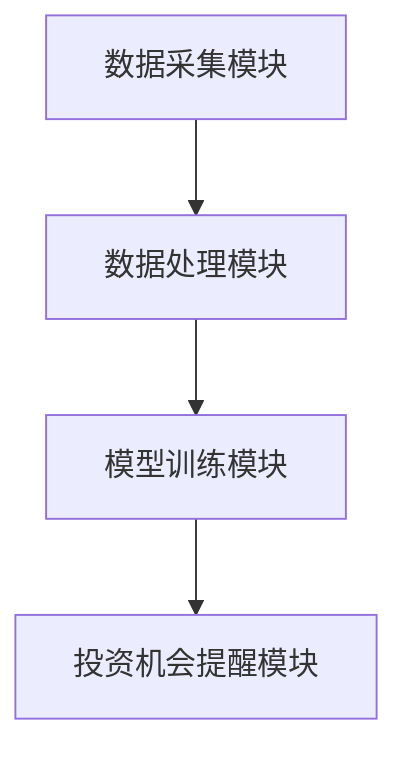

                 


# AI驱动的自动化投资机会提醒

> 关键词：人工智能，投资自动化，机会提醒，机器学习，深度学习，系统架构

> 摘要：本文详细探讨了如何利用人工智能技术实现自动化投资机会提醒系统。从基本概念、算法原理到系统设计和项目实战，全面解析了AI在投资领域的应用，为读者提供了一套完整的解决方案。

---

## 第一部分：AI驱动的自动化投资机会提醒概述

### 第1章：投资自动化与AI的结合

#### 1.1 投资自动化的定义与背景

投资自动化是指通过技术手段，自动完成投资决策、交易执行和风险管理的过程。传统的投资分析依赖于人工判断，效率低且容易受到主观因素的影响。随着AI技术的发展，自动化投资逐渐成为可能。

- **传统投资分析的局限性**：  
  - 数据量大，难以快速处理。  
  - 分析过程主观性强，容易受情绪影响。  
  - 无法及时捕捉市场变化。

- **AI的优势**：  
  - 处理大量数据的能力。  
  - 快速分析和决策的能力。  
  - 模型可以不断优化，适应市场变化。

#### 1.2 AI在投资中的核心作用

- **数据处理**：AI可以快速处理海量数据，提取有用的信息。  
- **预测模型**：通过机器学习和深度学习，AI能够预测市场趋势。  
- **自动化决策**：基于模型预测，AI可以自动触发投资行为。

---

## 第二部分：AI驱动投资机会提醒的核心技术

### 第2章：数据驱动的投资分析

#### 2.1 数据的来源与类型

- **市场数据**：股票价格、成交量、K线图等。  
- **新闻数据**：公司公告、行业动态、经济政策等。  
- **社交媒体数据**：投资者情绪分析。

#### 2.2 数据预处理与特征提取

- **数据清洗**：去除噪声数据，处理缺失值。  
- **特征工程**：提取有用的特征，如动量、相对强弱指数（RSI）等。

### 第3章：AI模型在投资预测中的应用

#### 3.1 机器学习模型

- **线性回归**：用于预测资产的未来价格。  
  $$ y = \beta_0 + \beta_1x_1 + \beta_2x_2 + \ldots + \beta_nx_n $$  
- **支持向量机（SVM）**：适用于分类任务，如判断股票是否会上涨。  
- **随机森林与梯度提升树**：用于分类和回归任务，适合处理高维数据。

#### 3.2 深度学习模型

- **卷积神经网络（CNN）**：适用于处理图像数据，如K线图。  
- **循环神经网络（RNN）**：适用于时间序列数据，如股票价格预测。  
- **Transformer架构**：用于处理长序列数据，提升模型的并行计算能力。

---

## 第三部分：系统架构与实现

### 第4章：系统架构设计

#### 4.1 功能模块划分

- **数据采集模块**：负责收集市场数据。  
- **数据处理模块**：清洗和特征提取。  
- **模型训练模块**：构建和优化预测模型。  
- **投资机会提醒模块**：根据模型预测结果，触发提醒。

#### 4.2 系统架构图



---

### 第5章：项目实战与代码实现

#### 5.1 环境搭建

- **Python环境**：安装Python 3.8及以上版本。  
- **依赖库**：numpy、pandas、scikit-learn、keras等。

#### 5.2 数据采集与处理

```python
import pandas as pd
import numpy as np

# 示例数据：股票价格
data = pd.DataFrame({
    '日期': ['2023-01-01', '2023-01-02', '2023-01-03'],
    '收盘价': [100, 102, 101]
})

# 数据清洗
data.dropna()  # 去除空值
```

#### 5.3 模型训练与优化

```python
from sklearn.linear_model import LinearRegression

# 线性回归模型
model = LinearRegression()
model.fit(X_train, y_train)
```

#### 5.4 投资机会提醒系统实现

```python
import pandas as pd
from sklearn.linear_model import LinearRegression

# 数据预处理
data = pd.read_csv('stock_data.csv')
data.dropna()

# 模型训练
X = data[['开盘价', '收盘价']]
y = data['收盘价'].shift(-1)
model = LinearRegression()
model.fit(X, y)

# 预测未来价格
future_price = model.predict(future_X)
```

---

## 第四部分：系统优化与未来展望

### 第6章：系统优化与扩展

#### 6.1 系统优化

- **算法优化**：尝试不同的模型组合，如集成学习。  
- **数据优化**：引入更多数据源，如新闻和社交媒体数据。  
- **系统性能优化**：提升数据处理速度和模型推理效率。

#### 6.2 未来展望

- **实时监控**：实现24/7的实时监控和提醒。  
- **多市场支持**：扩展到更多金融市场，如外汇和加密货币。  
- **个性化提醒**：根据投资者的风险偏好，定制提醒策略。

---

## 第五部分：总结与注意事项

### 第7章：总结与注意事项

#### 7.1 总结

本文详细介绍了AI驱动的自动化投资机会提醒系统，从理论到实践，为读者提供了一套完整的解决方案。通过AI技术，我们可以更高效、更准确地捕捉投资机会。

#### 7.2 注意事项

- **数据隐私**：处理投资数据时，需注意数据隐私问题。  
- **模型维护**：定期更新模型，以适应市场变化。  
- **风险管理**：自动化投资需结合风险管理策略，避免重大损失。

---

## 作者

作者：AI天才研究院/AI Genius Institute & 禅与计算机程序设计艺术 /Zen And The Art of Computer Programming

