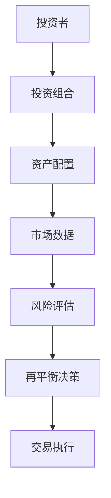
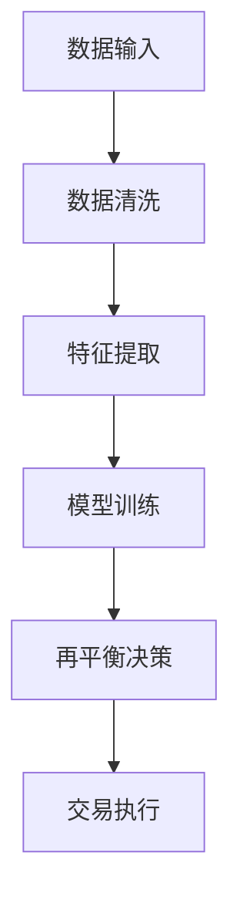
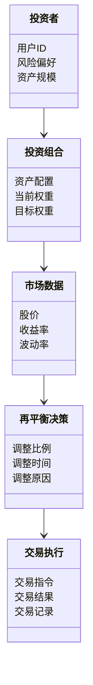

                 


# AI驱动的自动化投资组合再平衡

> 关键词：AI，投资组合，再平衡，自动化，机器学习，量化交易，算法优化

> 摘要：本文详细探讨了AI在投资组合管理中的应用，特别是如何通过自动化再平衡策略优化投资组合的表现。文章从基本概念出发，逐步深入，结合算法原理和系统架构，全面分析AI驱动的投资组合再平衡的实现过程，最后通过实战案例展示其实际应用。

---

## 第一部分: 投资组合再平衡概述

### 第1章: 投资组合再平衡的定义与重要性

#### 1.1 投资组合再平衡的定义

**投资组合**是指将一定资金按照特定比例分配到不同资产类别（如股票、债券、现金等）中，以实现风险分散和收益最大化的一种投资方式。而**再平衡**则是指在市场环境变化、资产价格波动或投资者风险偏好调整的情况下，定期调整投资组合的资产配置，使其回归预定目标的过程。

**为什么需要再平衡？**

1. **市场波动**：不同资产的市场表现差异可能导致初始配置偏离目标。
2. **风险偏好变化**：投资者的财务状况或市场环境变化可能需要调整风险承受能力。
3. **目标变化**：投资目标（如收益目标或期限）的变化需要及时调整配置。

#### 1.2 AI驱动的再平衡的优势

传统的再平衡方法依赖于手动调整或基于固定规则的自动化策略，而AI的引入为再平衡提供了更高效和智能的解决方案。AI可以通过以下方式优化再平衡过程：

1. **数据驱动决策**：利用海量市场数据和投资者行为数据，AI能够识别潜在的市场趋势和投资者需求。
2. **实时优化**：通过机器学习模型，AI可以实时跟踪市场变化，快速调整投资组合配置。
3. **个性化策略**：AI能够根据投资者的具体情况（如风险承受能力、投资目标等）定制化再平衡策略。

#### 1.3 投资组合再平衡的边界与外延

**再平衡的边界条件**：

- 调整范围：仅调整部分资产配置，而非全部。
- 时间频率：定期或不定期的调整。
- 调整幅度：设定最大调整比例，避免过度波动。

**与相关概念的对比**：

| 概念         | 定义                                                                 | 特点                   |
|--------------|----------------------------------------------------------------------|------------------------|
| 资产配置     | 根据投资目标分配资产比例                                                     | 静态调整               |
| 投资组合优化 | 在给定风险下最大化收益或在给定收益下最小化风险                             | 优化模型               |
| 动态再平衡   | 根据市场变化实时调整投资组合配置                                           | 动态、实时              |

---

## 第二部分: AI驱动的自动化投资组合再平衡的核心概念与联系

### 第2章: 核心概念与原理

#### 2.1 AI驱动再平衡的核心概念

**数据驱动的特征**：

- 数据来源：市场数据（如股价、收益率）、投资者行为数据（如交易记录、风险偏好）。
- 数据处理：清洗、特征提取、标准化。

**算法驱动的特征**：

- 算法类型：监督学习（如回归、分类）、无监督学习（如聚类）、强化学习。
- 模型选择：根据问题类型选择合适的算法，如使用随机森林预测市场趋势。

**自适应优化的特征**：

- 优化目标：最大化收益、最小化风险。
- 调整策略：基于实时数据动态优化配置。

#### 2.2 核心概念的属性对比

| 概念         | 数据驱动特征 | 算法驱动特征 | 自适应优化特征 |
|--------------|--------------|--------------|----------------|
| 再平衡目标   | 数据支持      | 算法选择      | 实时优化        |
| 调整频率     | 数据频率      | 算法响应      | 自动调整        |
| 调整幅度     | 数据范围      | 算法决策      | 智能控制        |

#### 2.3 ER实体关系图架构



---

## 第三部分: AI驱动的自动化投资组合再平衡的算法原理

### 第3章: 算法原理与实现

#### 3.1 算法原理概述

**数据预处理**：

1. 数据清洗：去除缺失值、异常值。
2. 特征提取：从市场数据中提取有用的特征，如收益率、波动率。

**模型训练**：

1. 选择算法：根据问题类型选择合适的算法（如使用线性回归预测资产收益）。
2. 模型训练：使用历史数据训练模型，得到最优参数。

**再平衡决策**：

1. 预测市场趋势：基于模型预测结果，调整资产配置比例。
2. 生成交易指令：根据调整比例生成具体的交易指令。

#### 3.2 算法流程图



#### 3.3 算法实现代码

```python
import numpy as np
import pandas as pd
from sklearn.linear_model import LinearRegression

def preprocess_data(data):
    # 数据清洗
    data = data.dropna()
    return data

def extract_features(data):
    # 特征提取
    features = data[['close', 'volume']]
    return features

def train_model(features, target):
    # 模型训练
    model = LinearRegression()
    model.fit(features, target)
    return model

def generate_rebalance_decision(model, current_weights, target_weights):
    # 再平衡决策
    predicted_returns = model.predict(current_weights)
    rebalance_decision = {}
    for i in range(len(predicted_returns)):
        rebalance_decision[i] = predicted_returns[i]
    return rebalance_decision

# 示例数据
data = pd.DataFrame({
    'close': [100, 105, 110, 115, 120],
    'volume': [1000, 900, 1200, 1100, 1300],
    'target': [0.1, 0.2, 0.15, 0.05, 0.3]
})

# 数据预处理
clean_data = preprocess_data(data)
# 特征提取
features = extract_features(clean_data)
# 模型训练
model = train_model(features, clean_data['target'])
# 再平衡决策
current_weights = np.array([0.4, 0.3, 0.2, 0.1])
target_weights = np.array([0.3, 0.4, 0.2, 0.1])
rebalance_decision = generate_rebalance_decision(model, current_weights, target_weights)
```

---

## 第四部分: 系统架构与实现

### 第4章: 系统架构设计

#### 4.1 问题场景介绍

投资组合再平衡系统需要实时处理大量市场数据，快速生成再平衡决策，并执行交易指令。系统需要具备高可用性和实时性。

#### 4.2 项目介绍

本系统旨在利用AI技术实现投资组合的自动化再平衡，优化投资组合的风险收益比。

#### 4.3 系统功能设计



---

## 第五部分: 项目实战与高级主题

### 第5章: 项目实战

#### 5.1 环境安装

安装必要的库：

```bash
pip install numpy pandas scikit-learn
```

#### 5.2 系统核心实现

```python
import numpy as np
import pandas as pd
from sklearn.linear_model import LinearRegression

class InvestmentPortfolio:
    def __init__(self, initial_weights, target_weights):
        self.initial_weights = initial_weights
        self.target_weights = target_weights
        self.model = LinearRegression()
    
    def preprocess_data(self, data):
        data = data.dropna()
        return data
    
    def extract_features(self, data):
        features = data[['close', 'volume']]
        return features
    
    def train_model(self, features, target):
        self.model.fit(features, target)
        return self.model
    
    def generate_rebalance_decision(self, current_weights):
        predicted_returns = self.model.predict(current_weights)
        rebalance_decision = {}
        for i in range(len(predicted_returns)):
            rebalance_decision[i] = predicted_returns[i]
        return rebalance_decision

# 示例使用
initial_weights = np.array([0.4, 0.3, 0.2, 0.1])
target_weights = np.array([0.3, 0.4, 0.2, 0.1])
data = pd.DataFrame({
    'close': [100, 105, 110, 115, 120],
    'volume': [1000, 900, 1200, 1100, 1300],
    'target': [0.1, 0.2, 0.15, 0.05, 0.3]
})
portfolio = InvestmentPortfolio(initial_weights, target_weights)
clean_data = portfolio.preprocess_data(data)
features = portfolio.extract_features(clean_data)
portfolio.train_model(features, clean_data['target'])
rebalance_decision = portfolio.generate_rebalance_decision(initial_weights)
```

---

## 第六部分: 结语

### 6.1 小结

AI驱动的自动化投资组合再平衡通过实时数据分析和智能决策，显著提升了投资组合管理的效率和效果。本文从基本概念到算法实现，再到系统架构，全面阐述了AI在投资组合再平衡中的应用。

### 6.2 注意事项

1. **数据质量**：确保数据来源可靠，避免噪声干扰。
2. **模型选择**：根据具体问题选择合适的算法，避免过度拟合。
3. **风险管理**：再平衡过程中需严格控制风险，避免过大波动。

### 6.3 未来展望

随着AI技术的不断发展，投资组合再平衡将更加智能化和个性化。未来，可以探索更复杂的模型（如深度学习）和更高效的算法，以应对更复杂的市场环境。

---

作者：AI天才研究院/AI Genius Institute & 禅与计算机程序设计艺术 /Zen And The Art of Computer Programming

