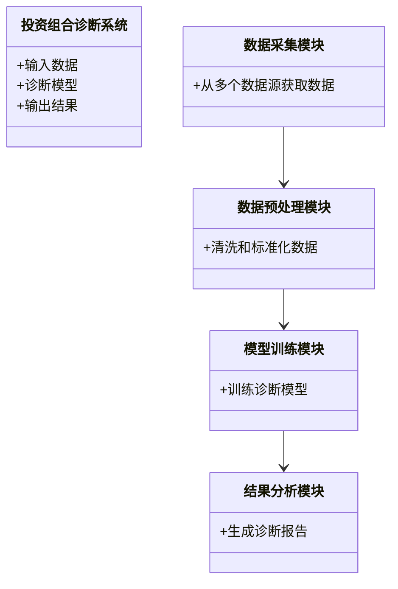
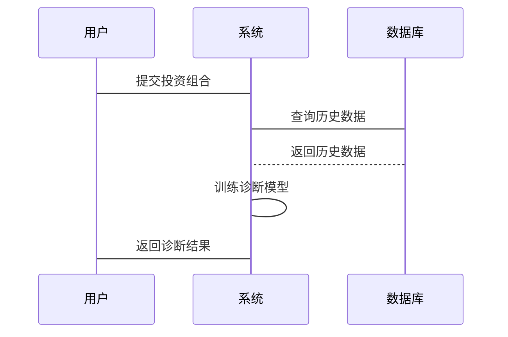

                 


# AI驱动的自动化投资组合诊断

关键词：AI，投资组合诊断，自动化，机器学习，金融分析，风险管理

摘要：本文详细探讨了如何利用人工智能技术实现投资组合的自动化诊断。通过分析投资组合的风险、收益和市场动态，结合机器学习、自然语言处理和强化学习等技术，提出了一种高效的自动化诊断方法。文章内容包括投资组合诊断的核心概念、AI技术的基础、具体算法的实现、系统架构设计以及项目实战案例，旨在为读者提供全面的技术指导和实践参考。

---

# 第1章: AI驱动的自动化投资组合诊断概述

## 1.1 投资组合诊断的背景与意义

### 1.1.1 投资组合诊断的定义与作用
投资组合诊断是通过对资产组合的构成、风险和收益进行分析，评估其在市场中的表现，并提出优化建议的过程。其作用在于帮助投资者识别潜在风险，优化资产配置，提升投资回报。

### 1.1.2 传统投资组合诊断的局限性
传统方法依赖人工分析，耗时且容易受主观因素影响。随着市场数据的爆炸式增长，传统方法难以高效处理复杂场景。

### 1.1.3 AI技术在投资组合诊断中的价值
AI技术能够快速处理海量数据，发现隐藏的模式，提供精准的诊断结果，显著提高了投资组合诊断的效率和准确性。

## 1.2 AI驱动的自动化投资组合诊断的核心概念

### 1.2.1 自动化投资组合诊断的定义
通过AI技术自动完成投资组合的数据分析、风险评估和优化建议的过程。

### 1.2.2 AI在投资组合诊断中的应用场景
包括风险预测、资产配置优化、市场趋势分析等。

### 1.2.3 投资组合诊断的流程与步骤
数据采集、特征提取、模型训练、结果分析与反馈。

## 1.3 本书的核心内容与目标

### 1.3.1 本书的主要内容
涵盖投资组合诊断的基础知识、AI技术的应用、具体算法的实现、系统架构设计和项目实战案例。

### 1.3.2 本书的目标读者
面向金融从业者、数据科学家、技术开发者以及对AI驱动的投资组合诊断感兴趣的研究者。

### 1.3.3 本书的组织结构
从概述到核心概念，再到算法实现和系统设计，最后通过项目实战和高级主题深入探讨。

## 1.4 本章小结

---

# 第2章: 投资组合诊断的核心概念与原理

## 2.1 投资组合诊断的基本原理

### 2.1.1 投资组合的风险与收益分析
风险与收益是投资组合诊断的核心指标，通过分析这两者的关系，可以评估投资组合的健康状况。

### 2.1.2 投资组合的构成要素
包括资产种类、权重分配、市场波动性等。

### 2.1.3 投资组合诊断的关键指标
如夏普比率、最大回撤、波动率等。

## 2.2 AI驱动的自动化诊断流程

### 2.2.1 数据采集与预处理
从多个数据源获取市场数据，清洗和标准化处理。

### 2.2.2 数据特征提取
提取有用的特征，如动量、相对强弱等。

### 2.2.3 模型训练与优化
使用机器学习模型进行训练，并通过交叉验证优化模型。

### 2.2.4 结果分析与反馈
生成诊断报告，并根据结果调整投资策略。

## 2.3 投资组合诊断的核心算法

### 2.3.1 回归分析
用于预测投资组合的未来表现。

### 2.3.2 聚类分析
用于识别市场中的相似资产。

### 2.3.3 时间序列分析
用于分析投资组合的历史表现和趋势。

### 2.3.4 强化学习在投资组合诊断中的应用
通过强化学习优化资产配置。

## 2.4 本章小结

---

# 第3章: AI技术在投资组合诊断中的应用基础

## 3.1 机器学习在投资组合诊断中的应用

### 3.1.1 监督学习在投资组合预测中的应用
如线性回归、支持向量机用于预测资产价格。

### 3.1.2 非监督学习在投资组合分析中的应用
如聚类分析用于识别市场中的相似资产。

### 3.1.3 半监督学习在投资组合诊断中的应用
结合少量标注数据和大量无标签数据进行分析。

## 3.2 自然语言处理在投资组合诊断中的应用

### 3.2.1 文本数据的特征提取
从新闻、报告中提取情感指标。

### 3.2.2 基于NLP的情感分析在投资组合诊断中的应用
分析市场情绪对投资组合的影响。

### 3.2.3 基于NLP的市场情绪分析
实时监控市场情绪变化，辅助投资决策。

## 3.3 强化学习在投资组合优化中的应用

### 3.3.1 强化学习的基本原理
通过试错机制优化资产配置。

### 3.3.2 强化学习在投资组合优化中的应用
设计状态、动作和奖励函数，优化投资组合的收益和风险。

### 3.3.3 强化学习的挑战与解决方案
如高维状态空间的处理。

## 3.4 时间序列分析在投资组合诊断中的应用

### 3.4.1 时间序列分析的基本原理
分析数据的时序特征，如趋势、周期性。

### 3.4.2 时间序列分析在投资组合预测中的应用
预测资产价格和市场趋势。

### 3.4.3 时间序列分析的挑战与解决方案
如处理缺失数据和异常值。

## 3.5 本章小结

---

# 第4章: 投资组合诊断的算法原理与实现

## 4.1 回归分析的原理与实现

### 4.1.1 线性回归的原理
通过最小二乘法拟合数据，预测投资组合的收益。

### 4.1.2 线性回归的实现步骤
数据预处理、模型训练、评估与优化。

### 4.1.3 线性回归的优缺点
优点：简单易懂；缺点：假设变量之间线性关系。

### 4.1.4 示例代码
```python
import numpy as np
from sklearn.linear_model import LinearRegression

# 示例数据
X = np.array([[1], [2], [3], [4], [5]])
y = np.array([2, 4, 5, 4, 6])

# 训练模型
model = LinearRegression()
model.fit(X, y)

# 预测
print(model.predict([[6]]))
```

## 4.2 聚类分析的原理与实现

### 4.2.1 聚类分析的基本原理
通过相似性度量将数据点分组，识别市场中的相似资产。

### 4.2.2 K-means算法的实现步骤
数据预处理、选择K值、初始化质心、迭代优化。

### 4.2.3 聚类分析的优缺点
优点：发现数据分布模式；缺点：依赖初始参数。

### 4.2.4 示例代码
```python
from sklearn.cluster import KMeans

# 示例数据
X = np.array([[1, 2], [3, 4], [5, 6], [7, 8], [9, 10]])

# 训练模型
model = KMeans(n_clusters=2)
model.fit(X)

# 获取聚类结果
print(model.labels_)
```

## 4.3 时间序列分析的原理与实现

### 4.3.1 时间序列分析的基本原理
分析数据的时序特征，如趋势、周期性。

### 4.3.2 ARIMA模型的实现步骤
数据预处理、模型参数选择、模型训练、预测与评估。

### 4.3.3 时间序列分析的优缺点
优点：适合预测有时间依赖性的数据；缺点：对异常值敏感。

### 4.3.4 示例代码
```python
from statsmodels.tsa.arima_model import ARIMA

# 示例数据
data = [1, 2, 3, 4, 5]

# 训练模型
model = ARIMA(data, order=(1, 1, 0))
model_fit = model.fit()

# 预测
print(model_fit.forecast(1))
```

## 4.4 本章小结

---

# 第5章: 投资组合诊断的系统架构与设计

## 5.1 系统功能设计

### 5.1.1 领域模型设计
使用Mermaid类图展示系统模块之间的关系。



### 5.1.2 系统架构设计
使用Mermaid架构图展示系统的分层架构。


### 5.1.3 系统接口设计
定义系统接口，如API接口。

### 5.1.4 系统交互设计
使用Mermaid序列图展示用户与系统的交互流程。



## 5.2 本章小结

---

# 第6章: 项目实战——基于AI的投资组合诊断系统

## 6.1 项目环境搭建

### 6.1.1 安装必要的库
如numpy、pandas、scikit-learn、statsmodels等。

## 6.2 系统核心实现

### 6.2.1 数据采集与预处理
从API获取市场数据，清洗和标准化。

### 6.2.2 模型训练与优化
选择合适的算法，训练并优化模型。

### 6.2.3 结果分析与报告生成
生成诊断报告，可视化投资组合的风险和收益。

## 6.3 代码实现与解读

### 6.3.1 数据采集模块
```python
import requests

def get_market_data(ticker):
    url = f"https://api.example.com/stock/{ticker}"
    response = requests.get(url)
    return response.json()
```

### 6.3.2 数据预处理模块
```python
import pandas as pd

def preprocess_data(data):
    df = pd.DataFrame(data)
    df = df.dropna()
    return df
```

### 6.3.3 模型训练模块
```python
from sklearn.linear_model import LinearRegression

def train_model(X, y):
    model = LinearRegression()
    model.fit(X, y)
    return model
```

### 6.3.4 结果分析模块
```python
def generate_report(model, X_test, y_test):
    y_pred = model.predict(X_test)
    report = pd.DataFrame({'预测值': y_pred, '实际值': y_test})
    return report
```

## 6.4 实际案例分析

### 6.4.1 数据来源与预处理
使用真实市场数据进行分析。

### 6.4.2 模型训练与优化
通过交叉验证优化模型参数。

### 6.4.3 结果分析与解读
生成诊断报告，分析投资组合的风险和收益。

## 6.5 本章小结

---

# 第7章: 高级主题与最佳实践

## 7.1 前沿技术与未来趋势

### 7.1.1 多模态数据的融合
结合文本、图像等多种数据源进行分析。

### 7.1.2 可解释性AI在投资组合诊断中的应用
提高模型的可解释性，增强用户信任。

## 7.2 模型调优与优化

### 7.2.1 超参数优化
使用网格搜索或随机搜索优化模型参数。

### 7.2.2 模型集成
通过集成学习提升诊断准确率。

## 7.3 风险管理与控制

### 7.3.1 风险预警机制
实时监控市场风险，及时调整投资策略。

### 7.3.2 风险对冲策略
利用衍生工具对冲投资组合的系统性风险。

## 7.4 最佳实践 tips

### 7.4.1 数据质量的重要性
确保数据的准确性和完整性。

### 7.4.2 模型选择的策略
根据具体场景选择合适的算法。

### 7.4.3 持续学习与优化
定期更新模型，适应市场变化。

## 7.5 本章小结

---

# 第8章: 总结与展望

## 8.1 本书的核心内容回顾

## 8.2 未来的研究方向

### 8.2.1 更高级的AI算法
如深度学习、生成对抗网络等。

### 8.2.2 多模态数据的应用
结合更多数据源进行分析。

## 8.3 对读者的建议

### 8.3.1 持续学习
关注AI和金融领域的最新进展。

### 8.3.2 实践操作
通过项目实战提升技能。

## 8.4 作者寄语

---

# 作者：AI天才研究院/AI Genius Institute & 禅与计算机程序设计艺术 /Zen And The Art of Computer Programming

