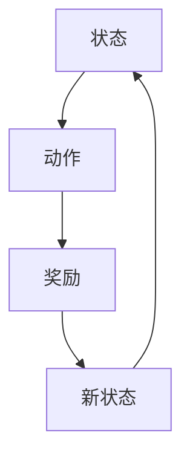
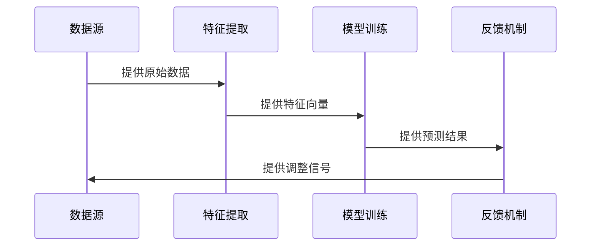

                 


```markdown
# AI驱动的自适应价值投资模型

**关键词**：AI, 价值投资, 自适应模型, 强化学习, 算法, 金融分析

**摘要**：本文探讨了AI技术在金融投资中的应用，特别是如何构建自适应价值投资模型。通过分析传统投资的局限性，提出利用机器学习和强化学习算法，设计一种能够实时调整投资策略的模型。文章详细讲解了模型的核心概念、算法原理、系统架构，并通过实战案例展示了模型的应用，最后给出了最佳实践建议。

---

# 第一章: 背景介绍

## 1.1 问题背景

### 1.1.1 传统价值投资的局限性
传统价值投资依赖于对市场、行业和公司的深入分析，但这种方法存在以下问题：
- 数据处理能力有限，难以实时适应市场变化。
- 依赖主观判断，可能导致决策偏差。
- 稳定性不足，市场波动时表现不稳定。

### 1.1.2 AI技术在金融领域的应用现状
AI技术在金融领域的应用日益广泛，包括：
- 自动化交易系统
- 风险评估与管理
- 市场预测与趋势分析

### 1.1.3 自适应投资模型的必要性
随着市场环境的复杂化，传统模型难以满足动态调整的需求，自适应模型应运而生，能够根据市场反馈实时优化投资策略。

## 1.2 问题描述

### 1.2.1 价值投资的核心要素
价值投资关注于公司的基本面，包括市盈率、市净率、ROE等指标。

### 1.2.2 现有模型的不足
传统模型难以应对市场波动和数据量的激增，缺乏灵活性和适应性。

### 1.2.3 自适应价值投资模型的目标
通过AI技术，构建能够实时调整投资策略，优化投资组合的自适应模型。

## 1.3 问题解决

### 1.3.1 AI驱动的解决方案
利用机器学习和强化学习，构建动态调整的投资模型。

### 1.3.2 自适应模型的优势
能够根据市场变化快速调整，提高投资效率和收益。

### 1.3.3 技术实现路径
通过数据收集、特征提取、模型训练和实时反馈，实现模型的自适应调整。

## 1.4 边界与外延

### 1.4.1 自适应模型的适用范围
适用于股票、基金等金融资产的长期投资策略。

### 1.4.2 模型的边界条件
数据质量和完整性、市场环境的稳定性、监管政策的变化。

### 1.4.3 与其他投资模型的区分
与传统模型相比，自适应模型更具灵活性和实时性。

## 1.5 概念结构与核心要素

### 1.5.1 核心概念的层次结构
1. 数据流与特征提取
2. 模型训练与优化
3. 反馈机制与自适应调整

### 1.5.2 核心要素的定义与关系
- 数据流：输入数据的流动和处理。
- 特征提取：从数据中提取关键特征。
- 模型训练：利用特征训练模型。
- 反馈机制：根据结果调整模型参数。

### 1.5.3 模型的输入输出关系
- 输入：市场数据、公司基本面数据。
- 输出：投资策略、投资组合调整建议。

---

# 第二章: 核心概念与联系

## 2.1 自适应价值投资模型的原理

### 2.1.1 数据流与特征提取
- 数据来源：市场数据、公司财报、行业报告。
- 特征提取：市盈率、市净率、ROE、历史价格波动等。

### 2.1.2 模型训练与优化
- 使用机器学习算法，如随机森林、神经网络，训练模型。
- 通过强化学习优化模型参数。

### 2.1.3 反馈机制与自适应调整
- 根据实际投资结果反馈，调整模型参数和策略。

## 2.2 核心概念属性特征对比表

| 核心概念 | 输入特征 | 输出特征 | 自适应机制 |
|----------|----------|----------|------------|
| 数据流   | 市场数据 | 模型参数 | 动态调整    |
| 特征提取 | 历史价格 | 关键指标 | 实时更新    |
| 模型训练 | 参数调整 | 预测结果 | 自动优化    |

## 2.3 ER实体关系

```mermaid
erd
    数据流 --|> 特征提取: 提供数据
    特征提取 --|> 模型训练: 提供特征
    模型训练 --|> 反馈机制: 提供预测结果
    反馈机制 --|> 数据流: 提供调整信号
```

---

# 第三章: 算法原理

## 3.1 强化学习算法原理

### 3.1.1 算法步骤



### 3.1.2 数学公式

$$ Q(s,a) = Q(s,a) + \alpha (r + \max Q(s',a') - Q(s,a)) $$

### 3.1.3 Python代码示例

```python
class Agent:
    def __init__(self, state_space, action_space):
        self.state_space = state_space
        self.action_space = action_space
        self.Q = defaultdict(lambda: defaultdict(float))
    
    def get_action(self, state):
        max_action = max(self.Q[state].items(), key=lambda x: x[1])[0]
        return max_action
    
    def update_Q(self, state, action, reward, next_state):
        current_Q = self.Q[state][action]
        next_max_Q = max(self.Q[next_state].values()) if next_state in self.Q else 0
        new_Q = current_Q + alpha * (reward + gamma * next_max_Q - current_Q)
        self.Q[state][action] = new_Q
```

---

# 第四章: 系统分析与架构设计

## 4.1 系统应用场景

### 4.1.1 问题场景介绍
实时监控市场数据，动态调整投资组合。

### 4.1.2 项目介绍
构建一个基于强化学习的自适应投资模型。

## 4.2 系统功能设计

### 4.2.1 领域模型


### 4.2.2 系统架构


### 4.2.3 系统接口设计

| 接口 | 输入 | 输出 |
|------|------|------|
| 数据采集 | 无 | 市场数据 |
| 特征提取 | 原始数据 | 特征向量 |
| 模型训练 | 特征向量 | 模型参数 |
| 反馈机制 | 投资结果 | 参数调整信号 |
| 策略执行 | 参数调整信号 | 投资组合调整 |

### 4.2.4 系统交互



---

# 第五章: 项目实战

## 5.1 环境安装

### 5.1.1 安装依赖
```bash
pip install numpy pandas scikit-learn matplotlib
```

## 5.2 核心代码实现

### 5.2.1 数据预处理

```python
import pandas as pd
import numpy as np

def preprocess_data(data):
    data['return'] = data['收盘价'].pct_change()
    data['moving_avg'] = data['收盘价'].rolling(20).mean()
    return data.dropna()
```

### 5.2.2 强化学习agent

```python
class Agent:
    def __init__(self, state_size, action_size):
        self.state_size = state_size
        self.action_size = action_size
        self.Q = np.zeros((state_size, action_size))
    
    def get_action(self, state):
        return np.argmax(self.Q[state])
    
    def update_Q(self, state, action, reward, next_state):
        self.Q[state][action] += alpha * (reward + gamma * np.max(self.Q[next_state]) - self.Q[state][action])
```

### 5.2.3 训练过程

```python
def train(agent, env, episodes=1000):
    for episode in range(episodes):
        state = env.reset()
        total_reward = 0
        while True:
            action = agent.get_action(state)
            next_state, reward, done = env.step(action)
            agent.update_Q(state, action, reward, next_state)
            state = next_state
            total_reward += reward
            if done:
                break
    return agent
```

## 5.3 案例分析

### 5.3.1 数据分析
分析模型在不同市场环境下的表现，如牛市、熊市、震荡市。

### 5.3.2 模型优化
调整超参数，如alpha和gamma，优化模型性能。

### 5.3.3 投资组合管理
根据模型反馈，动态调整投资组合，降低风险，提高收益。

---

# 第六章: 最佳实践

## 6.1 总结与经验

### 6.1.1 经验分享
- 数据质量至关重要，需确保数据的完整性和准确性。
- 模型调参需谨慎，避免过拟合。
- 定期监控和评估模型性能，及时调整。

### 6.1.2 注意事项
- 风险控制：避免过度依赖模型，保持人工干预。
- 数据隐私：确保数据安全，遵守相关法律法规。
- 市场变化：模型需定期更新，适应市场变化。

## 6.2 拓展阅读

### 6.2.1 推荐书籍
- 《机器学习实战》
- 《强化学习》

### 6.2.2 技术博客
- [Towards Data Science](https://towardsdatascience.com/)
- [Medium AI](https://medium.com/ai)

## 6.3 未来研究方向

- 多目标优化：在价值投资中考虑风险、收益、流动性等多目标。
- 鲁棒性提升：增强模型的鲁棒性，适应复杂市场环境。
- 可解释性：提高模型的可解释性，便于投资者理解决策过程。

---

# 作者：AI天才研究院 & 禅与计算机程序设计艺术
```

