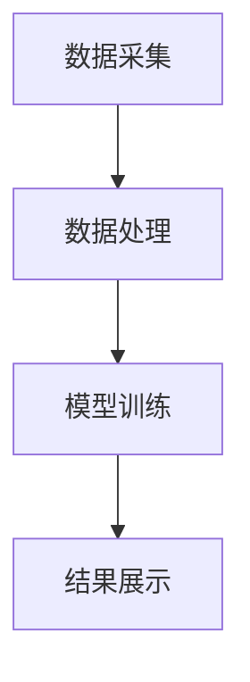
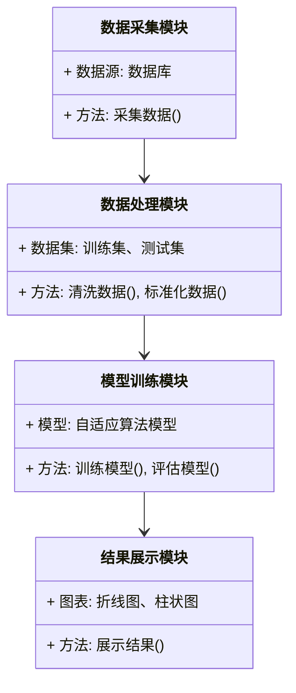
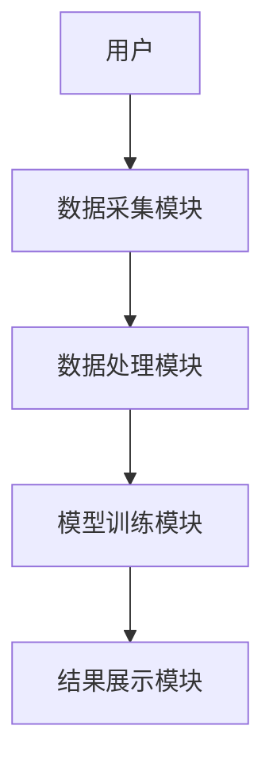
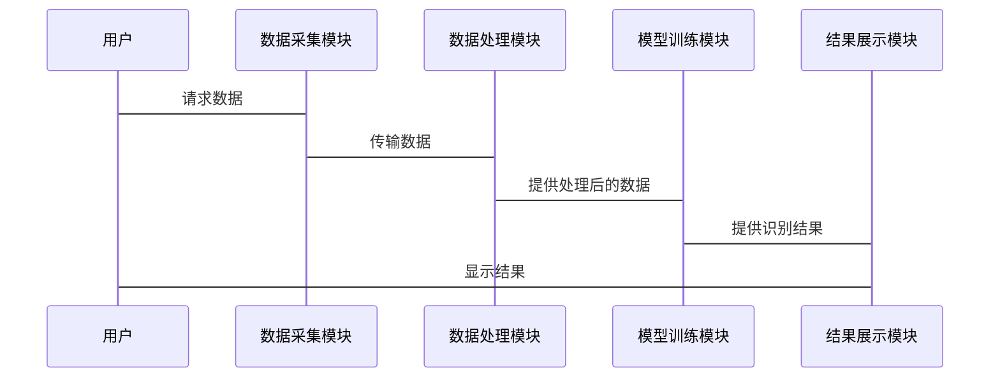

                 


# AI驱动的自适应经济周期识别器

> 关键词：AI、经济周期、自适应算法、时间序列分析、机器学习、深度学习、系统架构

> 摘要：本文探讨了AI在经济周期识别中的应用，分析了传统方法的局限性，详细介绍了基于机器学习和深度学习的自适应算法，并结合系统架构设计和项目实战，展示了如何利用AI技术实现经济周期的自适应识别。

---

# 第1章: 经济周期识别的背景与意义

## 1.1 经济周期的基本概念

经济周期是指经济活动的波动，通常分为扩张和收缩阶段。经济周期的识别对于经济政策制定、投资决策和风险管理具有重要意义。经济周期的特征包括增长率波动、就业率变化和通货膨胀率波动等。

## 1.2 传统经济周期识别方法的局限性

传统方法如统计分析和模型预测存在数据依赖性强、适应性差和实时性低的问题。例如，ARIMA模型需要大量的历史数据，且难以适应数据分布的变化。

## 1.3 AI驱动的经济周期识别的优势

AI技术能够通过大数据分析和自适应学习，提高识别的准确性和实时性。机器学习算法如随机森林和神经网络能够捕捉非线性关系，深度学习则能够处理复杂的时间序列数据。

## 1.4 本书的目标与结构

本书旨在介绍AI驱动的经济周期识别技术，涵盖算法原理、系统架构和项目实战。通过详细讲解，帮助读者掌握自适应算法的应用方法。

---

# 第2章: 经济周期识别的核心概念与联系

## 2.1 经济周期识别的核心概念

经济指标包括GDP、失业率和通胀率等，是识别经济周期的重要依据。自适应算法能够根据数据变化调整模型参数，提高识别的准确性。

## 2.2 经济指标与经济周期的关系

主要经济指标通过时间序列分析，可以揭示其与经济周期的关联性。例如，GDP增长率的波动通常与经济周期的变化密切相关。

## 2.3 自适应算法与经济周期识别的结合

自适应算法能够实时调整模型，适应数据的变化，提高识别的准确性和及时性。例如，动态时间规整算法能够处理时间序列数据中的变形。

---

# 第3章: AI驱动的经济周期识别算法原理

## 3.1 常用的经济周期识别算法

### 3.1.1 基于机器学习的算法

随机森林和XGBoost等算法能够处理非线性关系，适合经济周期识别中的分类和回归任务。

### 3.1.2 基于深度学习的算法

LSTM和Transformer网络能够捕捉时间序列中的长期依赖关系，适合处理复杂的经济数据。

### 3.1.3 基于时间序列分析的算法

ARIMA和Prophet模型适合处理时间序列数据，能够预测未来的经济趋势。

## 3.2 自适应算法的数学模型与公式

### 3.2.1 自适应滤波器的数学模型

自适应滤波器的更新公式为：
$$
w_{n+1} = w_n + \mu \cdot x_n \cdot e_n
$$

其中，\(w_n\) 是权重向量，\(x_n\) 是输入向量，\(e_n\) 是误差，\(\mu\) 是学习率。

### 3.2.2 自适应回归模型的公式推导

自适应回归模型的参数更新公式为：
$$
\theta_{n+1} = \theta_n + \alpha \cdot (y_n - \hat{y}_n) \cdot x_n
$$

其中，\(\theta_n\) 是参数向量，\(\alpha\) 是步长，\(y_n\) 是真实值，\(\hat{y}_n\) 是预测值，\(x_n\) 是输入向量。

### 3.2.3 自适应聚类算法的数学表达

自适应聚类算法的聚类中心更新公式为：
$$
C_{k+1} = \frac{1}{N_k} \sum_{i=1}^{N_k} x_i
$$

其中，\(C_k\) 是第\(k\)个聚类中心，\(N_k\) 是第\(k\)个聚类中的样本数，\(x_i\) 是样本向量。

## 3.3 算法实现的步骤与流程

### 3.3.1 数据预处理

- 数据清洗：处理缺失值和异常值。
- 标准化：将数据标准化到同一范围内。
- 分割：将数据分为训练集和测试集。

### 3.3.2 特征提取与选择

- 特征提取：从原始数据中提取有意义的特征。
- 特征选择：使用特征重要性评分选择关键特征。

### 3.3.3 模型训练与优化

- 训练：使用训练数据训练模型。
- 调参：通过网格搜索优化模型参数。
- 评估：使用测试数据评估模型性能。

### 3.3.4 模型评估与验证

- 准确率：模型正确预测的比例。
- 召回率：模型正确识别正样本的比例。
- F1分数：综合准确率和召回率的指标。

---

# 第4章: 系统架构与设计

## 4.1 系统架构设计

### 4.1.1 模块划分

系统主要包括数据采集模块、数据处理模块、模型训练模块和结果展示模块。

### 4.1.2 功能设计

- 数据采集：从数据库中获取经济指标数据。
- 数据处理：对数据进行清洗和预处理。
- 模型训练：训练自适应算法模型。
- 结果展示：将识别结果以可视化形式展示。

### 4.1.3 架构图



## 4.2 系统功能设计

### 4.2.1 领域模型类图



## 4.3 系统架构设计

### 4.3.1 架构图



## 4.4 系统接口设计

### 4.4.1 接口定义

- 数据采集模块提供`get_data()`接口，返回原始数据。
- 数据处理模块提供`process_data()`接口，返回预处理后的数据。
- 模型训练模块提供`train_model()`接口，返回训练好的模型。
- 结果展示模块提供`display_result()`接口，显示识别结果。

### 4.4.2 交互流程



---

# 第5章: 项目实战与应用

## 5.1 项目环境搭建

- 安装Python和必要的库（如scikit-learn、Keras、TensorFlow）。
- 下载经济指标数据集（如GDP、失业率数据）。

## 5.2 系统核心实现

### 5.2.1 数据采集模块

```python
import pandas as pd

def get_data():
    # 从数据库中获取数据
    data = pd.read_csv('economic_indicators.csv')
    return data
```

### 5.2.2 数据处理模块

```python
def process_data(data):
    # 数据清洗和预处理
    data = data.dropna()
    data = (data - data.mean()) / data.std()
    return data
```

### 5.2.3 模型训练模块

```python
from sklearn.ensemble import RandomForestClassifier

def train_model(data, labels):
    # 训练随机森林模型
    model = RandomForestClassifier()
    model.fit(data, labels)
    return model
```

### 5.2.4 结果展示模块

```python
import matplotlib.pyplot as plt

def display_result(predicted, actual):
    # 绘制预测结果和实际值的对比图
    plt.plot(predicted, label='预测值')
    plt.plot(actual, label='实际值')
    plt.legend()
    plt.show()
```

## 5.3 实际案例分析

使用GDP增长率数据进行训练，预测经济周期的变化。通过模型识别经济周期的阶段，并验证预测结果的准确性。

## 5.4 项目总结与优化建议

项目成功实现了经济周期的自适应识别，但在处理高维数据和实时性方面还有提升空间。未来可以结合边缘计算和流数据处理技术，进一步提高系统的实时性和准确性。

---

# 第6章: 总结与展望

## 6.1 项目成果总结

通过本项目，我们成功地将AI技术应用于经济周期识别，展示了自适应算法的优势和潜力。

## 6.2 经济周期识别的未来发展方向

随着AI技术的不断发展，未来可以通过集成学习、强化学习和图神经网络等技术，进一步提升经济周期识别的准确性和智能化水平。

## 6.3 对读者的建议

建议读者深入学习机器学习和时间序列分析的知识，结合实际问题进行实践，不断提升自己的技术能力。

---

# 附录

## 附录A: 相关代码与数据集

提供项目所需的代码和数据集下载链接。

## 附录B: 算法数学推导

详细推导自适应算法的数学模型和公式。

## 附录C: 系统架构图与交互图

展示系统架构图和交互图，帮助读者更好地理解系统的结构和工作流程。

---

# 作者：AI天才研究院 & 禅与计算机程序设计艺术

通过本文的详细讲解和项目实战，读者可以全面了解AI驱动的自适应经济周期识别器的核心原理和应用方法。希望本书能够为相关领域的研究和实践提供有价值的参考。

