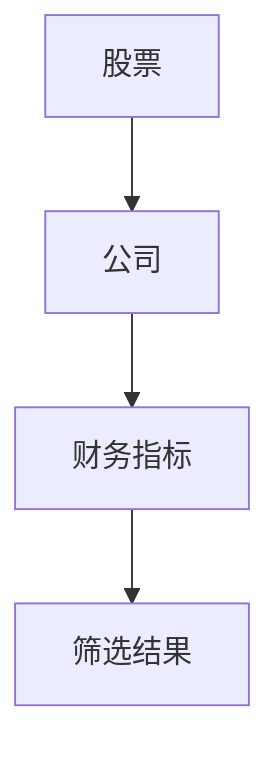
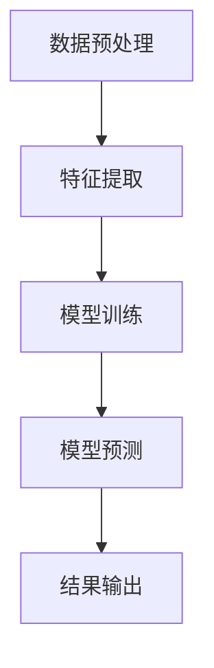
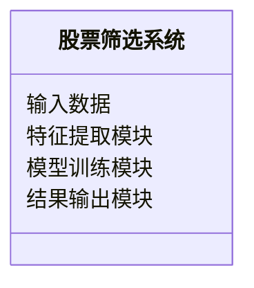
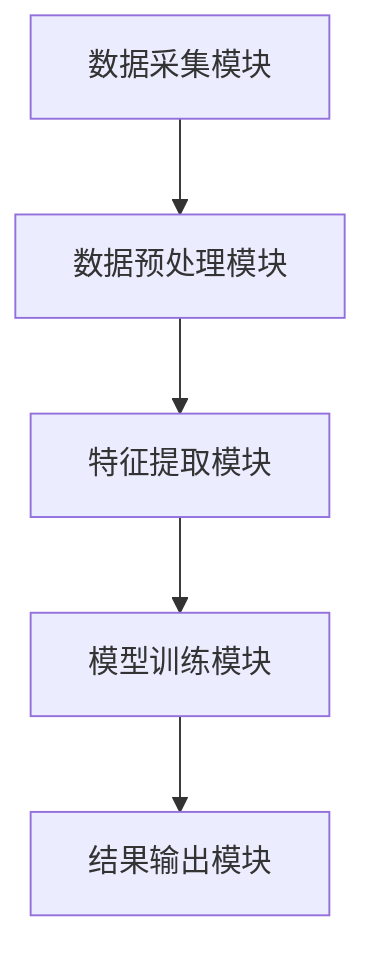
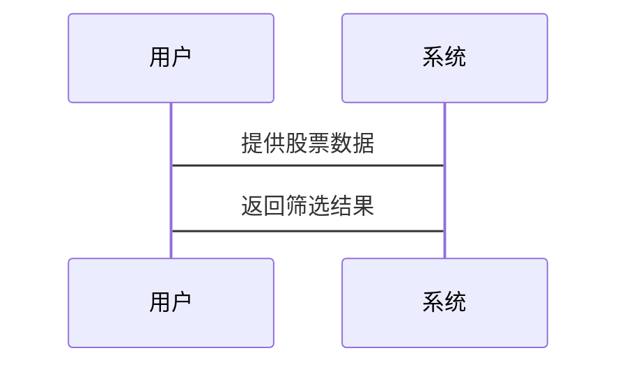

                 


# AI驱动的费雪成长型股票筛选系统

> 关键词：费雪成长型股票，人工智能，股票筛选，机器学习，算法模型

> 摘要：本文探讨了利用人工智能技术驱动的费雪成长型股票筛选系统。通过分析费雪成长型股票的特点，结合AI算法，构建一个高效的股票筛选系统。文章详细介绍了系统的背景、核心概念、算法原理、系统架构设计、项目实战以及最佳实践，为读者提供全面的技术指导。

---

# 第一部分: AI驱动的费雪成长型股票筛选系统概述

## 第1章: 费雪成长型股票与AI筛选系统背景

### 1.1 费雪成长型股票的定义与特点

#### 1.1.1 费雪成长型股票的定义
费雪成长型股票指的是那些具有持续增长潜力的公司股票。这些公司通常表现出稳定的收入和利润增长，能够在较长的时间内实现股价的稳步上升。

#### 1.1.2 费雪成长型股票的核心特点
- **收入持续增长**：公司收入年增长率稳定且高于行业平均水平。
- **净利润持续增长**：公司净利润表现优异，且增长趋势明显。
- **股东权益增长**：公司股东权益持续增加，表明公司资产增值或盈利能力提高。
- **低波动性**：相对于市场整体波动，费雪成长型股票的波动性较低。

#### 1.1.3 费雪成长型股票与传统股票投资的区别
传统的股票投资方法依赖于人工分析和经验判断，而费雪成长型股票筛选系统则利用AI技术，通过数据挖掘和机器学习算法，自动化地识别具有成长潜力的股票。

### 1.2 AI驱动的股票筛选系统背景

#### 1.2.1 股票筛选的传统方法与局限性
传统股票筛选方法依赖于分析师的主观判断和经验，存在效率低、成本高、覆盖面有限等问题。

#### 1.2.2 AI技术在金融领域的应用前景
AI技术在金融领域的应用越来越广泛，特别是在股票筛选、风险评估、市场预测等方面展现了巨大的潜力。

#### 1.2.3 费雪成长型股票筛选的AI化趋势
随着AI技术的不断发展，越来越多的投资者开始利用AI驱动的股票筛选系统来寻找具有成长潜力的股票。

### 1.3 费雪成长型股票筛选的核心问题

#### 1.3.1 问题背景与问题描述
如何利用AI技术高效地筛选出具有持续增长潜力的费雪成长型股票，是当前金融领域的重要研究方向。

#### 1.3.2 问题解决的必要性与可行性
传统的股票筛选方法效率低下，而AI技术能够通过大数据分析和机器学习算法，快速识别潜在的成长型股票，提高筛选效率和准确性。

#### 1.3.3 费雪成长型股票筛选的边界与外延
筛选系统需要考虑的边界包括：公司财务数据的完整性、市场波动的影响、宏观经济环境的变化等。外延则包括对不同类型成长型股票的进一步细分。

#### 1.3.4 系统核心要素与组成结构
费雪成长型股票筛选系统的核心要素包括：数据采集模块、特征提取模块、模型训练模块、结果输出模块。

---

## 第2章: AI驱动的费雪成长型股票筛选系统核心概念与联系

### 2.1 核心概念原理

#### 2.1.1 费雪成长型股票筛选的特征工程
特征工程是筛选系统的核心，包括数据的清洗、转换、特征选择等步骤。常用的特征包括收入增长率、净利润增长率、股东权益增长率等。

#### 2.1.2 AI模型在股票筛选中的作用
AI模型通过分析历史数据，识别出具有成长潜力的股票，帮助投资者做出更明智的投资决策。

#### 2.1.3 系统的核心算法与模型选择
常用的算法包括随机森林、支持向量机、XGBoost等，选择合适的算法能够提高筛选系统的准确性和稳定性。

### 2.2 核心概念属性特征对比

| 特征属性 | 描述 |
|----------|------|
| 收入增长率 | 公司收入的年增长率 |
| 净利润增长率 | 公司净利润的年增长率 |
| 股东权益增长率 | 股东权益的年增长率 |
| 营业利润率 | 营业利润与营业收入的比率 |
| 净资产收益率 | 净利润与股东权益的比率 |

### 2.3 ER实体关系图



---

## 第3章: AI驱动的费雪成长型股票筛选系统算法原理

### 3.1 算法原理概述

#### 3.1.1 机器学习在股票筛选中的应用
机器学习通过分析历史数据，识别出影响股票表现的关键特征，并预测未来的走势。

#### 3.1.2 常见的股票筛选算法
常用的算法包括随机森林、XGBoost、支持向量机等，每种算法都有其优缺点和适用场景。

#### 3.1.3 费雪成长型股票筛选的算法选择
在实际应用中，通常选择随机森林算法，因为它能够处理高维数据，并且具有较强的抗过拟合能力。

### 3.2 算法流程图



### 3.3 算法实现代码

```python
import pandas as pd
from sklearn.ensemble import RandomForestClassifier

# 数据预处理
data = pd.read_csv('stock_data.csv')
data = data.dropna()  # 删除缺失值
data = pd.get_dummies(data)  # 虚拟化处理

# 特征选择
features = data[['收入增长率', '净利润增长率', '股东权益增长率', '营业利润率', '净资产收益率']]
target = data['目标变量']

# 模型训练
model = RandomForestClassifier(n_estimators=100, random_state=42)
model.fit(features, target)

# 模型预测
predictions = model.predict(features)
```

### 3.4 算法的数学模型与公式

#### 3.4.1 随机森林算法
随机森林是一种集成学习算法，通过构建多个决策树，并将它们的结果进行投票或平均，最终得到预测结果。

#### 3.4.2 预测模型的数学表达
$$
\text{预测结果} = \argmax_{i} \sum_{j=1}^{n} \text{决策树}_j(\text{输入})
$$

---

## 第4章: 系统分析与架构设计

### 4.1 系统应用场景

#### 4.1.1 系统输入
系统输入包括历史财务数据、市场数据、公司基本面信息等。

#### 4.1.2 系统输出
系统输出包括筛选出的费雪成长型股票列表、相关指标分析、投资建议等。

### 4.2 系统功能设计

#### 4.2.1 领域模型


#### 4.2.2 系统架构设计


#### 4.2.3 系统接口设计
系统接口包括数据输入接口、模型调用接口、结果输出接口等。

#### 4.2.4 系统交互设计


---

## 第5章: 项目实战

### 5.1 环境安装

#### 5.1.1 安装Python
```bash
python --version
```

#### 5.1.2 安装依赖库
```bash
pip install pandas scikit-learn
```

### 5.2 系统核心实现源代码

```python
import pandas as pd
from sklearn.ensemble import RandomForestClassifier

# 数据预处理
data = pd.read_csv('stock_data.csv')
data = data.dropna()
data = pd.get_dummies(data)

# 特征选择
features = data[['收入增长率', '净利润增长率', '股东权益增长率', '营业利润率', '净资产收益率']]
target = data['目标变量']

# 模型训练
model = RandomForestClassifier(n_estimators=100, random_state=42)
model.fit(features, target)

# 模型预测
predictions = model.predict(features)
```

### 5.3 实际案例分析

#### 5.3.1 数据准备
从公开数据源获取股票数据，包括收入增长率、净利润增长率等指标。

#### 5.3.2 模型训练
使用历史数据训练随机森林模型，得到筛选结果。

#### 5.3.3 结果分析
分析筛选出的股票是否符合费雪成长型股票的特征，评估模型的准确性和稳定性。

### 5.4 项目小结
通过实际案例分析，验证了AI驱动的费雪成长型股票筛选系统的有效性和可行性。

---

## 第6章: 最佳实践与小结

### 6.1 最佳实践 tips

#### 6.1.1 数据质量的重要性
确保数据的完整性和准确性，是筛选系统准确性的基础。

#### 6.1.2 模型选择的合理性
根据实际情况选择合适的算法，避免盲目追求复杂性。

#### 6.1.3 模型的持续优化
定期更新数据和模型，确保系统的稳定性和准确性。

### 6.2 小结

通过本文的介绍，读者可以了解到AI驱动的费雪成长型股票筛选系统的构建过程，包括背景、核心概念、算法原理、系统架构设计、项目实战以及最佳实践。希望本文能够为读者提供有价值的参考和启发。

### 6.3 注意事项

- 数据的获取和处理需要遵守相关法律法规。
- 模型的准确性和稳定性需要持续关注和优化。
- 投资者在使用筛选系统时，应结合市场环境和自身需求进行决策。

### 6.4 拓展阅读

- 《机器学习实战》
- 《Python机器学习》
- 《深度学习》

---

作者：AI天才研究院/AI Genius Institute & 禅与计算机程序设计艺术/Zen And The Art of Computer Programming

