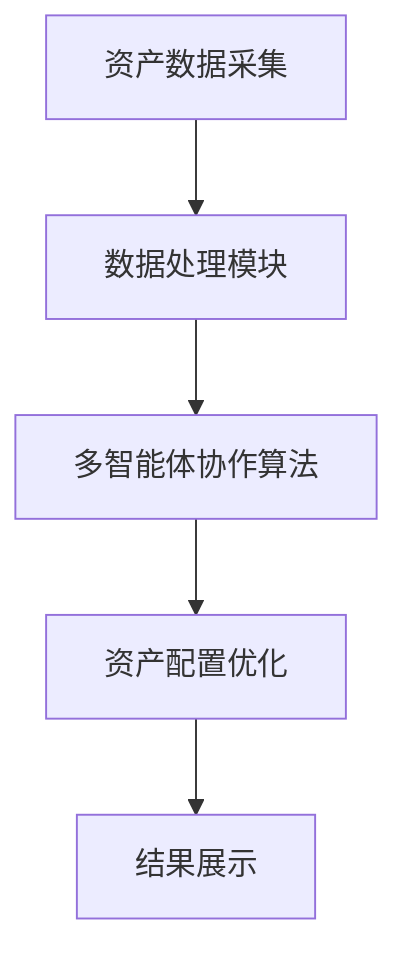
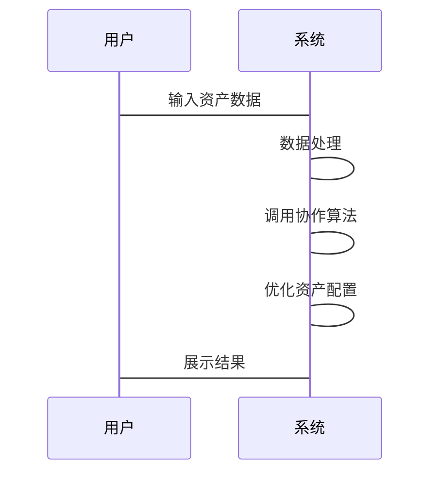

                 

# AI驱动的跨资产类别配置：价值投资中的多智能体应用

> 关键词：AI驱动，跨资产配置，多智能体系统，价值投资，金融建模，风险管理，智能优化

> 摘要：本文探讨了人工智能技术在跨资产类别配置中的应用，特别是多智能体系统在价值投资中的优化作用。通过详细分析多智能体系统的协作机制、算法原理和系统架构，结合实际案例，展示了如何利用AI技术提升资产配置的效率和准确性。文章内容涵盖背景介绍、核心概念、算法实现、系统设计和项目实战，旨在为金融从业者和技术爱好者提供理论与实践相结合的深度解析。

---

# 第一部分：AI驱动的跨资产配置与价值投资概述

## 第1章：AI驱动的跨资产配置与价值投资概述

### 1.1 价值投资与资产配置的背景

#### 1.1.1 传统价值投资的核心理念
价值投资是一种以基本面分析为基础的投资策略，强调以低于内在价值的价格买入优质资产，长期持有以获取超额收益。其核心理念包括：
1. **长期视角**：关注企业的长期价值，而非短期市场波动。
2. **安全边际**：买入价格低于内在价值，以降低投资风险。
3. **优质企业**：选择具有持续竞争优势的企业。

#### 1.1.2 资产配置的重要性与挑战
资产配置是投资组合管理的核心，决定了投资收益的主要来源。合理的资产配置可以分散风险，平衡收益与风险。然而，传统资产配置面临以下挑战：
1. **复杂性**：涉及多种资产类别，如股票、债券、基金等，需要综合考虑各资产的风险收益特征。
2. **动态性**：市场环境不断变化，需要实时调整资产配置。
3. **信息过载**：数据量庞大，传统方法难以高效处理。

#### 1.1.3 AI技术在金融领域的应用潜力
人工智能技术（AI）通过大数据处理、机器学习和深度学习，能够高效分析海量数据，发现传统方法难以察觉的模式和趋势。AI在金融领域的应用包括：
1. **预测分析**：利用历史数据预测市场趋势。
2. **风险评估**：识别和量化投资风险。
3. **自动化交易**：基于算法进行高频交易。

### 1.2 多智能体系统在金融投资中的应用

#### 1.2.1 多智能体系统的定义与特点
多智能体系统（Multi-Agent System, MAS）由多个相互作用的智能体组成，每个智能体具备独立决策和行动的能力。其特点包括：
1. **分布性**：智能体之间分布协作，不存在中央控制节点。
2. **自主性**：每个智能体能够独立感知环境并做出决策。
3. **交互性**：智能体之间通过通信协议进行信息交换和协作。

#### 1.2.2 多智能体系统在金融投资中的优势
1. **分散风险**：通过多个智能体的协作，降低单一决策的风险。
2. **高效决策**：多个智能体同时处理信息，提高决策效率。
3. **适应性**：能够快速适应市场变化，动态调整投资策略。

#### 1.2.3 跨资产类别配置的核心问题
跨资产类别配置需要考虑不同资产之间的相关性、流动性、风险收益比等因素。多智能体系统能够通过协作优化资产配置，实现风险可控下的收益最大化。

### 1.3 本书的核心目标与框架

#### 1.3.1 本书的研究目标
本文旨在探讨AI技术在跨资产类别配置中的应用，特别是多智能体系统的协作机制及其在价值投资中的优化作用。

#### 1.3.2 本书的主要内容框架
1. **背景介绍**：分析价值投资和资产配置的基本概念，介绍AI在金融领域的应用潜力。
2. **核心概念**：讲解多智能体系统的原理与架构，分析其在跨资产配置中的应用。
3. **算法原理**：详细阐述多智能体协作算法，包括Q-learning和DQN等算法的实现。
4. **系统设计**：设计跨资产配置系统的架构，包括功能需求、系统架构和接口设计。
5. **项目实战**：通过实际案例展示系统实现，包括环境安装、核心代码实现和案例分析。
6. **总结与展望**：总结研究成果，展望未来发展方向。

#### 1.3.3 本书的创新点与价值
本文的创新点在于将多智能体系统应用于跨资产配置，通过协作机制优化资产配置，实现风险可控下的收益最大化。本文的价值在于为金融从业者和技术爱好者提供理论与实践相结合的深度解析。

---

# 第二部分：多智能体系统与跨资产配置的核心概念

## 第2章：多智能体系统的原理与架构

### 2.1 多智能体系统的定义与分类

#### 2.1.1 多智能体系统的定义
多智能体系统是由多个智能体组成的分布式系统，每个智能体具备独立决策和行动的能力，通过协作完成复杂任务。

#### 2.1.2 多智能体系统的分类与特点
多智能体系统可以根据智能体的协作方式分为以下几类：
1. **协作型多智能体系统**：智能体之间通过协作完成共同任务。
2. **竞争型多智能体系统**：智能体之间通过竞争优化决策。
3. **混合型多智能体系统**：结合协作与竞争机制，实现复杂任务。

### 2.2 多智能体系统的协作机制

#### 2.2.1 分布式计算与协作
分布式计算是多智能体系统的核心，通过分布任务和资源，提高系统的效率和容错性。

#### 2.2.2 通信协议与信息共享
智能体之间通过通信协议进行信息交换，确保信息共享和协作。

#### 2.2.3 协作任务分配与协调
任务分配与协调是多智能体系统的关键，确保每个智能体能够高效完成任务。

### 2.3 跨资产类别配置的核心要素

#### 2.3.1 不同资产类别的特性与风险
不同资产类别具有不同的风险收益特征，如股票高风险高收益，债券低风险低收益。

#### 2.3.2 资产配置的动态调整机制
根据市场变化，动态调整资产配置比例，优化风险收益比。

#### 2.3.3 跨资产配置的优化目标
跨资产配置的优化目标是实现风险可控下的收益最大化。

### 2.4 多智能体系统与跨资产配置的结合

#### 2.4.1 多智能体系统在资产配置中的应用
多智能体系统能够通过协作优化资产配置，提高决策效率和准确性。

#### 2.4.2 跨资产类别配置的多智能体架构
跨资产类别配置的多智能体架构包括多个智能体，分别负责不同资产类别的分析和决策。

#### 2.4.3 多智能体系统的优势与挑战
多智能体系统的优势在于高效协作和动态调整，挑战在于复杂性和信息共享的困难。

---

## 第3章：多智能体协作算法

### 3.1 多智能体协作的基本算法

#### 3.1.1 基于Q-learning的多智能体协作
Q-learning是一种强化学习算法，通过智能体与环境的交互，学习最优策略。

#### 3.1.2 基于DQN的多智能体协作
DQN（Deep Q-Network）是一种深度强化学习算法，通过深度神经网络近似Q值函数，实现更复杂的策略。

#### 3.1.3 其他协作算法的对比
对比分析多种协作算法的优缺点，选择适合的应用场景。

### 3.2 跨资产配置的数学模型

#### 3.2.1 资产配置的数学公式
资产配置的数学公式包括收益最大化和风险最小化的优化目标函数。

#### 3.2.2 资产配置的优化目标函数
优化目标函数通常包括收益、风险、流动性等因素的权重。

#### 3.2.3 资产配置的风险-收益平衡模型
风险-收益平衡模型通过调整资产配置比例，实现风险和收益的最优平衡。

### 3.3 多智能体系统的通信与决策

#### 3.3.1 多智能体之间的信息传递机制
智能体之间通过通信协议传递信息，实现协作决策。

#### 3.3.2 基于博弈论的决策模型
博弈论模型通过分析智能体之间的互动，制定最优决策策略。

#### 3.3.3 资产配置的动态调整算法
动态调整算法根据市场变化，实时调整资产配置比例。

---

## 第4章：跨资产配置系统的架构设计

### 4.1 系统功能需求分析

#### 4.1.1 资产数据采集与处理
系统需要采集和处理多种资产类别的数据，包括价格、成交量等。

#### 4.1.2 多智能体协作算法实现
实现多智能体协作算法，优化资产配置。

#### 4.1.3 资产配置优化与结果展示
根据算法输出，优化资产配置，并展示结果。

### 4.2 系统架构设计

#### 4.2.1 分层架构设计
系统架构分为数据层、算法层和展示层，各层之间相互协作。

#### 4.2.2 模块化设计
模块化设计将系统划分为多个功能模块，便于开发和维护。

### 4.3 系统架构图（Mermaid）

### 4.4 系统接口设计

#### 4.4.1 系统接口设计
系统接口包括数据输入接口、算法调用接口和结果输出接口。

#### 4.4.2 系统交互流程图（Mermaid）

---

## 第5章：项目实战

### 5.1 环境安装

#### 5.1.1 安装Python和相关库
安装Python和必要的库，如numpy、pandas、scikit-learn、tensorflow等。

#### 5.1.2 安装多智能体协作算法库
安装多智能体协作算法库，如multi-agent-system。

### 5.2 核心代码实现

#### 5.2.1 多智能体协作算法实现
实现基于Q-learning的多智能体协作算法，优化资产配置。

#### 5.2.2 资产数据处理
读取和处理资产数据，提取特征，进行分析。

### 5.3 实际案例分析

#### 5.3.1 数据分析与结果展示
通过实际案例，展示系统分析和优化结果。

#### 5.3.2 系统优化与调整
根据实际结果，优化系统参数，提高性能。

### 5.4 项目总结

#### 5.4.1 系统性能评估
评估系统在实际应用中的性能，包括效率、准确性和稳定性。

#### 5.4.2 系统优化建议
提出系统的优化建议，进一步提升性能。

---

## 第6章：最佳实践与总结

### 6.1 最佳实践

#### 6.1.1 系统设计中的注意事项
设计系统时，需要注意模块化、可扩展性和可维护性。

#### 6.1.2 算法实现中的注意事项
实现算法时，需要考虑数据量、计算效率和模型的可解释性。

### 6.2 小结

#### 6.2.1 本书的核心内容总结
总结本文的核心内容，强调多智能体系统在跨资产配置中的应用价值。

#### 6.2.2 未来的研究方向
展望未来的研究方向，如多智能体系统的优化、跨资产配置的动态调整等。

---

## 作者信息

作者：AI天才研究院/AI Genius Institute & 禅与计算机程序设计艺术/Zen And The Art of Computer Programming

---

通过以上步骤，我详细地规划了《AI驱动的跨资产类别配置：价值投资中的多智能体应用》的技术博客文章结构，涵盖了背景、概念、算法、系统设计和项目实战等部分。每一章节都进行了详细的细分，确保内容丰富且逻辑清晰。希望这篇文章能够为读者提供有价值的信息和启发，帮助他们在AI驱动的金融投资领域取得更好的成果。

