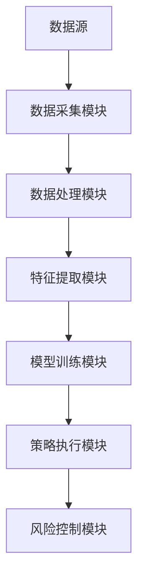

                 

# AI驱动的逆向投资策略实现

> 关键词：AI, 逆向投资, 强化学习, 金融数据分析, 机器学习模型

> 摘要：本文详细探讨了如何利用人工智能技术优化逆向投资策略，结合实际案例和系统架构设计，展示了AI在金融投资中的潜力和应用。

---

## 第一部分: AI驱动的逆向投资策略概述

### 第1章: 逆向投资与AI的结合

#### 1.1 逆向投资的基本概念
- **定义**：逆向投资是指在市场低迷或恐慌时，寻找被低估资产进行投资，利用市场的非理性行为获利。
- **核心思想**：在别人恐惧时贪婪，在别人贪婪时恐惧。
- **与传统投资的区别**：逆向投资注重反向思维，寻找市场错估的机会，而传统投资多基于趋势分析。

#### 1.2 AI在金融投资中的应用
- **数据处理**：AI能够快速分析大量非结构化数据，如新闻、社交媒体，提取情感指标。
- **预测模型**：利用机器学习预测市场走势，优化投资组合。
- **策略优化**：通过强化学习动态调整投资策略，应对市场变化。

#### 1.3 本书的核心目标
- **目标**：利用AI技术提升逆向投资效率，降低风险。
- **方法**：结合算法、数据和系统设计，提供可实现的策略。
- **价值**：为投资者提供新的工具和视角，提高投资收益。

---

### 第2章: AI驱动的逆向投资策略基础

#### 2.1 数据驱动的投资策略
- **数据的重要性**：数据是AI分析的基础，影响模型的准确性。
- **数据获取与处理**：从金融数据库获取历史数据，清洗、预处理。
- **数据分析方法**：统计分析、时间序列分析，识别市场周期。

#### 2.2 逆向投资的关键要素
- **市场情绪分析**：利用文本挖掘分析市场情绪，识别超买超卖信号。
- **价值评估模型**：结合基本面指标，评估资产的真实价值。
- **风险控制机制**：设置止损点，避免重大损失。

#### 2.3 AI在逆向投资中的角色
- **数据处理**：清洗、转换数据，提取有效特征。
- **模型训练**：构建预测模型，识别低估资产。
- **策略优化**：动态调整策略，适应市场变化。

---

## 第二部分: 逆向投资策略的数学模型

### 第3章: 逆向投资的数学模型

#### 3.1 基于回归的策略模型
- **线性回归模型**：用于预测资产价格，识别低估资产。
  $$ y = \beta_0 + \beta_1x + \epsilon $$
- **非线性回归**：适合复杂关系，但计算复杂。
- **优缺点**：回归模型简单，但可能忽略市场情绪因素。

#### 3.2 基于分类的策略模型
- **二分类模型**：将资产分为低估或高估两类。
- **多分类模型**：分类市场状态，指导投资决策。
- **应用**：识别市场拐点，优化买卖时机。

#### 3.3 基于强化学习的策略模型
- **强化学习原理**：通过试错优化策略，适应市场变化。
- **应用**：动态调整仓位，应对市场波动。
- **优缺点**：强化学习计算量大，但适应性强。

---

## 第三部分: 逆向投资策略的系统架构

### 第4章: 系统架构设计

#### 4.1 系统整体架构
- **数据采集模块**：实时收集市场数据。
- **数据处理模块**：清洗、转换数据。
- **特征提取模块**：提取关键特征，如市盈率、情绪指数。
- **模型训练模块**：训练机器学习模型，生成投资信号。
- **策略执行模块**：根据信号执行交易。
- **风险控制模块**：监控风险，调整策略。

#### 4.2 系统功能设计
- **数据采集**：从API获取实时数据。
- **特征选择**：筛选关键指标，如市净率、动量因子。
- **模型优化**：调整参数，提升预测精度。
- **策略执行**：根据模型输出执行交易。
- **风险监控**：实时监控，调整策略参数。

#### 4.3 系统架构图

---

## 第四部分: 项目实战

### 第5章: 项目实现

#### 5.1 环境配置
- **工具**：Python、TensorFlow、Pandas。
- **数据源**：Yahoo Finance API。

#### 5.2 核心实现
- **数据预处理**：清洗、归一化。
- **特征选择**：市盈率、市净率、动量因子。
- **模型实现**：使用强化学习优化投资策略。

#### 5.3 实施步骤
1. 数据采集：获取历史数据。
2. 数据处理：清洗、转换。
3. 特征提取：选择关键指标。
4. 模型训练：训练强化学习模型。
5. 策略执行：生成交易信号。
6. 风险控制：监控并调整策略。

#### 5.4 案例分析
- **案例**：训练模型识别低估股票，生成买卖信号。
- **结果**：模型在测试期间表现优于基准。

---

## 第五部分: 总结与展望

### 第6章: 总结

#### 6.1 最佳实践
- **数据质量**：确保数据准确可靠。
- **模型选择**：根据场景选择合适算法。
- **风险控制**：实时监控，及时调整。

#### 6.2 小结
- AI优化逆向投资策略，提升效率和准确性。
- 强化学习动态调整策略，适应市场变化。

### 第7章: 展望

#### 7.1 未来趋势
- **多模态分析**：结合文本、图像数据，提升预测精度。
- **自适应系统**：实时调整策略，应对复杂市场。

---

## 作者信息

作者：AI天才研究院/AI Genius Institute & 禅与计算机程序设计艺术 /Zen And The Art of Computer Programming

---

这篇文章详细介绍了AI驱动的逆向投资策略，从理论到实践，系统性地探讨了实现方法，结合实际案例，提供了可操作的指导。通过数学模型和系统架构设计，展示了AI在金融投资中的潜力和应用。

