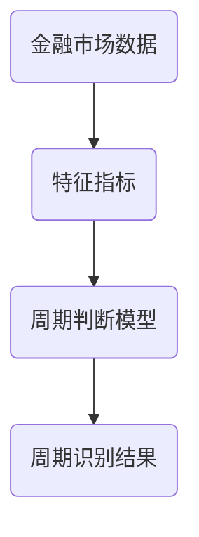
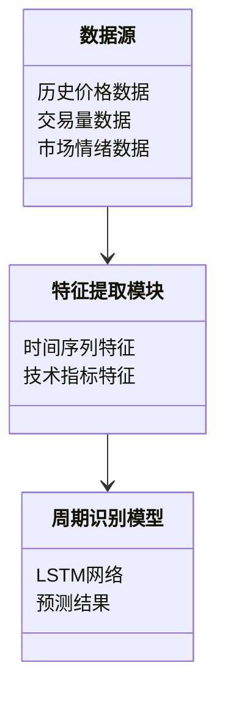
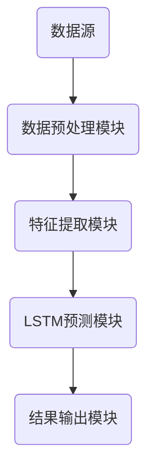
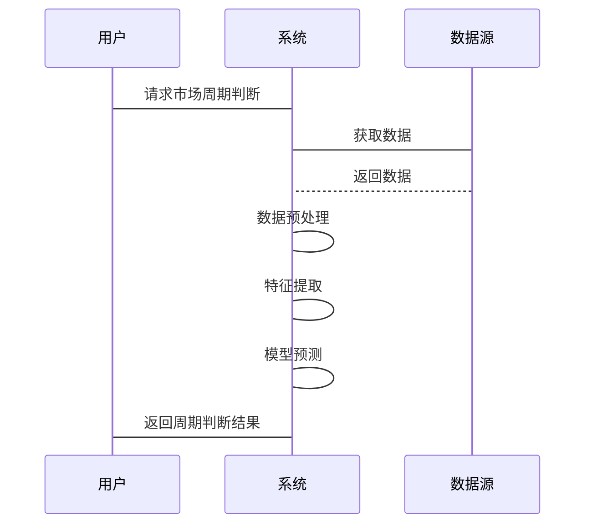

                 


# AI驱动的金融市场周期识别系统

> 关键词：AI驱动、金融市场、周期识别、时间序列分析、LSTM、系统架构

> 摘要：本文将深入探讨如何利用人工智能技术，特别是基于时间序列分析的深度学习模型（如LSTM），来实现对金融市场周期的自动识别。通过结合金融市场的周期性特征和AI算法的优势，本文旨在提出一种高效、准确的市场周期识别系统，并通过实际案例展示系统的实现与应用。

---

# 第一部分: 金融市场周期识别的背景与挑战

## 第1章: 金融市场周期识别的背景与挑战

### 1.1 金融市场周期的基本概念

#### 1.1.1 金融市场的周期性特征
- 牛市、熊市、震荡市的定义
- 市场周期对投资者和机构的重要性
- 周期性变化的规律与挑战

#### 1.1.2 传统市场周期识别方法的局限性
- 基于技术指标的传统方法（如均线、MACD等）
- 数据噪声和市场波动对传统方法的影响
- 传统方法的主观性和局限性

#### 1.1.3 市场周期识别的复杂性
- 市场情绪的不确定性
- 多因素影响（政策、经济、地缘政治等）
- 数据的高维性和实时性要求

### 1.2 AI技术在金融领域的应用现状

#### 1.2.1 AI在金融分析中的优势
- 数据处理能力
- 模型泛化能力
- 实时分析能力

#### 1.2.2 当前市场周期识别的技术难点
- 数据质量和完整性
- 模型的可解释性
- 算法的实时性和高效性

#### 1.2.3 AI驱动的创新解决方案
- 基于深度学习的时间序列分析
- 自适应模型的构建与优化
- 多模态数据的融合分析

### 1.3 本章小结
- 本章介绍了金融市场周期的基本概念及其识别的复杂性。
- 阐述了AI技术在金融分析中的优势，同时也指出了当前技术的难点与创新方向。

---

# 第二部分: 金融市场周期识别的核心概念与原理

## 第2章: 金融市场周期识别的核心概念

### 2.1 市场周期的类型与特征

#### 2.1.1 市场周期的分类
- 牛市：市场上涨，投资者信心强
- 熊市：市场下跌，投资者信心低
- 震荡市：市场波动剧烈，无明显趋势

#### 2.1.2 不同周期的特征指标
- 均线：趋势性指标
- MACD：动量指标
- 市场波动率：VIX指数等

#### 2.1.3 周期切换的关键信号
- 技术指标交叉
- 市场情绪变化
- 大规模资金流动

### 2.2 AI驱动的市场周期识别模型

#### 2.2.1 数据驱动的特征提取
- 时间序列数据的预处理
- 特征工程：构建有效的特征向量
- 数据增强：提升模型鲁棒性

#### 2.2.2 模型驱动的周期判断
- 基于时间序列的模型（ARIMA、LSTM等）
- 深度学习模型的优势
- 模型的训练与调优

#### 2.2.3 综合模型的构建与优化
- 多模型融合
- 超参数优化
- 模型评估与验证

### 2.3 核心概念的ER实体关系图



### 2.4 本章小结
- 本章详细介绍了金融市场周期的类型及其特征。
- 阐述了AI驱动的市场周期识别模型的核心概念与构建方法。

---

# 第三部分: AI驱动的市场周期识别算法原理

## 第3章: 时间序列分析与市场周期预测

### 3.1 时间序列分析的基本原理

#### 3.1.1 时间序列的分解方法
- 趋势（Trend）
- 周期（Seasonality）
- 噪声（Noise）

#### 3.1.2 常见的时间序列模型
- ARIMA模型
- GARCH模型
- Prophet模型

#### 3.1.3 LSTM网络在时间序列中的应用
- LSTM的结构与特点
- LSTM在金融时间序列预测中的优势

### 3.2 基于LSTM的市场周期预测模型

#### 3.2.1 LSTM网络的结构与特点
- 长短期记忆单元（LSTM）
- 门控机制（遗忘门、输入门、输出门）

#### 3.2.2 市场周期预测的模型设计
- 模型输入：时间序列数据
- 模型输出：周期标签（牛市、熊市、震荡市）
- 模型训练：监督学习框架

#### 3.2.3 模型训练与优化
- 损失函数：交叉熵损失
- 优化器：Adam优化器
- 超参数调优

### 3.3 算法实现的数学模型

#### 3.3.1 LSTM的数学公式
- 遗忘门：
$$ f_{\text{g}}(t) = \sigma(w_g x_t + u_g h_{t-1} + b_g) $$
- 输入门：
$$ i_{\text{g}}(t) = \sigma(w_i x_t + u_i h_{t-1} + b_i) $$
- 输出门：
$$ o_{\text{g}}(t) = \sigma(w_o x_t + u_o h_{t-1} + b_o) $$
- 候选记忆单元：
$$ g_{\text{g}}(t) = \tanh(w_c x_t + u_c h_{t-1} + b_c) $$
- 最终记忆单元：
$$ h_t = f_{\text{g}}(t) \cdot g_{\text{g}}(t) + i_{\text{g}}(t) \cdot h_{t-1} $$
- 输出：
$$ o_t = o_{\text{g}}(t) \cdot \tanh(h_t) $$

### 3.4 本章小结
- 本章详细介绍了时间序列分析的基本原理及其在金融市场的应用。
- 阐述了基于LSTM的市场周期预测模型的构建与优化方法。

---

# 第四部分: 系统架构与实现方案

## 第4章: 系统架构与实现方案

### 4.1 问题场景介绍

#### 4.1.1 问题描述
- 数据源：金融市场数据（股票价格、指数等）
- 问题目标：实时识别市场周期
- 业务需求：提供周期判断服务，辅助投资决策

### 4.2 系统功能设计

#### 4.2.1 领域模型设计


#### 4.2.2 系统架构设计


#### 4.2.3 接口设计
- 输入接口：金融市场数据
- 输出接口：周期标签
- API接口：提供周期判断服务

### 4.3 系统交互设计

#### 4.3.1 交互流程


### 4.4 本章小结
- 本章详细介绍了系统的架构设计与实现方案。
- 描述了系统的核心模块及其交互流程。

---

# 第五部分: 项目实战与案例分析

## 第5章: 项目实战与案例分析

### 5.1 项目实战

#### 5.1.1 环境安装
- Python 3.8+
- TensorFlow 2.0+
- Pandas、NumPy
- Matplotlib或Seaborn

#### 5.1.2 核心代码实现
```python
import numpy as np
import pandas as pd
import tensorflow as tf
from sklearn.model_selection import train_test_split
from tensorflow.keras import layers

# 数据加载与预处理
data = pd.read_csv('market_data.csv')
# 特征提取
features = data[['close', 'open', 'high', 'low', 'volume']]
# 标签构建
labels = data['label']
# 数据分割
X_train, X_test, y_train, y_test = train_test_split(features, labels, test_size=0.2)
# 模型构建
model = tf.keras.Sequential([
    layers.LSTM(64, return_sequences=True),
    layers.LSTM(32),
    layers.Dense(3, activation='softmax')
])
# 模型编译
model.compile(optimizer='adam', loss='sparse_categorical_crossentropy', metrics=['accuracy'])
# 模型训练
model.fit(X_train, y_train, epochs=10, batch_size=32, validation_data=(X_test, y_test))
```

#### 5.1.3 案例分析
- 数据来源：股票价格数据
- 模型训练：基于LSTM的时间序列预测
- 结果分析：周期判断的准确率与召回率

### 5.2 本章小结
- 本章通过实际项目展示了系统的实现过程。
- 阐述了核心代码的实现与案例分析。

---

# 第六部分: 最佳实践与总结

## 第6章: 最佳实践与总结

### 6.1 最佳实践

#### 6.1.1 数据预处理
- 数据清洗
- 特征工程
- 数据增强

#### 6.1.2 模型优化
- 超参数调优
- 模型融合
- 模型解释性

#### 6.1.3 系统部署
- 模型的实时预测
- 系统的可扩展性
- 系统的稳定性

### 6.2 本项目的关键点

#### 6.2.1 算法选择
- LSTM网络的选用
- 模型的训练与优化

#### 6.2.2 系统设计
- 分层架构设计
- 模块化设计

### 6.3 未来发展方向

#### 6.3.1 模型优化
- 更复杂的深度学习模型（如Transformer）
- 多模态数据的融合

#### 6.3.2 系统扩展
- 实时数据处理
- 全球市场的覆盖

#### 6.3.3 应用场景拓展
- 量化交易策略
- 风险管理

### 6.4 本章小结
- 本章总结了项目的最佳实践经验和关键点。
- 展望了未来的发展方向与应用场景。

---

# 结语

AI驱动的金融市场周期识别系统通过结合时间序列分析和深度学习技术，为金融市场周期的识别提供了高效、准确的解决方案。本文从理论到实践，详细阐述了系统的构建过程，并通过实际案例展示了系统的应用价值。未来，随着AI技术的不断进步，市场周期识别系统将更加智能化、自动化，为金融市场的分析与决策提供更强大的支持。

---

作者：AI天才研究院/AI Genius Institute & 禅与计算机程序设计艺术 /Zen And The Art of Computer Programming

