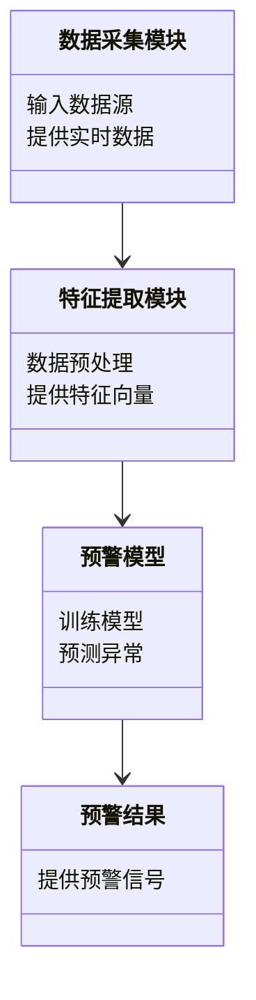
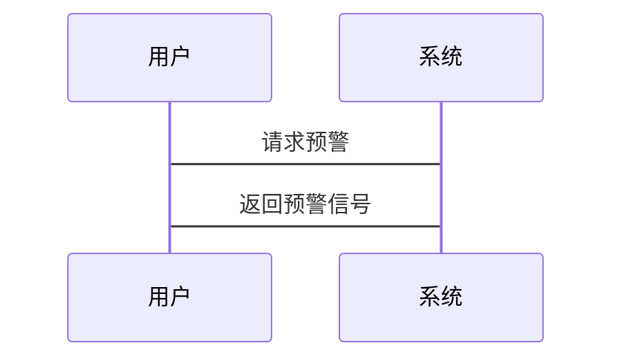

                 


# AI驱动的金融市场异常波动预警系统

> 关键词：金融市场，异常波动，AI技术，预警系统，时间序列分析，机器学习，深度学习

> 摘要：本文探讨了如何利用人工智能技术构建金融市场异常波动预警系统，重点分析了异常波动的定义与特征、AI技术的核心原理、系统架构设计、项目实战案例以及最佳实践。文章旨在为金融从业者和AI技术爱好者提供理论与实践相结合的深度解析，帮助读者理解如何通过技术手段实现金融市场风险的早期预警。

---

## 第一部分: 背景与概述

### 第1章: 背景与概述

#### 1.1 金融市场异常波动的背景与挑战

金融市场是全球经济的核心，其波动性直接影响投资者的收益和市场的稳定性。然而，异常波动往往具有突发性和不可预测性，传统方法难以有效捕捉和预警这些事件。AI技术的引入为解决这一问题提供了新的可能性。

- **1.1.1 金融市场波动的定义与特征**  
  金融市场波动是指价格在短时间内剧烈变化的现象。异常波动通常表现为价格的突然飙升或暴跌，可能由市场情绪、突发事件或人为操作引发。

- **1.1.2 异常波动的定义与分类**  
  异常波动可以分为局部异常和全局异常。局部异常是指某段时间内价格偏离正常波动范围，而全局异常则是在整个市场范围内出现的价格剧烈波动。

- **1.1.3 传统方法的局限性与AI的优势**  
  传统方法依赖于统计分析和经验判断，难以应对复杂多变的市场环境。AI技术通过大数据分析和机器学习算法，能够捕捉非线性关系和潜在模式，提供更精准的预警能力。

#### 1.2 AI技术在金融市场的应用背景

AI技术的快速发展为金融行业带来了革命性的变化。金融市场数据的复杂性和多样性使得AI成为理想的解决方案。

- **1.2.1 大数据分析与AI技术的结合**  
  金融市场数据量庞大，类型多样，包括价格、成交量、新闻情绪等。AI技术能够高效处理这些数据，提取有价值的信息。

- **1.2.2 金融市场的复杂性与AI的适用性**  
  市场参与者的行为复杂，情绪波动和外部事件难以预测。AI技术通过建模和模拟，能够帮助识别潜在风险。

- **1.2.3 异常波动预警的现实意义**  
  异常波动可能导致巨大损失，提前预警可以帮助投资者规避风险，维护市场稳定。

#### 1.3 本章小结

本章介绍了金融市场异常波动的背景与挑战，分析了AI技术在其中的应用优势，为后续内容奠定了基础。

---

## 第二部分: 核心概念与原理

### 第2章: 金融市场异常波动的核心概念

#### 2.1 异常波动的定义与特征

- **2.1.1 异常波动的多维度定义**  
  异常波动不仅包括价格的剧烈变化，还可能涉及交易量的突变和市场情绪的急剧转变。

- **2.1.2 市场数据的特征分析**  
  通过分析历史数据，可以发现异常波动往往伴随着某些特定的模式，例如成交量骤增或价格跳水。

- **2.1.3 异常波动的分类与边界**  
  异常波动可以分为短期波动、中期调整和长期趋势变化。不同类型的波动需要不同的预警机制。

#### 2.2 AI驱动的预警系统核心要素

- **2.2.1 数据采集与处理**  
  数据是预警系统的基石，包括实时价格、成交量、市场情绪等多源数据。

- **2.2.2 特征提取与建模**  
  通过特征工程提取关键指标，构建适合AI模型的输入数据。

- **2.2.3 预警机制与反馈**  
  建立多级预警机制，并根据反馈不断优化模型。

#### 2.3 核心概念的对比与联系

- **2.3.1 异常波动与其他市场现象的对比**  
  异常波动与正常波动的区别在于变化的剧烈程度和发生的时间。

- **2.3.2 AI技术在预警系统中的作用**  
  AI通过分析历史数据，识别潜在的异常模式，帮助预测未来波动。

- **2.3.3 系统架构的实体关系图**


### 第3章: AI技术的核心原理

#### 3.1 时间序列分析原理

- **3.1.1 时间序列的基本特征**  
  时间序列分析关注数据的时序特性，如趋势、周期性和随机性。

- **3.1.2 常见的时间序列模型**  
  包括ARIMA、GARCH等模型，用于预测未来趋势。

- **3.1.3 异常检测的统计方法**  
  使用Z-score、均值标准差等方法识别异常值。

#### 3.2 机器学习与深度学习算法

- **3.2.1 常用的异常检测算法**  
  Isolation Forest、One-Class SVM等无监督学习算法。

- **3.2.2 LSTM网络的原理**  
  LSTM通过记忆单元捕获长期依赖关系，适用于时间序列预测。

- **3.2.3 Transformer模型的应用**  
  Transformer通过自注意力机制捕捉全局关系，提升模型的表达能力。

#### 3.3 算法原理的数学模型

- **3.3.1 ARIMA模型公式**  
  $$ ARIMA(p, d, q) = 0 $$

- **3.3.2 LSTM网络结构**  
  $$ LSTM(t) = \text{激活}(f_t, c_t) $$

#### 3.4 算法对比与选择

根据数据特性选择合适的算法，例如使用LSTM处理长序列，使用Isolation Forest处理高维数据。

---

## 第三部分: 系统架构与实现

### 第4章: 系统架构与实现

#### 4.1 问题场景介绍

- **4.1.1 问题描述**  
  构建一个实时预警系统，能够快速识别潜在的异常波动。

- **4.1.2 项目介绍**  
  本项目基于Python和TensorFlow框架，实现一个实时的异常波动预警系统。

#### 4.2 系统功能设计

- **4.2.1 领域模型**  
  使用领域模型描述系统功能模块之间的关系。



#### 4.3 系统架构设计

- **4.3.1 系统架构图**


#### 4.4 系统接口设计

- **4.4.1 API接口定义**  
  提供RESTful API，供前端调用。

- **4.4.2 数据格式与交互流程**  
  使用JSON格式传递数据，前端通过API获取预警结果。

#### 4.5 系统交互流程

- **4.5.1 交互序列图**



---

## 第四部分: 项目实战

### 第5章: 项目实战

#### 5.1 环境安装

- **5.1.1 安装Python与相关库**  
  使用Anaconda环境，安装numpy、pandas、tensorflow等库。

#### 5.2 系统核心实现源代码

- **5.2.1 数据预处理代码**  
  ```python
  import numpy as np
  import pandas as pd

  # 读取数据
  data = pd.read_csv('market_data.csv')
  # 数据标准化
  from sklearn.preprocessing import StandardScaler
  scaler = StandardScaler()
  scaled_data = scaler.fit_transform(data)
  ```

- **5.2.2 模型实现代码**  
  ```python
  from tensorflow.keras.models import Sequential
  from tensorflow.keras.layers import LSTM, Dense

  model = Sequential()
  model.add(LSTM(64, input_shape=(timesteps, features)))
  model.add(Dense(1))
  model.compile(optimizer='adam', loss='mse')
  ```

#### 5.3 代码应用解读与分析

- **5.3.1 数据预处理解读**  
  标准化处理确保模型输入具有相似的尺度，提升训练效果。

- **5.3.2 模型实现解读**  
  LSTM网络适用于捕捉时间序列中的长时依赖关系，适合金融市场的复杂波动。

#### 5.4 实际案例分析

- **5.4.1 案例分析与结果展示**  
  使用真实数据训练模型，并展示预警结果。

#### 5.5 项目小结

通过项目实战，验证了AI技术在金融市场异常波动预警中的有效性。

---

## 第五部分: 最佳实践与总结

### 第6章: 最佳实践与总结

#### 6.1 项目经验总结

- **6.1.1 数据质量的重要性**  
  数据的完整性和准确性直接影响模型效果。

- **6.1.2 模型调优的必要性**  
  通过网格搜索等方法优化模型参数，提升预警准确率。

#### 6.2 注意事项

- **6.2.1 数据隐私与安全**  
  保护用户数据，遵守相关法律法规。

- **6.2.2 模型的可解释性**  
  提供可解释的预警结果，帮助用户理解决策依据。

#### 6.3 未来展望

- **6.3.1 技术融合**  
  结合自然语言处理技术，分析新闻情绪对市场的影响。

- **6.3.2 模型优化**  
  研究更高效的算法，提升预警系统的实时性。

---

## 作者：AI天才研究院/AI Genius Institute & 禅与计算机程序设计艺术 /Zen And The Art of Computer Programming

