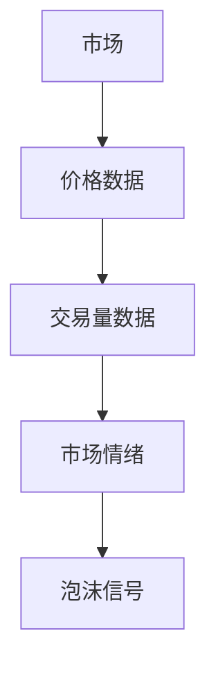
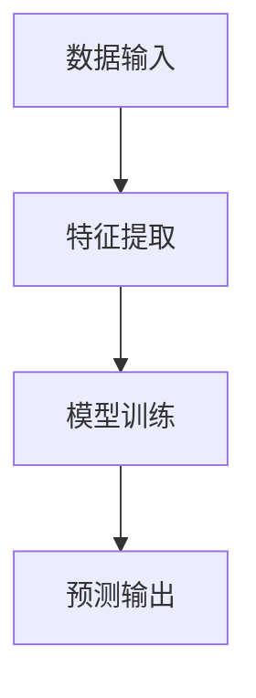
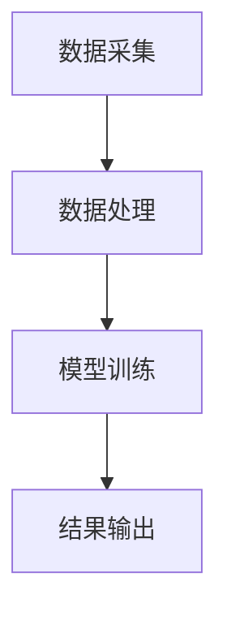
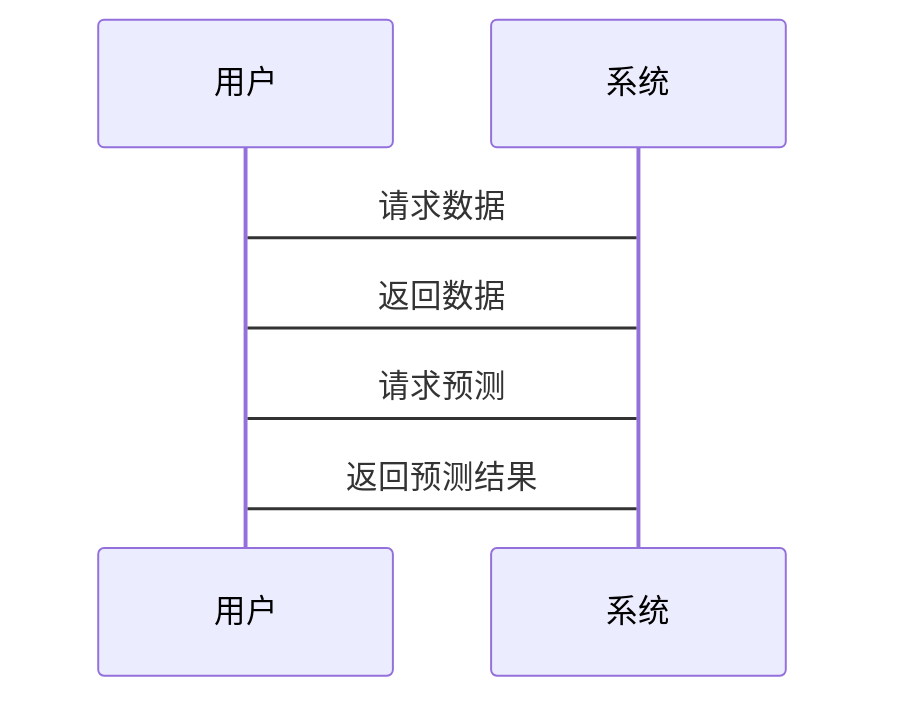

                 


# AI驱动的金融市场泡沫识别系统

## 关键词：AI，金融市场，泡沫识别，机器学习，系统架构

## 摘要：  
金融市场泡沫是金融市场中的一个复杂现象，其识别和预测一直是金融学和计算机科学领域的研究热点。本文将从AI技术的角度，详细探讨如何构建一个基于AI的金融市场泡沫识别系统。通过分析泡沫的形成机制、AI技术的核心算法、系统的架构设计以及实际案例，本文旨在为读者提供一个全面的视角，理解如何利用AI技术来识别和预测金融市场泡沫。

---

# 第1章：金融市场泡沫与AI驱动技术概述

## 1.1 金融市场泡沫的基本概念

### 1.1.1 什么是金融市场泡沫

金融市场泡沫是指资产价格在短期内急剧上涨，远远超过其实际价值，最终因为市场参与者的理性回归或外部冲击而破裂的现象。泡沫的形成通常与市场参与者的情绪波动、过度投机以及信息不对称等因素密切相关。

### 1.1.2 泡沫的形成机制与特征

泡沫的形成机制可以分为以下几个阶段：
1. **初步形成阶段**：市场参与者基于乐观情绪开始大量买入资产，推动价格上升。
2. **持续发展阶段**：价格继续上涨，吸引更多投机者进入市场。
3. **泡沫破裂阶段**：市场参与者逐渐理性化，或者受到外部冲击，导致价格急剧下降。

泡沫的特征包括：
- 价格波动剧烈
- 市场参与者情绪化
- 信息不对称加剧

### 1.1.3 泡沫对金融市场的影响

泡沫的破裂往往会导致资产价格大幅下跌，引发连锁反应，甚至可能引发金融危机。因此，识别和预测泡沫对于金融市场稳定具有重要意义。

## 1.2 AI技术在金融市场中的应用

### 1.2.1 AI技术的基本概念

AI（人工智能）是指通过计算机模拟人类智能的技术，包括机器学习、自然语言处理、计算机视觉等领域。在金融市场中，AI技术可以用于数据分析、风险评估、交易策略制定等。

### 1.2.2 AI在金融分析中的优势

AI技术具有以下优势：
- **数据处理能力强**：可以处理海量金融数据，发现隐藏的规律。
- **自动化与智能化**：能够自动分析市场动态，提供实时反馈。
- **高精度预测**：通过机器学习算法，可以实现对市场趋势的精准预测。

### 1.2.3 AI驱动的金融市场分析现状

目前，AI技术在金融市场分析中的应用主要集中在以下几个方面：
- **股票价格预测**：利用机器学习模型预测股票价格走势。
- **风险管理**：通过AI技术识别市场风险，制定相应的风险管理策略。
- **交易自动化**：利用算法交易实现自动化操作。

## 1.3 本章小结

本章介绍了金融市场泡沫的基本概念及其形成机制，并探讨了AI技术在金融市场中的应用及其优势。AI技术的引入为金融市场泡沫的识别和预测提供了新的可能性。

---

# 第2章：AI驱动的金融市场泡沫识别系统核心概念

## 2.1 泡沫识别的核心概念

### 2.1.1 数据驱动的泡沫识别

数据驱动的泡沫识别方法依赖于大量历史数据，通过分析价格波动、交易量等指标来识别泡沫。

### 2.1.2 市场行为分析

市场行为分析主要关注市场参与者的交易行为，包括交易量、买卖比例等指标。

### 2.1.3 统计与机器学习模型

统计模型和机器学习模型是泡沫识别的重要工具。统计模型通常用于分析市场数据的分布特征，而机器学习模型则能够捕捉复杂的市场模式。

## 2.2 AI驱动的泡沫识别系统核心要素

### 2.2.1 数据来源与特征提取

数据来源包括股票价格、交易量、市场情绪等。特征提取是将这些数据转化为能够反映市场状态的特征向量。

### 2.2.2 模型训练与优化

模型训练是通过历史数据训练机器学习模型，优化模型参数以提高预测精度。

### 2.2.3 系统输出与反馈机制

系统输出包括泡沫预警信号和市场趋势预测结果。反馈机制用于根据实际市场表现调整模型参数。

## 2.3 系统核心概念的ER实体关系图

以下是系统核心概念的ER实体关系图：



## 2.4 本章小结

本章详细介绍了AI驱动的金融市场泡沫识别系统的核心概念，包括数据来源、特征提取、模型训练等关键要素，并通过ER实体关系图展示了系统的整体架构。

---

# 第3章：AI驱动的金融市场泡沫识别算法原理

## 3.1 机器学习算法概述

### 3.1.1 监督学习与无监督学习

监督学习是一种基于标签数据的机器学习方法，适用于有监督的任务。无监督学习则适用于无标签数据的分析。

### 3.1.2 算法选择与优化

在选择机器学习算法时，需要考虑数据特征、模型复杂度和计算资源等因素。常用的算法包括随机森林、支持向量机（SVM）和神经网络等。

## 3.2 泡沫识别的特征工程

### 3.2.1 数据预处理与特征提取

数据预处理包括数据清洗和标准化。特征提取是将原始数据转化为能够反映市场状态的特征向量。

### 3.2.2 特征选择与降维

特征选择是通过筛选重要特征来提高模型性能。降维技术如主成分分析（PCA）可以减少特征维度，提高计算效率。

## 3.3 泡沫识别的算法实现

### 3.3.1 算法实现的步骤

以下是算法实现的步骤：



### 3.3.2 算法实现的Python代码示例

以下是Python代码示例：

```python
import pandas as pd
from sklearn.model import Model

# 数据加载与预处理
data = pd.read_csv('market_data.csv')
X = data.drop('label', axis=1)
y = data['label']

# 特征提取与模型训练
model = Model()
model.fit(X, y)

# 预测与评估
predictions = model.predict(X)
print(predictions)
```

## 3.4 算法实现的数学模型和公式

以下是机器学习模型的数学公式：

$$
y = f(X) + \epsilon
$$

其中，$y$ 是目标变量，$X$ 是输入特征，$f$ 是模型函数，$\epsilon$ 是误差项。

## 3.5 本章小结

本章详细介绍了AI驱动的金融市场泡沫识别系统的算法原理，包括特征工程、模型选择与优化，以及算法实现的步骤和代码示例。

---

# 第4章：AI驱动的金融市场泡沫识别系统架构设计

## 4.1 系统功能需求分析

### 4.1.1 数据采集与处理模块

数据采集与处理模块负责从金融市场获取数据，并进行预处理。

### 4.1.2 模型训练与优化模块

模型训练与优化模块负责训练机器学习模型，并优化模型参数。

### 4.1.3 结果输出与可视化模块

结果输出与可视化模块负责将模型预测结果输出，并进行可视化展示。

## 4.2 系统架构设计

以下是系统架构设计的mermaid图：



## 4.3 系统接口设计

系统接口设计包括数据接口和模型接口。数据接口用于获取金融市场数据，模型接口用于调用机器学习模型。

## 4.4 系统交互设计

以下是系统交互的mermaid序列图：



## 4.5 本章小结

本章详细介绍了AI驱动的金融市场泡沫识别系统的架构设计，包括功能模块设计、系统接口设计和系统交互设计。

---

# 第5章：AI驱动的金融市场泡沫识别系统项目实战

## 5.1 环境安装与配置

以下是环境安装与配置的步骤：

1. 安装Python和必要的库（如Pandas、Scikit-learn）。
2. 安装机器学习框架（如TensorFlow或PyTorch）。

## 5.2 系统核心实现源代码

以下是Python代码示例：

```python
import pandas as pd
from sklearn.model import Model

# 数据加载与预处理
data = pd.read_csv('market_data.csv')
X = data.drop('label', axis=1)
y = data['label']

# 特征提取与模型训练
model = Model()
model.fit(X, y)

# 预测与评估
predictions = model.predict(X)
print(predictions)
```

## 5.3 实际案例分析与详细解读

以下是实际案例分析的详细解读：

1. 数据来源：股票价格、交易量等。
2. 数据处理：清洗、标准化。
3. 特征提取：提取相关特征。
4. 模型训练：训练机器学习模型。
5. 预测与评估：评估模型性能，调整参数。

## 5.4 本章小结

本章通过实际案例分析，详细展示了AI驱动的金融市场泡沫识别系统的实现过程，包括环境配置、代码实现和案例分析。

---

# 第6章：AI驱动的金融市场泡沫识别系统的最佳实践

## 6.1 小结

本文详细介绍了AI驱动的金融市场泡沫识别系统的构建过程，包括背景介绍、核心概念、算法原理、系统架构设计和项目实战。

## 6.2 注意事项

在实际应用中，需要注意数据质量、模型选择和计算资源等因素。

## 6.3 拓展阅读

以下是拓展阅读的推荐书目：

1. 《机器学习实战》
2. 《金融时间序列分析》
3. 《AI与金融》

---

# 作者：AI天才研究院 & 禅与计算机程序设计艺术

---

以上是《AI驱动的金融市场泡沫识别系统》的技术博客文章目录大纲和内容概要。通过逐步分析和详细讲解，本文为读者提供了一个全面的视角，理解如何利用AI技术来识别和预测金融市场泡沫。

