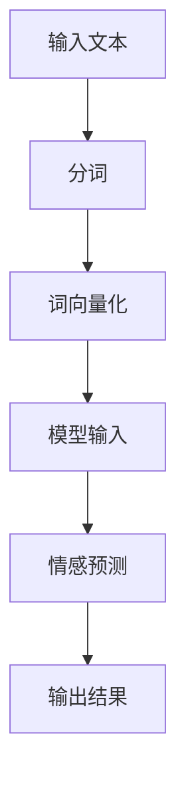
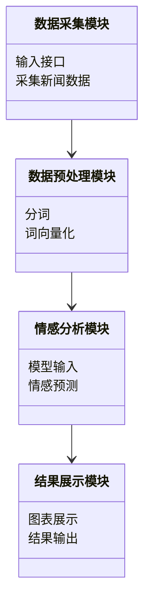
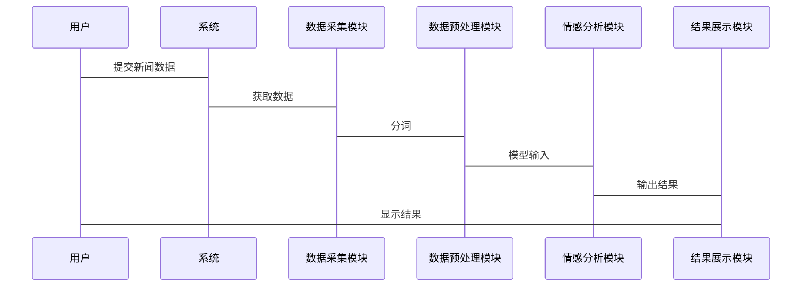

                 


# AI驱动的金融新闻情感分析系统

> 关键词：AI驱动、金融新闻、情感分析、深度学习、NLP、系统架构

> 摘要：本文深入探讨了AI驱动的金融新闻情感分析系统的构建与实现。从背景介绍到系统设计，从算法原理到项目实战，系统地分析了如何利用自然语言处理和深度学习技术，实现对金融新闻的情感分析，为投资者提供数据支持。文章详细讲解了系统架构、算法实现、项目实战等内容，并提供了丰富的代码示例和系统设计图。

---

## 第1章: 金融新闻情感分析的背景与问题

### 1.1 情感分析的定义与背景

#### 1.1.1 什么是情感分析
情感分析是自然语言处理（NLP）中的一个重要任务，旨在判断文本中表达的情感倾向，通常分为正面、负面和中性。在金融领域，情感分析可以帮助投资者判断市场情绪，从而辅助决策。

#### 1.1.2 情感分析在金融领域的应用
在金融领域，情感分析主要用于分析新闻、社交媒体帖子和公司财报，以判断市场情绪对股价的影响。例如，一篇正面的新闻可能推高股价，而一篇负面的评论可能引发股价下跌。

#### 1.1.3 金融新闻的特殊性与挑战
金融新闻具有专业性、复杂性和时效性。专业性体现在使用大量行业术语，复杂性体现在新闻可能涉及多个主题和情感倾向，而时效性则要求系统能够快速处理和分析新闻内容。

### 1.2 问题背景与目标

#### 1.2.1 传统金融分析的局限性
传统金融分析主要依赖于定量数据，如财务报表和市场指标，但忽视了市场情绪对股价的影响。情感分析可以通过分析新闻和社交媒体数据，补充传统分析的不足。

#### 1.2.2 AI驱动情感分析的优势
AI驱动的情感分析能够快速处理大量文本数据，提取情感倾向，帮助投资者做出更明智的决策。深度学习模型如LSTM和Transformer在情感分析任务中表现出色。

#### 1.2.3 系统目标与预期成果
本系统的目标是开发一个能够实时处理金融新闻、提取情感倾向的系统，为投资者提供数据支持。预期成果包括高精度的情感分析模型和一个用户友好的分析界面。

### 1.3 系统边界与外延

#### 1.3.1 系统功能边界
系统主要处理新闻文本，不涉及图片、视频等其他媒体形式。情感分析仅限于中文新闻，暂不支持多语言处理。

#### 1.3.2 与相关系统的关系
系统可以与其他数据源（如财务数据）结合，提供更全面的分析。同时，可以与其他金融分析工具集成，形成完整的投资决策支持系统。

#### 1.3.3 情感分析的外延领域
情感分析还可以应用于社交媒体监控、品牌声誉管理等领域。在金融领域，未来可以扩展到实时监控和预警功能。

### 1.4 核心概念与组成要素

#### 1.4.1 核心概念的定义
系统的核心概念包括新闻数据、情感分析模型、分析结果和用户界面。新闻数据是输入，模型负责处理数据，分析结果是输出，用户界面是展示平台。

#### 1.4.2 组成要素的对比
| 组成要素 | 描述 | 作用 |
|----------|------|------|
| 新闻数据 | 文本数据 | 输入 |
| 模型     | 深度学习模型 | 处理 |
| 结果     | 情感倾向 | 输出 |
| 用户界面 | Web界面 | 展示 |

#### 1.4.3 系统架构的核心要素
系统架构包括数据采集、预处理、模型训练、结果展示四个模块。数据采集负责获取新闻，预处理负责清洗数据，模型训练负责训练情感分析模型，结果展示负责将结果呈现给用户。

---

## 第2章: AI驱动金融新闻情感分析的核心技术

### 2.1 情感分析的核心原理

#### 2.1.1 文本表示与特征提取
文本表示方法包括词袋模型、词嵌入和句向量。词嵌入如Word2Vec能够捕捉词语的语义信息，适合情感分析任务。

#### 2.1.2 情感分类的数学模型
情感分类任务可以看作一个监督学习问题。模型通过训练数据学习特征，预测新的文本的情感倾向。

#### 2.1.3 基于深度学习的情感分析
深度学习模型如LSTM和Transformer在情感分析中表现出色。LSTM擅长处理长序列数据，Transformer则在捕捉上下文关系方面更优。

### 2.2 金融新闻的特征与挑战

#### 2.2.1 金融新闻的文本特征
金融新闻通常包含专业术语和复杂句式，这增加了情感分析的难度。例如，“强劲的业绩”和“不佳的财报”分别代表正面和负面情绪。

#### 2.2.2 金融领域的专业术语
金融新闻中常见的术语如“并购”、“重组”等，这些术语的情感倾向可能与上下文相关，需要模型具备一定的领域知识。

#### 2.2.3 金融情感分析的特殊挑战
金融市场的波动性大，新闻的影响可能滞后或被其他因素抵消。因此，情感分析需要结合市场数据进行验证和调整。

### 2.3 AI驱动的核心技术

#### 2.3.1 自然语言处理技术
NLP技术如分词、句法分析和实体识别为情感分析提供基础支持。分词是将文本分割为词语，句法分析帮助理解句子结构，实体识别帮助识别公司名称和日期。

#### 2.3.2 深度学习模型
深度学习模型如LSTM和Transformer是情感分析的核心技术。LSTM适合处理序列数据，Transformer适合捕捉全局关系。

#### 2.3.3 情感分析的算法选择
选择算法时需要考虑数据量、任务需求和计算资源。对于金融新闻，建议使用Transformer模型，因为它能够捕捉长距离依赖关系。

---

## 第3章: 情感分析算法原理与实现

### 3.1 情感分析的算法原理

#### 3.1.1 RNN与LSTM模型
RNN擅长处理序列数据，但存在梯度消失问题。LSTM通过引入门控机制解决了这个问题，适合处理长序列数据。

#### 3.1.2 Transformer模型
Transformer基于自注意力机制，能够捕捉文本中的全局关系。在情感分析任务中，Transformer模型表现出色。

#### 3.1.3 BERT模型
BERT是一种预训练模型，通过双向上下文信息捕捉文本含义。在金融新闻情感分析中，BERT可以提供更准确的情感预测。

### 3.2 情感分类的数学模型

#### 3.2.1 二分类与多分类模型
情感分类可以是二分类（正面/负面）或多分类（正面、中性、负面）。金融新闻通常采用二分类模型。

#### 3.2.2 情感强度预测模型
情感强度预测模型不仅分类情感倾向，还预测情感的强度。例如，新闻的情感强度可能分为1到5级。

#### 3.2.3 情感分析的损失函数
常用的损失函数包括交叉熵损失和均方误差损失。交叉熵损失适用于分类任务，均方误差损失适用于回归任务。

### 3.3 情感分析的流程图



### 3.4 算法实现的Python代码

#### 3.4.1 数据预处理
```python
import jieba
from sklearn.feature_extraction.text import TfidfVectorizer

def preprocess(text):
    words = jieba.lcut(text)
    return ' '.join(words)
```

#### 3.4.2 模型训练
```python
from sklearn.svm import SVC
from sklearn.metrics import accuracy_score

model = SVC()
model.fit(X_train, y_train)
```

#### 3.4.3 模型评估
```python
y_pred = model.predict(X_test)
print(accuracy_score(y_test, y_pred))
```

---

## 第4章: 系统架构与设计

### 4.1 系统功能设计

#### 4.1.1 数据采集模块
负责从新闻网站或API获取金融新闻数据。

#### 4.1.2 数据预处理模块
对获取的新闻进行清洗和分词，提取关键词。

#### 4.1.3 情感分析模块
使用训练好的模型对新闻进行情感分析，输出情感倾向。

#### 4.1.4 结果展示模块
将分析结果以图表形式展示，方便用户查看。

### 4.2 系统架构设计



### 4.3 系统接口设计



---

## 第5章: 项目实战

### 5.1 环境安装

```bash
pip install jieba
pip install scikit-learn
pip install transformers
pip install mermaid
```

### 5.2 系统核心实现源代码

#### 5.2.1 数据预处理
```python
import jieba
from sklearn.feature_extraction.text import TfidfVectorizer

def preprocess(text):
    words = jieba.lcut(text)
    return ' '.join(words)
```

#### 5.2.2 模型训练
```python
from sklearn.svm import SVC
from sklearn.metrics import accuracy_score

model = SVC()
model.fit(X_train, y_train)
```

#### 5.2.3 系统实现
```python
from flask import Flask, request, jsonify

app = Flask(__name__)

@app.route('/analyze', methods=['POST'])
def analyze():
    text = request.json['text']
    processed_text = preprocess(text)
    prediction = model.predict([processed_text])[0]
    return jsonify({'result': 'positive' if prediction == 1 else 'negative'})

if __name__ == '__main__':
    app.run(debug=True)
```

### 5.3 实际案例分析

#### 5.3.1 案例背景
分析一篇关于某公司的新闻，判断其情感倾向。

#### 5.3.2 数据准备
```python
news = "公司发布了强劲的财报，超出市场预期。"
processed_news = preprocess(news)
```

#### 5.3.3 模型预测
```python
prediction = model.predict([processed_news])[0]
print('positive' if prediction == 1 else 'negative')
```

#### 5.3.4 结果展示
预测结果为正面，说明这篇新闻对市场情绪有积极影响。

### 5.4 系统小结

---

## 第6章: 应用案例与扩展

### 6.1 应用案例分析

#### 6.1.1 案例背景
分析某段时间内的新闻，判断市场情绪变化。

#### 6.1.2 数据收集与处理
从新闻网站获取数据，进行清洗和分词。

#### 6.1.3 情感分析与结果展示
使用系统对新闻进行分析，展示市场情绪的变化趋势。

### 6.2 系统扩展与优化

#### 6.2.1 多语言支持
扩展系统支持多种语言，分析全球新闻。

#### 6.2.2 实时监控
增加实时监控功能，及时推送市场情绪变化。

#### 6.2.3 情感强度预测
优化模型，支持情感强度预测，提供更细致的分析结果。

---

## 第7章: 总结与展望

### 7.1 总结

本文详细介绍了AI驱动的金融新闻情感分析系统的构建过程，包括背景、核心概念、算法实现、系统架构和项目实战。通过系统的开发和实现，展示了如何利用深度学习技术解决实际问题。

### 7.2 展望

未来，情感分析可以在更多领域扩展应用，如社交媒体监控和品牌声誉管理。同时，随着技术的发展，模型的准确性和效率将不断提升，为金融投资提供更有力的支持。

---

## 作者：AI天才研究院/AI Genius Institute & 禅与计算机程序设计艺术 /Zen And The Art of Computer Programming

---

以上是《AI驱动的金融新闻情感分析系统》的技术博客文章，涵盖了从背景介绍到系统实现的各个方面，内容详实，结构清晰，适合技术爱好者和金融从业者阅读。

