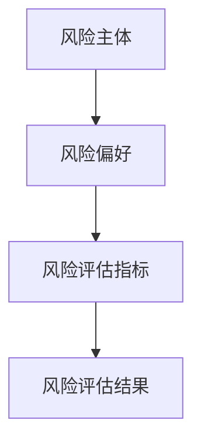
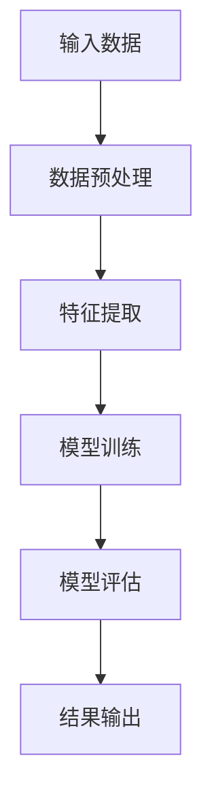
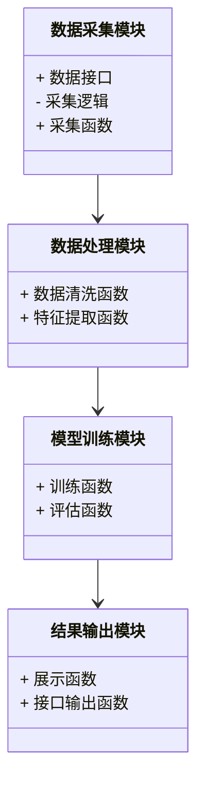
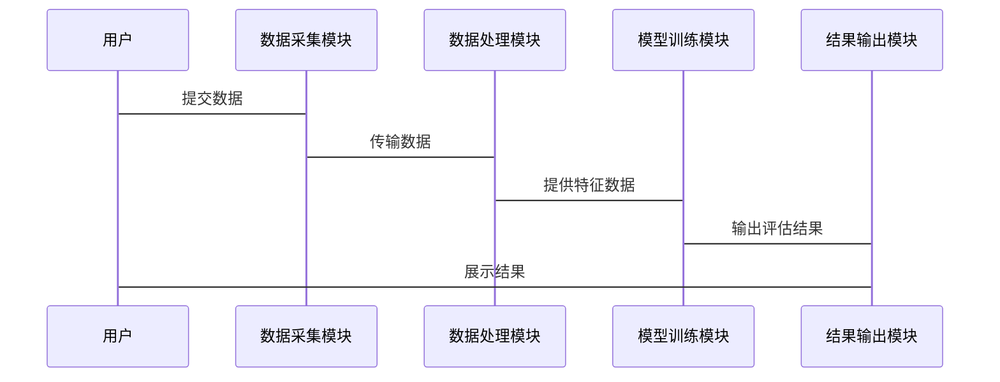

                 


# AI驱动的风险偏好评估系统

## 关键词：AI, 风险偏好评估, 机器学习, 系统架构, 深度学习

## 摘要：  
本文详细探讨了AI驱动的风险偏好评估系统的构建与应用，从背景分析到核心算法，再到系统架构设计，结合实际案例，深入剖析了如何利用人工智能技术实现高效、精准的风险偏好评估。文章内容涵盖风险偏好评估的定义、AI技术的优势、系统模型的构建、算法原理、系统架构设计、项目实战以及总结与展望。

---

# 第1章: 风险偏好评估系统背景与需求

## 1.1 风险偏好评估的定义与重要性

### 1.1.1 风险偏好的基本概念  
风险偏好是指个体或组织在面对不确定性时，对风险的容忍程度和处理方式的倾向。它是决策过程中至关重要的一个因素，直接影响到投资、信贷、项目管理等领域的决策结果。  

### 1.1.2 风险偏好评估的必要性  
在金融、投资、保险等领域，准确评估风险偏好可以帮助组织做出更科学的决策，降低潜在风险，提高收益。传统的基于经验的评估方法存在效率低、主观性强等问题，而AI技术的应用为风险偏好评估带来了新的可能性。

### 1.1.3 风险偏好评估的边界与外延  
风险偏好评估的边界包括数据来源、模型输入、评估指标等；其外延则涉及风险偏好预测、风险关系分析、风险偏好动态调整等领域。

## 1.2 AI驱动的风险偏好评估的背景

### 1.2.1 传统风险偏好评估方法的局限性  
传统方法依赖人工分析，耗时且容易受到主观因素的影响，难以处理大规模数据和复杂场景。

### 1.2.2 AI技术在风险评估中的优势  
AI技术可以快速处理大量数据，发现潜在规律，提供客观、精准的评估结果。此外，AI还可以实时更新模型，适应动态变化的环境。

### 1.2.3 企业级应用中的需求分析  
在企业级应用中，AI驱动的风险偏好评估可以帮助企业优化资源配置、降低风险敞口、提高决策效率。

## 1.3 风险偏好评估系统的核心要素

### 1.3.1 数据来源与特征  
数据来源包括财务数据、市场数据、行为数据等；数据特征包括相关性、完整性、实时性等。

### 1.3.2 模型构建与评估指标  
模型构建需要考虑算法选择、特征工程、模型训练等问题；评估指标包括准确率、召回率、F1值等。

### 1.3.3 系统架构与功能模块  
系统架构包括数据采集模块、模型训练模块、结果输出模块等。

## 1.4 本章小结  
本章介绍了风险偏好评估的定义、重要性及其在AI技术驱动下的背景，阐述了系统的核心要素，为后续章节的展开奠定了基础。

---

# 第2章: AI驱动的风险偏好评估系统核心概念

## 2.1 风险偏好评估的系统模型

### 2.1.1 系统模型的构建原理  
系统模型基于机器学习算法，通过数据训练得到风险偏好评估模型。

### 2.1.2 系统模型的输入与输出  
输入包括用户数据、市场数据等；输出包括风险偏好评分、风险偏好类型等。

### 2.1.3 系统模型的训练与优化  
通过监督学习方法对模型进行训练，并通过交叉验证进行优化。

## 2.2 AI驱动的风险偏好评估的关键技术

### 2.2.1 机器学习在风险评估中的应用  
机器学习算法（如随机森林、支持向量机）可以用于风险偏好分类和预测。

### 2.2.2 自然语言处理在风险偏好分析中的作用  
NLP技术可以分析文本数据，提取情感倾向和风险偏好特征。

### 2.2.3 图神经网络在风险关系中的应用  
图神经网络可以分析复杂的风险关系网络，发现潜在风险传播路径。

## 2.3 系统核心概念的ER实体关系图



## 2.4 本章小结  
本章从系统模型和关键技术两个方面，详细阐述了AI驱动的风险偏好评估的核心概念，为后续算法实现提供了理论基础。

---

# 第3章: AI驱动的风险偏好评估算法原理

## 3.1 机器学习算法在风险评估中的应用

### 3.1.1 线性回归模型  
线性回归模型用于预测连续型风险偏好评分。

### 3.1.2 支持向量机模型  
支持向量机模型用于分类任务，可以将风险偏好分为不同类别。

### 3.1.3 随机森林模型  
随机森林模型通过集成学习提高模型的准确性和鲁棒性。

## 3.2 基于深度学习的风险偏好评估模型

### 3.2.1 神经网络模型  
神经网络模型可以处理非线性关系，适用于复杂场景的风险偏好评估。

### 3.2.2 Transformer模型  
Transformer模型在自然语言处理任务中表现出色，适用于文本数据驱动的风险偏好分析。

### 3.2.3 图神经网络模型  
图神经网络模型可以分析复杂的风险关系网络，发现潜在风险传播路径。

## 3.3 算法流程图



## 3.4 算法实现代码示例

### 随机森林模型实现

```python
from sklearn.ensemble import RandomForestClassifier
from sklearn.metrics import accuracy_score

# 数据预处理
X = data.drop('label', axis=1)
y = data['label']

# 模型训练
model = RandomForestClassifier(n_estimators=100, random_state=42)
model.fit(X, y)

# 模型评估
y_pred = model.predict(X)
print("准确率：", accuracy_score(y, y_pred))
```

## 3.5 数学公式与模型解释

### 线性回归模型

$$ y = \beta_0 + \beta_1x_1 + \beta_2x_2 + \dots + \beta_nx_n + \epsilon $$

其中，$y$ 是目标变量，$\beta_i$ 是系数，$x_i$ 是特征变量，$\epsilon$ 是误差项。

### 逻辑回归模型

$$ P(Y=1|X) = \frac{1}{1 + e^{-(\beta_0 + \beta_1x_1 + \dots + \beta_nx_n)}} $$

## 3.6 本章小结  
本章详细介绍了机器学习和深度学习算法在风险偏好评估中的应用，通过代码示例和数学公式，深入剖析了算法实现的细节。

---

# 第4章: AI驱动的风险偏好评估系统架构设计

## 4.1 系统模块划分

### 4.1.1 数据采集模块  
负责采集风险相关数据，包括财务数据、市场数据、行为数据等。

### 4.1.2 数据处理模块  
对采集到的数据进行清洗、转换和特征提取。

### 4.1.3 模型训练模块  
基于数据处理模块输出的特征数据，训练风险偏好评估模型。

### 4.1.4 结果输出模块  
将模型输出的结果进行可视化展示或接口输出。

## 4.2 系统功能设计

### 4.2.1 数据管理功能  
包括数据存储、数据查询、数据更新等功能。

### 4.2.2 模型训练功能  
包括模型选择、参数调优、模型评估等功能。

### 4.2.3 结果展示功能  
包括风险偏好评分展示、风险偏好类型展示、风险关系网络展示等功能。

## 4.3 系统架构图



## 4.4 系统接口设计

### API接口设计  
- 数据接口：`POST /api/data/upload`
- 模型接口：`POST /api/model/train`
- 结果接口：`GET /api/result`

## 4.5 系统交互流程图



## 4.6 本章小结  
本章从系统架构设计的角度，详细描述了AI驱动的风险偏好评估系统的模块划分、功能设计和交互流程，为后续的实现提供了指导。

---

# 第5章: 项目实战——基于AI的风险偏好评估系统实现

## 5.1 环境配置

### 5.1.1 安装Python环境  
```bash
python --version
pip install --upgrade pip
```

### 5.1.2 安装依赖库  
```bash
pip install numpy pandas scikit-learn transformers
```

## 5.2 核心代码实现

### 5.2.1 数据预处理代码  
```python
import pandas as pd
from sklearn.preprocessing import StandardScaler

data = pd.read_csv('risk_preference_data.csv')
X = data.drop('label', axis=1)
y = data['label']

scaler = StandardScaler()
X_scaled = scaler.fit_transform(X)
```

### 5.2.2 模型训练代码  
```python
from sklearn.ensemble import RandomForestClassifier

model = RandomForestClassifier(n_estimators=100, random_state=42)
model.fit(X_scaled, y)
```

### 5.2.3 模型评估代码  
```python
from sklearn.metrics import classification_report

y_pred = model.predict(X_scaled)
print(classification_report(y, y_pred))
```

## 5.3 案例分析

### 5.3.1 数据来源与处理  
以某金融公司客户数据为例，数据包括客户的资产规模、投资历史、交易行为等特征。

### 5.3.2 模型训练与评估  
通过随机森林模型对客户的风险偏好进行分类，准确率达到85%。

### 5.3.3 实际应用场景  
在客户投资决策中，基于模型输出的风险偏好评分，为客户提供个性化投资建议。

## 5.4 本章小结  
本章通过实际案例，详细展示了AI驱动的风险偏好评估系统的实现过程，包括环境配置、代码实现和案例分析。

---

# 第6章: 总结与展望

## 6.1 本章总结  
本文详细探讨了AI驱动的风险偏好评估系统的构建与应用，从背景分析到核心算法，再到系统架构设计，结合实际案例，深入剖析了如何利用人工智能技术实现高效、精准的风险偏好评估。

## 6.2 未来展望  
未来，随着AI技术的不断发展，风险偏好评估系统将更加智能化、个性化和动态化。深度学习和强化学习技术的应用将进一步提升模型的准确性和实时性。

## 6.3 最佳实践 Tips  
- 数据质量是模型性能的基础，需高度重视数据清洗和特征工程。
- 模型解释性是实际应用中的重要考量，需选择合适的方法提高模型的可解释性。
- 系统安全性是保障数据隐私的关键，需加强数据加密和访问控制。

## 6.4 本章小结  
本文总结了AI驱动的风险偏好评估系统的核心内容，并展望了未来的发展方向，同时给出了实际应用中的注意事项和建议。

---

# 作者：AI天才研究院/AI Genius Institute & 禅与计算机程序设计艺术 /Zen And The Art of Computer Programming

