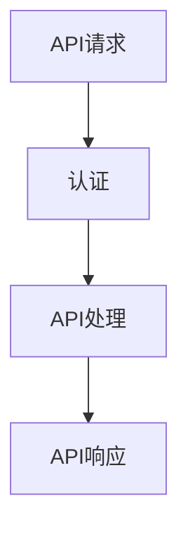
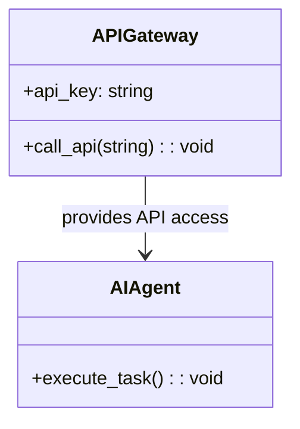
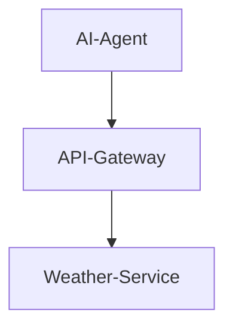

                 


# API集成：扩展AI Agent的功能与数据源

## 关键词：API集成、AI Agent、数据源扩展、功能扩展、算法原理、系统架构设计

## 摘要：  
本文深入探讨了API集成在扩展AI Agent功能和数据源中的关键作用。通过分析API集成的核心概念、算法原理、系统架构设计以及实际项目案例，本文为读者提供了从理论到实践的全面指导，帮助他们理解并掌握如何通过API集成提升AI Agent的能力。

---

# 第一章: API集成与AI Agent的背景介绍

## 1.1 问题背景与描述

### 1.1.1 当前AI Agent的发展现状
AI Agent（智能代理）正在迅速发展，广泛应用于自动化任务执行、数据处理和决策支持等领域。然而，AI Agent的功能和数据源通常受限于其内部资源，无法充分利用外部系统的潜力。

### 1.1.2 问题描述
AI Agent的能力受到其内置功能和数据源的限制，难以适应复杂多变的外部环境和多样化的需求。

### 1.1.3 问题解决思路与目标
通过API集成，将外部系统的能力和数据源引入AI Agent，扩展其功能和数据获取范围。

### 1.1.4 核心概念结构与组成
API集成、AI Agent、数据源扩展、功能扩展

## 1.2 核心概念与问题解决

### 1.2.1 问题的边界与外延
API集成不仅涉及技术实现，还涉及数据安全、性能优化和用户体验等方面。

---

# 第二章: API集成的核心概念与联系

## 2.1 API集成的原理与机制

### 2.1.1 API的定义与分类
API（应用程序编程接口）是系统间的通信接口。根据功能，API可分为RESTful API、WebSocket API等。

### 2.1.2 API的调用流程与协议
API调用通常包括请求、认证、处理和响应四个步骤，遵循HTTP协议。

## 2.2 AI Agent的功能扩展

### 2.2.1 API作为功能扩展的桥梁
通过调用外部API，AI Agent可以获取天气数据、地理位置信息等，实现功能扩展。

## 2.3 数据源扩展

### 2.3.1 数据源的分类与特点
数据源可分为结构化数据（如数据库）和非结构化数据（如文本文件），每种类型有其特点和应用场景。

---

# 第三章: AI Agent的原理与API集成的关系

## 3.1 AI Agent的基本原理

### 3.1.1 AI Agent的结构与组成
AI Agent通常包括感知层、决策层和执行层，每个层负责不同的功能。

## 3.2 API集成在AI Agent中的作用

### 3.2.1 API作为数据源的作用
通过API集成，AI Agent可以实时获取外部数据，提升决策的准确性。

---

# 第四章: API集成的算法原理与实现

## 4.1 API集成的算法原理

### 4.1.1 API调用的流程图


## 4.2 算法实现的代码示例

### 4.2.1 API调用的Python代码
```python
import requests

response = requests.get('https://api.example.com/data')
data = response.json()
print(data)
```

## 4.3 数学模型

### 4.3.1 概率论模型
$$ P(A|B) = \frac{P(B|A)P(A)}{P(B)} $$

---

# 第五章: 数学模型的建立与应用

## 5.1 数学模型的定义与作用
数学模型用于描述API集成中的数据关系，帮助优化API调用的效率。

---

# 第六章: 系统架构设计与实现

## 6.1 问题场景介绍

### 6.1.1 问题场景描述
设计一个AI Agent，通过API集成获取天气数据，实现智能提醒功能。

## 6.2 系统功能设计

### 6.2.1 领域模型


## 6.3 系统架构设计

### 6.3.1 系统架构图


---

# 第七章: 项目实战与案例分析

## 7.1 项目实战

### 7.1.1 环境安装
安装必要的Python库，如`requests`和`mermaid`。

### 7.1.2 代码实现
```python
import requests

def fetch_weather_data(api_key):
    response = requests.get(f'https://api.example.com/weather?api_key={api_key}')
    return response.json()

def main():
    api_key = 'your_api_key'
    weather_data = fetch_weather_data(api_key)
    print(weather_data)

if __name__ == '__main__':
    main()
```

---

# 第八章: 总结与展望

## 8.1 总结
API集成是扩展AI Agent功能和数据源的关键技术，通过合理的系统设计和算法优化，可以显著提升AI Agent的能力。

## 8.2 展望
未来，API集成将更加智能化，支持更多复杂场景，进一步推动AI Agent的发展。

---

# 作者
作者：AI天才研究院/AI Genius Institute  
作者：禅与计算机程序设计艺术/Zen And The Art of Computer Programming

