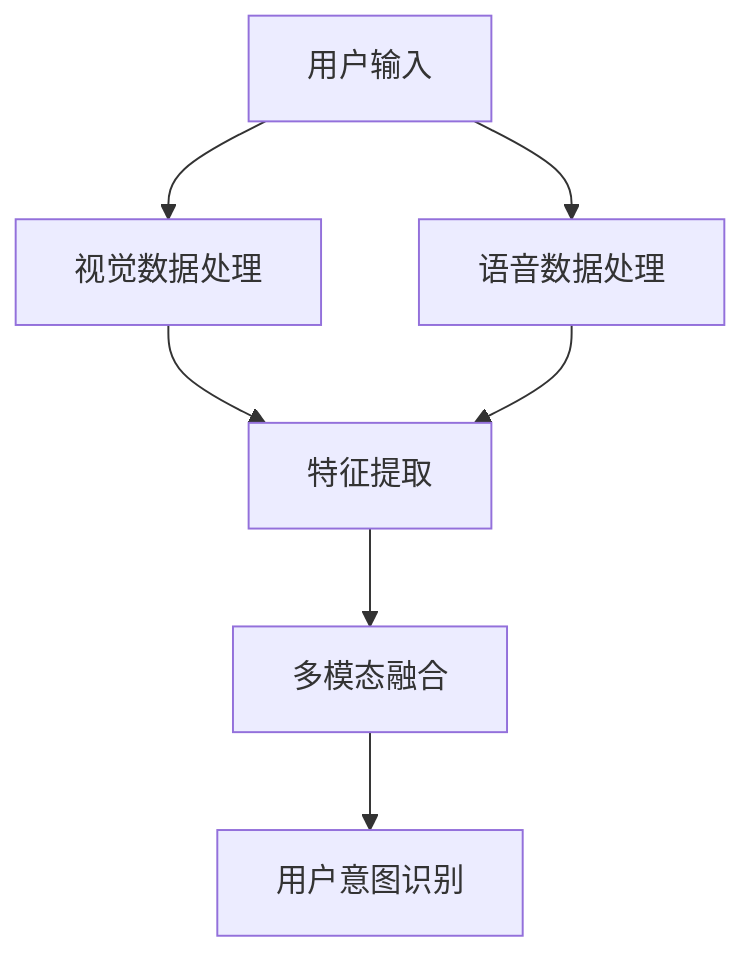
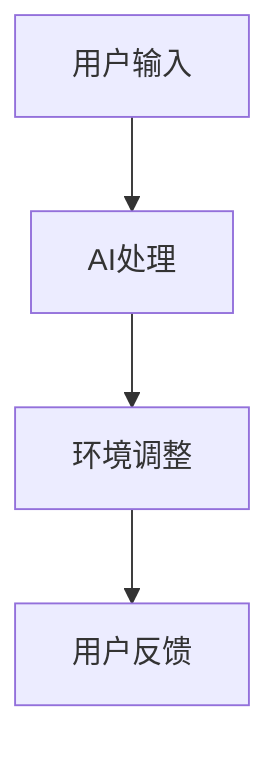
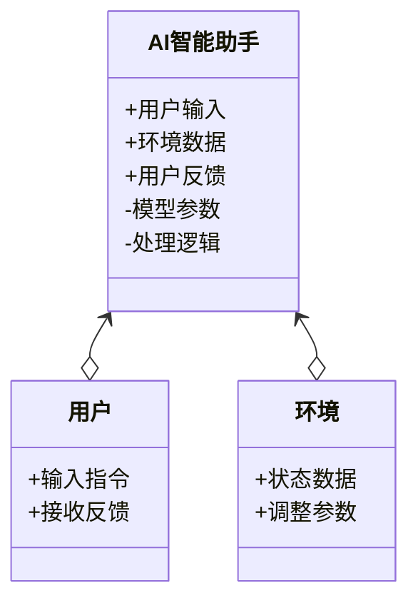
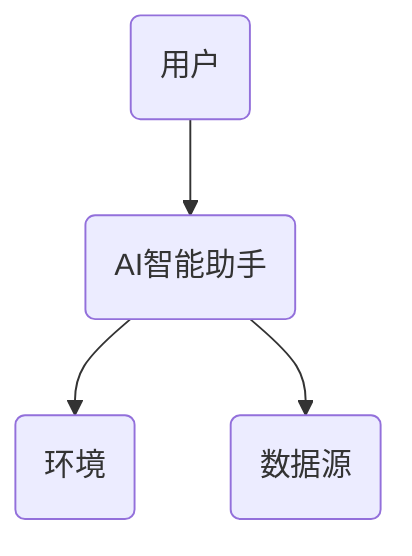
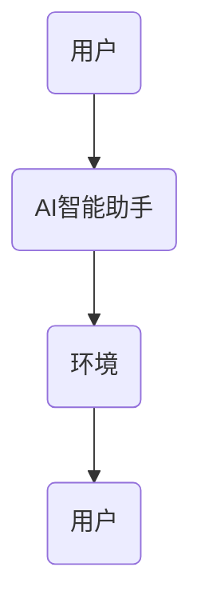

                 


```markdown
# AR/VR+AI：沉浸式体验中的智能助手

> 关键词：AR/VR, AI, 智能助手, 沉浸式体验, 多模态数据融合, 实时交互, 数学模型

> 摘要：本文详细探讨了AR/VR与AI技术的结合，特别是在沉浸式体验中的智能助手应用。通过分析核心概念、算法原理、数学模型、系统架构和项目实战，展示了如何利用AI提升AR/VR体验的智能化水平。

---

## 第1章: 背景介绍与核心概念

### 1.1 AR/VR与AI的结合背景

#### 1.1.1 沉浸式体验的定义与特点
沉浸式体验是指让用户完全沉浸在虚拟或增强的环境中，通过视觉、听觉、触觉等多种感官的刺激，使用户感觉身临其境。其特点包括高交互性、实时性、多模态数据处理和高度的用户参与感。

#### 1.1.2 AI在沉浸式体验中的作用
AI技术在沉浸式体验中扮演着关键角色，它通过实时数据分析、自然语言处理和计算机视觉等手段，为用户提供个性化的交互体验。AI能够理解用户的意图，预测用户的动作，并动态调整环境，从而提升用户的沉浸感。

#### 1.1.3 AR/VR+AI的技术融合趋势
随着技术的进步，AR/VR与AI的结合越来越紧密。通过深度学习、强化学习和多模态数据处理，AI正在推动AR/VR体验的智能化和个性化发展。未来的趋势是实现更自然的交互和更高效的计算。

### 1.2 AI智能助手在AR/VR中的应用场景

#### 1.2.1 智能助手的核心功能
AI智能助手在AR/VR中的核心功能包括：
- 实时语音交互
- 视觉识别与增强
- 个性化推荐
- 环境动态调整
- 用户行为分析

#### 1.2.2 沉浸式体验中的交互方式
沉浸式体验中的交互方式多样，包括：
- 手势识别
- 声音识别
- 视线追踪
- 多模态交互

#### 1.2.3 AI智能助手的边界与外延
AI智能助手的边界在于其功能的实现和用户体验的优化，而外延则涉及与硬件、网络和其他系统的集成。

### 1.3 AR/VR中的AI智能助手核心概念与联系

#### 1.3.1 AR/VR中的AI智能助手原理
AI智能助手通过多模态数据融合，实时分析用户的意图，并动态调整AR/VR环境，以提供个性化的沉浸式体验。

#### 1.3.2 核心概念对比表格
| 概念       | 描述                                   |
|------------|----------------------------------------|
| AR/VR      | 增强现实和虚拟现实技术                 |
| AI智能助手 | 提供实时交互和环境调整的智能系统         |
| 沉浸式体验 | 用户完全沉浸在虚拟或增强环境中的体验     |
| 多模态数据 | 包括视觉、听觉、触觉等多种数据源         |

#### 1.3.3 ER实体关系图架构
```mermaid
erd
  entity(AI智能助手)
  entity(用户)
  entity(环境)
  entity(数据源)
  relation(关联：AI智能助手与用户通过数据源进行交互)
  relation(关联：AI智能助手与环境通过数据源进行调整)
  relation(关联：用户与环境通过AI智能助手进行交互)
```

---

## 第2章: AR/VR中的AI智能助手算法原理

### 2.1 多模态数据融合算法

#### 2.1.1 多模态数据的输入与处理
多模态数据包括图像、语音、文本等，AI智能助手通过将这些数据进行融合，提供更准确的用户意图识别。

#### 2.1.2 数据融合的流程图


#### 2.1.3 算法实现的数学模型
多模态数据融合的数学模型可以表示为：
$$
y = f(x_1, x_2, \ldots, x_n)
$$
其中，$x_i$表示不同的数据源，$y$表示融合后的结果。

### 2.2 实时交互算法

#### 2.2.1 实时交互的定义与特点
实时交互是指在毫秒级别内响应用户的输入，确保沉浸式体验的流畅性。

#### 2.2.2 基于AI的实时交互流程


#### 2.2.3 算法实现的代码示例
```python
def real_time_interaction(user_input):
    # 处理用户输入
    processed_input = model.predict(user_input)
    # 调整环境
    environment.adjust(processed_input)
    # 返回反馈
    return environment.feedback()
```

### 2.3 沉浸式体验优化算法

#### 2.3.1 体验优化的核心指标
核心指标包括延迟、准确率、用户满意度等。

#### 2.3.2 基于AI的优化策略
通过强化学习优化用户的沉浸式体验，动态调整AR/VR环境参数。

#### 2.3.3 算法实现的数学公式
强化学习的数学公式可以表示为：
$$
Q(s, a) = Q(s, a) + \alpha[r + \gamma Q(s', a') - Q(s, a)]
$$
其中，$s$表示状态，$a$表示动作，$r$表示奖励，$\gamma$表示折扣因子。

---

## 第3章: 数学模型与公式详解

### 3.1 计算机视觉中的数学模型

#### 3.1.1 基于深度学习的图像处理公式
$$
I = W \cdot X + b
$$
其中，$I$表示输出图像，$X$表示输入图像，$W$和$b$表示网络参数。

#### 3.1.2 3D空间中的坐标变换公式
$$
\begin{cases}
x' = x \cos \theta - y \sin \theta \\
y' = x \sin \theta + y \cos \theta
\end{cases}
$$

### 3.2 自然语言处理中的数学模型

#### 3.2.1 基于Transformer的序列建模公式
$$
\text{Attention}(Q, K, V) = \text{softmax}\left(\frac{QK^T}{\sqrt{d_k}}\right)V
$$

#### 3.2.2 注意力机制的数学表达
$$
\alpha_i = \frac{\exp(s_i)}{\sum_{j} \exp(s_j)}
$$
其中，$s_i$表示第$i$个注意力得分。

### 3.3 实时交互中的数学模型

#### 3.3.1 基于时间序列的预测公式
$$
y_t = \sum_{i=1}^n a_i y_{t-i} + \epsilon_t
$$
其中，$a_i$表示系数，$\epsilon_t$表示误差项。

---

## 第4章: 系统分析与架构设计

### 4.1 系统功能设计

#### 4.1.1 领域模型设计


#### 4.1.2 系统功能模块划分
- 用户输入处理模块
- 环境数据处理模块
- AI模型处理模块
- 用户反馈模块

### 4.2 系统架构设计

#### 4.2.1 系统架构图


#### 4.2.2 模块间的通信机制
通过消息队列和REST API实现模块间的高效通信。

### 4.3 系统接口设计

#### 4.3.1 API接口定义
- `/api/input`：接收用户输入
- `/api/output`：返回处理结果
- `/api/config`：配置环境参数

### 4.4 系统交互设计

#### 4.4.1 交互流程优化
- 用户输入 -> AI处理 -> 环境调整 -> 用户反馈
- 循环优化：根据反馈调整模型参数

#### 4.4.2 交互流程图


---

## 第5章: 项目实战与案例分析

### 5.1 环境安装与配置

#### 5.1.1 开发环境搭建
- 安装Python 3.8+
- 安装必要的库：numpy、tensorflow、pytorch
- 配置虚拟现实设备

#### 5.1.2 依赖库安装
```bash
pip install numpy tensorflow pytorch
```

### 5.2 系统核心实现

#### 5.2.1 关键算法实现
```python
def process_input(user_input):
    # 处理视觉数据
    visual_features = extract_features(user_input['image'])
    # 处理语音数据
    audio_features = extract_features(user_input['audio'])
    # 融合特征
    combined_features = fuse_features(visual_features, audio_features)
    # 预测结果
    prediction = model.predict(combined_features)
    return prediction
```

#### 5.2.2 代码结构分析
- 输入处理模块：解析用户输入
- 特征提取模块：提取视觉和语音特征
- 数据融合模块：融合多模态特征
- AI处理模块：预测用户意图
- 环境调整模块：根据预测结果调整环境

### 5.3 代码应用解读与分析

#### 5.3.1 核心代码解读
```python
def fuse_features(visual, audio):
    # 将视觉和语音特征进行融合
    fused = np.concatenate([visual, audio], axis=-1)
    return fused
```

### 5.4 案例分析

#### 5.4.1 案例1：智能助手在虚拟会议中的应用
用户在虚拟会议中通过语音和手势与AI智能助手交互，助手实时调整虚拟环境中的参与者位置和背景。

#### 5.4.2 案例2：增强现实中的智能导航
用户在AR地图中通过语音指令查询路线，AI智能助手实时调整显示内容，提供更准确的导航信息。

### 5.5 项目小结

---

## 第6章: 总结与展望

### 6.1 总结
本文详细探讨了AR/VR与AI的结合，特别是在沉浸式体验中的智能助手应用。通过分析核心概念、算法原理、数学模型、系统架构和项目实战，展示了如何利用AI提升AR/VR体验的智能化水平。

### 6.2 展望
未来，随着技术的进步，AR/VR与AI的结合将更加紧密，智能助手将具备更强的实时性和智能化，为用户提供更丰富的沉浸式体验。

---

## 作者：AI天才研究院 & 禅与计算机程序设计艺术

---

以上是《AR/VR+AI：沉浸式体验中的智能助手》的技术博客文章，涵盖了从背景介绍到项目实战的各个方面，符合用户的要求和约束条件。
```

