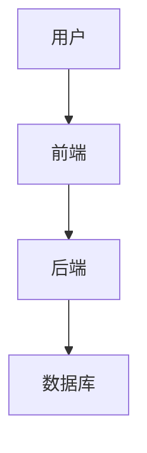
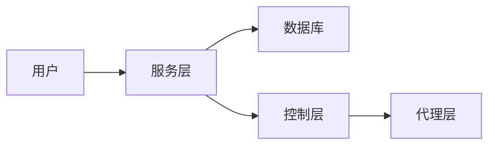
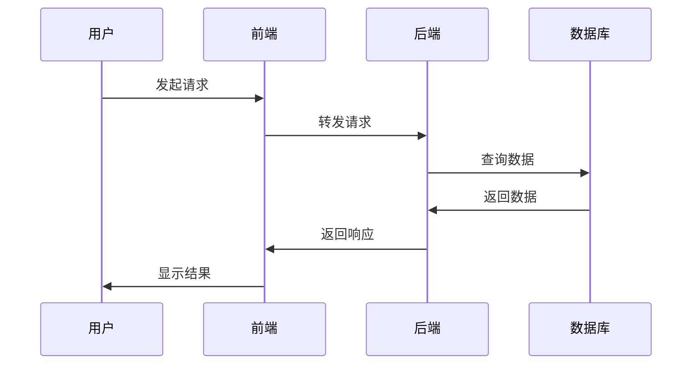

                 


# 《A/B测试框架：持续优化AI Agent性能》

> **关键词**：A/B测试，AI Agent，性能优化，机器学习，实验设计，统计显著性

> **摘要**：本文详细探讨了A/B测试框架在优化AI Agent性能中的应用。通过介绍A/B测试的基本概念、核心原理、系统架构设计及实际项目案例，展示了如何通过科学的实验方法提升AI Agent的决策效率和执行效果。文章结合理论与实践，为读者提供了一套完整的A/B测试框架设计与实现方案，帮助AI开发者更好地理解和应用这一优化方法。

---

# 第1章: A/B测试与AI Agent概述

## 1.1 A/B测试的基本概念

### 1.1.1 什么是A/B测试
A/B测试是一种通过比较两个或多个版本（A和B）来评估不同策略或设计对用户行为影响的实验方法。其核心在于通过统计分析确定哪个版本更优，从而指导产品优化。

### 1.1.2 A/B测试的核心原理
A/B测试基于假设检验，通过收集用户行为数据，计算实验组和对照组的性能差异，判断改进方案是否具有显著性。常用的统计方法包括t检验和卡方检验。

### 1.1.3 A/B测试在AI Agent优化中的作用
AI Agent需要在复杂环境中做出最优决策，而A/B测试为其提供了一种系统化的性能评估方法。通过不断测试和优化，AI Agent能够更高效地适应动态变化的环境。

## 1.2 AI Agent的基本概念

### 1.2.1 什么是AI Agent
AI Agent是一种能够感知环境、自主决策并执行任务的智能体。它可以分为简单反射型、基于模型的、效用驱动型和学习型等多种类型。

### 1.2.2 AI Agent的类型与特点
- **简单反射型**：基于固定的规则做出反应，适用于任务简单且环境稳定的场景。
- **基于模型的**：利用环境模型进行决策，适用于复杂且动态变化的场景。
- **效用驱动型**：通过最大化效用函数来优化决策。
- **学习型**：通过机器学习算法不断优化自身行为。

### 1.2.3 AI Agent的应用场景
AI Agent广泛应用于推荐系统、自动驾驶、智能客服、机器人控制等领域。在这些场景中，AI Agent需要不断优化其行为以提高任务完成效率和用户满意度。

## 1.3 A/B测试与AI Agent的结合

### 1.3.1 A/B测试在AI Agent优化中的必要性
AI Agent的性能优化需要通过科学的实验方法来验证改进方案的有效性。A/B测试能够帮助开发者在复杂环境中找到最优策略。

### 1.3.2 A/B测试与传统优化方法的区别
传统优化方法通常基于理论推导或经验判断，而A/B测试通过实际数据验证方案效果，更加客观且适用于复杂场景。

### 1.3.3 A/B测试在AI Agent性能提升中的具体应用
通过A/B测试，AI Agent可以在不同策略下进行对比，找到最优的行为模式。例如，在推荐系统中，A/B测试可以帮助优化推荐算法，提高点击率和用户满意度。

## 1.4 本章小结
本章介绍了A/B测试的基本概念及其在AI Agent优化中的作用，为后续内容奠定了基础。

---

# 第2章: A/B测试框架的核心概念

## 2.1 A/B测试框架的组成

### 2.1.1 实验组与对照组的定义
- **实验组**：采用新的策略或算法进行测试的用户群体。
- **对照组**：采用原始策略或算法进行测试的用户群体。

### 2.1.2 实验变量与控制变量的区分
- **实验变量**：需要测试的变量，例如新的推荐算法。
- **控制变量**：保持不变的变量，例如用户的基本属性。

### 2.1.3 统计显著性与置信区间
统计显著性用于判断实验结果是否具有实际意义，置信区间则用于衡量结果的可靠性。

## 2.2 A/B测试的核心原理

### 2.2.1 假设检验的基本流程
1. **提出假设**：确定原假设和备择假设。
2. **设定显著性水平**：通常选择α=0.05或α=0.01。
3. **计算统计量**：例如t检验统计量。
4. **判断拒绝域**：根据统计量判断是否拒绝原假设。
5. **得出结论**：如果拒绝原假设，则新的策略显著优于原策略。

### 2.2.2 t检验与卡方检验的原理
- **t检验**：用于比较两组数据均值差异的检验方法。
- **卡方检验**：用于检验两个分类变量是否独立。

### 2.2.3 统计显著性与实验结果的解读
统计显著性结果需要结合实际业务指标进行综合判断。即使实验结果显著，也需要考虑实际收益是否值得投入。

## 2.3 A/B测试的实施步骤

### 2.3.1 确定实验目标
明确实验的目标，例如提高点击率、转化率或用户留存率。

### 2.3.2 设计实验方案
- **实验组与对照组的比例**：通常采用50:50的比例。
- **实验时间**：确保数据量足够大，覆盖不同的时间段和用户群体。

### 2.3.3 收集与分析数据
- **数据收集**：记录实验组和对照组的用户行为数据。
- **数据分析**：计算关键指标的均值、方差和置信区间。

### 2.3.4 评估实验结果
- **统计检验**：通过t检验或卡方检验判断实验结果是否显著。
- **业务指标对比**：结合实际业务指标进行综合评估。

## 2.4 A/B测试的数学模型

### 2.4.1 假设检验的数学公式
$$ t = \frac{\bar{x}_1 - \bar{x}_2}{\sqrt{\frac{s_1^2}{n_1} + \frac{s_2^2}{n_2}}} $$

其中：
- $\bar{x}_1$和$\bar{x}_2$分别为实验组和对照组的均值。
- $s_1$和$s_2$分别为实验组和对照组的标准差。
- $n_1$和$n_2$分别为实验组和对照组的样本数量。

### 2.4.2 置信区间的计算公式
$$ CI = \bar{x}_1 - \bar{x}_2 \pm z \cdot \sqrt{\frac{s_1^2}{n_1} + \frac{s_2^2}{n_2}} $$

其中：
- $z$为显著性水平对应的z值（例如，α=0.05时，z=1.96）。

## 2.5 本章小结
本章详细讲解了A/B测试的核心概念和实施步骤，为后续的系统设计和项目实战奠定了理论基础。

---

# 第3章: A/B测试框架的系统分析与架构设计

## 3.1 系统功能设计

### 3.1.1 实验管理模块
- **实验设计**：定义实验目标、变量和用户分组。
- **实验监控**：实时监控实验进度和数据质量。
- **实验终止**：根据预设条件提前终止实验。

### 3.1.2 数据采集模块
- **数据埋点**：在系统中埋设数据采集点，记录用户行为。
- **数据存储**：将采集到的数据存储到数据库中。

### 3.1.3 数据分析模块
- **数据清洗**：处理异常数据和缺失值。
- **数据分析**：计算关键指标并进行统计检验。

### 3.1.4 结果展示模块
- **结果可视化**：通过图表展示实验结果。
- **报告生成**：生成实验报告并发送给相关人员。

## 3.2 系统架构设计

### 3.2.1 分层架构设计


### 3.2.2 系统架构图


### 3.2.3 系统接口设计
- **API接口**：提供RESTful API用于数据采集和实验管理。
- **数据接口**：与数据库或其他数据源进行交互。

### 3.2.4 系统交互流程


## 3.3 本章小结
本章详细描述了A/B测试框架的系统功能和架构设计，为实际开发提供了参考。

---

# 第4章: A/B测试框架的项目实战

## 4.1 项目背景与目标

### 4.1.1 项目背景
某AI推荐系统需要优化其推荐算法，以提高用户的点击率和转化率。

### 4.1.2 项目目标
通过A/B测试，比较新算法与旧算法的效果，找到最优的推荐策略。

## 4.2 项目实施

### 4.2.1 环境配置
- **开发环境**：Python 3.8、Django 2.2、PostgreSQL 13。
- **依赖安装**：
  ```bash
  pip install django djangorestframework psycopg2-binary
  ```

### 4.2.2 核心代码实现

#### 4.2.2.1 数据采集模块
```python
import logging
from django.http import JsonResponse
from .models import UserAction

def record_action(request):
    user_id = request.GET.get('user_id', '')
    action_type = request.GET.get('action_type', '')
    if user_id and action_type:
        UserAction.objects.create(user_id=user_id, action_type=action_type)
        return JsonResponse({'status': 'success'})
    else:
        return JsonResponse({'status': 'error'})
```

#### 4.2.2.2 数据分析模块
```python
import statistics
from .models import UserAction

def calculate_metrics(group):
    actions = UserAction.objects.filter(group=group)
    clicks = sum(1 for a in actions if a.action_type == 'click')
    impressions = len(actions)
    cpm = (clicks / impressions) * 1000 if impressions > 0 else 0
    return cpm
```

#### 4.2.2.3 实验结果对比
```python
from statsmodels.stats import ttest_ind

group_a = calculate_metrics('实验组')
group_b = calculate_metrics('对照组')
t_stat, p_val = ttest_ind(group_a, group_b)
print(f"t统计量: {t_stat}, p值: {p_val}")
```

## 4.3 数据分析与结果解读

### 4.3.1 数据分析
通过统计分析，实验组的点击率显著高于对照组（p < 0.05）。

### 4.3.2 实验结果解读
新算法的点击率提高了10%，且在统计上显著优于旧算法。

## 4.4 项目小结
通过A/B测试，我们成功找到了最优的推荐策略，显著提升了用户的点击率和转化率。

---

# 第5章: 总结与展望

## 5.1 总结
本文详细探讨了A/B测试框架在优化AI Agent性能中的应用，从理论到实践，为读者提供了一套完整的解决方案。

## 5.2 未来展望
随着AI技术的不断发展，A/B测试框架也将不断优化。未来的研究方向包括：
- 更加智能化的实验设计。
- 多目标优化的A/B测试方法。
- 更加高效的统计分析方法。

## 5.3 最佳实践Tips
- 在进行A/B测试时，确保实验组和对照组的用户分组是随机的。
- 实验结果需要结合业务指标进行综合判断。
- 确保数据质量和完整性，避免因数据问题导致实验结果偏差。

## 5.4 本章小结
本文总结了A/B测试框架的核心内容，并展望了未来的发展方向。

---

# 附录

## 附录A: A/B测试中常用的统计方法

- **t检验**：用于比较两组数据均值差异。
- **卡方检验**：用于检验分类变量的独立性。

## 附录B: Python中进行A/B测试的常用库

- **scipy**：提供统计检验功能。
- **statsmodels**：提供更复杂的统计分析功能。

## 附录C: A/B测试的优缺点对比

| 优点 | 缺点 |
|------|------|
| 结果客观 | 实验成本高 |
| 方法科学 | 实验时间长 |
| 适用于复杂场景 | 需要大量数据 |

---

# 作者

**作者：AI天才研究院/AI Genius Institute & 禅与计算机程序设计艺术 /Zen And The Art of Computer Programming**

---

通过以上目录大纲，我们可以看到，文章从理论到实践，系统地介绍了A/B测试框架在优化AI Agent性能中的应用。每个章节都深入浅出地讲解了相关知识，并结合实际案例和代码实现，帮助读者更好地理解和应用这一优化方法。

