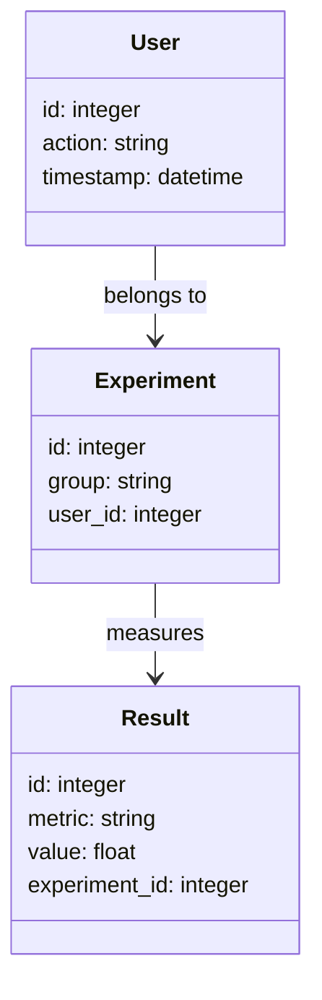
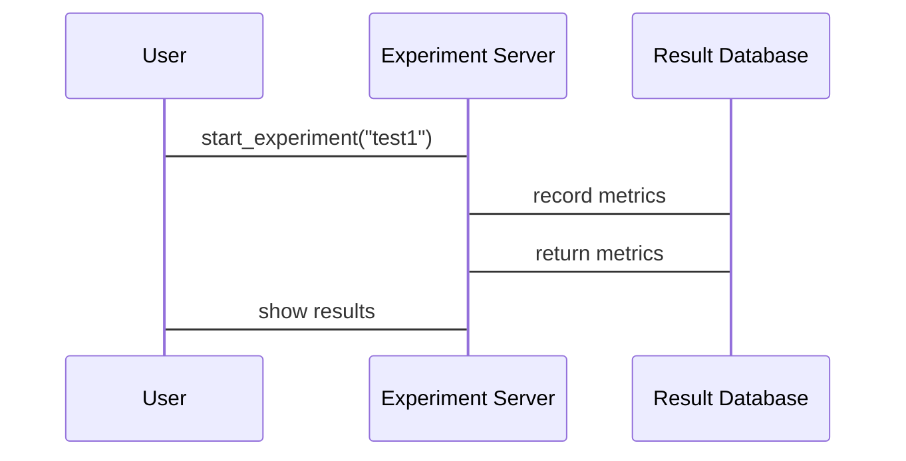

                 


# A/B测试：优化AI Agent的用户体验

> 关键词：A/B测试, AI Agent, 用户体验优化, 统计显著性, 实验设计

> 摘要：本文深入探讨了A/B测试在优化AI Agent用户体验中的应用。通过分析A/B测试的基本原理、数学模型、系统架构设计以及实际案例，本文为读者提供了从理论到实践的全面指导。通过详细讲解AI Agent的用户行为分析、实验设计、统计显著性检验等核心概念，本文帮助读者理解如何通过A/B测试提升AI Agent的用户体验。

---

## 第一部分: A/B测试与AI Agent概述

### 第1章: A/B测试的基本概念与应用

#### 1.1 A/B测试的定义与背景
##### 1.1.1 什么是A/B测试
A/B测试是一种通过比较两个或多个版本（A和B）来评估用户行为差异的实验方法。在AI Agent领域，A/B测试常用于优化用户界面、功能交互和算法性能。

##### 1.1.2 A/B测试的历史与发展
A/B测试起源于互联网行业，最早应用于网页设计优化。随着AI技术的发展，A/B测试逐渐扩展到AI Agent的用户体验优化领域。

##### 1.1.3 A/B测试在AI Agent中的应用背景
AI Agent需要通过与用户的交互来提供服务，其用户体验直接影响用户满意度和产品成功。通过A/B测试，可以系统地优化AI Agent的行为策略和交互方式。

#### 1.2 AI Agent的定义与特点
##### 1.2.1 AI Agent的基本概念
AI Agent是一种具有自主决策能力的智能体，能够通过感知环境并执行任务来满足用户需求。

##### 1.2.2 AI Agent的核心特点
- 智能性：基于AI算法进行决策和学习。
- 交互性：与用户进行自然语言或图形交互。
- 自适应性：能够根据用户反馈动态调整行为策略。

##### 1.2.3 AI Agent与传统软件的区别
AI Agent具有自主性和学习能力，能够通过数据驱动的方式不断优化自身行为。

#### 1.3 A/B测试在用户体验优化中的作用
##### 1.3.1 用户体验优化的重要性
用户体验是AI Agent成功的关键因素，直接影响用户满意度和产品市场竞争力。

##### 1.3.2 A/B测试在用户体验优化中的应用
通过A/B测试，可以量化不同设计或算法对用户体验的影响，找到最优解决方案。

##### 1.3.3 A/B测试与AI Agent结合的优势
AI Agent的复杂性和动态性使得A/B测试成为优化其用户体验的重要工具。

---

### 第2章: A/B测试的核心原理与方法

#### 2.1 A/B测试的基本原理
##### 2.1.1 实验设计的基本原则
A/B测试的核心是随机化分组和统计显著性检验。实验组和对照组的样本必须具有代表性，且实验期间不能引入外部干扰因素。

##### 2.1.2 统计学基础与A/B测试的关系
统计学是A/B测试的理论基础，包括假设检验、置信区间和显著性水平等概念。

##### 2.1.3 A/B测试的数学模型
A/B测试的核心是通过统计方法比较两组数据的均值差异。常用公式包括t检验和卡方检验。

#### 2.2 A/B测试的主要方法
##### 2.2.1 随机化分组方法
随机化是确保实验组和对照组具有可比性的关键步骤，通常采用随机分配或分层随机分配。

##### 2.2.2 样本量计算方法
样本量的计算需要考虑显著性水平、统计功效和预期效应大小。常用公式为：
$$ n = \frac{2(z_{\alpha/2} + z_{\beta})^2 \sigma^2}{\Delta^2} $$
其中，$z_{\alpha/2}$是显著性水平的分位数，$z_{\beta}$是统计功效的分位数，$\sigma^2$是方差，$\Delta$是预期效应大小。

##### 2.2.3 统计显著性检验方法
常用的显著性检验方法包括t检验、卡方检验和Mann-Whitney U检验。

#### 2.3 A/B测试的实施步骤
##### 2.3.1 确定实验目标
明确实验目标，例如提高用户点击率或降低用户流失率。

##### 2.3.2 设计实验方案
设计实验方案，包括实验组和对照组的定义、样本量和实验周期。

##### 2.3.3 执行实验与数据收集
通过实验平台收集用户行为数据，确保数据的完整性和准确性。

##### 2.3.4 数据分析与结果解读
使用统计方法分析数据，判断实验结果的显著性和实际意义。

---

### 第3章: A/B测试与AI Agent的结合

#### 3.1 AI Agent的用户行为分析
##### 3.1.1 用户行为的定义与分类
用户行为可以分为显性行为（如点击、输入）和隐性行为（如注意力、情绪）。

##### 3.1.2 用户行为数据的采集与处理
通过日志记录和用户反馈采集用户行为数据，并进行清洗和预处理。

##### 3.1.3 用户行为分析的常见方法
常用方法包括聚类分析、路径分析和关联规则挖掘。

#### 3.2 A/B测试在AI Agent中的应用场景
##### 3.2.1 界面优化实验
通过A/B测试优化AI Agent的用户界面设计，例如按钮颜色和布局。

##### 3.2.2 功能优化实验
通过A/B测试优化AI Agent的功能交互，例如对话流程和响应速度。

##### 3.2.3 算法优化实验
通过A/B测试比较不同算法的效果，例如推荐算法和自然语言处理算法。

#### 3.3 A/B测试对AI Agent用户体验的提升
##### 3.3.1 提升用户满意度
通过优化用户界面和交互流程，提高用户的使用体验。

##### 3.3.2 提高用户留存率
通过个性化推荐和动态调整策略，增强用户的粘性和留存。

##### 3.3.3 增加用户活跃度
通过实验优化用户激励机制，提高用户的活跃度和参与度。

---

### 第4章: A/B测试的数学模型与统计方法

#### 4.1 基础统计学原理
##### 4.1.1 均值与方差的计算
均值公式：
$$ \bar{x} = \frac{1}{n} \sum_{i=1}^{n} x_i $$
方差公式：
$$ s^2 = \frac{1}{n-1} \sum_{i=1}^{n} (x_i - \bar{x})^2 $$

##### 4.1.2 假设检验的基本概念
假设检验用于判断实验结果是否具有统计显著性。常用检验方法包括t检验和卡方检验。

##### 4.1.3 显著性水平与p值
显著性水平通常设为0.05，p值小于显著性水平时，拒绝原假设。

#### 4.2 A/B测试的数学模型
##### 4.2.1 均值差异的t检验公式
$$ t = \frac{\bar{x}_1 - \bar{x}_2}{\sqrt{\frac{s_1^2}{n_1} + \frac{s_2^2}{n_2}}} $$

##### 4.2.2 方差分析的基本原理
方差分析用于比较多个组的均值差异，公式为：
$$ F = \frac{MSB}{MSW} $$
其中，MSB是组间均方，MSW是组内均方。

##### 4.2.3 统计显著性与置信区间
置信区间用于估计参数的范围，公式为：
$$ \bar{x} \pm t_{\alpha/2} \cdot \frac{s}{\sqrt{n}} $$

---

### 第5章: A/B测试的系统分析与架构设计

#### 5.1 问题场景介绍
A/B测试在AI Agent中的应用场景包括用户界面优化、功能交互优化和算法性能优化。

#### 5.2 系统功能设计
##### 5.2.1 领域模型设计
领域模型示例（mermaid类图）：


##### 5.2.2 系统架构设计
系统架构示例（mermaid架构图）：
```mermaid
aws
  - [REST API Gateway]
  - [负载均衡器]
  - [Web服务器]
  - [数据库]
  - [缓存]
  - [消息队列]
```

##### 5.2.3 系统接口设计
系统接口示例：
```http
POST /api/experiments
Content-Type: application/json

{
  "name": "test1",
  "groups": ["control", "treatment"],
  "parameters": {
    "duration": 7 days,
    "sample_size": 1000
  }
}
```

##### 5.2.4 系统交互设计
系统交互示例（mermaid序列图）：


---

### 第6章: A/B测试的项目实战

#### 6.1 环境安装与配置
需要安装的工具包括Python、Pandas、NumPy和scipy库。

#### 6.2 核心代码实现
##### 6.2.1 数据预处理
```python
import pandas as pd
import numpy as np
from scipy import stats

# 加载数据
data = pd.read_csv("experiment.csv")

# 数据预处理
data.dropna(inplace=True)
data['group'] = data['group'].astype('category')
```

##### 6.2.2 统计显著性检验
```python
def compute_t_test(group_a, group_b):
    t, p = stats.ttest_ind(group_a, group_b)
    return t, p

group_a = data[data['group'] == 'control']['metric']
group_b = data[data['group'] == 'treatment']['metric']

t_stat, p_val = compute_t_test(group_a, group_b)
print(f"t统计量: {t_stat:.3f}, p值: {p_val:.5f}")
```

##### 6.2.3 实验结果分析
```python
if p_val < 0.05:
    print("实验结果具有统计显著性")
else:
    print("实验结果不具有统计显著性")
```

#### 6.3 实际案例分析
以优化AI Agent的对话响应时间为案例，详细分析实验设计和结果解读。

#### 6.4 项目小结
总结项目实施的经验和教训，强调A/B测试在优化AI Agent用户体验中的重要性。

---

### 第7章: 总结与展望

#### 7.1 总结
本文系统地介绍了A/B测试在优化AI Agent用户体验中的应用，从理论到实践提供了全面的指导。

#### 7.2 未来展望
随着AI技术的不断发展，A/B测试将在更复杂的场景中发挥重要作用，例如多臂-bandit算法和实时反馈机制。

#### 7.3 最佳实践Tips
- 确保实验设计的科学性和严谨性。
- 选择合适的统计方法进行数据分析。
- 结合业务目标和用户需求进行实验优化。

---

## 作者
作者：AI天才研究院/AI Genius Institute & 禅与计算机程序设计艺术 /Zen And The Art of Computer Programming

