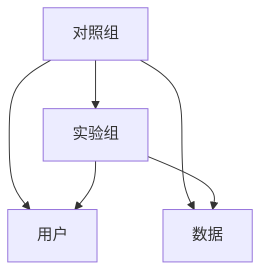
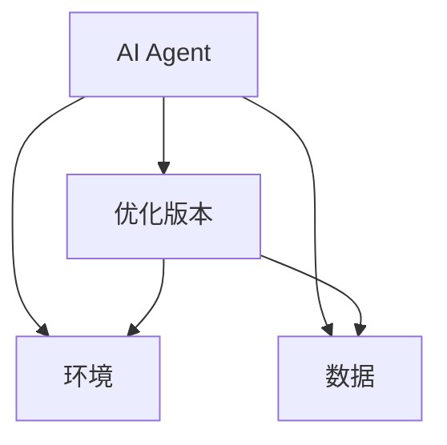
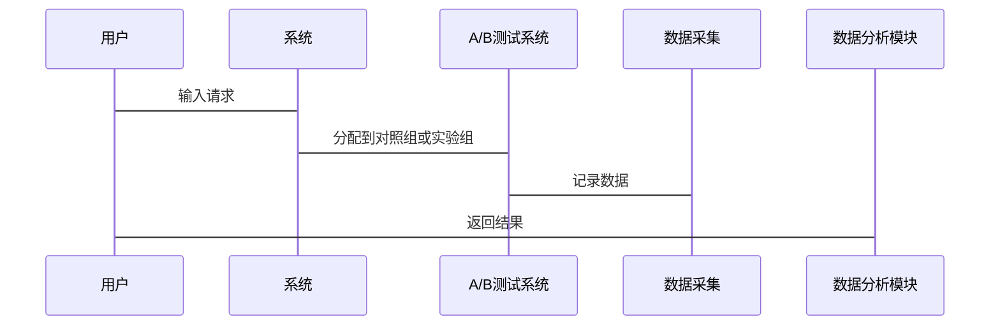

                 


# A/B测试：持续优化AI Agent的表现

> 关键词：A/B测试, AI Agent, 优化, 统计显著性, 数据分析

> 摘要：本文探讨了A/B测试在AI Agent优化中的应用，详细介绍了A/B测试的核心概念、算法原理、系统架构设计以及项目实战。通过理论与实践结合，展示了如何利用A/B测试持续优化AI Agent的表现。

---

## 第1章: A/B测试的基本概念与应用

### 1.1 A/B测试的定义与核心原理

#### 1.1.1 什么是A/B测试
A/B测试是一种实验方法，通过将用户分成两组，一组使用对照版本（A组），另一组使用实验版本（B组），比较两组在特定指标上的表现，以确定哪个版本更优。A/B测试的核心在于通过统计方法分析实验结果，确保优化决策的科学性。

#### 1.1.2 A/B测试的核心原理
- **随机分配**：用户随机分配到A组或B组，确保两组在其他变量上具有相似性。
- **对照实验**：通过比较两组数据，确定实验版本是否显著优于对照版本。
- **统计显著性**：通过统计学方法（如t检验）判断实验结果是否具有显著性，避免随机误差的影响。

#### 1.1.3 A/B测试在产品优化中的作用
A/B测试广泛应用于产品设计、用户体验优化等领域，帮助企业在决策时减少风险，确保优化措施的有效性。

### 1.2 AI Agent的定义与特点

#### 1.2.1 AI Agent的基本概念
AI Agent（智能体）是能够感知环境并采取行动以实现目标的实体。它可以是一个软件程序，通过传感器获取信息，利用算法进行决策，并通过执行器与环境互动。

#### 1.2.2 AI Agent的核心特点
- **自主性**：AI Agent能够在没有外部干预的情况下自主决策。
- **反应性**：能够实时感知环境变化并做出反应。
- **目标导向**：所有行动都以实现特定目标为导向。

#### 1.2.3 AI Agent与传统软件的区别
AI Agent具有学习和适应能力，能够通过数据优化表现，而传统软件通常遵循固定的规则。

### 1.3 A/B测试与AI Agent优化的结合

#### 1.3.1 A/B测试在AI Agent优化中的应用
通过A/B测试，可以评估不同算法或策略对AI Agent表现的影响，找出最优方案。

#### 1.3.2 AI Agent优化的必要性
AI Agent在复杂环境中的表现可能受到多种因素影响，需要通过系统优化来提升性能。

#### 1.3.3 A/B测试在AI Agent优化中的优势
- **科学性**：通过统计方法确保优化决策的科学性。
- **可扩展性**：适用于不同规模和复杂度的优化问题。

---

## 第2章: A/B测试的核心概念与联系

### 2.1 核心概念原理

#### 2.1.1 统计显著性
统计显著性是通过p值判断实验结果是否由随机因素引起。通常，p值小于0.05表示结果具有显著性。

#### 2.1.2 样本量计算
样本量计算确保实验结果具有足够的统计效力，常用公式包括：
$$ n = \frac{2(Z_{\alpha/2} + Z_{\beta})^2 \sigma^2}{\delta^2} $$
其中，\( Z_{\alpha/2} \)是显著性水平的分位数，\( Z_{\beta} \)是统计效力的分位数，\( \sigma \)是标准差，\( \delta \)是期望的最小效应差。

#### 2.1.3 对照组与实验组的设计
对照组是保持不变的版本，实验组是需要测试的版本。通过比较两组数据，确定实验组是否显著优于对照组。

### 2.2 核心概念对比

#### 2.2.1 A/B测试与多变量测试的对比
- **A/B测试**：测试两个版本，确定哪个更优。
- **多变量测试**：测试多个变量组合，找出最佳组合。

#### 2.2.2 A/B测试与A/B/n测试的对比
- **A/B测试**：仅测试两个版本。
- **A/B/n测试**：测试多个版本，适用于多方案比较。

#### 2.2.3 A/B测试与传统软件测试的对比
- **A/B测试**：注重实验设计和统计分析。
- **传统软件测试**：注重功能验证和缺陷发现。

### 2.3 实体关系图

#### 2.3.1 A/B测试的实体关系图



#### 2.3.2 AI Agent优化的实体关系图



---

## 第3章: A/B测试的算法原理

### 3.1 A/B测试的流程

#### 3.1.1 实验设计
确定目标、样本量、对照组和实验组。

#### 3.1.2 数据收集
通过日志记录用户行为数据，收集各组的表现指标。

#### 3.1.3 数据分析
使用统计方法（如t检验）分析数据，判断实验结果是否具有显著性。

### 3.2 统计检验方法

#### 3.2.1 均值差异的t检验
用于比较两组样本均值差异，公式为：
$$ t = \frac{\bar{X}_1 - \bar{X}_2}{\sqrt{s_1^2/n_1 + s_2^2/n_2}} $$

#### 3.2.2 卡方检验
用于比较两个分类变量的独立性，公式为：
$$ \chi^2 = \sum \frac{(O - E)^2}{E} $$

#### 3.2.3 Z检验
用于比较两组比例差异，公式为：
$$ z = \frac{p_1 - p_2}{\sqrt{p(1-p)(1/n_1 + 1/n_2)}} $$

### 3.3 统计显著性计算

#### 3.3.1 p值计算
p值是观察到的统计量与实际数据更极端的结果的概率。

#### 3.3.2 置信区间计算
置信区间用于估计总体参数的范围，常用95%置信区间。

#### 3.3.3 样本量计算公式
$$ n = \frac{2(Z_{\alpha/2} + Z_{\beta})^2 \sigma^2}{\delta^2} $$

---

## 第4章: AI Agent优化的系统架构设计

### 4.1 问题场景介绍

AI Agent在复杂环境中需要不断优化表现，A/B测试提供了一种科学的优化方法。

### 4.2 系统功能设计

#### 4.2.1 领域模型

```mermaid
classDiagram
    class A/B测试系统 {
        +对照组
        +实验组
        +数据采集
        +统计分析
    }
```

#### 4.2.2 系统架构设计


#### 4.2.3 系统接口设计

系统接口包括用户输入、数据采集、统计分析模块。

#### 4.2.4 系统交互流程



---

## 第5章: 项目实战

### 5.1 环境安装

安装Python和必要的库（如numpy、pandas、scipy）。

### 5.2 核心实现代码

```python
import numpy as np
from scipy import stats

def t_test(control_group, experiment_group):
    t, p = stats.ttest_ind(control_group, experiment_group)
    return p

# 示例数据
control = np.random.normal(0, 1, 100)
experiment = np.random.normal(0.5, 1, 100)

p_value = t_test(control, experiment)
print(f"p值为：{p_value}")
```

### 5.3 代码解读与分析

- **t_test函数**：计算两组数据的t检验p值。
- **示例数据**：控制组和实验组的数据生成。
- **结果分析**：p值小于0.05表示实验组显著优于对照组。

### 5.4 实际案例分析

通过具体案例分析，展示如何利用A/B测试优化AI Agent的表现。

### 5.5 项目小结

总结项目经验，强调A/B测试在优化AI Agent中的重要性。

---

## 第6章: 最佳实践与总结

### 6.1 最佳实践

- **选择合适的样本量**：确保统计效力。
- **避免多重检验**：多次测试可能导致假阳性。
- **实时监控**：及时终止无效实验。

### 6.2 小结

A/B测试是优化AI Agent表现的重要工具，通过科学的实验设计和统计分析，可以显著提升AI Agent的性能。

### 6.3 注意事项

- **样本偏倚**：确保样本具有代表性。
- **实验干扰**：避免实验组和对照组的干扰。
- **数据隐私**：确保用户数据的安全性。

### 6.4 拓展阅读

推荐相关书籍和论文，供读者深入学习。

---

## 作者

作者：AI天才研究院/AI Genius Institute  
禅与计算机程序设计艺术/Zen And The Art of Computer Programming  

---

通过以上内容，读者可以全面了解A/B测试在AI Agent优化中的应用，从理论到实践，掌握如何利用A/B测试持续优化AI Agent的表现。

