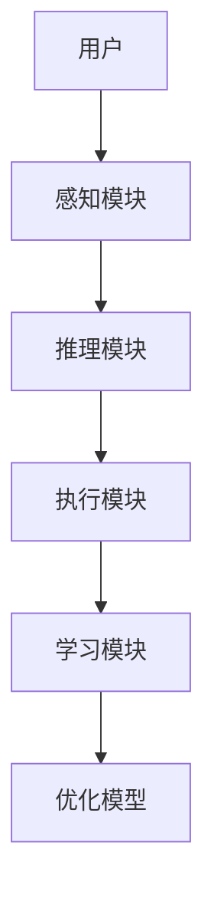
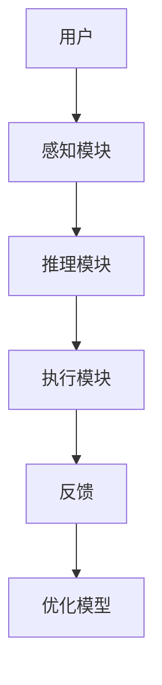
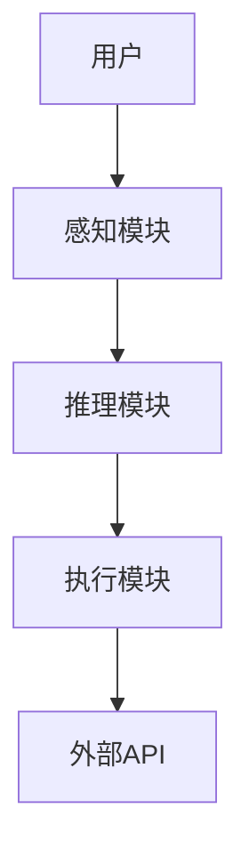
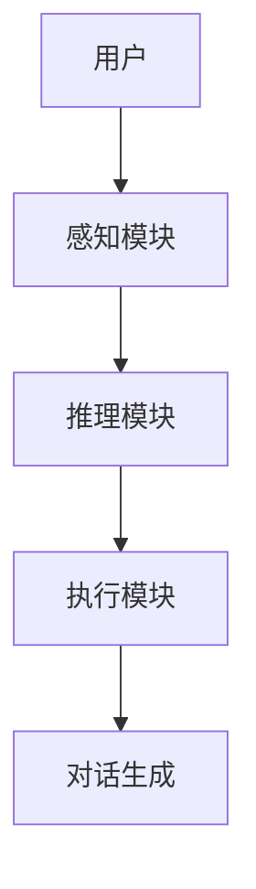

                 


# BERT模型在AI Agent中的应用与微调

> **关键词**：BERT模型，AI Agent，自然语言处理，微调，机器学习，深度学习

> **摘要**：本文详细探讨了BERT模型在AI Agent中的应用及其微调方法。首先介绍了BERT模型的基本概念和AI Agent的核心功能，接着分析了BERT模型在自然语言处理任务中的原理和应用场景。随后，深入讨论了BERT模型在AI Agent中的具体应用，如对话系统和任务处理，并详细讲解了微调技术的实现过程。最后，通过实际案例分析和系统架构设计，展示了BERT模型在AI Agent中的潜力和实际应用价值。

---

# 第一部分: BERT模型与AI Agent基础

## 第1章: BERT模型与AI Agent概述

### 1.1 BERT模型的基本概念

#### 1.1.1 什么是BERT模型
BERT（Bidirectional Encoder Representations from Transformers）是由Google于2018年提出的一种基于Transformer架构的预训练语言模型。它通过将文本转化为上下文相关的向量表示，能够有效捕捉语言中的语法和语义信息。

$$
\text{BERT的目标是生成双向的文本表示，从而在各种下游任务中实现高性能。}
$$

#### 1.1.2 BERT模型的核心特点
1. **双向Transformer结构**：与传统的单向模型不同，BERT使用双向Transformer进行编码，能够同时考虑上下文。
2. **预训练与微调**：BERT采用预训练策略，通过大规模的无监督数据进行训练，然后通过微调适应特定任务。
3. **多任务学习能力**：BERT在预训练过程中同时优化多个任务，使其在多种下游任务中表现优异。

#### 1.1.3 BERT模型的应用场景
- **文本分类**：如情感分析、主题分类。
- **问答系统**：如SQuAD任务。
- **文本摘要**：生成简洁的文本摘要。
- **对话系统**：用于生成自然的对话回复。

### 1.2 AI Agent的基本概念

#### 1.2.1 什么是AI Agent
AI Agent（人工智能代理）是一种智能体，能够感知环境、执行任务并做出决策。它可以理解用户的输入，分析需求，并通过执行一系列动作来满足用户的需求。

$$
\text{AI Agent的核心目标是通过与用户交互，提供高效、智能的服务。}
$$

#### 1.2.2 AI Agent的核心功能
1. **感知**：通过自然语言处理技术理解用户的输入。
2. **推理**：基于理解的用户需求，进行逻辑推理。
3. **执行**：根据推理结果，执行相应的操作或任务。
4. **学习**：通过与用户的交互不断优化自身的模型。

#### 1.2.3 AI Agent的应用领域
- **智能助手**：如Siri、Alexa等。
- **客服系统**：自动处理客户咨询和问题。
- **智能推荐**：根据用户行为推荐相关内容。
- **教育辅助**：为学生提供个性化学习建议。

### 1.3 BERT模型与AI Agent的结合

#### 1.3.1 BERT模型在AI Agent中的作用
BERT模型作为强大的自然语言处理工具，可以为AI Agent提供以下支持：
1. **文本理解**：帮助AI Agent准确理解用户的输入。
2. **对话生成**：生成自然流畅的对话回复。
3. **意图识别**：识别用户的意图并进行分类。

#### 1.3.2 BERT模型与AI Agent的协同工作
AI Agent通过调用BERT模型进行文本处理，BERT模型则为AI Agent提供语言理解和生成能力。两者的结合使得AI Agent能够更高效地完成任务，提供更智能的服务。

#### 1.3.3 BERT模型在AI Agent中的优势
1. **强大的上下文理解能力**：BERT模型能够捕捉到文本中的深层语义信息。
2. **多任务适应性**：BERT模型经过预训练，可以轻松适应多种下游任务。
3. **高效的微调机制**：通过微调，BERT模型可以快速适应特定领域或任务的需求。

---

## 第2章: BERT模型的原理与实现

### 2.1 BERT模型的结构

#### 2.1.1 Transformer架构
Transformer是由Vaswani等人提出的一种基于注意力机制的深度学习模型。它由编码器和解码器组成，广泛应用于自然语言处理任务。

$$
\text{编码器用于将输入文本转换为向量表示，解码器用于生成目标输出。}
$$

#### 2.1.2 BERT模型的分层结构
BERT模型由多个Transformer层组成，每一层包括多头注意力机制和前馈神经网络。这些层堆叠在一起，形成一个深度的神经网络。

#### 2.1.3 BERT模型的训练过程
1. **预训练**：在大规模的无监督数据上进行训练，目标是学习文本的上下文表示。
2. **微调**：在特定任务上进行Fine-tuning，优化模型以适应特定任务的需求。

### 2.2 BERT模型的训练方法

#### 2.2.1 预训练目标
BERT的预训练目标包括：
1. **Masked LM（掩码语言模型）**：随机遮蔽部分单词，通过预测这些单词来训练模型。
2. **Next Sentence Prediction（下一句预测）**：预测句子之间的关系。

#### 2.2.2 掩码语言模型
在掩码语言模型中，模型需要预测被遮蔽的单词。这通过交叉熵损失函数来实现。

$$
\text{损失函数：} L = -\sum_{i=1}^{n} \text{log}(p(y_i|x))
$$

#### 2.2.3 下游任务的微调
在微调阶段，模型在特定任务上进行训练，如文本分类或问答系统。微调通常包括调整模型的输出层。

### 2.3 BERT模型的应用场景

#### 2.3.1 文本分类
文本分类是BERT模型的一个常见应用，如情感分析和主题分类。

$$
\text{输入：} "这是一个很好的产品。"
$$

$$
\text{输出：} \text{正面情感。}
$$

#### 2.3.2 问答系统
BERT模型在问答系统中的应用非常广泛，如SQuAD任务。

$$
\text{问题：} \text{谁发明了BERT？}
$$

$$
\text{答案：} \text{杰夫·Dean。}
$$

#### 2.3.3 文本摘要
文本摘要任务中，BERT模型可以生成简洁的文本摘要。

$$
\text{输入：} "BERT是一种基于Transformer的预训练语言模型。"
$$

$$
\text{输出：} \text{BERT是基于Transformer的预训练语言模型。}
$$

---

## 第3章: AI Agent的核心功能与架构

### 3.1 AI Agent的功能模块

#### 3.1.1 感知模块
感知模块负责接收用户的输入并进行初步处理，如自然语言理解。

$$
\text{输入：} "我需要查询天气情况。"
$$

$$
\text{输出：} \text{用户意图：查询天气。}
$$

#### 3.1.2 推理模块
推理模块基于用户的意图进行逻辑推理，确定需要执行的任务。

$$
\text{任务：} \text{查询天气情况。}
$$

#### 3.1.3 执行模块
执行模块负责执行推理模块确定的任务，如调用天气API。

$$
\text{输出：} \text{今天的天气是晴朗的。}
$$

#### 3.1.4 学习模块
学习模块负责记录用户的行为和反馈，优化AI Agent的模型。

### 3.2 AI Agent的系统架构设计

#### 3.2.1 领域模型设计
领域模型描述了AI Agent的功能模块及其交互关系。



#### 3.2.2 系统架构设计
系统架构设计描述了AI Agent的整体结构。



#### 3.2.3 系统接口设计
系统接口设计描述了AI Agent与其他系统的交互接口。



---

## 第4章: BERT模型在AI Agent中的应用

### 4.1 对话系统中的应用

#### 4.1.1 对话生成
BERT模型可以用于生成自然的对话回复。



#### 4.1.2 意图识别
通过BERT模型进行意图识别，可以提高对话系统的准确性。

### 4.2 任务处理中的应用

#### 4.2.1 任务理解
任务理解是AI Agent处理任务的第一步。

$$
\text{输入：} "我需要预订明天的机票。"
$$

$$
\text{输出：} \text{任务：预订机票，时间：明天。}
$$

#### 4.2.2 任务执行
任务执行模块根据理解的任务进行操作。

---

## 第5章: BERT模型的微调与优化

### 5.1 微调的原理

#### 5.1.1 参数初始化
微调过程中，模型的参数需要重新初始化。

#### 5.1.2 数据准备
根据具体任务准备微调数据。

#### 5.1.3 模型训练
在具体任务上进行微调训练。

### 5.2 微调的实现

#### 5.2.1 对话系统的微调
对话系统的微调需要特定的对话数据。

#### 5.2.2 任务处理的微调
任务处理的微调需要任务相关的数据。

### 5.3 微调的效果评估

#### 5.3.1 评估指标
评估指标包括准确率、召回率等。

#### 5.3.2 实验结果
通过实验验证微调的效果。

---

## 第6章: 项目实战

### 6.1 环境搭建

#### 6.1.1 安装依赖
安装必要的库，如TensorFlow、Keras等。

#### 6.1.2 下载模型
下载预训练的BERT模型。

### 6.2 代码实现

#### 6.2.1 加载模型
加载预训练的BERT模型。

```python
from transformers import BertTokenizer, TFBertModel
tokenizer = BertTokenizer.from_pretrained('bert-base-uncased')
model = TFBertModel.from_pretrained('bert-base-uncased')
```

#### 6.2.2 微调模型
在具体任务上进行微调。

```python
def create_model(bert_model, num_classes):
    input_ids = Input(shape=(128,), dtype='int32')
    attention_mask = Input(shape=(128,), dtype='int32')
    outputs = bert_model(input_ids, attention_mask=attention_mask)
    dense = Dense(num_classes, activation='softmax')(outputs[0])
    model = Model(inputs=[input_ids, attention_mask], outputs=dense)
    return model
```

#### 6.2.3 模型训练
训练模型并保存检查点。

```python
model.compile(optimizer='adam', loss='sparse_categorical_crossentropy', metrics=['accuracy'])
model.fit(x_train, y_train, epochs=3, batch_size=32, validation_data=(x_test, y_test))
```

### 6.3 案例分析

#### 6.3.1 对话系统案例
训练一个简单的对话系统。

#### 6.3.2 任务处理案例
训练一个任务处理的AI Agent。

### 6.4 总结

#### 6.4.1 实战总结
总结项目实战的经验和教训。

#### 6.4.2 模型优化
提出进一步优化模型的建议。

---

## 第7章: 最佳实践与总结

### 7.1 最佳实践

#### 7.1.1 模型选择
选择合适的BERT模型进行微调。

#### 7.1.2 数据预处理
对数据进行适当的预处理，确保微调效果。

#### 7.1.3 超参数调优
调整超参数以提高模型性能。

### 7.2 总结

#### 7.2.1 全文总结
总结全文的主要内容和结论。

#### 7.2.2 未来展望
展望BERT模型在AI Agent中的未来应用和发展。

---

# 作者

**作者：AI天才研究院/AI Genius Institute & 禅与计算机程序设计艺术 /Zen And The Art of Computer Programming**

---

感谢您的阅读！希望本文对您理解BERT模型在AI Agent中的应用有所帮助。

