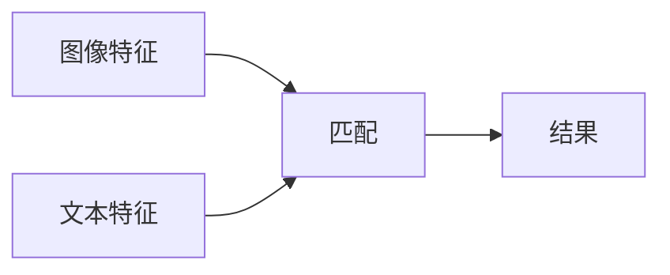
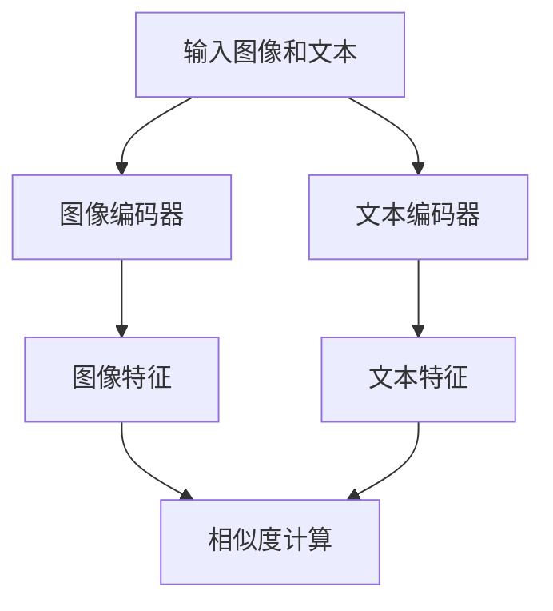
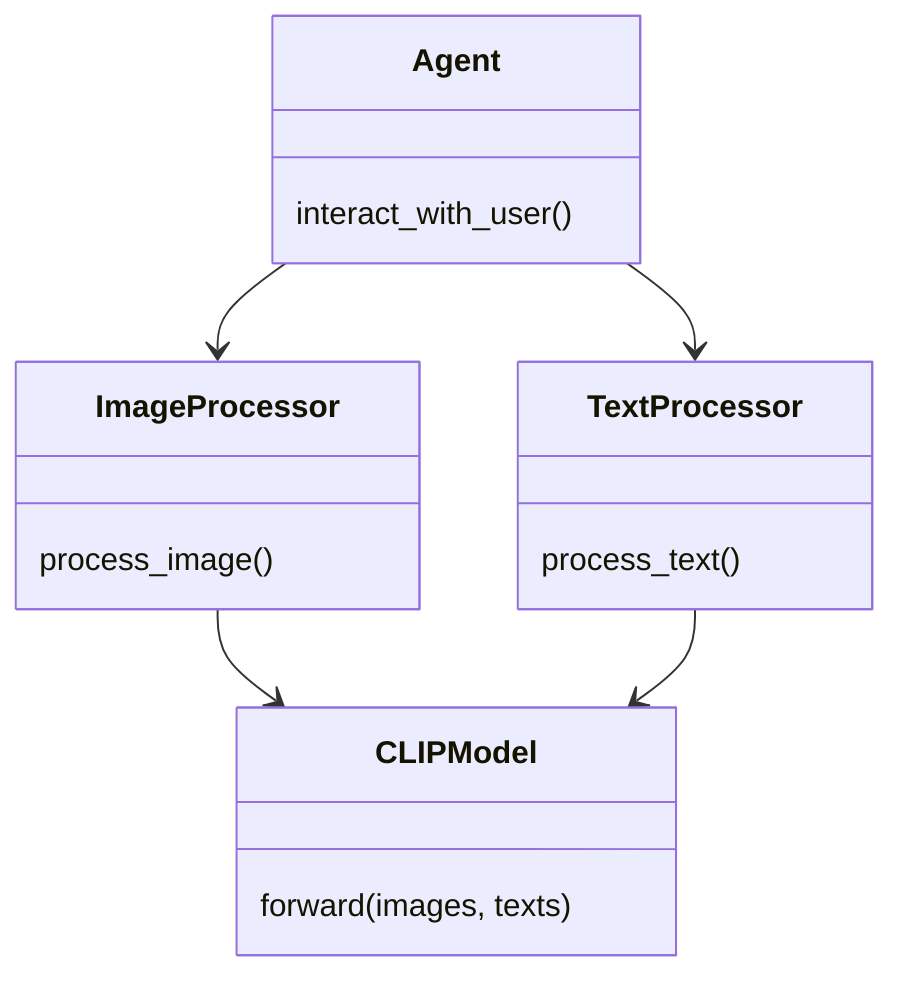
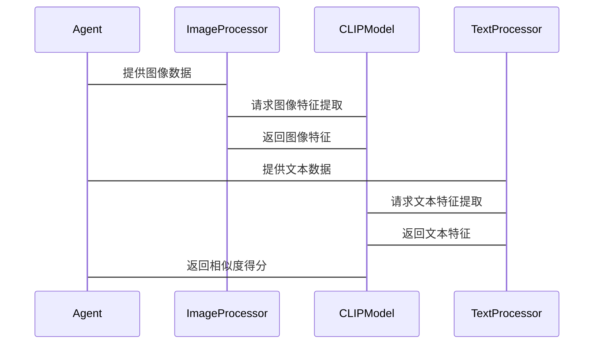

                 


# CLIP模型：实现AI Agent的跨模态理解

## 关键词：CLIP模型，AI Agent，跨模态理解，图像文本匹配，联合学习

## 摘要：
本文深入探讨CLIP模型在AI Agent跨模态理解中的应用。通过分析CLIP模型的核心原理、算法实现、系统架构及实际案例，详细阐述其在图像与文本联合学习中的优势，为AI Agent的多模态交互提供理论支持和实践指导。

---

# 第1章: CLIP模型的背景与概念

## 1.1 跨模态理解的背景与挑战
### 1.1.1 跨模态理解的定义与重要性
跨模态理解指模型能处理多种数据类型，如图像、文本、语音等，实现信息的综合理解与交互。在AI Agent领域，跨模态能力使其能更自然地与人类交互，提升任务执行效率。

### 1.1.2 当前AI Agent在跨模态理解中的挑战
1. **数据异构性**：不同模态的数据结构差异大，难以统一处理。
2. **语义鸿沟**：图像与文本之间的语义关联复杂，匹配难度高。
3. **计算复杂性**：多模态数据处理对计算资源要求高。

### 1.1.3 CLIP模型的提出与目标
CLIP模型由OpenAI提出，旨在通过联合学习图像和文本特征，实现跨模态匹配与理解，解决传统方法在跨模态任务中的局限性。

## 1.2 CLIP模型的核心概念
### 1.2.1 CLIP模型的基本原理
CLIP模型采用双塔结构，分别提取图像和文本的嵌入特征，并通过对比学习实现跨模态匹配。

### 1.2.2 CLIP模型的关键特性
- **跨模态匹配**：支持图像与文本的双向理解。
- **零样本学习**：无需标签即可进行图像分类。
- **可扩展性**：适用于多种跨模态任务。

### 1.2.3 CLIP模型的边界与外延
CLIP模型专注于跨模态匹配，适用于图像搜索、文本检索等任务，但其性能依赖于高质量的数据和模型调优。

## 1.3 CLIP模型的核心要素组成
### 1.3.1 模型输入与输出
- **输入**：图像和文本对。
- **输出**：相似度得分或分类结果。

### 1.3.2 模型的训练与优化
CLIP采用对比学习，优化图像和文本的特征向量，使其在语义上对齐。

### 1.3.3 模型的评估与验证
通过准确率、召回率等指标评估模型的跨模态匹配能力。

## 1.4 本章小结
本章介绍了CLIP模型的背景、核心概念及其在AI Agent中的应用潜力，为后续分析奠定基础。

---

# 第2章: CLIP模型的核心概念与联系

## 2.1 CLIP模型的核心原理
### 2.1.1 多模态数据的处理方法
CLIP模型将图像和文本分别映射到相同的特征空间，通过对比学习实现跨模态匹配。

### 2.1.2 CLIP模型的联合学习机制
模型采用对比损失函数，优化图像和文本的特征向量，使其在语义上对齐。

### 2.1.3 CLIP模型的特征提取与匹配
通过特征提取网络，分别获取图像和文本的嵌入，并计算其相似度。

## 2.2 CLIP模型的核心概念对比
### 2.2.1 CLIP模型与传统跨模态模型的对比
- **传统方法**：依赖特征手工设计，跨模态对齐困难。
- **CLIP模型**：采用端到端联合学习，自动优化特征。

### 2.2.2 CLIP模型在不同场景下的表现
- **图像检索**：CLIP在图像搜索任务中表现优异。
- **文本检索**：CLIP在文本匹配任务中同样表现出色。

### 2.2.3 CLIP模型的核心参数与性能指标
- **参数数量**：取决于模型的深度和宽度。
- **性能指标**：准确率、召回率、F1分数等。

## 2.3 CLIP模型的ER实体关系图


## 2.4 本章小结
本章详细阐述了CLIP模型的核心原理及其在不同场景下的应用，揭示了其在跨模态理解中的优势。

---

# 第3章: CLIP模型的算法原理与实现

## 3.1 CLIP模型的算法流程


## 3.2 CLIP模型的数学模型与公式
### 3.2.1 模型的损失函数
$$ L = -\sum_{i=1}^{N} \log(\text{sim}(x_i, y_i)) - \log(1-\text{sim}(x_i, y_j)) $$
其中，$\text{sim}(x, y)$表示图像$x$和文本$y$的相似度得分。

### 3.2.2 模型的优化方法
$$ \theta = \theta - \eta \cdot \nabla_{\theta} L $$
通过梯度下降优化模型参数，最小化损失函数。

## 3.3 CLIP模型的实现代码
```python
import torch
import torch.nn as nn

class CLIPModel(nn.Module):
    def __init__(self, image_encoder, text_encoder):
        super().__init__()
        self.image_encoder = image_encoder
        self.text_encoder = text_encoder
        self.logit_scale = nn.Parameter(torch.ones([]) * np.log(1 / 0.07))

    def forward(self, images, texts):
        image_features = self.image_encoder(images)
        text_features = self.text_encoder(texts)
        similarity = (image_features @ text_features.T) * torch.exp(self.logit_scale)
        return similarity
```

## 3.4 本章小结
本章通过数学公式和代码展示了CLIP模型的算法原理，为后续的实现与应用提供了理论基础。

---

# 第4章: CLIP模型的系统分析与架构设计方案

## 4.1 问题场景介绍
AI Agent需要处理图像和文本信息，实现跨模态交互，提升用户体验。

## 4.2 系统功能设计
### 4.2.1 领域模型


## 4.3 系统架构设计
### 4.3.1 分层架构


## 4.4 系统接口设计
### 4.4.1 系统接口
- **输入接口**：接收图像和文本数据。
- **输出接口**：返回相似度得分或分类结果。

## 4.5 系统交互序列图


## 4.6 本章小结
本章详细分析了CLIP模型在AI Agent系统中的架构设计，为实际应用提供了指导。

---

# 第5章: CLIP模型的项目实战

## 5.1 环境安装与配置
- **安装依赖**：使用Python和PyTorch框架。
- **数据准备**：收集图像和文本对，构建训练集和测试集。

## 5.2 核心实现代码
```python
import torch
import torch.nn as nn
import torch.optim as optim

class CLIPModel(nn.Module):
    def __init__(self, image_encoder, text_encoder):
        super().__init__()
        self.image_encoder = image_encoder
        self.text_encoder = text_encoder
        self.logit_scale = nn.Parameter(torch.ones([]) * np.log(1 / 0.07))

    def forward(self, images, texts):
        image_features = self.image_encoder(images)
        text_features = self.text_encoder(texts)
        similarity = (image_features @ text_features.T) * torch.exp(self.logit_scale)
        return similarity

def train_model(model, optimizer, criterion, train_loader, num_epochs=10):
    for epoch in range(num_epochs):
        for images, texts in train_loader:
            optimizer.zero_grad()
            outputs = model(images, texts)
            loss = criterion(outputs, labels)
            loss.backward()
            optimizer.step()
    return model
```

## 5.3 代码应用解读与分析
- **数据预处理**：将图像和文本转换为模型可接受的格式。
- **模型训练**：使用优化器和损失函数进行训练，提升模型性能。
- **模型推理**：在测试集上进行预测，评估模型效果。

## 5.4 实际案例分析
### 5.4.1 案例一：图像搜索
通过CLIP模型，用户输入文本查询，系统返回相关图像结果。

### 5.4.2 案例二：文本检索
用户上传图像，系统返回相关文本描述。

## 5.5 项目小结
本章通过实际案例展示了CLIP模型的应用场景，验证了其在跨模态任务中的有效性。

---

# 第6章: CLIP模型的最佳实践与总结

## 6.1 项目小结
- **核心优势**：跨模态匹配能力强，支持零样本学习。
- **局限性**：计算资源消耗大，依赖高质量数据。

## 6.2 最佳实践 tips
1. **数据预处理**：确保图像和文本对齐，提升模型性能。
2. **模型调优**：选择合适的超参数，优化训练效果。
3. **应用场景**：适用于图像检索、文本检索等任务。

## 6.3 未来发展方向
- **模型优化**：探索更高效的跨模态学习方法。
- **多模态扩展**：扩展到更多数据类型，如音频、视频等。
- **实时应用**：提升模型推理速度，支持实时交互。

## 6.4 本章小结
本章总结了CLIP模型的应用经验，为未来的改进和扩展提供了方向。

---

# 作者：AI天才研究院 & 禅与计算机程序设计艺术

---

以上是文章的详细目录大纲和部分内容展示。通过系统的分析与实践，本文深入探讨了CLIP模型在AI Agent跨模态理解中的应用，为相关领域的研究和实践提供了有价值的参考。

