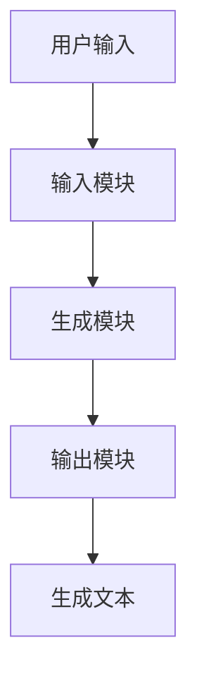
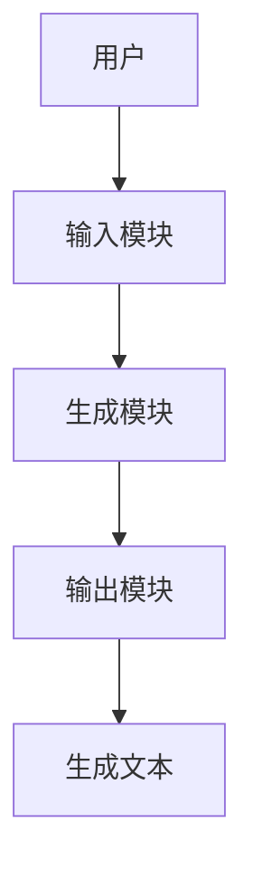

                 


# GPT系列模型：打造强大的生成式AI Agent

> 关键词：GPT系列模型，生成式AI，AI Agent，自然语言处理，机器学习，Transformer架构，生成式AI Agent

> 摘要：本文将全面探讨GPT系列模型在生成式AI Agent中的应用，从基础理论到实际应用，深入分析生成式AI Agent的核心技术，包括GPT系列模型的原理、实现、优化及系统设计，最后通过项目实战和未来趋势展望，为读者提供一个全面、系统的技术视角。

---

## # 第一部分: GPT系列模型与生成式AI Agent基础

### ## 第1章: GPT系列模型概述

#### ### 1.1 GPT系列模型的发展历程
##### 1.1.1 GPT系列模型的起源与演进
GPT（Generative Pre-trained Transformer）系列模型起源于2018年的GPT，由OpenAI团队首次提出。其核心思想是通过Transformer架构实现大规模语言模型的预训练，从而具备强大的生成能力。随后，GPT-2、GPT-3、GPT-4等版本相继发布，模型参数规模和生成能力不断提升。GPT系列模型的成功推动了生成式AI的发展。

##### 1.1.2 GPT系列模型的核心特点
GPT系列模型具有以下核心特点：
1. **基于Transformer架构**：采用自注意力机制，能够捕捉长距离依赖关系。
2. **预训练+微调模式**：通过大规模无监督数据预训练，再在特定任务上进行微调。
3. **生成能力强**：能够生成连贯、自然的文本，适用于多种任务，如文本生成、对话系统等。

##### 1.1.3 GPT系列模型的最新进展
GPT系列模型的最新进展包括：
1. **模型规模更大**：GPT-4的参数量超过1000亿。
2. **多模态能力增强**：支持图像、音频等多种模态输入。
3. **生成能力更智能**：能够理解上下文，生成更符合逻辑的回答。

#### ### 1.2 生成式AI的核心概念
##### 1.2.1 生成式AI的定义与特点
生成式AI是指通过机器学习模型生成新的内容，包括文本、图像、音频等。其核心特点包括：
1. **自动化生成**：无需人工干预，模型自动生成内容。
2. **多样化输出**：能够生成多种风格和内容。
3. **上下文理解**：能够理解上下文，生成连贯的内容。

##### 1.2.2 GPT系列模型在生成式AI中的地位
GPT系列模型是生成式AI领域的代表，其强大的生成能力使其成为许多应用的核心技术，如智能对话系统、内容生成工具等。

##### 1.2.3 生成式AI的边界与外延
生成式AI的应用场景包括：
1. **文本生成**：新闻、文章、对话等。
2. **内容创作**：诗歌、小说、代码等。
3. **数据增强**：通过生成数据增强训练数据集。

---

### ## 第2章: 生成式AI的原理与数学模型

#### ### 2.1 生成式AI的基本原理
##### 2.1.1 生成式AI的文本生成机制
生成式AI通过概率模型生成文本，具体流程包括：
1. **输入处理**：接收输入文本。
2. **生成概率分布**：基于模型计算每个可能的下一个词的概率分布。
3. **生成输出**：根据概率分布生成输出词。

##### 2.1.2 GPT系列模型的生成过程
GPT系列模型的生成过程包括：
1. **输入处理**：将输入文本转换为模型可处理的格式。
2. **自注意力机制**：计算每个词与其他词的关联性。
3. **前向传播**：通过前向传播生成概率分布。
4. **生成输出**：根据概率分布生成输出词。

##### 2.1.3 生成式AI的数学基础
生成式AI的数学基础包括：
1. **概率论**：生成式AI基于概率分布生成文本。
2. **线性代数**：用于矩阵运算和向量表示。
3. **微积分**：用于优化算法和损失函数。

#### ### 2.2 GPT系列模型的数学模型
##### 2.2.1 概率论基础
生成式AI基于概率分布生成文本，概率论是其数学基础。

##### 2.2.2 Transformer架构的数学公式
Transformer架构的数学公式包括：
1. **自注意力机制**：
   $$\text{Attention}(Q, K, V) = \text{softmax}\left(\frac{QK^T}{\sqrt{d_k}}\right)V$$
2. **前向网络**：
   $$F(x) = \text{ReLU}(xW_1 + b_1)W_2 + b_2$$

##### 2.2.3 注意力机制的数学推导
注意力机制的数学推导包括：
1. **查询（Q）**：表示输入序列。
2. **键（K）**：表示输入序列的键。
3. **值（V）**：表示输入序列的值。
4. **注意力得分**：计算每个查询与键的相似性。
5. **归一化**：通过Softmax函数归一化得分。
6. **加权求和**：根据得分加权求和得到最终输出。

---

### ## 第3章: GPT系列模型的实现与优化

#### ### 3.1 GPT系列模型的实现细节
##### 3.1.1 预训练与微调的实现
1. **预训练**：在大规模通用数据上进行无监督预训练。
2. **微调**：在特定任务上进行有监督微调。

##### 3.1.2 模型参数的调优技巧
1. **学习率调整**：使用学习率衰减策略。
2. **批次大小**：调整批次大小以优化训练效率。
3. **模型深度**：增加模型深度以提高生成能力。

##### 3.1.3 模型压缩与轻量化
1. **模型剪枝**：去除冗余参数。
2. **模型蒸馏**：将大模型的知识迁移到小模型。
3. **量化**：将模型参数量化以减少存储空间。

#### ### 3.2 GPT系列模型的优化策略
##### 3.2.1 训练数据的优化
1. **数据清洗**：去除低质量数据。
2. **数据增强**：通过数据增强增加训练数据的多样性。
3. **数据平衡**：平衡训练数据的类别分布。

##### 3.2.2 模型推理的优化
1. **缓存机制**：缓存常用数据以加速推理。
2. **并行计算**：利用并行计算加速推理。
3. **模型优化器**：使用模型优化器进行优化。

##### 3.2.3 模型部署的优化
1. **容器化部署**：使用容器化技术部署模型。
2. **分布式部署**：将模型部署到分布式系统中。
3. **边缘计算**：将模型部署到边缘设备上。

---

### ## 第4章: 生成式AI的应用场景与案例分析

#### ### 4.1 生成式AI的典型应用场景
##### 4.1.1 文本生成
1. **新闻生成**：生成新闻标题和正文。
2. **文章生成**：生成技术文章和博客。
3. **对话系统**：生成对话内容。

##### 4.1.2 对话系统
1. **智能客服**：提供智能客服对话。
2. **语音助手**：提供语音交互服务。
3. **聊天机器人**：提供实时聊天服务。

##### 4.1.3 内容创作
1. **诗歌创作**：生成诗歌和歌词。
2. **小说创作**：生成小说和故事。
3. **代码生成**：生成代码片段。

#### ### 4.2 GPT系列模型的实际案例分析
##### 4.2.1 案例一：文本生成
1. **应用背景**：新闻媒体。
2. **实现细节**：使用GPT-3生成新闻标题和正文。
3. **效果评估**：通过BLEU和ROUGE等指标评估生成效果。

##### 4.2.2 案例二：对话系统
1. **应用背景**：智能客服系统。
2. **实现细节**：使用GPT-2进行对话生成。
3. **效果评估**：通过人类评价和指标评估生成效果。

##### 4.2.3 案例三：内容创作
1. **应用背景**：创意写作。
2. **实现细节**：使用GPT-3生成诗歌和小说。
3. **效果评估**：通过创意性和连贯性评估生成效果。

---

### ## 第5章: 生成式AI的系统设计与架构

#### ### 5.1 系统功能设计
##### 5.1.1 领域模型设计
1. **输入处理**：接收用户输入。
2. **生成模块**：生成输出文本。
3. **输出模块**：输出生成结果。

##### 5.1.2 功能模块划分
1. **输入模块**：接收用户输入。
2. **生成模块**：生成文本内容。
3. **输出模块**：输出生成结果。

##### 5.1.3 系统功能流程图


#### ### 5.2 系统架构设计
##### 5.2.1 系统架构图


##### 5.2.2 模块间交互设计
1. **用户输入**：用户输入查询或提示。
2. **生成模块**：根据输入生成文本。
3. **输出模块**：输出生成结果。

##### 5.2.3 系统扩展性设计
1. **模型更新**：支持模型的在线更新。
2. **多模态支持**：支持多种输入和输出格式。
3. **性能优化**：优化系统性能，提升生成速度。

---

### ## 第6章: 生成式AI的项目实战

#### ### 6.1 项目环境搭建
1. **安装Python**：安装Python 3.8及以上版本。
2. **安装依赖库**：安装TensorFlow、Keras、Transformers等库。
3. **下载模型权重**：下载预训练模型权重。

#### ### 6.2 系统核心实现
##### 6.2.1 核心代码实现
```python
import tensorflow as tf
from transformers import GPT2Tokenizer, GPT2Model

# 加载预训练模型
model = GPT2Model.from_pretrained('gpt2')
tokenizer = GPT2Tokenizer.from_pretrained('gpt2')

# 定义生成函数
def generate_text(prompt, max_length=50):
    inputs = tokenizer.encode(prompt, add_special_tokens=True)
    outputs = model.generate(inputs, max_length=max_length, do_sample=True)
    return tokenizer.decode(outputs[0], skip_special_tokens=True)
```

##### 6.2.2 代码应用解读
1. **模型加载**：加载预训练的GPT-2模型。
2. **生成函数**：定义生成文本的函数。
3. **输入处理**：将输入文本编码为模型可处理的格式。
4. **生成输出**：生成文本并解码为字符串。

#### ### 6.3 实际案例分析
##### 6.3.1 案例分析
1. **输入**：用户输入“今天天气怎么样？”。
2. **生成**：模型生成“今天天气很好，阳光明媚。”

#### ### 6.4 项目小结
通过项目实战，我们可以看到生成式AI的强大生成能力。同时，也需要注意模型的调优和优化，以提升生成效果和性能。

---

### ## 第7章: 生成式AI的高级主题与未来趋势

#### ### 7.1 模型的可解释性
1. **可解释性的重要性**：模型的可解释性对于生成式AI的应用至关重要。
2. **提升可解释性的方法**：通过可视化和中间结果分析提升模型的可解释性。

#### ### 7.2 生成式AI的多模态应用
1. **多模态生成**：支持图像、音频等多种模态的生成。
2. **跨模态交互**：实现不同模态之间的交互和生成。

#### ### 7.3 生成式AI的伦理与安全
1. **伦理问题**：生成式AI可能引发的伦理问题，如虚假信息的生成。
2. **安全问题**：生成式AI可能被用于恶意用途。

#### ### 7.4 生成式AI的未来研究方向
1. **更强大的生成能力**：进一步提升生成质量。
2. **多模态生成**：支持更多模态的生成。
3. **可解释性研究**：深入研究模型的可解释性。

---

## # 附录

### ## 附录A: 生成式AI的工具与库
1. **TensorFlow**：Google的深度学习框架。
2. **Keras**：深度学习框架。
3. **Hugging Face Transformers**：支持多种生成式模型的库。

### ## 附录B: 生成式AI的评估指标
1. **BLEU**：基于n-gram的评估指标。
2. **ROUGE**：基于召回率的评估指标。
3. **METEOR**：综合评估生成质量的指标。

---

## # 作者

作者：AI天才研究院/AI Genius Institute & 禅与计算机程序设计艺术 /Zen And The Art of Computer Programming

